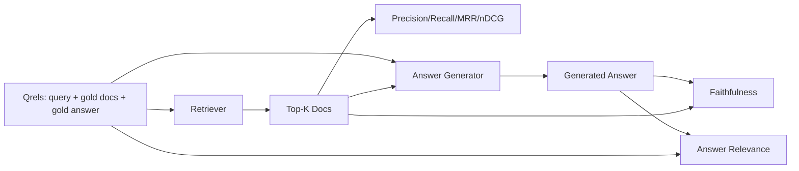

# Evaluación de RAG: Precisión, Recall, MRR, nDCG, fidelidad, relevancia de la respuesta

> Si no puedes calificar tu respuesta y la de tu recuperación al mismo tiempo, no puedes enviar el sistema.

**Type:** Build
**Languages:** Python
**Prerequisites:** Phase 11 lessons 06 (RAG), 10 (evaluation); Phase 19 Track B foundations (lessons 20-29); Phase 19 lessons 64, 65, 66, 67
**Time:** ~90 minutes

## Objetivos de aprendizaje
- Calcule cuatro métricas de recuperación de qrels de oro: precision@k, recall@k, MRR (rango recíproco medio) y nDCG@k.
- Compute dos métricas de grado de respuesta: fidelidad (cada afirmación basada en el contexto recuperado) y relevancia de la respuesta (la respuesta responde a la pregunta).
- Construir un archivo qrels fijo (cuestiones, documentos de oro ID, texto de respuesta de oro) que la eval lee de extremo a extremo.
- Lea los valores métricos para diagnosticar dónde está fallando un pipeline: recuperación, clasificación, generación o aterrizaje.

## El problema

Un sistema RAG tiene al menos cuatro partes móviles: chunker, retriever, reranker, generador. Cualquiera de ellas puede ser la causa de una respuesta equivocada.

¿Es porque el retriever no incluyó el trozo en la posición superior k? ¿Es porque el re-ranqueador empujó el trozo derecho más allá de la posición uno? ¿Es porque el generador ignoró el trozo e inventó algo? No se puede decir solo de la respuesta. Necesitas:

- Metricas de recuperación para calificar lo que salió del retriever.
- Calificar métricas para calificar donde la pieza derecha estaba en el orden.
- Filialidad para calificar si el generador se mantuvo dentro del contexto recuperado.
- Respuesta relevante para calificar si la respuesta responde a la pregunta en absoluto.

Esta lección construye los seis en la parte superior de un archivo Qrels fijo. La evaluación es offline y determinista; en producción se intercambia el LLM falso como juez por uno real.

## El concepto



### Precision@k

De los documentos top-k que el recuperador devolvió, ¿cuál es la fracción del conjunto de oro? Si el oro tiene tres documentos y el top-3 devuelve dos de ellos y uno incorrecto, precision@3 es 2 / 3.

### Recall@k

Si el oro tiene tres documentos y el top-5 contiene los tres, recall@5 es 1.0.

En la producción RAG la métrica que la gente suele citar es recall@k. La generación puede dejar caer piezas irrelevantes fácilmente; no puede inventar una respuesta de un trozo que nunca vio.

### RRM (Rango recíproco medio)

Para cada consulta, encuentra la posición del primer documento relevante en la lista clasificada. El rango recíproco es 1 / posición. Media en todo el conjunto de consultas. MRR es un resumen de un solo número de lo bien que el buscador pone la mejor respuesta en la parte superior.

MRR pesa mucho la posición-1. Una consulta donde el documento de oro está en el rango 1 contribuye 1.0. Rango 2 contribuye 0.5. Rango 10 contribuye 0.1. La métrica está dominada por la parte superior de la lista.

### nDCG@k

Normal de ganancia acumulada con descuento. La fórmula completa asigna una ganancia a cada documento recuperado (a menudo 1 para relevante, 0 para no), descuentos por el registro de la posición, sumas y divididas por el DCG ideal (el DCG que tendría si se clasificara perfectamente). Intervalo de 0 a 1.

nDCG acompaña la relevancia graduada: el oro puede decir "doc A es 3, doc B es 2, doc C es 1". MRR y recall@k aplanan todo a binario.

### La fidelidad

Para cada reclamación en la respuesta generada, compruebe si la reclamación está respaldada por el contexto recuperado. La implementación estándar utiliza un pedido de LLM como juez que toma (reclamación, contexto) y devuelve sí o no. La métrica es la fracción de reclamaciones que pasan.

La fidelidad capta el modo de falla del generador donde el modelo inventa contenido. Incluso si el recuperador devuelve los trozos correctos, un generador que alucina se rompe.

Esta lección implementa la fidelidad con un juez simulador determinista que verifica si los tokens de cada reclamo se superponen al contexto recuperado por un umbral.

### Respuesta relevante

¿La respuesta realmente aborda la pregunta? La fidelidad pregunta "¿la respuesta está basada en el contexto?". La relevancia de la respuesta pregunta "¿la respuesta está basada en la pregunta?". Una respuesta fiel pero fuera del tema tiene un puntaje alto en fidelidad y baja en relevancia. Una respuesta corta y sobre el tema que ignora el contexto tiene un puntaje alto en relevancia y baja en fidelidad.

La aplicación estándar también utiliza LLM-as-judge: take (pregunta, respuesta) y pregunta si la respuesta aborda la pregunta.

## El dispositivo se

```python
{
  "qid": "q1",
  "query": "what is the abort threshold for multipart uploads",
  "gold_doc_ids": ["d1", "d3"],
  "gold_answer_substring": "three failed parts",
  "graded_relevance": {"d1": 3, "d3": 2},
}
```

Cada consulta contiene:
- la cadena de consulta,
- un conjunto de documentos de oro (para la precisión / recuperación / MRR),
- un dictamen de relevancia calificado (para nDCG),
- la cadena de respuesta de oro (se mantiene como metadatos de referencia en cada qrel; la fidelidad en esta lección se calcula juzgando las afirmaciones extraídas en el contexto recuperado, no en contra de esta cadena).

En la producción, las etiquetas, esta lección envía un dispositivo hecho a mano para que la evaluación se quede fuera de la caja.

```figure
ci-rag-metric-ladder
```

## Construye el mismo

`code/main.py`los instrumentos:

- `precision_at_k(retrieved, gold, k)`- la definición literal.
- `recall_at_k(retrieved, gold, k)`- la definición literal.
- `mean_reciprocal_rank(retrieved_list_of_lists, gold_list)`- la media sobre las consultas.
- `ndcg_at_k(retrieved, graded_relevance, k)`- DCG/IDCG con ganancias binarias o clasificadas.
- `extract_claims(answer)`- divide una respuesta en reclamos en forma de oración.
- `faithfulness(claims, context_texts, judge)`- fracción de las reclamaciones que se consideran respaldadas.
- `answer_relevance(question, answer, judge)`- juzgar si la respuesta responde a la pregunta.
- `MockJudge`- determinista de token-overlap juez así que la evaluación se ejecuta fuera de línea.
- `evaluate_pipeline(pipeline_fn, qrels, ks)`- el orquestrador que ejecuta cada métrica.
- Una demostración que ejecuta tres variantes de la tubería (baseline de cunker, recuperación híbrida, híbrido + relanzamiento) contra los qrels y imprime una tabla de métricas.

- ¿Qué quieres decir ?

```bash
python3 code/main.py
```

La salida muestra precision@k, recall@k, MRR, nDCG@k, fidelidad y relevancia de la respuesta para cada variante en una sola tabla de métricas. La fila de recuperación híbrida supera la línea de base de chunker en el recall; la fila de relanzamiento supera a la híbrida en MRR.

## Leer las métricas para diagnosticar fallos

| Symptom | Likely cause | What to fix |
|---------|-------------|-------------|
| Low recall@k, low precision@k | Chunker cut the answer or retriever cannot find it | Chunker boundaries (lesson 64) or retriever modality (lesson 65) |
| Decent recall@k, low MRR | Right chunk is in top-k but not at position 1 | Reranker (lesson 66) |
| High MRR, low faithfulness | Generator invents content despite right context | Generation prompt; force-cite-or-refuse |
| High faithfulness, low relevance | Answer is grounded but off-topic | Query rewriter (lesson 67) or generation prompt |
| All four high, users still complain | Eval set is unrepresentative | Expand qrels with real user queries |

## Los modos de falla de la demostración se ocultará

**LLM-as-judge bias.**Un modelo juzga sus propias salidas como más fieles que ellos.

**Qrels rot.**El oro responde a la deriva a medida que el corpus cambia. Un documento que era oro para el q1 en enero de 2024 ya no es la respuesta correcta en octubre de 2024 porque el equipo renombró la función.

**Faithfulness micro-checks miss macro-claims.**La fidelidad de la frase puede pasar mientras la estructura general de la respuesta engaña.

**Recall@k masks per-query failures.**Un 90% de recuerdo promedio puede ocultar que una clase de consulta siempre se pierde.

## Usalo

Modelos de producción:

- Ejecutar la evaluación en cada cambio de retriever o generador. Tratar una regresión de recall@k como un fallo de prueba.
- Persiste en el rastro métrico por consulta. Cuando un usuario se queja, busque la entrada de qrels que coincida y vea si habría sido capturada.
- Ejecutar los qrels: un conjunto de humo de 20 consultas que se ejecuta en CI; un conjunto de regresión de 200 que se ejecuta por noche; un conjunto profundo de 2000 que se ejecuta semanalmente.

## Envío

La lección 69 conecta toda la tubería (cunker, retriever, reranker, generador) y ejecuta esta evaluación contra el sistema de extremo a extremo.

## Los ejercicios

1. Añadir una quinta métrica de recuperación: hit-rate@k. Compararla con recall@k. Explicar cuándo difieren.
2. Implemente una fidelidad calificada: 0 (no soportada), 1 (parcialmente soportada), 2 (totalmente soportada). Actualice la métrica en consecuencia.
3. Reemplaza el juez falso con una llamada modelo real.
4. Añadir una sección de clase de consulta ("literal", "parafraseado", "multi-temática").
5. Añade una métrica de "duración de la respuesta" y correlacionala con la fidelidad.

## Términos clave

| Term | What people say | What it actually means |
|------|-----------------|------------------------|
| Precision@k | "Hit rate over retrieved" | Fraction of top-k that are gold |
| Recall@k | "Hit rate over gold" | Fraction of gold in top-k |
| MRR | "First-hit position" | Mean of 1 / rank of first relevant document |
| nDCG@k | "Graded ranking quality" | DCG over the top-k divided by ideal DCG |
| Faithfulness | "Groundedness" | Fraction of answer claims supported by retrieved context |
| Answer relevance | "Did it address the question?" | Whether the answer matches the question's intent |
| Qrels | "Gold labels" | The labeled set of queries and their gold documents and answers |

## Leer más

- Buckley, Voorhees, "Evaluación de la estabilidad de las medidas de evaluación", SIGIR 2000 - el documento canónico sobre las métricas de clasificación
- Jarvelin, Kekalainen, "Evaluación acumulada de las técnicas de IR basadas en ganancias" - el documento nDCG
- [Ragas: Automated Evaluation of RAG Pipelines](https://docs.ragas.io)
- [Anthropic, Evaluating RAG](https://www.anthropic.com/news/evaluating-rag)
- Fase 11 Lección 10 - Fundamentos del marco de evaluación
- Fase 19 lecciones 64-67 - componentes evaluados aquí
- Fase 19 lección 69 - la línea de extremo a extremo de este evaluaciones
