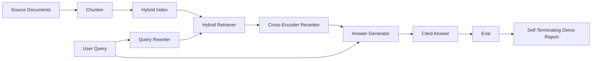

# Sistema de RAG de extremo a extremo

> Seis lecciones de componentes, una tubería, un bucle de evaluación, una demostración automática.

**Type:** Build
**Languages:** Python
**Prerequisites:** Phase 11 lessons 06 (RAG), 10 (evaluation); Phase 19 Track B foundations (lessons 20-29); Phase 19 lessons 64, 65, 66, 67, 68
**Time:** ~90 minutes

## Objetivos de aprendizaje
- Compone el chunker, el retriever híbrido, el reescribir la consulta, el reencoderador cruzado y el generador de respuestas en una sola línea de extremo a extremo.
- Implemente un generador de respuestas que cite sus reclamos por pieza anclada, con rechazo a la baja confianza.
- Ejecutar la lección 68 eval contra la tubería ensamblada y demostrar la construcción en etapas gana en cada métrica sobre los mismos componentes aislados.
- Construir una demostración de CLI autoterminable que ingere un corpus de fijación, ejecute un conjunto de consultas fijas y salga de cero con un informe resumen.

## El problema

Seis componentes aislados no prueban nada. El chunker puede ganar en recall@5 contra el corpus y perder en el recall@5 del sistema porque el retriever no puede clasificar lo que emite el chunker. El reencoder puede elevar el MRR en un grupo de candidatos sintéticos y no puede hacerlo en candidatos bi-encodadores reales porque el retiro del bi-encodor en el presupuesto de reencode es demasiado bajo. El reescriba la consulta puede promover el documento de oro en una sola consulta y romper en la siguiente porque el simulacro de LLM devuelve una hipotética degenerada.

La prueba de integración es la ejecución de toda la tubería de extremo a extremo contra los mismos dispositivos, con la misma métrica, con un archivo de orquestación que conecta todo. Eso es lo que esta lección construye. Si las métricas en la tubería integrada vencen las métricas en la demostración aislada de cada etapa, has probado el sistema.

## El concepto



### Opciones de cableado

El tubo es un pequeño gráfico. Cada etapa es una función con una firma clara.

| Stage | Input | Output |
|-------|-------|--------|
| Chunker | Document text | List of Chunk records |
| Retriever | Query string | Top-N Chunk records |
| Rewriter (optional) | Query string | List of rewrites + hypothetical |
| Reranker | Query, candidates | Top-K Chunk records with cross scores |
| Generator | Query, top-K Chunk records | Answer string with citations |

La composición es sencilla cuando cada firma es estable.`Pipeline`La clase tiene las cinco etapas y una`query`Cada etapa es intercambiable: pasar un chunker diferente, retriever, reescritor, re-ranker o generador y la tubería sigue funcionando.

### Generador de respuestas con citas

El generador es la última etapa y la más fácil de romper.

1. Toma las piezas de K más arriba.
2. Selecciona hasta dos trozos cuyo texto contiene la mayor coincidencia de tokens de contenido con la consulta.
3. Emite una respuesta que es una concatenation de una frase-de-cada-seleccionado-pieza, con cada frase seguida por un `[doc_id:chunk_index]`el anclaje.
4. Si ninguna pieza se superpone por encima del umbral de desechos, emite "no sé" sin citación.

En la producción cambias la simulación por una llamada de LLM real con la plantilla de solicitud:

```
You are answering a question using only the snippets below.
Cite every claim with the anchor in parentheses.
If the snippets do not answer the question, say "I do not know".

Question: {query}

Snippets:
{enumerated chunks with anchors}

Answer:
```

La ruta de rechazo a baja confianza es la razón por la que se registra la puntuación de rango 1 del codificador cruzado. Si se encuentra por debajo del umbral del cuerpo, el generador se niega. Esta es la válvula de seguridad contra respuestas alucinadas.

### La demo autoterminación

La demostración ejecuta todo de extremo a extremo. Imprime una desglose por etapa de una consulta, ejecuta la eval sobre los cuatro qrels fijos, impresa una tabla de métricas y sale con estado cero si todas las métricas de la lección 68 cumplen con los umbrales establecidos en la demostración. Si alguna métrica está por debajo del umbral, la demostración sale con un estado no cero y un mensaje que nombra la métrica fallida.

Este es el tipo de prueba de humo de CI. La tubería se ejecuta fuera de línea, rápido, determinista. Los umbrales son deliberadamente ajustados en el dispositivo por lo que una regresión en cualquiera de las seis lecciones falla en la demostración.

```figure
rag-pipeline-flow
```

## Construye el mismo

`code/main.py`los instrumentos:

- `Chunk`- el registro realizado a través de todas las etapas (extiende la forma de la lección 64 con un chunk_index y un doc_id fuente).
- `Chunker`- selecciona una estrategia de la lección 64 (división recursiva por defecto).
- `HybridIndex`- BM25 + denso + RRF de la lección 65.
- `Rewriter`(opcional) - elige uno de HyDE, multi-cuestiones, descomposición de la lección 67 por longitud de la consulta y presencia de conjunciones.
- `Reranker`- el codificador cruzado entrenado de la lección 66, con un conjunto de entrenamiento de fijación más pequeño para que converja en segundos.
- `Generator`- el generador de simulacros deterministas con citas y rechazo a la baja confianza.
- `Pipeline`- compone las cinco etapas con un`query(question)`método que devuelve `Result(answer, top_k, latency_ms_per_stage)`¿ Qué ?
- `run_demo()`- ingere el corpus, ejecuta tres consultas de fijación, ejecuta la evaluación, imprime los resultados, establece el código de salida por umbral.

- ¿Qué quieres decir ?

```bash
python3 code/main.py
```

La salida es una pista de consulta impresa, la tabla de eval completa y un estado final de paso / fracaso.

## Los modos de falla de la demostración se ocultará

**Chunker boundary drift.**Si cambias la estrategia de chunker entre el pase de etiquetado eval qrels y la demostración, los documentos de oro ya no se alinean. Bloquea la estrategia de chunker en el archivo qrels. La demostración incluye un encabezado que nombra el chunker.

**Reranker training set leaks into the eval.**Las 14 triples de entrenamiento en la lección 66 incluyen consultas que se asemejan a las consultas de evaluación. En la producción, mantenga las consultas de evaluación estrictamente. Las consultas de evaluación de la demostración se desconectan deliberadamente del conjunto de entrenamiento de rango.

**Mock generator hides hallucination risk.**La simulación no puede alucinar porque sólo emite texto de los trozos recuperados.

**No streaming.**El tubo devuelve la respuesta completa al final de cada etapa. Un sistema de producción transmite la salida del generador. La transmisión está fuera de alcance; las métricas de grado de respuesta funcionan en la cadena final de cualquier manera.

**Latency is offline.**Las llamadas de LLM simuladas son de tiempo constante. Las llamadas de LLM reales dominan. Planifique un presupuesto de latencia en el alcance de la solicitud; el tiempo de la lección por etapa solo mide el trabajo de la CPU.

## Usalo

Modelos de producción:

- Envía el archivo de la tubería bajo un orquestrador con interfaces de etapa explícitas. Evite difundir el cableado a través del repo.
- Ejecutar la evaluación antes de cada fusión que toca una etapa. Si la evaluación cae, la fusión no aterriza.
- Persiste el rastro métrico por CI de ejecución para que pueda atribuir regresiones a un cambio de etapa.
- Añadir un conjunto de humo de 20 consultas (subconjunto del conjunto de regresión) que se ejecuta en menos de 30 segundos; el conjunto completo de regresión se ejecuta todas las noches.

## Envío

El archivo de la tubería en esta lección es la forma que el resto de las lecciones de la F de pista de la F de la Fase 19 asumen. Las lecciones posteriores agregarían automatización de ingestión, reindexación incremental, telemetría y una capa de servicio en la parte superior.

## Los ejercicios

1. Añadir un selector de estrategia por consulta dentro del reescrita: heurísticas de la lección 67 (lengitud, conjunciones, relación de jerga) elegir HyDE, multi-cuestión o descompresión.
2. Añadir una llamada de LLM real para el generador detrás de una bandera env.
3. Extenda la demostración para tomar un `--corpus path`Repita la evaluación y el control del umbral.
4. Añadir un`--strategy`El objetivo de la evaluación de la estrategia de recuperación de datos es evaluar la contribución de cada estrategia al retiro de datos de extremo a extremo.
5. Añadir una interfaz de generador de transmisión y alimentarlo en el eval. Confirmar que la fidelidad se calcula en la cadena final y no en el prefijo transmitido.

## Términos clave

| Term | What people say | What it actually means |
|------|-----------------|------------------------|
| Pipeline | "RAG pipeline" | The composed stages from ingestion to cited answer |
| Citation anchor | "Source link" | The (doc_id, chunk_index) reference attached to each claim |
| Refuse-on-low-confidence | "I do not know" | Generator returns no answer when the reranker top-1 score sits below threshold |
| Smoke set | "CI eval" | The minimal qrels subset that runs in every PR check |
| Stage interface | "Function signature" | The stable input and output type of each pipeline stage |

## Leer más

- [Anthropic, Building search and retrieval](https://www.anthropic.com/news/contextual-retrieval)
- [Pinterest, MCP internal search](https://medium.com/pinterest-engineering)- arquitectura de producción de referencia
- [Ragas: Automated Evaluation of RAG Pipelines](https://docs.ragas.io)
- Fase 11 Lección 06 - Fundamentos del RAG
- Fase 19 lecciones 64-68 - los componentes compuestos aquí
