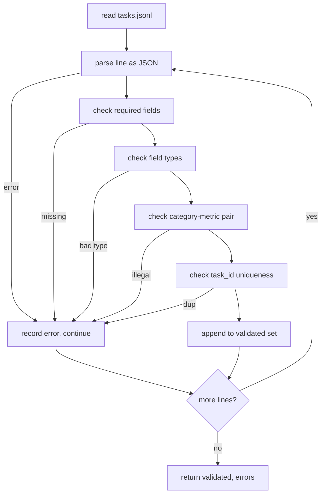

# Formatos de especificaciones de tareas

> Un arnés de eval es tan bueno como el contrato que las tareas honran. congelar la forma JSONL y el vocabulario métrico antes de escribir una sola función de puntuación.

**Type:** Build
**Languages:** Python
**Prerequisites:** Phase 19 Track B foundations
**Time:** ~90 min

## Objetivos de aprendizaje

- Definir un esquema de registro de tareas JSONL que cubra aritmética, opción múltiple, ejecución de código, clasificación y resumen de texto libre en una sola forma.
- Ponga un vocabulario cerrado de nombres métricos para que las lecciones en curso (71-73) puedan ser enviadas en un solo campo.
- Especifique ejemplos de pocos disparos y reglas de postprocesamiento como parte de la tarea, no el corredor, por lo que el mismo prompt produce el mismo objetivo en todos los modelos.
- Implemente un validador estricto que rechaza los registros malformados antes de que lleguen al corredor.
- Envía un conjunto de fijación de 10 tareas que ejercita cada rama de la especificación para que el validador tenga algo real para masticar.

```figure
ci-task-spec-gate
```

## ¿Por qué una especificación congelada

Una base de código de investigación acumula scripts eval más rápido que acumula pruebas. En seis meses, cada portátil tiene su propia forma JSON, cada métrica se reimplementa dos veces, y nada se puede comparar a través de ejecuciones. La solución es aburrida. Elija un esquema. Escribir un validador. Rechazar todo lo demás. Eso es lo que hace esta lección.

La forma toma prestadas ideas de los arneses de estilo BIG-bench, HELM e Im-eval, pero los nombres de campos son nuestros. Cada campo tiene un único propietario. El corredor lee la tarea. La métrica lee los objetivos. El paso post-proceso normaliza la generación. Ningún campo es mutable en la mitad de la tubería.

## La forma del disco

Una tarea es un objeto JSON en una sola línea.`tasks.jsonl`Una línea mala aborta ese registro, no la carrera.

```json
{
  "task_id": "arith_001",
  "category": "arithmetic",
  "prompt": "Compute the result. Question: 17 + 24\nAnswer:",
  "targets": ["41"],
  "metric_name": "exact_match",
  "few_shot_examples": [
    {"prompt": "Question: 2 + 2\nAnswer:", "completion": "4"}
  ],
  "post_process": "strip_whitespace",
  "metadata": {"difficulty": "easy"}
}
```

Los campos requeridos son:`task_id`¿ Qué ?`category`¿ Qué ?`prompt`¿ Qué ?`targets`¿ Qué ?`metric_name`¿ Qué ?`post_process`- ¿ Qué ?`few_shot_examples`y `metadata`Los campos de nivel superior desconocidos no pueden ser validados.

## Reglas de campo

`task_id`El validador impone la singularidad a través del archivo.

`category`es uno de los `arithmetic`¿ Qué ?`mcq`¿ Qué ?`code_exec`¿ Qué ?`classification`¿ Qué ?`summary`. La categoría limita qué par métrico y posterior al proceso es legal.`code_exec`la tarea debe utilizar `metric_name = code_exec`y un `mcq`la tarea debe utilizar `metric_name = exact_match`contra un objetivo de una sola letra.

`prompt`El validador prohíbe el espacio blanco y rechaza los registros que ya contienen un bloque de pocos disparos en el cuerpo de la solicitud.

`targets`es una lista no vacía de cadenas.`exact_match`, cualquier elemento que coincida cuenta.`f1`y `rouge_l`, el objetivo con más puntuaciones gana.`mcq`, la lista contiene exactamente un elemento.

`metric_name`es uno de los `exact_match`¿ Qué ?`f1`¿ Qué ?`bleu_4`¿ Qué ?`rouge_l`¿ Qué ?`accuracy`¿ Qué ?`code_exec`El vocabulario está cerrado, una nueva métrica requiere una nueva lección y una nueva entrada aquí.

`few_shot_examples`es una lista de `{prompt, completion}`El validador limita la lista a ocho entradas para mantener las instrucciones limitadas.

`post_process`es uno de los `none`¿ Qué ?`strip_whitespace`¿ Qué ?`lower`¿ Qué ?`extract_letter`¿ Qué ?`extract_code_block`¿ Qué ?`extract_first_line`Cada regla tiene un único comportamiento determinista.

## Comportamiento del validador



El validador devuelve dos listas: registros validados y registros de error con la línea infractora, la regla violada y el campo de error. El corredor se niega a iniciar si la lista de errores no está vacía a menos que una explícita `--allow-bad-tasks`la bandera está fijada.

## Render de pocos disparos

El corredor concatenar algunos ejemplos de disparos delante del prompt con un separador de línea en blanco. El mismo camino de código se ejecuta para cada modelo, por lo que la única fuente de variación es el modelo mismo. Los autores escriben ejemplos una vez, no una vez por proveedor.

```python
def render(task):
    parts = []
    for ex in task.get("few_shot_examples", []):
        parts.append(ex["prompt"] + " " + ex["completion"])
    parts.append(task["prompt"])
    return "\n\n".join(parts)
```

## Reglas de posprocesamiento

El paso post-proceso se ejecuta generación tras generación, antes que la métrica. Es determinista e apátrida.

- `none`devuelve la cadena sin cambios.
- `strip_whitespace`las tiras que conducen y siguen el espacio blanco.
- `lower`Baja la cuerda.
- `extract_letter`devuelve el primer carácter que coincida `[A-E]`, utilizado para el MCQ.
- `extract_code_block`devuelve el cuerpo del primer bloque cercado con triple rectangular, utilizado para la ejecución de código.
- `extract_first_line`devuelve la primera línea no vacía, utilizada para la clasificación resumida.

Una tarea que necesita una regla fuera de esta lista pertenece a una nueva lección.

## Lo que esta lección no hace

No da puntuación, no llama a un modelo, no ejecuta código, estos vienen en las lecciones 71, 72 y 75.

El fijo de 10 tareas cubre dos elementos aritméticos, dos elementos MCQ, dos elementos de ejecución de código, dos elementos de clasificación y dos elementos de resumen.`tasks_bad.jsonl`) descarga todas las reglas y el validador devuelve exactamente tantos errores.

## Cómo leer el código

`main.py`define `TaskSpec`¿ Qué ?`validate_task`¿ Qué ?`validate_file`, y un punto de entrada de CLI.`load_fixtures`Los auxiliares de renderización y postprocesamiento viven junto a la validación por lo que el corredor en la lección 75 importa un solo módulo.

Leer .`main.py`De arriba a abajo.`code/tests/test_spec.py`Las pruebas fijan todas las reglas de validación y cada comportamiento posterior al proceso.`main.py`valida el dispositivo en paquete e imprime un resumen.

## Ir más allá

Las suites de eval real crecen categorías de la manera en que los esquemas crecen columnas. La medida sobria es negarse a agregar una categoría sin agregar también una métrica, una regla de post-proceso y al menos una tarea fija. Trate la especificación como una migración de base de datos. Cada cambio se revisa, se versionan y se acompaña de pruebas. El validador en esta lección es la puerta.
