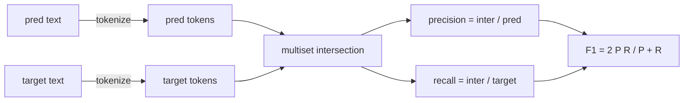
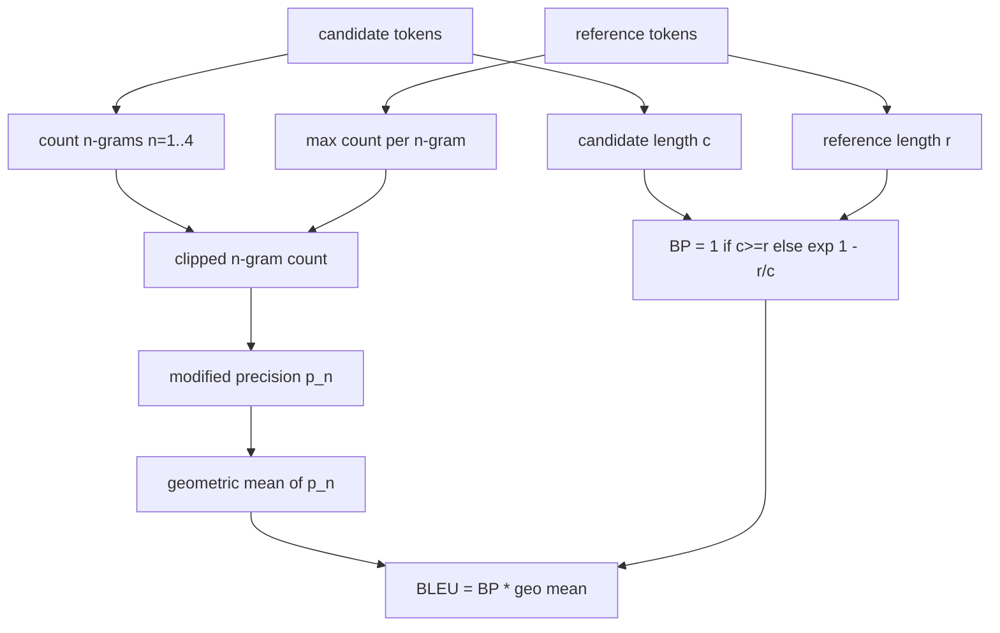

# Metricas clásicas

> BLEU, ROUGE-L, F1, coincidencia exacta, precisión. Cinco métricas que aún representan la mayoría de los números de evaluación publicados de LLM. Implemente cada uno desde los primeros principios para que sepa lo que significa el número.

**Type:** Build
**Languages:** Python
**Prerequisites:** Phase 19 Track B foundations, lesson 70
**Time:** ~90 min

## Objetivos de aprendizaje

- Implementar la coincidencia exacta a nivel de tokens, F1, y la precisión con reglas explícitas de tokenización.
- Implementar BLEU-4 desde cero: precisión n-gram modificada, media geométrica sobre n es igual a 1 a 4, penalidad de brevedad.
- Implemente ROUGE-L utilizando la subsecuencia común más larga, con combinación F-beta de precisión y recuerdo.
- Envía en el campo metric_name de la lección 70 para que el corredor permanezca metric-agnóstico.
- Enmarcar el comportamiento con vectores de referencia extraídos de ejemplos de trabajo, no de una biblioteca de terceros.

```figure
cd-bleu-overlap
```

## ¿Por qué se reimplementa

Leerán artículos que informan sobre BLEU 28.3 y otro que informa sobre BLEU 0.283. Encontrará puntuaciones ROUGE-L que difieren en diez puntos en dos bibliotecas porque una truncada a letra pequeña y la otra no. La forma más rápida de dejar de confundirse es escribir las métricas usted mismo, luego apuntar a la línea donde se decide el tokenizer y la línea donde se aplica el suavización. Después de eso, comparar números entre papeles se convierte en una cuestión de leer la configuración métrica, no discutir sobre bibliotecas.

El color azul es el color de la pantalla, el color azul es el color de la pantalla, el color azul es el color de la pantalla, el color azul es el color de la pantalla, el color azul es el color de la pantalla, el color azul es el color de la pantalla, el color azul es el color de la pantalla, el color azul es el color de la pantalla, el color azul es el color de la pantalla, el color azul es el color de la pantalla, el color azul es el color de la pantalla, el color azul es el color de la pantalla, el color azul es el color de la pantalla, el color azul es el color de la pantalla, el color azul es el color de la pantalla, el color azul es el color de la pantalla, el color azul es el color de la pantalla, el color de la pantalla es el color de la pantalla, el color de la pantalla es el color de la pantalla, el color de la pantalla es el color de la pantalla, el color de la pantalla es el color es el color de la pantalla, el color de la pantalla es el color es el color de la pantalla, el color de la pantalla es el color es el color de la pantalla es el color es el color de la pantalla, el color de la pantalla es el color es el color de la pantalla es el color es el color es el color es el color es el color de la pantalla, y el color de la color es el color es el color es el color es el color es el color es el color es el color es el color es el color es el color es el color es el color es el color es el color es el color es el color es el color es el color es el color es el color es el color es es es el color es el color es es es es el color es es es es es el color es el color es el color es es el color es el color es es el color es el color es el color es el color es es es el color es el color es el color es es es es es el color es es es es el color es es el color es el color es es es es es es es es es es el color es es es es es el color es es es es es es el color es es es es es es el color es el color es es es es es el color es es es es es el color es es es es es el color es es es es es es es el color es es

## Señalización

El tokenizer es`re.findall(r"\w+", text.lower())`. letra pequeña, alfanumérica corre, puntuación de caída. cada métrica en esta lección utiliza este tokenizer exacto. el corredor no tiene que elegir. si intercambias tokenizadores, estás ejecutando un punto de referencia diferente.

```python
TOKEN_RE = re.compile(r"\w+", re.UNICODE)
def tokenize(text):
    return TOKEN_RE.findall(text.lower())
```

Esto es una simplificación deliberada. Las configuraciones de producción se preocuparán por CJK, contracciones y identificadores de código. El punto de la lección es que el tokenizer es un contrato, no un botón.

## Me parece exactamente.

```python
def exact_match(pred, targets):
    return float(any(pred.strip() == t.strip() for t in targets))
```

Esto es el resultado de las tareas de aritmética, MCQ y clasificación corta.

## Nivel de fichaje F1

Configurar el multiset de token para predicción y objetivo. Precisión es la intersección de multiset dividida por el multiset de predicción. Recall es la misma intersección dividida por el multiset del objetivo. F1 es la media armónica. La implementación maneja los casos de predicción vacía y borde de objetivo vacío.



Para tareas multitareales, tomamos la mejor F1 sobre la lista de objetivos. Eso coincide con el comportamiento de estilo SQuAD ampliamente reportado en la literatura.

## BLEEU-4

BLEU es la métrica canónica de traducción automática y todavía aparece en el trabajo de resumen. La formulación que usamos es BLEU-4 a nivel de corpus con la penalidad de brevedad estándar y el suavización aditiva-uno en recuentos de n-gramos modificados para que un solo 4 gramos faltantes no empuje la puntuación a cero.

Para cada par de referencia candidato, contamos n-grama modificada de precisión para n igual a 1, 2, 3, 4. La precisión modificada recoge el conteo de n-grama candidato por el conteo máximo de ese n-grama en cualquier referencia, por lo que un candidato no puede inflar repetindo una frase.



La regla de suavizamiento es la que Lin y Och llamaron método 1: agregar uno al numerador y al denominador de cada n-grama de precisión antes de tomar el registro.`log 0`cuando una referencia no tiene un equivalente de 4 gramos y se mantiene cerca del valor no suavizado en candidatos largos.

## ROSO-L

ROUGE-L compara la subsecuencia común más larga de las secuencias de token de referencia y candidato. El LCS capta el orden de palabras sin forzar la contiguidad, por lo que es la métrica de resumen predeterminada.`lcs / reference length`, precisión como `lcs / candidate length`, y combinar con F-beta donde beta es igual a uno para la forma simétrica F1.

```python
def lcs_length(a, b):
    n, m = len(a), len(b)
    dp = numpy.zeros((n + 1, m + 1), dtype=int)
    for i in range(n):
        for j in range(m):
            if a[i] == b[j]:
                dp[i+1, j+1] = dp[i, j] + 1
            else:
                dp[i+1, j+1] = max(dp[i+1, j], dp[i, j+1])
    return int(dp[n, m])
```

La tabla numpy hace que la implementación sea legible; las listas de Python puras también funcionarían. Las tareas que optan por ROUGE-L pagan el costo O(n) por tarea. Para longitudes de resumen típicas que permanecen por debajo de un milisegundo.

## Precisión

Para las tareas de clasificación de múltiples objetivos, la precisión se reduce a una coincidencia exacta con un solo objetivo normalizado.`metric_name`sin pasar por las comparaciones de cuerdas dentro del corredor.

## Contrato de expedición

El punto de entrada único es `score(metric_name, prediction, targets)`- Vuelve a flotear .`[0, 1]`El corredor no se ramifica en el nombre métrico. entrega la llamada y escribe el resultado. Esta es la superficie que la lección 75 se adhiere a la especificación de tarea de la lección 70.

```python
def score(metric_name, pred, targets):
    if metric_name == "exact_match":
        return exact_match(pred, targets)
    if metric_name == "f1":
        return max(f1_score(pred, t) for t in targets)
    if metric_name == "bleu_4":
        return max(bleu4(pred, t) for t in targets)
    if metric_name == "rouge_l":
        return max(rouge_l(pred, t) for t in targets)
    if metric_name == "accuracy":
        return accuracy(pred, targets)
    raise ValueError(f"unknown metric_name: {metric_name}")
```

`code_exec`Se maneja en la lección 72 y se envuelve en el despachador allí.

## Lo que esta lección no hace

No llama a un modelo. No normaliza generaciones más allá de lo que ya hicieron las reglas de postproceso de la lección 70. No calcula intervalos de confianza. No hace BLEURT o BERTScore (que necesitan un modelo y viven en una lección diferente).

## Cómo leer el código

`main.py`La función de referencia de la función de referencia es la función de referencia de la función de referencia de la función de referencia.`_reference_examples`La demostración ejecuta el despachador en ocho ejemplos e imprime puntuaciones por métrica.`code/tests/test_metrics.py`pin los vectores de referencia y enfatizar cada caso de borde (previsión vacía, referencia vacía, sin fichas compartidas, coincidencia exacta, recortes repetidos de frases).

Leer .`main.py`Las funciones se ordenan por complejidad. exact_match y precisión son una línea cada. F1 es de seis líneas. BLEU y ROUGE-L son las partes pesadas y incluyen comentarios detallados sobre la regla de suavizamiento y la recidiva de LCS.

## Ir más allá

Las métricas clásicas son necesarias, no suficientes. recompensan la superposición superficial y pierden significado. La solución es colocar las métricas basadas en modelos en la parte superior (BLEURT, BERTScore, GEval) una vez que confíes en el piso clásico. Esa es una lección posterior. Por ahora: haga que estos cinco trabajen, pin los pruebas, y tienes una pila de métricas que es auditable, rápida y reproducible.
