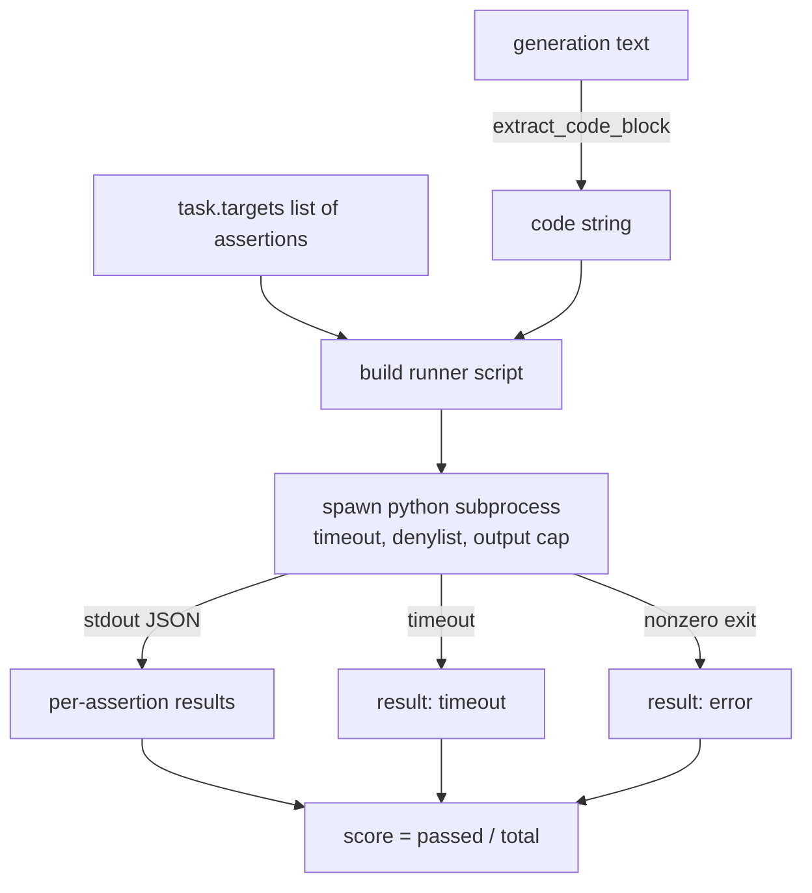
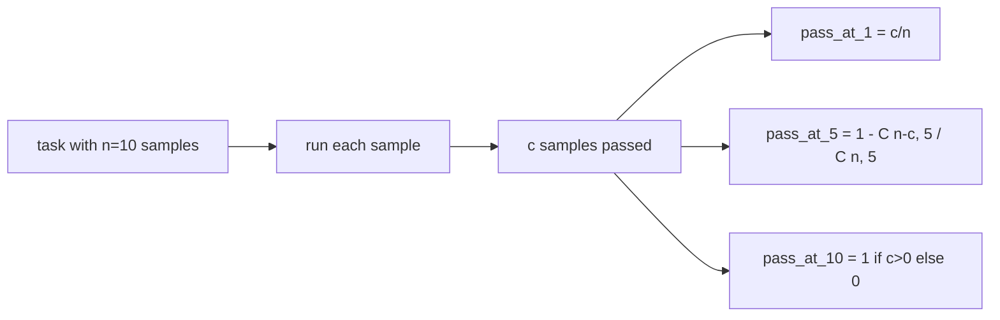

# Código Exec Metrica

> El código generado es correcto cuando pasa las pruebas. El arnés de evaluación tiene que extraer código, ejecutarlo sin estrellar al host, y contar las tasas de paso honestamente. Esta lección construye esa superficie.

**Type:** Build
**Languages:** Python
**Prerequisites:** Phase 19 Track B foundations, lessons 70 and 71
**Time:** ~90 min

## Objetivos de aprendizaje

- Extraer un bloque de código de una generación de forma libre de una manera que coincida con la regla de post-proceso de la lección 70.
- Ejecutar el código candidato en un subproceso aislado con un tiempo límite de tiempo, un límite de salida y un denilista de importación.
- Poner una tarea como la fracción de las cadenas de afirmación suministradas que pasan contra el candidato.
- Computa el paso a k para tareas que muestran múltiples generaciones de un modelo.
- Tratar los accidentes de caja de arena, errores de sintaxis y tiempos de salida como modos de falla de primera clase con códigos de salida distintos que el corredor puede registrar.

```figure
sandbox-runner
```

## ¿Por qué un subproceso aislado

En línea`exec`El riesgo de seguridad y estabilidad es un riesgo generado por la`while True: pass`bloquea la evaluación para siempre.`import shutil; shutil.rmtree('/')`La solución es generar un nuevo intérprete Python por candidato, pasar el código en stdin, escribir los resultados de la afirmación a stdout, y matar el proceso si se supera.

Los evals reales como HumanEval, MBPP, BigCodeBench y LiveCodeBench usan una caja de arena de subprocesos. Algunas capas de Docker en la parte superior. Detenemos en el subproceso por una razón: es portátil, es stdlib, y capta los modos de falla que importan para la evaluación educativa.

## La forma de una tarea de ejecutar código

¿ Qué es esto ?`code_exec`tarea lleva cadenas de afirmación en `targets`El corredor extrae un bloque de código cercado de la generación, construye un arnés de prueba alrededor de él y ejecuta el resultado.



La puntuación es una fracción en `[0, 1]`. Una tarea con tres afirmaciones en las que dos pasos obtienen un puntaje de 0,667. El corredor devuelve la misma forma sin importar qué falla: los choques del subproceso se asignan a un código de error normalizado, no a un rastreo de Python que se agita hasta el arnés.

## El Denylist

El guión de ejecutar código candidato reescribe las importaciones de módulos peligrosos a un estúb que eleva`ImportError("denied")`La lista es deliberadamente conservadora:`os.system`¿ Qué ?`subprocess`¿ Qué ?`socket`¿ Qué ?`requests`¿ Qué ?`urllib`¿ Qué ?`urllib.request`¿ Qué ?`urllib.error`¿ Qué ?`urllib.parse`¿ Qué ?`ctypes`¿ Qué ?`shutil`¿ Qué ?`http.client`¿ Qué ?`asyncio.subprocess`¿ Qué ?

No pretendemos que esto sea a prueba de balas. Un código adversario determinado puede escapar de cualquier sandbox en proceso en Python. El denylist es un respaldo. El tiempo de tiempo del reloj de la pared y el límite de salida son los controles de carga.

```python
DENIED = {
    "os.system": True,
    "subprocess": True,
    "socket": True,
    "shutil": True,
    "requests": True,
    "urllib": True,
    "ctypes": True,
}
```

Envuelvemos al candidato prependendo .`import sys`y un guardia que se pega en monos .`os.system`La plantilla completa está en `main.py`¿ Qué ?

## Tiempo de tiempo de tiempo

Cada subproceso obtiene un presupuesto predeterminado de tres segundos de reloj de pared.`subprocess.run(..., timeout=t)`Si el tiempo de espera dispara, el corredor atrapa.`TimeoutExpired`, mata el proceso, y registra un `timeout`El corredor sigue adelante y el corredor sigue adelante.

El tiempo de espera se puede configurar por tarea a través de `task.metadata.timeout_s`Las pruebas de unidad de larga duración pueden requerir más; el validador de la lección 70 limita el valor a treinta segundos para mantener la suite limitada.

## Capas de salida

El subproceso puede inundar la memoria del host, agotando la memoria del host. El corredor transmite la memoria en un buffer y mata al niño tan pronto como el total de ejecución cruza 256 KB. El resultado se registra como `exit_code = error`con la cadena de detalles `"output overflow"`Esto aparece en la práctica cuando una generación accidentalmente escribe un bucle infinito que imprime.

## - Pasé por el camino.

Pass-at-k es la estimadora imparcial utilizada por HumanEval y sus amigos.`n`muestras independientes por tarea y `c`de ellos, la probabilidad de que una muestra de tamaño `k`de la `n`contiene al menos una solución de paso:

```
pass_at_k(n, c, k) = 1 - C(n - c, k) / C(n, k)
```

¿ Cuándo ?`n - c < k`el numerador no está definido y el valor es `1`La implementación maneja el caso de borde directamente.`pass_at_k(n, c, k)`para su uso por la capa de clasificación en la lección 74.



## Códigos de salida

El corredor devuelve uno de los cinco resultados por tarea:

- `pass`cuando todo dicho se haya pronunciado.
- `assertion_fail`cuando el código se ejecutó pero al menos una afirmación falló.
- `syntax_error`cuando el código no importó o tenía un error de sintaxis.
- `timeout`Cuando expiró el reloj de la pared.
- `error`para cualquier otro choque, incluidos los impactos en denilistas y el desbordamiento de salida (superficies de desbordamiento con detalles `"output overflow"`¿Qué es lo que se hace?

El resultado es todavía una fracción. El código de salida es metadatos. Las lecciones de abajo pueden decidir si contar un tiempo como cero o como datos faltantes.

## Lo que esta lección no hace

No te da una caja de arena real. No ejecuta código no fiable desde la web abierta. No maneja tareas estatales como archivo I / O o llamadas de red. Estas necesitan un contenedor o una microVM. El punto de esta lección es el contrato: un subproceso aislado, un denilista, un tiempo de espera, un límite de salida, un vocabulario limpio de código de salida y matemáticas de paso a paso.

## Cómo leer el código

`main.py`define `extract_code`¿ Qué ?`run_candidate`¿ Qué ?`score_code_exec`, y `pass_at_k`El guión de subproceso ejecutor se construye como una cadena y se pasa como `-c`Los test en el año 2000 se realizaron en el centro de la Universidad de Cambridge.`code/tests/test_exec.py`Exercir los cuatro códigos de salida más el paso a k en comparación con ejemplos elaborados extraídos del estilo HumanEval.

Leer .`main.py`la plantilla de ejecutor es la pieza portadora. mira al bucle de afirmación hasta que puedas predecir el sobre JSON que escribe de nuevo al proceso padre.

## Ir más allá

Una vez que la forma del subproceso funciona, la próxima preocupación es la portabilidad. Las diferentes versiones de Python manejan SIGKILL de manera diferente en Windows. La solución más limpia es poner al corredor en una imagen de Docker. Lo siguiente después es reemplazar las cadenas de afirmación con archivos de prueba de unidades reales para que la evaluación coincida con lo que hace el CI de producción. Deje de llamar pruebas de cuerdas de afirmación en ese punto; son pruebas de juguete y tienen modos de falla de juguete.
