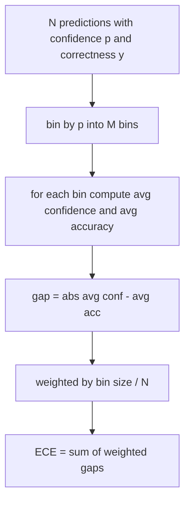
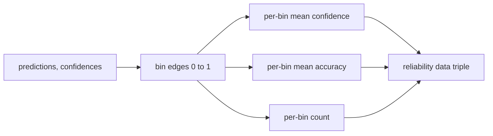

# Perplejidad y calibración

> Si tu modelo dice que tiene un 90% de confianza en mil respuestas y tiene seiscientas correctas, no está bien calibrado. La calibración es la mitad de la evaluación confiable. La otra mitad es la perplejidad, que te dice si el modelo piensa que el texto retido es plausible en absoluto.

**Type:** Build
**Languages:** Python
**Prerequisites:** Phase 19 Track B foundations, lessons 70 and 71
**Time:** ~90 min

## Objetivos de aprendizaje

- Computa la perplejidad a nivel de tokens en un corpus de tokens de probabilidades de registro negativas proporcionadas por el adaptador de modelo.
- Calcule el error de calibración esperado (ECE) de un clasificador o de una evaluación de opción múltiple a partir de probabilidades previstas.
- Calcule el puntaje Brier (error medio al cuadrado frente al indicador de corrección) y explique cuándo hace lo que la ECE no hace.
- Construir los datos del diagrama de fiabilidad necesarios para trazar una curva de confianza contra precisión.
- Encuentra a los tres en el aro de evaluación para que el corredor pueda conectar .`perplexity`¿ Qué ?`ece`, y `brier`números de un informe modelo.

```figure
cd-reliability-diagram
```

## ¿Qué te dice la perplejidad?

La perplejidad es la probabilidad de registro negativo promedio exponencial por token. Más bajo es mejor. Una perplejidad de uno significa que el modelo asigna probabilidad uno a cada token real. Una perplejidad del tamaño del vocabulario significa que el modelo es uniforme y no aprendió nada. Los números reales se encuentran entre ellos: un modelo base fuerte de 2026 en WikiText-103 se sitúa entre ocho y doce. Un mal en el mismo texto se sitúa en cincuenta más.

El arnés no calcula las probabilidades de registro en sí mismo. Aquellas provienen del adaptador de modelo. Los agregados del arnés: toma una lista de probabilidades de registro por token, una lista de recuentos de tokens por secuencia, y devuelve la perplejidad del corpus.

```python
def perplexity(neg_log_probs, token_counts):
    total_nll = sum(neg_log_probs)
    total_tokens = sum(token_counts)
    return math.exp(total_nll / total_tokens)
```

La implementación maneja casos de borde de tokens cero y afirma que las probabilidades negativas de registro no son negativas.`log p`en lugar de`-log p`La función lo capta como una violación de contrato.

## Qué medidas adopta la CEE

El error de calibración esperado agrupa las predicciones por su confianza en un número fijo de contenedores, y luego mide la brecha promedio entre la confianza y la precisión en cada contenedor, ponderada por el tamaño de la contenedor.



La formulación estándar utiliza diez contenedores de ancho igual en `[0, 1]`La implementación soporta cualquier número entero positivo.`bins`Parámetro para que el corredor pueda elegir entre la convención de publicación (10) y la convención de comparación (15).

El ECE es parcial por el número de contenedores y el tamaño de la muestra. Con diez contenedores y cien predicciones, no se puede distinguir 0,02 ECE del ruido aleatorio. La implementación devuelve el número de contenedores poblados junto con el ECE para que el corredor pueda negarse a reportar un solo número en muy pocas muestras.

## ¿Qué puntaje Brier hace que la ECE no

El ECE sólo se preocupa por las brechas promedio. Un modelo que es demasiado seguro de la mitad de los contenedores y poco seguro de la otra mitad puede tener un ECE bajo mientras que está mal calibrado localmente.

Para resultados binarios, Brier es `mean((p_i - y_i)^2)`Se descompone en fiabilidad, resolución e incertidumbre.

```python
def brier(p, y):
    return float(np.mean((p - y) ** 2))
```

## Datos del diagrama de fiabilidad

Un diagrama de fiabilidad predice la confianza contra la precisión empírica en cada bin. La diagonal es una calibración perfecta. La función devuelve tres matrices: confianza promedio por bin, precisión promedio por bin y recuento por bin. El código de gráfico vive río abajo; esta lección se detiene en la forma de datos.



El tuple devuelto es lo que una capa de llamada necesita para dibujar la trama o calcular una variante ECE personalizada (ECE adaptativa, barrido ECE, etc.).

## Fuentes de confianza

El arnés no asume que la confianza proviene de softmax.`[0, 1]`Para las tareas de múltiples opciones, la confianza natural es `softmax over option log-likelihoods`Para el texto libre la confianza natural es la probabilidad auto-relatada del modelo o el exponencial de la probabilidad promedio de registro.

## Casas de bordes

- Todas las predicciones equivocadas: ECE es la confianza promedio, Brier es alta, la perplejidad es lo que el modelo piense del texto.
- Todas las predicciones son correctas con alta confianza: ECE cerca de cero, Brier cerca de cero.
- Predictor perfectamente incierto en p=0.5: ECE es 0.5 menos precisión, Brier es 0.25 menos término de corrección.
- Entrada vacía: ECE, Brier y retorno de fiabilidad `0.0`(o matrices llenas de cero).`NaN`En el caso de tokens cero, ninguno de estos caminos emite una advertencia; el corredor inspecciona los valores y decide si debe informar o saltar.

Un modelo real con un punto de referencia real no lo hará, pero un adaptador de buggy o una pequeña muestra lo hará, y el corredor no debe caer.

## Envío

La calibración no es una métrica por tarea como F1. Es un informe por modelo.`(confidence, correct)`Se calcula la perplejidad en un corpus de texto que se mantiene, separado de la puntuación de tarea por tarea.

La interfaz es:

```python
report = CalibrationReport.from_predictions(confidences, correct)
report.ece          # float
report.brier        # float
report.reliability  # tuple of three numpy arrays
report.populated_bins  # int
```

`PerplexityResult.from_token_nll(neg_log_probs, token_counts)`devuelve la perplejidad y la probabilidad media negativa de registro por token.

## Lo que esta lección no hace

No llama a un modelo. No implementa softmax. No estima la confianza de los tokens de salida; ese es el trabajo del adaptador. No hace escala de temperatura o escala de Platt; esas son correcciones post-hoc que viven en una lección diferente. El objetivo de esta lección es hacer que los tres números (perplejidad, ECE, Brier) sean confiables y reproducibles.

## Cómo leer el código

`main.py`define `perplexity`¿ Qué ?`expected_calibration_error`¿ Qué ?`brier_score`¿ Qué ?`reliability_diagram`, y el `CalibrationReport`- ¿ Qué ?`PerplexityResult`La demostración se ejecuta con predicciones sintéticas donde se conoce la verdad de fondo: un modelo bien calibrado, uno demasiado seguro y uno poco seguro.`code/tests/test_calibration.py`Pinta cada caja de borde más valores de referencia para los predictores sintéticos.

Leer .`main.py`La orden de la función va escalar a vector para informar. cada función tiene una corta cadena de documentos con las matemáticas y el contrato.

## Ir más allá

La calibración es el eje más ignorado en la evaluación publicada. La mayoría de las tablas de clasificación informan un solo número de precisión y lo llaman hecho. Un modelo que gana con precisión y pierde con Brier es un despliegue de producción peor que un modelo que obtiene unos puntos más bajos en precisión pero que informa confiablemente de su incertidumbre. Una vez que tengas instalado la tubería de calibración, añada una escala de temperatura en una rebanada de validación, recompita la ECE y observa cómo se reduce la brecha. Esa es una lección separada, pero el suelo vive aquí.
