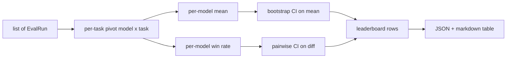
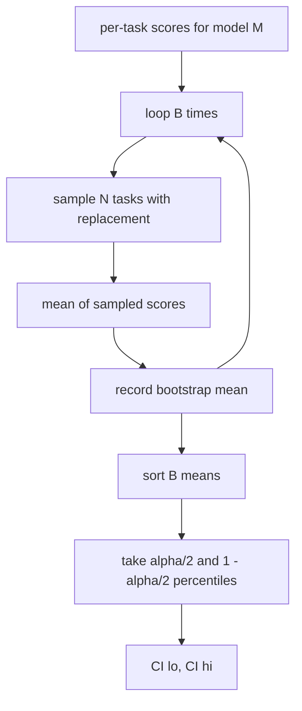

# El grupo de trabajo

> Las puntuaciones por tarea son fáciles. Las clasificaciones por modelo en tareas heterogéneas son más difíciles. La importancia estadística en el ranking de mil predicciones es la parte que todos saltan. Esta lección no lo saltan.

**Type:** Build
**Languages:** Python
**Prerequisites:** Phase 19 Track B foundations, lessons 70, 71, 73
**Time:** ~90 min

## Objetivos de aprendizaje

- Agrega las puntuaciones por tarea en múltiples modelos y múltiples tareas en una fila ordenada por modelo.
- Normaliza las puntuaciones heterogéneas para que las tasas de aprobación y los valores BLEU no influyan demasiado en el agregado.
- Califique los modelos por medio y por tasa de ganancias, y explique cuándo cada uno es el resumen correcto.
- Calcule los intervalos de confianza de arranque en la media de puntuación por modelo y en las diferencias en pares.
- Salir de la tabla de clasificación como un informe JSON y como una tabla de marcado el corredor en la lección 75 puede pegar en un comentario de CI.

```figure
ci-leaderboard-ci
```

## La forma de entrada

El agregador consume una lista de `EvalRun`Registros:

```python
@dataclass
class EvalRun:
    model_id: str
    task_id: str
    metric_name: str
    score: float          # in [0, 1]
    category: str
```

El corredor en la lección 75 emite un récord por cada uno .`(model, task)`El agregador no se preocupa por la forma en que se produjo el puntaje.`[0, 1]`¿ Qué ?

## La salida

Hay tres mesas:



La fila del ranking contiene: `model_id`¿ Qué ?`mean_score`¿ Qué ?`mean_ci_lo`¿ Qué ?`mean_ci_hi`¿ Qué ?`win_rate`¿ Qué ?`tasks_completed`, y una opción `categories`Mapa para la media por categoría.

## Normalización

Si una tarea obtiene un puntaje en `[0, 1]`y otro en `[0, 100]`El agregador valida que cada puntaje de entrada se encuentra en`[0, 1]`La medida se mantiene en el río arriba: la métrica debe devolver una fracción.

## Medias y tasa de ganancias

Los dos esquemas de clasificación sirven a objetivos diferentes.

El puntaje medio es el promedio de las puntuaciones por tarea de un modelo. Es el informe de los números principales de los tablones de clasificación. Es sensible a los valores extremos y a los desequilibrios de tareas.

La tasa de ganancia cuenta la frecuencia con que un modelo supera a todos los otros modelos en la misma tarea. Para cada tarea, el modelo con la puntuación más alta gana (dividido en lazos). La tasa de ganancia es igual a las ganancias divididas por el número de tareas en las que el modelo tiene una puntuación. Es menos sensible a los valores extremos y a las diferencias de escala, pero pierde información.

```python
def win_rate(model_id, runs_by_task, all_models):
    wins, total = 0, 0
    for task_id, runs in runs_by_task.items():
        scores = {r.model_id: r.score for r in runs if r.model_id in all_models}
        if model_id not in scores:
            continue
        total += 1
        best = max(scores.values())
        if scores[model_id] >= best:
            wins += 1
    return wins / total if total else 0.0
```

El corredor en la lección 75 se clasifica por medio por defecto; la columna de marcado de la tasa de ganancias está justo allí en caso de que el usuario lo prefiera.

## Intervalos de confianza de arranque

Los medios por modelo vienen con un intervalo de confianza estimado por bootstrap repetición sobre las tareas.`B`veces, y tomar el intervalo percentil en el nivel `alpha`¿ Qué ?



Para las comparaciones en pares, arrancamos la diferencia por tarea `score_A - score_B`El usuario lee si el intervalo excluye cero. Si lo hace, la diferencia es significativa en el nivel alfa. Si no lo hace, el tablero de clasificación trata los modelos como empatados.

Los ayudantes de bajo nivel (`bootstrap_mean_ci`¿ Qué ?`bootstrap_pairwise_diff`) por incumplimiento de `B=1000`• los agregadores públicos (`aggregate`¿ Qué ?`pairwise_diffs`) por incumplimiento de `b=500`La lección mantiene el bootstrap puro numpy, sin scipy.

## Categorías

Si ...`EvalRun.category`Si se establece, el agregador también informa la media por categoría.`math`¿ Qué ?`reasoning`¿ Qué ?`code`¿ Qué ?`safety`. Permite al corredor detectar si un modelo es bueno en general pero débil en código, que es información que el titular significa oculta.

## Representación de marcas

El ranking se presenta como una tabla de recarga:

```text
| Rank | Model | Mean | 95% CI | Win rate | Tasks |
|------|-------|------|--------|----------|-------|
| 1    | gpt   | 0.78 | 0.74-0.82 | 0.62 | 50 |
| 2    | claude| 0.75 | 0.71-0.79 | 0.34 | 50 |
| 3    | random| 0.10 | 0.07-0.13 | 0.04 | 50 |
```

La tabla se ordena por puntaje medio. La CI se representa a dos decimales.

## Lo que esta lección no hace

No ejecuta modelos. No llama la capa métrica. No implementa ECE adaptativo u otras variantes de calibración; esas son las lecciones 73. No implementa la ponderación de tareas. Cada tarea cuenta igual aquí.`weight`añadir peso en una lección de seguimiento si lo necesita.

## Cómo leer el código

`main.py`define `EvalRun`¿ Qué ?`LeaderboardRow`¿ Qué ?`aggregate`¿ Qué ?`bootstrap_mean_ci`¿ Qué ?`bootstrap_pairwise_diff`, y `render_markdown`. La demostración construye una suite sintética de tres modelos y doce tareas, agregadas e imprime el tablero de clasificación más la tabla de diferencias en pares.`code/tests/test_leaderboard.py`pin la banda de arranque, el renderizado de marca, los casos de ventaja de la tasa de ganancias y el comportamiento de entrada vacía.

Leer .`main.py`La forma de datos (EvalRun, LeaderboardRow) viene primero, el agregador después, el tercer bootstrap, la representación última.

## Ir más allá

El siguiente paso natural es la importancia de tareas en pareja en lugar de bootstrap sin pareja. Si el modelo A y B ambos ejecutaron las mismas cien tareas, la prueba apropiada es la banda de arranque en parejas de diferencias de tarea por tarea, que implementamos. Más allá de eso, se quiere una salida jerárquica que respete las familias de tareas (los problemas matemáticos no son independientes entre sí; un patrón de error aritmético afecta a diez de ellos). Eso es un seguimiento. El objetivo de esta lección es conseguir el piso correcto para que el evaluador informe un número que puedas defender.
