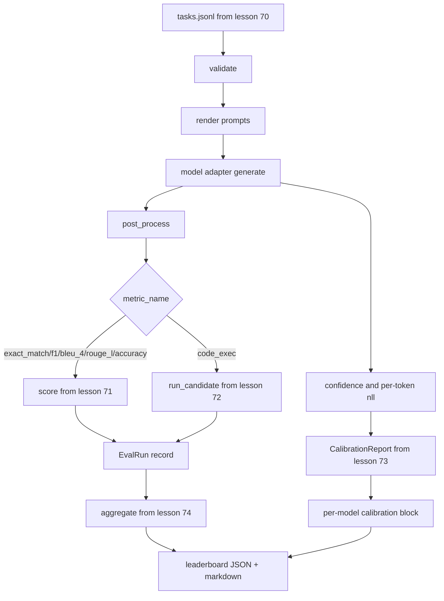

# Corredor de Eval de extremo a extremo

> El corredor lee la especificación de tarea de la lección 70, llama a un modelo a través de un adaptador, obtiene puntuaciones con las lecciones 71 y 72, adjunta el informe de calibración de la lección 73, y emite el tablero de clasificación de la lección 74.

**Type:** Build
**Languages:** Python
**Prerequisites:** Phase 19 Track B foundations, lessons 70 through 74
**Time:** ~90 min

## Objetivos de aprendizaje

- Define una`ModelAdapter`Interfaz que cualquier modelo (simulado, local, API) puede satisfacer con una pequeña superficie de método.
- ejecuta la eval en un archivo JSONL fijo con ejecución de tareas paralelas en un grupo de trabajadores.
- Compone la capa métrica (exact_match, F1, BLEU-4, ROUGE-L, code_exec) con la capa de calibración en un solo paso.
- Emisión por modelo `EvalRun`registros y los introducen directamente en el agregador de la lista de resultados.
- Exporta tanto un informe JSON como una tabla de marcado; autoterminar con salida cero en una ejecución limpia, no cero en validación o falla en el tiempo de ejecución.

```figure
eval-grid
```

## El oleoducto



El corredor es el punto de integración. Cada lección 70 a 74 posee un módulo que el corredor compone. El corredor no duplica ninguna lógica de esos módulos: los importa.

## La interfaz del adaptador

El adaptador es la costura entre el corredor y cualquier modelo.

```python
class ModelAdapter:
    model_id: str

    def generate(self, prompt: str, task: TaskSpec) -> Generation: ...
```

`Generation`es una clase de datos con:

- `text`: la salida en forma libre del modelo
- `confidence`: un flotante en`[0, 1]`que represente la probabilidad de respuesta del modelo autoinformada
- `token_nll`: suma opcional de probabilidades negativas de registro sobre los tokens generados
- `token_count`: número opcional de tokens generados

Los adaptadores simulados en el corredor proporcionan tres sabores: `RuleBasedAdapter`(determinista, casi perfecto),`NoisyAdapter`(confianza excesiva, a menudo errónea), y`BiasedAdapter`La demostración se ejecuta en las tres partes de la lección 70.

## Ejecución paralela

El corredor usa`concurrent.futures.ThreadPoolExecutor`Para ejecutar tareas en paralelo por modelo. El conteo de trabajadores es por defecto el menor de ocho y el conteo de tareas. Los hilos son suficientes porque el cuello de botella para las llamadas de modelo real es la red I/O. El camino de código-ejecución genera su propio subproceso dentro de la tarea y el ejecutor solo agrupa la espera.

Para pruebas deterministas, el corredor expone `run_eval(adapters, tasks, parallel=False)`Así que los exámenes pueden fijar la orden de ejecución.

## El bucle de puntuación de un solo paso

Para cada tarea:

1. Entregue el mensaje (prefijo de algunas fotos más el cuerpo del mensaje).
2. Llame al adaptador y programa la llamada.
3. Después de procesar la generación según la regla de la tarea.
4. Envía a la capa métrica.
5. Construir un`EvalRun`registro con la puntuación y metadatos métricos.
6. Añadir el `(confidence, correct)`en pareja con el amortiguador de calibración.

El `correct`La señal es`score >= 1.0`para las métricas de estilo exact_match (`exact_match`¿ Qué ?`accuracy`¿ Qué ?`code_exec`) y `score >= 0.5`El umbral se encuentra en:`_correct_from_score`y el corredor no expone una anulación pública.

## El número de empresas

Después de cada tarea tiene un resultado, el corredor llama.`aggregate`y `pairwise_diffs`de la lección 74 y `CalibrationReport.from_predictions`La salida es un solo envase JSON:

```json
{
  "leaderboard": [...],
  "pairwise": [...],
  "calibration": {
    "model_id_a": {"ece": 0.04, "brier": 0.10, "populated_bins": 8, ...},
    ...
  },
  "summary": {
    "tasks": 10,
    "models": 3,
    "wall_seconds": 1.2
  }
}
```

El corredor también escribe una tabla de marcado a stdout para que el usuario pueda pegar el resultado en una revisión de relaciones públicas.

## Demo de autoterminar

La demostración ejecuta tres adaptadores simulados en las diez tareas fijas de la lección 70. El tiempo de pared debe estar por debajo de diez segundos.

Los criterios de gestión limpia son:

- Cada tarea validada bajo la lección 70.
- Cada tarea obtuvo puntos bajo las lecciones 71 y 72.
- El informe de calibración agregado bajo la lección 73 sin errores.
- El tablero de clasificación clasificó el adaptador basado en reglas estrictamente por encima del adaptador aleatorio.

Si alguna de esas roturas, el ejecutor sale de cero con un error estructurado en el sobre JSON.

## Lo que esta lección no hace

No llama a un modelo real. No implementa un flujo de llaves API o el manejo de límites de velocidad. No implementa transmisión o generación parcial; el adaptador devuelve una generación por llamada. No hace retries o almacenamiento en caché. Estas preocupaciones viven en la capa del adaptador; el ejecutor es métrico-agnóstico y proveedor-agnóstico.

## Cómo leer el código

`main.py`La integración es la integración.`_load_sibling`Los datos de las clases de datos son los siguientes:`Generation`¿ Qué ?`EvalReport`, y `ModelAdapter`Los adaptadores simulados están en la parte inferior del archivo.

Leer .`main.py`La Comisión ha decidido, en su opinión, que el Consejo no debe tener en cuenta la situación actual.`run_eval`, entonces`_score_one`La demostración al final es el punto de entrada.

Las pruebas en `code/tests/test_runner.py`pin la interfaz del adaptador, el bucle de paso único, la equivalencia paralelo frente a secuencia, el amortiguador de calibración y la forma del sobre JSON.

## Ir más allá

Este ejecutor es el piso. Un sistema de evaluación de producción agrega: un caché de resultados con clave de `(task_id, model_id, model_version)`, un libro mayor de costos que rastrea dólares y tokens por carrera, una capa de retraso que respalda los límites de tasas, una política de muestreo para tareas de paso a paso y un formato de salida de transmisión para long suites.

Añadir un adaptador para un proveedor real después de que las simulacros funcionen. Elige uno con un nivel libre, escribe treinta líneas de pegamento, observa la pizarra de clasificación se ilumina. Luego añadir el segundo proveedor y deja que el arnés haga el trabajo.
