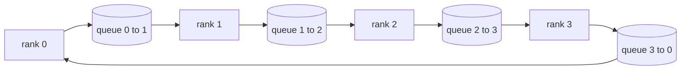

# Operaciones colectivas desde cero

> Las cuatro operaciones colectivas que mantienen la formación distribuida juntas son todosreducir, transmitir, reunir y reducir_dispersar.`multiprocessing.Queue`la malla, verificarlas contra una implementación de referencia, y el resto de la vía se convierte en plomería.

**Type:** Build
**Languages:** Python
**Prerequisites:** Phase 19 Track C lessons 42-49
**Time:** ~90 min

## Objetivos de aprendizaje

- Implement ring allreduce en dos pases (reducir-dispersar y luego reunir) y demostrar que el volumen de comunicación por rango es de 2 ((N-1) / N bytes por elemento.
- Construir la transmisión, todo reunido, y reducir_scatter en la parte superior de punto a punto envía más `multiprocessing.Queue`¿ Qué ?
- Verifique cada primitivo contra un`torch.distributed`Referencia de la misma entrada.
- Defender la elección de anillo versus árbol en forma de grupo, suelo de latencia y techo de ancho de banda.

## El problema

Una totalreducción ingenua sobre N filas envía N veces el tensor a una raíz y transmite N veces de vuelta. La anchura de banda se escala como O(N) por rango, la raíz se convierte en un cuello de botella, y el suelo del reloj de la pared es el enlace más lento veces N. Ring allreducen los planos en 2 ((N-1) trozos de tamaño T/N, por lo que los bytes por rango caen a 2T ((N-1)/N independientemente del tamaño del grupo. El árbol allreduce gana en pequeños enlaces N y de alta latencia porque la profundidad es log2(N) saltos en lugar de 2(N-1). Elige la topología equivocada para la forma del grupo y la GPU más lenta dicta el tiempo de paso.

Cada marco de entrenamiento distribuido que leerás en esta pista depende de estos cuatro primitivos. PyTorch DDP sincroniza los gradientes con un allreduce por cubo de parámetros. ZeRO desglosará el estado de optimización mediante reduc_scatter y emitirá parámetros actualizados por allgather. FSDP convierte el todo hacia adelante en todo juntado más reduc_scatter. Necesidades paralelas de transmisión de tuberías para las activaciones en grupos de etapas. Si no se pueden implementar los cuatro colectivos, no se puede razonar sobre por qué los entrenamientos se detienen, por qué la desajuste de gradientes aparece en el rango 3, o por qué la burbuja de tubería se duplica cuando se intercambian topologías.

## El concepto



### Anillo todo reducir en dos pases

Divide el tensor en N partes iguales indexadas 0..N-1. Cada rango posee un índice de piezas igual a su rango. Pase 1, reducción de dispersión, recorre los pasos N-1. En el paso s, el rango r envía la pieza (r - s) mod N a la pieza (r + 1) mod N y recibe la pieza (r - s - 1) mod N de la pieza (r - 1) mod N, acumulando la pieza recibida en su copia local. Después de N-1 pasos, r r posee la suma completa de r. Pasar 2, todo juntado, ejecuta otro N-1 pasos y gira los trozos terminados alrededor del anillo hasta que cada rango tiene la suma completa de cada trozo.

| Primitive | Per-rank bytes | Steps | When to use |
|-----------|---------------|-------|-------------|
| Ring allreduce | 2T(N-1)/N | 2(N-1) | Large T, fat-pipe homogeneous cluster |
| Tree allreduce | T log2(N) | 2 log2(N) | Small T or high-latency links |
| Broadcast | T | log2(N) tree | Parameter init, scalar config |
| Allgather | T(N-1)/N | N-1 | Sharded forward, ZeRO unshard |
| Reduce_scatter | T(N-1)/N | N-1 | ZeRO gradient sharding |

### Red de cola como sustituto de NCCL

NCCL se ejecuta sobre PCIe y NVLink con reducciones descargadas por hardware.`multiprocessing.Queue`El sistema de distribución de datos de la red de distribución de datos de datos de datos de datos de datos de datos de datos de datos de datos de datos de datos de datos de datos de datos de datos de datos de datos de datos de datos de datos de datos de datos de datos de datos de datos de datos de datos de datos de datos de datos de datos de datos de datos de datos de datos de datos de datos de datos de datos de datos de datos de datos de datos de datos de datos de datos de datos de datos de datos de datos de datos de datos de datos de datos de datos de datos de datos de datos de datos de datos de datos de datos de datos de datos de datos de datos de datos de datos de datos de datos de datos de datos de datos de datos de datos de datos de datos de datos de datos de datos de datos de datos de datos de datos de datos de datos de datos de datos de datos de datos de datos de datos de datos de datos de datos de datos de datos de datos de datos de datos de datos de datos de datos de datos de datos de datos de datos de datos de datos de datos de datos de datos de datos de datos de datos de datos de datos de datos de datos de datos de datos de datos de datos de datos de datos de datos de datos de datos de datos de datos de datos de datos de datos de datos de datos de datos de datos de datos de datos de datos de datos de datos de datos de datos de datos de datos de datos de datos de datos de datos de datos de datos de datos de datos de datos de datos de datos de datos de datos de datos de datos de datos de datos de datos de datos de datos de datos de datos de datos de datos de datos de datos de datos de datos de datos de datos de datos de datos de datos de datos de datos de datos de datos de datos de datos de datos de datos de datos de datos de datos de datos de datos de datos de datos de datos de datos de datos de datos de datos de datos de datos de datos de datos de datos de datos de datos de datos de datos de datos de datos de datos de datos de datos de datos de datos de datos de datos de datos de datos de datos de datos de datos de datos de datos de datos de datos de datos de datos de datos de datos de datos de datos de datos de datos de datos de datos de datos de datos de datos de datos de datos de datos de datos de datos de datos de datos de datos de datos de datos de

### Verificar con el globo

Cada primitivo aterriza con una prueba de unidad que compara su producción con `torch.distributed`El primer ensayo de la serie de pruebas de simulación de la velocidad de un anillo de reducción se inicia con el respaldo de la luz en el mismo tensor en el mismo tamaño mundial.

```figure
ci-ring-allreduce
```

## Construye el mismo

`code/main.py`los instrumentos:

- `Mesh`clase que conecta N `multiprocessing.Queue`Instancias en un anillo y expone `send(dst, tensor)`y `recv(src)`por rango.
- `ring_allreduce(mesh, rank, world_size, tensor)`ejecutando el algoritmo de dos pases.
- `broadcast(mesh, rank, world_size, tensor, src)`sobre un árbol logaritmico.
- `allgather(mesh, rank, world_size, tensor)`utilizando rotación N-1.
- `reduce_scatter(mesh, rank, world_size, tensor)`como la primera mitad de todoreduce.
- `_gloo_reference(op, world_size, tensor)`que pasa por la misma entrada `torch.distributed`con gloo para comparación en byte-igual.

- ¿Qué quieres decir ?

```bash
python3 code/main.py
```

Resultado: tabla de verificación primitiva comparando las salidas de red de cola y de luz, seguida de un contador de bytes por rango que demuestra la escala 2T(N-1) /N.

## Modelos de producción en la naturaleza

Tres patrones endurecen los primitivos lo suficiente como para enviarlos.

**Bucket gradients before allreduce.**Un modelo de parámetro 1B tiene decenas de miles de tensores de gradiente. Un allreduce por tensor paga el piso de latencia N veces. DDP cubre los gradientes en ~ 25 MB y emite un allreduce por balde; los pequeños tensores viajan en la parte posterior de los grandes. Sin cubrir el costo de latencia domina el paso.

**Overlap communication with computation.**El proceso de cálculo de gradientes es de una capa a otra en orden inverso. Cuando el gradiente de la última capa está listo, inicia su reducción total mientras la siguiente capa continúa con la computación. PyTorch DDP fija esto con ganchos listos para cubrir.

**Pick ring or tree by message size, not religion.**NCCL envía un detector de topología que selecciona el anillo para mensajes por encima de ~ 1 MB y árbol por debajo. El crossover es ancho de banda versus latencia: por encima de 1 MB, el término ancho de banda 2T(N-1) / N domina y gana el anillo; por debajo de 1 MB, gana el recuento de saltos.

## Usalo

Modelos de producción:

- **PyTorch DDP.**Llamadas .`dist.all_reduce`El tamaño del cubo es ajustable; 25 MB por defecto es razonable para 100Gbit Ethernet.
- **DeepSpeed ZeRO.**Los problemas reducen_scatter a gradientes de fragmentos y se reúnen para reconstruir los parámetros completos antes de avanzar.
- **FSDP.**El avance comienza con allgather para desglosar la capa, calcula, luego reduce con reduce_scatter y descarta lo desglosado.

## Envío

Utilice las primitivas de red de cola en las lecciones 77-81. Lección 77 los cables todos reducen a DDP. Lección 78 los cables reducen_dispersón en ZeRO. Lección 79 los cables transmitidos en activaciones de tuberías. Lección 81 compone los cuatro en la demostración de extremo a extremo.

## Los ejercicios

1. Añadir un árbol para reducir la variante y cambiar entre anillo y árbol por tamaño del mensaje.
2. Añadir un`recv_timeout_ms`Así que un rango estancado aparece un error de fecha límite en lugar de colgar para siempre.
3. Reemplazar`multiprocessing.Queue`Con tomas TCP para las cuatro primitivas.
4. Añadir un gancho de instrumentación de ancho de banda para que el contador de byte por rango se registre en JSONL.
5. Comparar el tiempo del reloj de la pared del anillo contra el árbol en 4 filas para tensores de tamaño 1KB, 1MB, 16MB. Defender el crossover empíricamente.

## Términos clave

| Term | What people say | What it actually means |
|------|----------------|------------------------|
| Allreduce | "Sum across ranks" | After the call every rank holds the same reduced tensor |
| Ring | "The fast topology" | N-1 chunks of size T/N flow around the cycle twice |
| Tree | "The log topology" | Reduction follows a binary tree; depth is log2(N) hops |
| Allgather | "Concatenate shards" | Every rank ends with every other rank's shard |
| Reduce_scatter | "Split the sum" | Each rank ends with the sum of one chunk only |
| Bucket | "Fuse small tensors" | Coalesce N small allreduces into one large one |

## Leer más

- [PyTorch Distributed: NCCL collectives](https://pytorch.org/docs/stable/distributed.html#collective-functions)
- [Horovod ring allreduce paper](https://arxiv.org/abs/1802.05799)
- [NCCL topology and algorithm selection](https://docs.nvidia.com/deeplearning/nccl/user-guide/docs/index.html)
- [Patarasuk and Yuan, Bandwidth optimal allreduce algorithms](https://www.cs.fsu.edu/~xyuan/paper/09jpdc.pdf)
- Fase 10 Lección 05 - visión general de la formación distribuida
- Fase 19 Lección 77 - DDP cableado encima de estos primitivos
