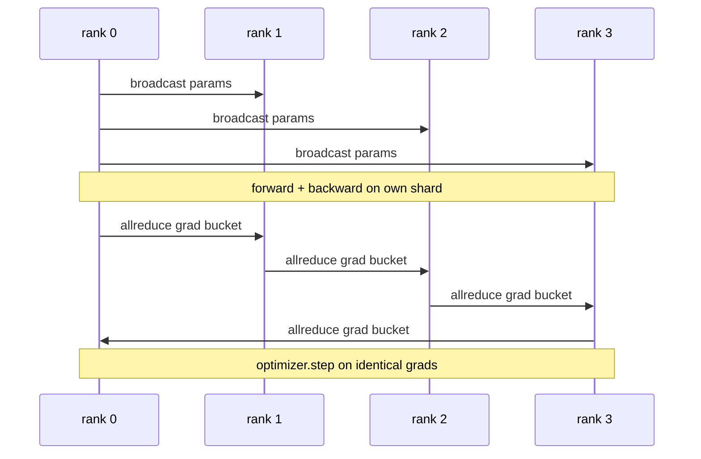

# Datos paralelas DDP desde cero

> DistribuidoDataParallel es un gancho en la parte superior de allreduce. Envuelva un modelo, transmite los parámetros iniciales desde el rango 0 para que cada rango comience idéntico, instala un gancho hacia atrás en cada parámetro que emite un allreduce del gradiente, y el resto es el descenso del gradiente.

**Type:** Build
**Languages:** Python
**Prerequisites:** Phase 19 Track C lessons 42-49
**Time:** ~90 min

## Objetivos de aprendizaje

- El cable a `DistributedDataParallel`- envuelo de forma que transmita los parámetros iniciales y reduce los gradientes después de retroceder.
- Spawn N CPU se clasifica con `torch.multiprocessing.spawn`sobre el fondo de la oscuridad con un encuentro basado en archivos.
- Demostrar la corrección de la sincronización entre gradientes mediante la formación del mismo modelo en los mismos datos secuencialmente y mostrando la equivalencia de parámetros por paso.
- Defender el uso de cubos (fusión gradiente) y superposición (comm durante retroceso) como los dos cambios que convierten un DDP de trabajo en un DDP de producción.

## El problema

Un modelo de 1 mil millones de parámetros con 12 GB de activaciones no encaja en una GPU de consumo. Incluso cuando encaja, el entrenamiento toma semanas. Los datos paralelos dividen el lote en N filas, cada fila calcula el avance y el retroceso en su fragmento, y en cada paso se suman los gradientes de cada fila para que todas las copias N permanezcan idénticas.

Sin sincronización de gradientes, las replicas N divergen por paso 2. El modelo ya no es "un modelo entrenado en más datos", son N modelos separados que comparten pesos iniciales. Con la sincronización de gradientes mal realizada (uno todo reduce por parámetro, sin superposición, sin cubrir) la red es el cuello de botella y las GPUs están esperando el cable. La nave de DDP está haciendo que la sincronización de gradientes sea casi libre en relación con la computación. El canónico PyTorch DDP logra eso mediante la conversión de gradientes, superponiendo todoreduce con la capa siguiente hacia atrás, y utilizando NCCL en NVLink. Podemos hacer las tres en CPU con Gloo y aprender las mismas lecciones.

## El concepto



### Las tres operaciones que necesita DDP

| Stage | Collective | Why |
|-------|-----------|-----|
| Init | broadcast from rank 0 | Every rank starts with the same parameters |
| After backward | allreduce of each grad | The mean gradient is what the optimiser steps on |
| Sometimes | broadcast of buffers | Batchnorm running stats stay synchronised |

### ¿Por qué lo malvado y no lo sumado?

Allreduce-SUM dividido por world_size da el gradiente medio. El medio es invariante al mundo_size: una tasa de aprendizaje sintonizada en una fila funciona en cuatro filas porque la magnitud del gradiente por paso no cambia. Allreduce-SUM sin la división te obliga a retunar la tasa de aprendizaje cada vez que cambias el tamaño del grupo. DDP envuelve la suma y divide; haz lo mismo en la lección.

### ¿Por qué los gradientes de cubo

Un transformador tiene miles de tensores de parámetros. Un allreduce por tensor paga el piso de latencia de la sombra miles de veces. DDP agrupa los gradientes en ~ 25 MB de cubos y emite un allreduce por cubo. Los mismos bytes totales se mueven a través del cable pero la latencia se amortiza sobre el cubo. Para el modelo diminuto de la lección agrupamos todo en un cubo; la estructura es lo que transporta.

### ¿Por qué se pincha la semilla?

Cada rango debe llamar`torch.manual_seed(seed + rank)`para mezclar pero `torch.manual_seed(seed)`para el parámetro init. Una sola semilla compartida significa que cada rango ve el mismo orden de lote (parallelos de datos derrotando); una semilla específica de rango para parámetros significa que los parámetros iniciales no están de acuerdo por epsilon flotante y la sincronización de gradientes ya no hace que las réplicas sean idénticas.

```figure
ci-ddp-grad-sync
```

## Construye el mismo

`code/main.py`los instrumentos:

- `MiniMLP`: una MLP de tres capas lo suficientemente pequeña como para converger en segundos, lo suficientemente grande como para exponer el cableado.
- `DistributedDataParallel(model, world_size)`: transmite parámetros en el momento de la construcción, devuelve un envase cuyo `sync_grads`Divide los graduados acumulados por tamaño mundial.
- `worker(rank, world_size, ...)`: ciclo de formación completo con `torch.distributed`Inicia sobre el horizonte, hacia adelante, hacia atrás, sincronización, paso.
- `_reference_single_process_loop(...)`: se utiliza el mismo modelo en los mismos datos secuencialmente en una fila, utilizado por la prueba de equivalencia de parámetros en byte-igual después de cada paso.

- ¿Qué quieres decir ?

```bash
python3 code/main.py
```

Resultado: una tabla de entrenamiento por paso que compara la pérdida de un solo proceso y la suma de comprobación de parámetros con la ejecución de DDP en 4 filas.

## Modelos de producción en la naturaleza

Tres patrones endurecen el DDP lo suficiente como para enviar.

**Find unused parameters.**Algunos caminos hacia adelante omiten los parámetros condicionalmente (salida temprana, mezcla de expertos en el router). Los parámetros omitidos no tienen gradiente, pero el gancho listo para cubrir el cubo de DDP todavía los espera y todos reducen los atascos. `find_unused_parameters=True`El costo es un gráfico de caminar por paso, así que deje de hacerlo a menos que sus ramas hacia adelante.

**Static graph optimisation.**Cuando el delantero es estable a través de los pasos,`static_graph=True`La optimización es importante a escala: la precomputación ahorra unos pocos ms por paso que se compone en 10.000 pasos.

**Gradient accumulation needs care.**La acumulación de gradientes sobre los microbatches K sin sincronizar cada microbatch es una ganancia de 10 veces el rendimiento.`no_sync()`Si olvidas al gerente, reduces K veces por nada, el rendimiento cae al suelo.

## Usalo

Modelos de producción:

- **PyTorch DDP.**La aplicación canónica. `torch.nn.parallel.DistributedDataParallel(model)`cables en cubo, superposición, y el contexto no_sync.
- **HuggingFace Accelerate.**Añade un lanzador que maneja`torchrun`Env vars y el modelo de envoltura.
- **Megatron-LM data parallel.**Combina DDP con paralelos tensores para modelos grandes; la pieza paralela de datos es el mismo patrón de reducción total después de retroceso.

## Envío

La lección 78 (Zero sharding) reemplaza el parámetro allreduce con reduce_scatter para que cada rango solo almacene su fragmento del estado optimizador.

## Los ejercicios

1. Agregue cubos de gradiente de tamaño configurable y mide el aceleramiento frente a un reducción total por parámetro en un modelo más profundo.
2. Implementación `no_sync()`como gestor de contexto y verificar que la acumulación de gradientes coincide con una línea de base de un solo proceso en relación con los microbatches K.
3. Añadir un`find_unused_parameters`El modo de marcha en el que el avanzado a veces salta una de las capas de MLP; sin la bandera la carrera debe quedar en un punto muerto.
4. Reemplaza el gloo por `torch.distributed.barrier()`-sólo sincronización para sentir la diferencia entre sincronización basada en reducción total y sincronización basada en barreras.
5. Medir el coste general de sincronización de gradientes como una fracción del tiempo de paso para los tamaños de lote 1, 16, 256 y explicar la escala.

## Términos clave

| Term | What people say | What it actually means |
|------|----------------|------------------------|
| DDP | "Data parallel" | Wrapper that broadcasts params and allreduces grads each step |
| Bucket | "Fuse grads" | Group N small allreduces into one large one |
| Overlap | "Hide comm" | Issue allreduce while later layers still computing backward |
| no_sync | "Accumulate" | Skip the post-backward allreduce for gradient accumulation |
| find_unused | "Branchy forward" | Detect parameters with no grad before reducing |

## Leer más

- [PyTorch DistributedDataParallel docs](https://pytorch.org/docs/stable/generated/torch.nn.parallel.DistributedDataParallel.html)
- [PyTorch DDP internals tutorial](https://pytorch.org/tutorials/intermediate/ddp_tutorial.html)
- [Li et al, PyTorch Distributed: Experiences on Accelerating Data Parallel Training](https://arxiv.org/abs/2006.15704)
- Fase 19 Lección 76 - los colectivos DDP se basa en
- Fase 19 Lección 78 - El fragmento ZeRO reemplaza el reducido por parámetro con reducido_dispersado
