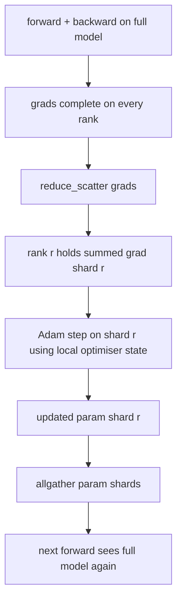

# El estado de la fragmentación de ZeRO Optimizer

> Adam almacena dos estimaciones de momento por parámetro, ambas en float32. Un modelo de parámetro 7B tiene 56 GB de estado optimizador. ZeRO etapa 1 se desglosan que a través de N filas; cada fila posee 1/N del optimizador. Después del paso local los fragmentos de parámetro actualizados se transmiten de nuevo, cada rango reconstruye el modelo completo, y comienza el siguiente paso. La victoria es una caída de memoria lineal en la asignación única más grande en la pila de entrenamiento.

**Type:** Build
**Languages:** Python
**Prerequisites:** Phase 19 Track C lessons 42-49
**Time:** ~90 min

## Objetivos de aprendizaje

- El estado de optimización de fragmentos (primer momento, segundo momento, copia principal fp32) a través de las filas N por lo que cada fila es dueña de 1/N.
- Utilice reduce_scatter para entregar cada rango sólo la suma de gradiente de su fragmento, luego todos reúnen para transmitir los fragmentos de parámetro actualizados de vuelta.
- Calcule la tabla de almacenamiento de memoria para la etapa 1, etapa 2, etapa 3 con la vanilla DDP.
- Defender la elección de la etapa 1 vs etapa 2 vs etapa 3 en el tamaño del modelo y el presupuesto de ancho de banda.

## El problema

Vanilla DDP replica todo: los parámetros, gradientes y estado optimizador están presentes en su totalidad en cada rango. Para un modelo de parámetro 7B en fp16 que significa 14 GB de parámetros, 14 GB de gradientes y 28 GB de estado optimizador por rango. El estado optimizador es el término más grande y el más fácil de desglosar porque solo se toca durante el paso, no durante el avance o el retroceso.

El ZeRO etapa 1 reduce el estado de optimización. Cada rango tiene 1/N de los momentos de Adam. Después de retroceder, en lugar de reducir el gradiente completo y pisar localmente, ZeRO reduce_scatters para que cada rango reciba solo el gradiente sumado de su fragmento. El rango aplica el paso más óptimo a su fragmento de los parámetros maestros. Los fragmentos de parámetros actualizados se reúnen para que cada rango tenga el modelo completo para el siguiente adelante. La memoria optimizadora cae en N. El tráfico de cable por paso es el mismo que DDP: un reduc_scatter más un allgather es igual a un allreduce por ancho de banda. La memoria gana, el rendimiento se mantiene.

## El concepto



### Etapas de la ZER

| Stage | What is sharded | Memory per rank | Comm per step |
|-------|----------------|------------------|---------------|
| DDP | nothing | params + grads + optim | 1x allreduce |
| ZeRO-1 | optimiser state | params + grads + optim/N | 1x reduce_scatter + 1x allgather |
| ZeRO-2 | optim + grads | params + grads/N + optim/N | 1x reduce_scatter + 1x allgather |
| ZeRO-3 | optim + grads + params | params/N + grads/N + optim/N | 1x allgather per layer + 1x reduce_scatter per layer |

La etapa 1 es la victoria más barata porque el estado optimizador domina el presupuesto. La etapa 2 necesita lógica de acumulación de fragmentos de gradiente pero el ancho de banda es el mismo. La etapa 3 (FSDP) paga por capa de comunicación por cada avance y retroceso, ganando la caída de memoria de parámetro-fragmento.

### Las matemáticas de la memoria, números reales

Para un modelo con parámetros P entrenados con Adam en precisión mixta:

| Term | Vanilla | ZeRO-1 | Why |
|------|---------|--------|-----|
| fp16 params | 2P bytes | 2P bytes | needed for forward |
| fp16 grads | 2P bytes | 2P bytes | needed for backward |
| fp32 master copy | 4P bytes | 4P/N bytes | only the optim uses it |
| fp32 first moment | 4P bytes | 4P/N bytes | only the optim uses it |
| fp32 second moment | 4P bytes | 4P/N bytes | only the optim uses it |
| Total | 16P bytes | 4P + 12P/N bytes |   |

En N=8: vanilla 16P, ZeRO-1 5.5P, una caída del 65%. en N=64: vanilla 16P, ZeRO-1 4.19P, una caída del 74%.

### ¿Por qué reduce_scatter bate todoreduce-then-shard

Allreduce da a cada rango el gradiente total sumado. Si sólo se necesita fragmento r, el (N-1) /N del gradiente que se redujo se desperdicia en rango r. Reduce_scatter entrega exactamente el fragmento que cada rango posee; los bytes por rango son los mismos que allreduce (ya que allreduce es reduce_scatter + allgather), pero la segunda mitad es reemplazada por el parámetro-shard allgather más tarde. El cable de red es idéntico al DDP, la memoria está dividida.

```figure
cd-zero-shard
```

## Construye el mismo

`code/main.py`los instrumentos:

- `flatten_params(module)`y `unflatten_into(module, flat)`El diseño plano es lo que hace que la fragmentación por rango sea una simple rebanada.
- `ZeroOptimizer(model, world_size, rank, lr)`que posee el fragmento de la rango de la copia maestra y los momentos de Adam.
- `step()`que ejecuta reduc_scatter en el gradiente plano, aplica a Adam a la fragmentación de la fila, y recolecta todos los parámetros actualizados de vuelta.
- Una demostración que entrena un MLP de 3 capas durante 20 pasos e imprime el presupuesto de memoria por paso junto con una línea de base de DDP de vainilla.

- ¿Qué quieres decir ?

```bash
python3 code/main.py
```

Resultado: pérdida por paso y la tabla de memoria que muestra ZeRO-1 tiene 1/N del estado optimizador en cada rango frente a la copia completa de DDP.

## Modelos de producción en la naturaleza

Tres patrones endurecen el ZeRO lo suficiente como para enviar.

**Sharded checkpointing matters.**El estado optimizador de ZeRO-1 se divide en filas; el punto de control tiene que registrar qué rango posee qué. La lección 80 construye el manifiesto de punto de control fragmentado que reanuda una ejecución de ZeRO en el mismo tamaño mundial. Sin él el estado guardado es ilegible al reiniciar.

**Mixed precision is the point.**ZeRO es una técnica de precisión mixta; la copia maestra de fp32 es lo que se fragmenta. ejecutar ZeRO sin precisión mixta paga el impuesto de memoria en el maestro de fp32 sin la ganancia de fp16 hacia adelante correspondiente.

**Stage 1 is a near-free win.**El intercambio de datos es idéntico al DDP por ancho de banda. Los ahorros de memoria son lineales en N. El único costo es la contabilidad para el fragmento optimizador.

## Usalo

Modelos de producción:

- **DeepSpeed ZeRO.**La aplicación de referencia. `deepspeed_config.json`selecciona el nivel 1/2/3 y los tamaños de la partición.
- **PyTorch FSDP.**El equivalente nativo de PyTorch.`ShardingStrategy.SHARD_GRAD_OP`es ZeRO-2; `FULL_SHARD`Es ZeRO-3.
- **HuggingFace Accelerate.**Envuelve tanto a DeepSpeed como a FSDP bajo una configuración uniforme.

## Envío

La lección 79 (paralelo de la tubería) es el eje ortogonal de fragmentación: en lugar de fragmentar el estado optimizador a través del mismo modelo, las capas de tubería se fragman a través de filas. La lección 81 compone DDP + ZeRO en la demostración de extremo a extremo.

## Los ejercicios

1. Se extiende hasta ZeRO-2 mediante gradientes de fragmentación: cada rango solo almacena el gradiente para su fragmentación, logrado mediante la eliminación de la parte no fragmentación después de retroceder.
2. Añadir un perfilador de memoria que imprime el uso real de byte fp32 en la posición 0 en comparación con la predicción de la fórmula.
3. Mide el tiempo de pared por paso del DDP de vainilla frente a ZeRO-1 y se descomponga en hacia adelante, hacia atrás, comunicaciones.
4. Implementar el recorte de gradiente bajo ZeRO-1: la norma L2 debe calcularse en todos los fragmentos mediante todoreducción de la norma local al cuadrado.
5. Implemente un "Zero ingenuo" con allreduce en lugar de reduce_scatter, mide la diferencia de tiempo de cable.

## Términos clave

| Term | What people say | What it actually means |
|------|----------------|------------------------|
| ZeRO-1 | "Shard the optimiser" | Each rank holds 1/N of fp32 master + Adam moments |
| ZeRO-2 | "Shard grads too" | Each rank also drops the non-shard gradients after reduce_scatter |
| ZeRO-3 | "Shard params" | Each rank holds 1/N of fp16 params; allgather per layer in forward |
| Master copy | "fp32 weights" | The high-precision parameter copy the optimiser updates |
| Reduce_scatter | "Split the sum" | Deliver each rank only its shard's summed gradient |

## Leer más

- [Rajbhandari et al, ZeRO: Memory Optimizations Toward Training Trillion Parameter Models](https://arxiv.org/abs/1910.02054)
- [DeepSpeed ZeRO documentation](https://www.deepspeed.ai/tutorials/zero/)
- [PyTorch FSDP documentation](https://pytorch.org/docs/stable/fsdp.html)
- Fase 19 Lección 76 - el reduc_scatter y todogather esta lección se mantiene en
- Fase 19 Lección 80 - punto de control fragmentado que el estado ZeRO debe utilizar
