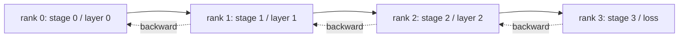

# Análisis paralelo y burbuja de tuberías

> El paralelismo tensor divide la matriz multiplicada a través de filas. El paralelismo de tubería divide el modelo a través de filas, una etapa por fila. Los microbates fluyen a través de la tubería. El tiempo vacío en el principio y el final es la burbuja; minimizándola es toda la nave.

**Type:** Build
**Languages:** Python
**Prerequisites:** Phase 19 Track C lessons 42-49
**Time:** ~90 min

## Objetivos de aprendizaje

- Dividir un modelo secuencial en N etapas y simular una tubería hacia adelante a través de N filas.
- Se recomienda el cálculo de la fracción de burbujas mediante el cálculo de la fracción de burbujas.
- Compare la burbuja con el horario 1F1B entrelazado utilizado en Megatron-LM y PipeDream.
- La asignación de etapa de defensa: el cálculo igual por etapa es más importante que el conteo de parámetros igual por etapa.

## El problema

Un modelo de parámetro 70B en fp16 necesita 140 GB de parámetros solo. Ninguna GPU de consumo la tiene. ZeRO-3 desglosará los parámetros a través de las filas, pero aún así necesitará cada fila para reunir la capa completa para cada paso adelante, pagando log(N) saltos por capa. El paralelo de la tubería toma una ruta diferente: cortar el modelo en N etapas y poner una etapa en cada rango. El avanzado de la capa 1 termina en la posición 0 y entrega el tensor de activación a la posición 1; la posición 1 corre la posición 2 y las manos a la posición 2; y así sucesivamente. Fluye hacia atrás en sentido contrario. La memoria cae linealmente porque cada rango solo tiene una etapa; la computación es secuencial, que es el problema de la burbuja.

La burbuja es el tiempo de inactividad al principio de la tubería (esperando que el primer microbatch llegue a la última etapa) y al final (esperando que el último microbatch vuelva a drenar). En el caso de los microbates M y las etapas N, la fracción de burbujas por etapa es (N-1)/(M+N-1). En M=8, N=4 es el 27%. En M=64, N=4 es del 4,5%. La burbuja se reduce cuando tienes muchos microbatches por paso, lo que significa pequeños tamaños de lotes por microbatch, que es la restricción que impulsa el diseño de microbatch.

## El concepto



### Programa de las Gpipe

Rellenar el tubo hacia adelante con todos los microbates M antes de comenzar hacia atrás; luego drenar hacia atrás en sentido contrario. Las activaciones de cada microbatch deben mantenerse hasta su retroceso, por lo que la memoria crece linealmente con M. El avance toma ciclos M+N-1, el retroceso toma otros ciclos M+N-1. El trabajo útil por etapa es de 2M ciclos; por etapa burbuja es de 2 ((N-1) ciclos. La fracción de burbuja es (N-1) / (((M+N-1) cuando cada avance y retroceso requiere una unidad de tiempo. Elegir M mucho mayor que N esconde la burbuja.

### 1F1B programación

Interlea: tan pronto como el microbatch hacia adelante alcance la última etapa, comience hacia atrás y deje que fluya hacia atrás. El horario alterna una hacia adelante y otra hacia atrás por etapa. La burbuja sigue siendo N-1, pero la memoria de activación está limitada por la profundidad del tubo, no por el recuento de microbatches. Las tuberías de producción utilizan 1F1B (Megatron, PipeDream). La lección implementa primero GPipe porque es más simple, y 1F1B como ejercicio.

### ¿Por qué importa la computación igual por etapa

Si la etapa 0 toma 50 ms y la etapa 1 toma 100 ms, cada ciclo está cerrado en la etapa 1. Las otras etapas están inactivas 50 ms por ciclo esperando la liberación de la etapa 1.

### Microbate contra lote

Una tubería ejecuta microbatches M de tamaño B cada uno. El tamaño efectivo del lote es M*B. El gradiente al final de un paso de tubería es el gradiente en los ejemplos combinados M*B. La fracción de burbuja depende de M; el optimizador ve M*B. La regulación M significa el comercio de burbuja (bajo con M alto) contra memoria por microbatch (memoria de activación más alta con M alto para GPipe).

```figure
cd-pipeline-bubble
```

## Construye el mismo

`code/main.py`los instrumentos:

- `PipelineStage`: un pequeño `nn.Module`que contiene los parámetros de una etapa y expone `forward(activation)`¿ Qué ?
- `Pipeline(stages, num_microbatches)`: orquesta el horario de GPipe en etapas simuladas utilizando un reloj de pared simulado por etapa.
- `bubble_fraction(num_stages, num_microbatches)`: de forma cerrada (N-1) / M+N-1).
- Una demostración de 4 etapas que imprime la traza por microbate y la fracción de burbuja medida.

- ¿Qué quieres decir ?

```bash
python3 code/main.py
```

Resultado: gráfico de Gantt etapa por micro-parcela y el porcentaje de burbujas contra la predicción de forma cerrada.

## Modelos de producción en la naturaleza

Tres patrones endurecen la tubería paralelo lo suficiente como para enviar.

**Activation checkpointing pairs with pipeline.**Con M microbatches en vuelo en GPipe, la memoria de activación es M veces un microbatch.

**Stage balance is measured, not assumed.**Los equipos de producción ejecutan un pase de perfiles que mide el cálculo real por capa (FLOPs y pared-reloj) en el hardware objetivo, luego la partición por esa medición.`--num-layers-per-stage`la bandera acepta una lista para permitir el recuento desigual de capas cuando las etapas tienen diferentes costes por capas.

**Send-recv schedule must avoid deadlock.**Una tubería que tiene cada etapa enviada antes de recibir bloqueos en el cable. La solución estándar es intercalar: las etapas de rango par envían primero, luego recv, y las etapas de rango impar recv primero, luego envían.

## Usalo

Modelos de producción:

- **Megatron-LM.**La referencia para la línea de tuberías paralela en escala. utiliza 1F1B y admite tensor + línea de tuberías + datos paralelas combinados.
- **DeepSpeed Pipeline.**Se integra con ZeRO; el oleoducto ZeRO-1 + es una combinación común para los modelos abiertos más grandes.
- **PyTorch Pipe.**El envase de tubería nativo PyTorch, construido sobre `torch.distributed.pipeline.sync.Pipe`¿ Qué ?

## Envío

La lección 80 almacena los fragmentos de parámetros por etapa en el punto de control fragmentado. La lección 81 compone la tubería DDP + ZeRO + en la demostración de extremo a extremo (en espíritu; la demostración mantiene la tubería simulada para el tiempo de ejecución).

## Los ejercicios

1. Implemente 1F1B y verifique que la fracción de burbuja coincide con GPipe pero la memoria de activación está limitada.
2. Profilar el tiempo real por etapa en un modelo más profundo y reequilibrar las etapas por el reloj de pared medido.
3. Añadir la acumulación de gradientes a través de microbatches de tubería y comprobar que el gradiente es igual al gradiente del equivalente lote completo hacia adelante.
4. Enpare el tubo con el punto de control de activación y mide la caída de memoria frente al costo de cálculo.
5. Combine la tubería con DDP (cada rango de tubería se replica a través de un grupo paralelo de datos) y razona a través del cronograma 2D.

## Términos clave

| Term | What people say | What it actually means |
|------|----------------|------------------------|
| Pipeline | "Model parallel along depth" | One stage per rank, activations flow stage to stage |
| Bubble | "Pipeline idle time" | (N-1) steps at start + end where some stages have no work |
| Microbatch | "Slice of the batch" | One forward/backward unit; bubble shrinks as M grows |
| GPipe | "Fill then drain" | All M forwards before any backward; high activation memory |
| 1F1B | "Interleaved schedule" | One forward one backward per stage; bounded activation memory |

## Leer más

- [Huang et al, GPipe: Efficient Training of Giant Neural Networks](https://arxiv.org/abs/1811.06965)
- [Narayanan et al, PipeDream: Generalized Pipeline Parallelism for DNN Training](https://arxiv.org/abs/1806.03377)
- [Megatron-LM pipeline parallel docs](https://github.com/NVIDIA/Megatron-LM)
- Fase 19 Lección 76 - las primitivas de envío/recuperación que utiliza el calendario
- Fase 19 Lección 78 - ZeRO es ortogonal a la tubería y a menudo se combina
