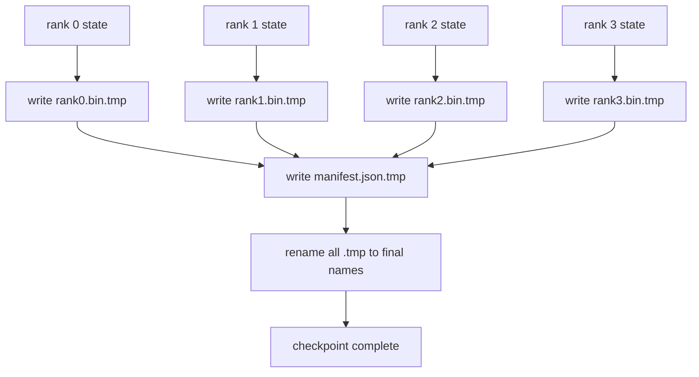

# Punto de control y currículo atómico fragmentado

> Un trabajo de entrenamiento de parámetro 70B se detiene por un fallo de nodos cada pocas horas. El formato del punto de control decide si pierdes 30 minutos o 30 horas. Un puesto de control fragmentado escribe el fragmento de cada rango en paralelo y registra la propiedad en un manifiesto. Resume carga el fragmento de cada rango de su propio archivo, reconstruye el estado en el mismo tamaño mundial, y los pasos más optimizados como si nada hubiera pasado. La escritura atómica mantiene un punto de control medio terminado de envenenar el próximo currículum.

**Type:** Build
**Languages:** Python
**Prerequisites:** Phase 19 Track C lessons 42-49
**Time:** ~90 min

## Objetivos de aprendizaje

- Guarde un puesto de control de varios rango como un archivo de fragmentos por rango más un manifiesto que registra qué rango posee qué.
- Utilice el patrón de escritura atómica (escriba a un camino temporal y luego renombre) para que una escritura de medio choque nunca produzca un punto de control medio terminado.
- Resumen desde el manifiesto, verificando el estado de igual en byte para ambos parámetros fp16 y el estado de optimizador ZeRO en cada rango.
- Defender el esquema manifiesto contra los tres modos de falla: cambio de tamaño mundial, desajuste del recuento de fragmentos y escritura parcial.

## El problema

Un puesto de control de vainilla lee todos los parámetros y el estado de optimizador en el rango 0, se reúne y escribe un solo archivo. Para un modelo 70B que es 1,1 TB de estado a través del puerto de red de una fila. Los escritores bloquean todos los otros rangos porque están esperando la reunión. El ancho de banda IO es el enlace de red más lento de una sola GPU, no el agregado. En un grupo real, el paso de recoger y luego escribir puede tardar más tiempo que la hora de formación anterior, lo que significa que el trabajo se realiza en menos de un punto de control por día de formación.

Los puestos de control fragmentados cambian el patrón: cada rango escribe su propio fragmento en su propio archivo en paralelo. Los registros manifiestos que clasifican a qué fragmento pertenecía, así que el currículum puede poner cada fragmento de vuelta a donde vino. El agregado escribe escalas de ancho de banda con el grupo. Un punto de control de 1 TB que tomó 4 horas a través de una fila toma 4 minutos a través de 64 filas. Además, el manifiesto le da un contrato para currículos incompatibles: el cambio de tamaño mundial es detectable, las escrituras parciales son detectables, y el camino de carga puede fallar en voz alta en lugar de silenciosamente usando datos obsoletos.

## El concepto



### Esquema manifiesto

```json
{
  "world_size": 4,
  "step": 1234,
  "wall_clock_seconds": 4521,
  "shards": [
    {"rank": 0, "path": "rank0.bin", "sha256": "...", "param_shard_offset": 0, "param_shard_numel": 65536},
    {"rank": 1, "path": "rank1.bin", "sha256": "...", "param_shard_offset": 65536, "param_shard_numel": 65536}
  ],
  "schema_version": 1
}
```

Tres campos son cargados.`world_size`hace que un currículum de un tamaño diferente fracase en voz alta en lugar de ser silenciosamente corrupto. `sha256`por fragmento captura escritos parciales o corruptos. `param_shard_offset`y `param_shard_numel`por fragmento, permita que el cargador reconstruya el tensor de parámetro plano en la posición correcta.

### Escribación atómica

El patrón estándar: escribe cada fragmento a `<name>.tmp`, escribe el manifiesto a `manifest.json.tmp`, fsync cada uno, luego renombrar. POSIX renombrar dentro del mismo sistema de archivos es atómico; o bien el nuevo archivo está completamente presente o el viejo es. Un accidente antes del renombrado final deja el punto de control anterior como el vivo. Sin escribir atómico un accidente puede dejar un fragmento parcial con un manifiesto presente que lo apunta, y la carga corrompe el estado optimizador en el currículum.

### Tres modos de falla que el esquema debe defenderse contra

| Failure | Symptom | Defence |
|---------|---------|---------|
| World-size change | resume on N=8 with manifest from N=4 | world_size mismatch in manifest, fail loudly |
| Shard count mismatch | resume sees fewer rank*.bin files than shards in manifest | enumerate shards, verify every one exists |
| Partial write | shard file truncated mid-flush | sha256 verification on load |

Cada defensa rechaza la mala carga temprano; la alternativa es la corrupción silenciosa que surge 100 pasos más tarde cuando la pérdida va a NaN.

### ¿Por qué archivos por rango, no un archivo grande

Escribir simultáneamente a un archivo a través de `O_APPEND`Los archivos por rango no tienen contención y se benefician de la tiración cuando el sistema de archivos subyacente es paralelo (Lustre, GPFS).

```figure
ci-sharded-checkpoint
```

## Construye el mismo

`code/main.py`los instrumentos:

- `ShardManifest`clase de datos con el esquema anterior más `to_json`- ¿ Qué ?`from_json`¿ Qué ?
- `save_sharded(state_dict_per_rank, dir, step)`que escribe el estado binario de cada rango en su propio archivo usando el patrón atómico de tiempo-también-nombre, luego escribe el manifiesto.
- `load_sharded(dir, expected_world_size)`que lee el manifiesto, verifica la sha256 de cada fragmento y devuelve los dictados de estado por rango.
- Una prueba de ida y vuelta: construir estado por rango, guardar, cargar, afirmar que el byte es igual.

- ¿Qué quieres decir ?

```bash
python3 code/main.py
```

Fuente: 4 archivos de fragmentos más el manifiesto escrito, luego recargado con verificación igual a byte.

## Modelos de producción en la naturaleza

Tres patrones endurecen el puesto de control lo suficiente como para enviar.

**Async write.**Las pilas de producción emiten el punto de control escribe en un hilo o proceso separado para que el entrenamiento continúe. La barrera está en el siguiente punto de control: no inicie el siguiente salvo hasta que el anterior esté completo.`async_io`La lección mantiene la escritura sincrónica para que los pasos sean visibles.

**Local fast disk first, then async upload.**Escriba a NVMe local (rápido) y luego subirá sincronizado a S3 o GCS. El patrón de dos niveles mantiene el punto de control en el grupo rápido para el currículum mientras envía una copia duradera fuera del grupo para el archivo. El manifiesto lleva el camino local; un manifiesto de subida lleva el camino remoto.

**Rotation matters.**Las ejecuciones de producción mantienen los últimos puntos de control K (generalmente 3-5) y rotan los más antiguos. Sin rotación el disco se llena a mitad de la carrera y el siguiente punto de control falla.

## Usalo

Modelos de producción:

- **DeepSpeed checkpointing.** `deepspeed.save_checkpoint(tag=step)`escribe archivos por rango y un `latest`archivo que apunta a la etiqueta activa.
- **PyTorch FSDP checkpointing.** `torch.distributed.checkpoint`salva el estado fragmentado con un `Planner`que decide el diseño por rango.
- **NeMo.**Envuelve DeepSpeed y FSDP con un uniforme `save_to_checkpoint`API que agrega metadatos.

## Envío

La lección 81 guarda un punto de control fragmentado de la ejecución de DDP+ZeRO de extremo a extremo y lo recarga en el mismo tamaño mundial para demostrar la validez del contrato de currículum.

## Los ejercicios

1. Agregar escritura sincronizada: iniciar el salvado en un hilo y dejar que la formación continúe. Bloquear el siguiente salvado hasta que el anterior se complete.
2. Añadir un`last_5_steps`rotation: mantenga los 5 puntos de control más recientes, elimine los más antiguos antes de guardar uno nuevo.
3. Añadir una vía de verificación rápida de solo CRC para la recarga en circuito interno (la rotación hace que un punto de control sea el nuevo activo sin sha256 completo).
4. Añadir una carga de tamaño transmundo: reequilibrio de fragmentos de N=4 a N=8 leyendo el manifiesto, concateniendo y re-carteniendo.
5. Añadir una carga a un falso S3 (un segundo directorio) y escribir el manifiesto de carga.

## Términos clave

| Term | What people say | What it actually means |
|------|----------------|------------------------|
| Sharded checkpoint | "Per-rank save" | Each rank writes its own shard file in parallel |
| Manifest | "Index" | JSON file recording shard paths, offsets, and sha256 |
| Atomic write | "tmp then rename" | Write to .tmp then POSIX rename so a crash leaves the previous file live |
| Partial write | "Truncated shard" | A crash during write produces a corrupt shard; sha256 catches it |
| Rotation | "Keep last K" | Delete oldest checkpoint before writing new one to bound disk usage |

## Leer más

- [DeepSpeed checkpointing](https://deepspeed.readthedocs.io/en/latest/model-checkpointing.html)
- [PyTorch torch.distributed.checkpoint](https://pytorch.org/docs/stable/distributed.checkpoint.html)
- [POSIX rename atomicity](https://pubs.opengroup.org/onlinepubs/9699919799/functions/rename.html)
- Fase 19 Lección 78 - El estado de ZeRO este punto de control está diseñado para salvar
- Fase 19 Lección 81 - la demostración de extremo a extremo viaja de ida y vuelta el estado guardado
