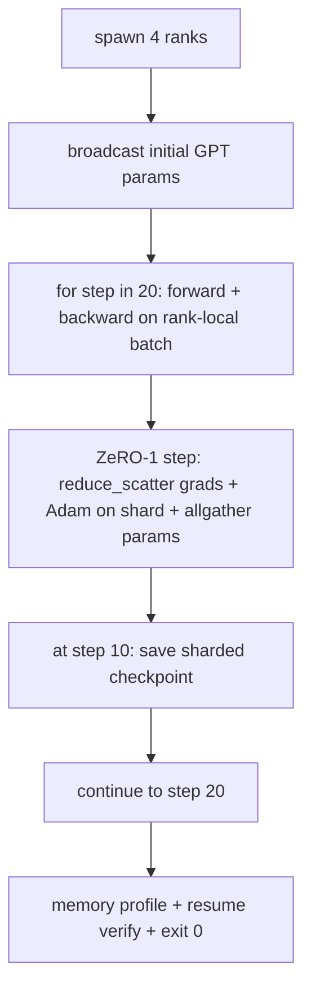

# Formación distribuida de extremo a extremo

> Las lecciones 76 a 80 construyeron cada una una pieza. Este es el ensamblaje: un pequeño GPT entrenado en 4 filas simuladas con DDP para la sincronización de gradientes, ZeRO-1 para el fragmentación de estado optimizador y un punto de control fragmentado en la marca de medio camino. La demostración corre 20 pasos, se termina automáticamente, imprime una curva de pérdida más un perfil de memoria y escribe un punto de control reiniciable.

**Type:** Build
**Languages:** Python
**Prerequisites:** Phase 19 Track C lessons 42-49
**Time:** ~90 min

## Objetivos de aprendizaje

- Componer DDP (lección 77) más ZeRO-1 (lección 78) más puntos de control fragmentados (lección 80) en un bucle de entrenamiento.
- Entrenar un modelo de lenguaje transformador de 2 capas en un pequeño corpus sintético durante 20 pasos a través de 4 filas simuladas.
- Imprima una tabla de pérdidas por paso, un perfil de memoria por rango y un manifiesto de punto de control que se reanuda en byte-equal en el mismo tamaño mundial.
- Defender la composición: cada pieza es probable de forma independiente en lecciones anteriores y esta lección prueba que componen.

## El problema

Una piedra angular es la prueba de que las piezas encajan juntas. Lección 76 colectivos implementados. La lección 77 los envuelve en DDP. Lección 78 estado optimizador fragmentado con reduc_scatter. Lección 79 analizó la tubería. La Lección 80 salvó un puesto de control fragmentado. Cada lección se mantuvo sola con su propia prueba. Una carrera de entrenamiento real utiliza todos los primitivos a la vez; si la composición es incorrecta, la pérdida diverge, el punto de control se niega a reanudarse, o la memoria por rango crece cuando debería encogerse.

Esta lección ejecuta la demostración de extremo a extremo y verifica cuatro invariantes: (a) la pérdida disminuye monótona a lo largo de los 20 pasos dentro del ruido de float, (b) cada rango tiene la misma norma de parámetros en cada paso, (c) la memoria de optimista por rango es igual a los bytes de la fórmula ZeRO-1 12P/N, y (d) el punto de control en el paso 10 se recarga en byte-equivalente al reinicio. La demostración se termina por sí misma: 20 pasos, un solo comando, salida 0.

## El concepto



### El mini GPT

El modelo es pequeño a propósito: 2 bloques de transformador, incorporado dim 32, 4 cabezas de atención, vocabulario 64, longitud de secuencia 16, lote 4. Unos pocos miles de parámetros. Lo suficientemente grande como para ejercer cada decisión de cableado (la atención multi-cabeza corre el camino máscarado estándar; LayerNorm tiene pesos para sincronizar; la cabeza LM es una proyección lineal separada de vuelta al vocabulario). Lo suficientemente pequeño como para que 20 pasos en 4 rango de CPU terminen en segundos.

### Las normas de composición

| Lesson piece | What it owns | What it leaves to the loop |
|--------------|--------------|----------------------------|
| DDP broadcast | Initial parameter sync | One call at construct time |
| ZeRO-1 step | Gradient sync, master copy update, parameter broadcast | One call per step replacing optimiser.step |
| Sharded checkpoint | Persist per-rank state, manifest with sha256 | Called on rank 0 with state collected via allgather |
| Training loop | Forward, backward, loss logging | Calls the three above in order |

El bucle no conoce los archivos de reduc_scatter o rendezvous.

### ¿Por qué un pequeño GPT y no sólo un MLP

El MLP de la lección 77 fue suficiente para verificar la sincronización de gradientes. Un pequeño GPT agrega tres cosas: una cabeza LM separada sobre la vocabla (en esta lección, desatada para la claridad; GPT completa típicamente une la cabeza a la incorporación de tokens), softmax + cross-entropy como la pérdida (más casos de borde numérico que MSE), y un avanzado asimétrico (embeddings luego atención luego MLP por capa). Apegarse a una MLP para la piedra angular ocultaría si la composición maneja correctamente la forma de la capa de inserción o la forma de la capa de inserción.

### Autoterminación significa salida 0

El bucle corre a 20 pasos fijos y sale.`while True`Una piedra angular que puedes dejar corriendo sin vigilancia y encontrar un registro completo cuando termine es una piedra angular que demuestra que el sistema está conectado correctamente.

```figure
ci-distributed-assembly
```

## Construye el mismo

`code/main.py`los instrumentos:

- `MiniGPT`: Transformador de dos capas con autoatención enmascarada y cabeza LM separada.
- `make_corpus(seed, total_tokens)`: datos deterministas de predicción de tokens siguientes.
- `_train_worker`: generado por rango; transmite los parámetros init, ejecuta el bucle, llama a paso ZeRO, escribe el punto de control fragmentado en el paso 10.
- `verify_resume`: después de la ejecución principal, recarga el punto de control paso 10 en proceso y afirma que los fragmentos maestros guardados coinciden con el instantáneo en memoria byte-for-byte.
- `main`: orquesta toda la demostración, imprime la tabla de pérdidas, el perfil de memoria y el resultado de verificación.

- ¿Qué quieres decir ?

```bash
python3 code/main.py
```

Resultado: una tabla de pérdidas de 20 filas, un perfil de memoria de 4 filas por rango, un manifiesto de checkpoint y una línea "RESUMAR VERIFIADO" sobre el éxito.

## Modelos de producción en la naturaleza

Tres patrones terminan la composición para carreras reales.

**Checkpoint every K minutes, not every K steps.**El tiempo de paso varía según la longitud de secuencia y el número de microbatches. Una cadencia de 10 minutos de punto de control capta la misma computación independientemente del tamaño del modelo.

**Detect divergence early.**Las carreras de producción añaden un guardador de NaN después de retroceder y un detector de picos de pérdida; si la pérdida salta más de 2 veces en un paso, vuelva al punto de control anterior en lugar de dejar que el optimizador marche hacia un estado degenerado.

**Aggregate the memory profile across ranks.**La memoria por rango difiere por rango en ejecuciones reales (el rango con la etapa de pipeline más grande tiene más activaciones).

## Usalo

Modelos de producción:

- **DeepSpeed.**Combina DDP + ZeRO + pipeline + control de activación bajo una configuración.
- **PyTorch FSDP.**El equivalente nativo.`FullyShardedDataParallel`con`ShardingStrategy.SHARD_GRAD_OP`Es ZeRO-2.
- **NeMo and Megatron-LM.**Añadir el paralelismo tensor para los modelos más grandes; de lo contrario la composición es la misma forma.

## Envío

La pista completa termina aquí. Las 6 lecciones juntas son el subsistema de capacitación distribuida que un equipo real construirá antes de adoptar DeepSpeed; la abstracción se ha probado contra el mundo y se han ejercido los modos de falla.

## Los ejercicios

1. Añadir una división tensor paralela de la cabeza de atención y verificar que la pérdida coincide con la línea de base de un rango.
2. Añadir la acumulación de gradientes en 4 microbatches y demostrar que el gradiente es igual al gradiente de un gran lote.
3. Añadir un currículum de paso 10 camino que realmente continúa el entrenamiento al paso 20 y produce la misma pérdida final que la carrera original.
4. Añadir una métrica de exportación (perdida, norma de grad, tiempo de paso) a JSONL para que la ejecución pueda ser visualizada después del hecho.
5. Añadir un guardador de NaN que vuelva al punto de control anterior en un punto de pérdida, y forzar un punto de pérdida con un multiplicador LR de un paso para ejercer el retroceso.

## Términos clave

| Term | What people say | What it actually means |
|------|----------------|------------------------|
| End-to-end | "Wire it all up" | One run composes every piece, not a unit test per piece |
| Memory profile | "GB per rank" | Bytes held on each rank for params, grads, optimiser state |
| Resume contract | "Save and load" | Per-rank state byte-equal after a checkpoint round-trip |
| Self-terminating | "Bounded run" | Fixed step count, exit 0 on completion, no human in the loop |

## Leer más

- [DeepSpeed end-to-end training tutorial](https://www.deepspeed.ai/getting-started/)
- [PyTorch FSDP advanced tutorial](https://pytorch.org/tutorials/intermediate/FSDP_advanced_tutorial.html)
- [Megatron-LM training script reference](https://github.com/NVIDIA/Megatron-LM)
- Fase 19 Lecciones 76-80 - cada pieza de esta lección compone
- Fase 17 - trasladar la composición a un grupo real
