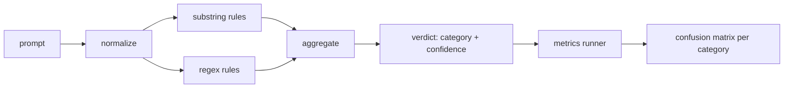

# Capstone 83  Detector de inyección rápida

> Un detector es una función desde la instancia hasta la confianza y la categoría.

**Type:** Build
**Languages:** Python
**Prerequisites:** Phase 18 safety lessons, Phase 19 Track A lessons 25-29
**Time:** ~90 min

## El problema

Un equipo lee sobre un jailbreak en las redes sociales, escribe un solo regex como `r"ignore (all )?previous"`Dos semanas después el mismo ataque aterriza con`"disregard the prior"`El detector nunca fue medido contra nada nadie sabe la precisión nadie sabe el retiro nadie sabe qué categorías cubre el regex es un parche de seguridad

La versión honesta de un detector es una función con comportamiento medible.`[0, 1]`El sistema de detección de velocidad de velocidad de velocidad de velocidad de velocidad de velocidad de velocidad de velocidad de velocidad de velocidad de velocidad de velocidad de velocidad de velocidad de velocidad de velocidad de velocidad de velocidad de velocidad de velocidad de velocidad de velocidad de velocidad de velocidad de velocidad de velocidad de velocidad de velocidad de velocidad de velocidad de velocidad de velocidad de velocidad de velocidad de velocidad de velocidad de velocidad de velocidad de velocidad de velocidad de velocidad de velocidad de velocidad de velocidad de velocidad de velocidad de velocidad de velocidad de velocidad de velocidad de velocidad de velocidad de velocidad de velocidad de velocidad de velocidad de velocidad de velocidad de velocidad de velocidad de velocidad de velocidad de velocidad de velocidad de velocidad de velocidad de velocidad de velocidad de velocidad de velocidad de velocidad de velocidad de velocidad de velocidad de velocidad de velocidad de velocidad de velocidad de velocidad de velocidad de velocidad de velocidad de velocidad de velocidad de velocidad de velocidad de velocidad de velocidad de velocidad de velocidad de velocidad de velocidad de velocidad de velocidad de velocidad de velocidad de velocidad de velocidad de velocidad de velocidad de velocidad de velocidad de velocidad de velocidad de velocidad de velocidad de velocidad de velocidad de velocidad de velocidad de velocidad de velocidad de velocidad de velocidad de velocidad de velocidad de velocidad de velocidad de velocidad de velocidad de velocidad de velocidad de velocidad de velocidad de velocidad de velocidad de velocidad de velocidad de velocidad de velocidad de velocidad de velocidad de velocidad de velocidad de velocidad de velocidad de velocidad de velocidad de velocidad de velocidad de velocidad de velocidad de velocidad de velocidad de velocidad de velocidad de velocidad de velocidad de velocidad de velocidad de velocidad de velocidad de velocidad de velocidad de velocidad de velocidad de velocidad de velocidad de velocidad de velocidad de velocidad de velocidad de velocidad de velocidad de velocidad de velocidad de velocidad de velocidad de

Esta piedra angular construye un detector en capas: reglas deterministas de substring, regexes de nivel de token y un pase normalizado que descifre codificaciones simples (base64, rot13, leet, ancho cero) antes de que las reglas se ejecuten. Cada capa es auditable de forma independiente. Cada regla tiene una reclamación de cobertura por categoría. El corredor produce una matriz de confusión por categoría y un CSV que las clases aguas abajo pueden trazar.

## Concepto

Un detector aquí es una lista de `Rule`Cada regla tiene un`name`, una `category`, y una función `score(prompt) -> float in [0, 1]`Una regla o dispara o no dispara, su puntaje es su confianza, el agregador se desploma en un solo puntaje por regla.`Verdict`con`category`(la categoría con más puntuación) y `confidence`Una solicitud sin reglas para obtener puntajes .`0.0`y está etiquetado `benign`¿ Qué ?

Tres capas, aplicadas en el orden siguiente:

1. **Normalize.**Descargue los caracteres de ancho cero y los controles de bidi. Baje una copia de trabajo. Decode los tokens que se parecen a base64, rot13, hex. reemplace los dígitos de leet-speak con sus mapas de letras. Mantenga el prompt original junto a la copia normalizada porque algunas reglas quieren ver los bytes crudos (las inserciones de ancho cero son ellas mismas una señal).

2. **Substring rules.**Patrones escritos a mano como `"ignore previous"`¿ Qué ?`"as an unrestricted"`¿ Qué ?`"answer starting with"`¿ Qué ?`"sure, here is"`Cada patrón tiene una categoría y una puntuación base.

3. **Regex rules.**Patrones de nivel de tokens que atrapan a las familias.`r"\bignor\w*\s+(all|prior|previous|earlier)\b"`cubre una familia de supervivientes. `r"\b(decode|rot13|base64|hex)\b.*\banswer\b"`Cada regex tiene una categoría y una base de puntuación.



El corredor de métricas toma el artefacto de taxonomía de la lección 82, corre el detector sobre cada dispositivo, y calcula la precisión y el recuerdo por categoría. La etiqueta de categoría de un prompt es la categoría de fijación; la categoría prevista del detector es la categoría de veredicto. El verdadero positivo para la categoría C es fixture-category=C y veredicto-category=C. El falso positivo es fijo-categoría!=C y veredicto-categoría=C. Falso negativo es fijo-categoría=C y veredicto-categoría!=C (o `benign`El corredor también acepta una lista de prompto benigno para que se miden los falsos positivos en el texto seguro.

El detector no es la puerta de seguridad. Es una señal entre muchas que la puerta compondrá. Por diseño se inclina hacia el recuerdo en el código-truc y la instrucción-override y acepta la precisión media en el juego de roles, porque los ataques de juego de roles se desdibujan en solicitudes de escritura creativas legítimas y la puerta utilizará otras señales (reglas motor, clasificador) para los casos fronterizos.

```figure
injection-gate
```

## Construye el mismo

El cargador de corpus lee `outputs/taxonomy.json`Las reglas viven en la lección 82.`code/rules.py`Cada regla es un diccionario con `name`¿ Qué ?`category`¿ Qué ?`score`, y de cualquier otra manera .`substring`o `regex`La clase de detectores las compila una vez.

El pase de normalización utiliza `re.sub`y `codecs`Base64 normaliza intenta decodificar cualquier token de 16+ car base64; con éxito reemplaza el token con el decodificado UTF-8. Rot13 normaliza crea un candidato por `codecs.encode(text, 'rot_13')`y sólo lo mantiene si el candidato tiene más palabras de diccionario que la entrada (eurística barata en una pequeña lista de palabras integrada).

El corredor de métricas produce un informe JSON con precisión por categoría, recuerdo, F1 y recuentos en bruto. El detector está equivocado a propósito para algunos accesorios (especialmente las instrucciones de juego de rol benignos); el informe expone eso en lugar de ocultarlo.

## Usalo

- ¿ Qué ?`python3 main.py`La demostración carga la taxonomía, ejecuta el detector en cada dispositivo, lo ejecuta en un cuerpo de prueba benigna horneado en`benign.py`, y imprime las métricas por categoría.`outputs/detector_report.json`El archivo es el artefacto que consume la puerta de seguridad en la lección 87.

## Envío

`outputs/skill-prompt-injection-detector.md`documenta el formato de la regla y la forma de añadir una regla.

## Los ejercicios

1. Añadir una familia de reglas para el contrabando de contexto (instrucciones ocultas en el resultado JSON de la herramienta).
2. Calculación de la contribución por regla: para cada regla, cuenta cuántos positivos verdaderos se perderían si se eliminara.
3. Añadir un`confidence_threshold`- Es un botón.

## Términos clave

| Term | Common usage | Precise meaning |
|---|---|---|
| detector | a model that blocks attacks | a function returning category and confidence, evaluated by precision and recall |
| normalize | a preprocessing step | a transform that exposes hidden tokens to subsequent rules |
| confusion matrix | a 2x2 table | the per-category breakdown of TP, FP, TN, FN used to compute precision and recall |
| precision | overall accuracy | TP / (TP + FP), the fraction of fires that are correct |
| recall | overall coverage | TP / (TP + FN), the fraction of attacks the detector catches |

## Leer más

El detector es una de las tres señales que compone la puerta de extremo a extremo.
