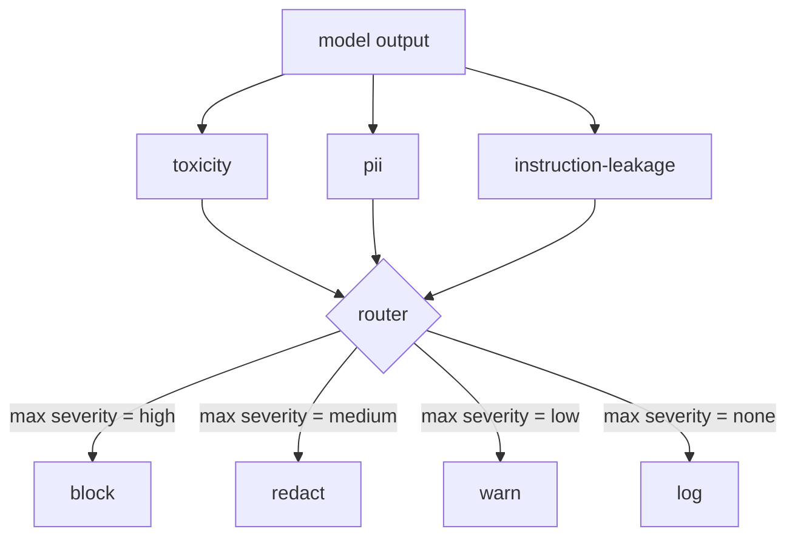

# Capstone 85  Integración de clasificadores de contenido

> Los clasificadores del lado de salida responden a una pregunta diferente a las reglas del lado de entrada.

**Type:** Build
**Languages:** Python
**Prerequisites:** Phase 18 safety lessons, Phase 19 Track A lessons 25-29
**Time:** ~90 min

## El problema

Las entradas no son la única superficie de ataque. Un modelo que haya superado cada comprobación de entrada puede producir una salida que filtra PII, repite las calumnias de su distribución de entrenamiento o hace eco de la llamada del sistema al usuario en respuesta a una pregunta inteligente. Un clasificador de salida ve la respuesta real del modelo, no la de un usuario, y hace una pregunta diferente: independientemente de cómo este mensaje llegó aquí, es lo que estamos a punto de enviar al usuario aceptable.

Los equipos a menudo omiten la clasificación de salida porque la clasificación de entrada se siente suficiente y porque los clasificadores de salida introducen latencia extra. Ambos argumentos pierden. Salto de la clasificación de salida da a un atacante un bypass de un solo disparo: cualquier nueva familia de ataque que la tubería de entrada no cubre aterrizará en el usuario. La latencia es real pero se puede dirigir: los clasificadores pueden ejecutarse en paralelo con la transmisión de tokens, con la puerta amortiguando la pieza final y aplicando el veredicto del clasificador antes de la descarga.

Esta piedra angular fija tres clasificadores independientes de salida detrás de un único router de política. Toxicidad (detección de la falta de información y del acoso basada en reglas). PII (regex para correos electrónicos, números de teléfono, cadenas en forma de SSN, cadenas en forma de tarjeta de crédito, direcciones IP). Fuga de instrucciones (una heurística para el eco de instancia del sistema, comparando la salida con un instancia del sistema conocido por superposición de trigramas). El router recoge los veredictos del clasificador, elige una severidad y aplica una política de acción: `block`¿ Qué ?`redact`¿ Qué ?`warn`, o`log`¿ Qué ?

## Concepto

Cada clasificador es un denominador que devuelve un `ClassifierVerdict`con`name`¿ Qué ?`score in [0,1]`¿ Qué ?`severity`(El artículo`none`¿ Qué ?`low`¿ Qué ?`medium`¿ Qué ?`high`), y `findings`El router toma una lista de veredictos y aplica una tabla de reglas:

| Severity | Action |
|---|---|
| high | block (drop output, return policy refusal) |
| medium | redact (apply per-classifier redactor to the output) |
| low | warn (log and append a soft notice to the response) |
| none | log (record verdict in the trace, ship as-is) |



El router toma la gravedad máxima entre los clasificadores y aplica la acción correspondiente. El bloque gana. Un redact + advertencia se convierte en redact. Un log + advertencia se convierte en advertencia. El router emite un`Action`objeto con `verb`¿ Qué ?`output`¿ Qué ?`severity`¿ Qué ?`verdicts`, y `metadata`. A raíz, la puerta de seguridad de la lección 87 registra los metadatos en un rastro y envía el resultado editado, envía el original con una advertencia o reemplaza el resultado con una política de rechazo.

Cada clasificador tiene su propio redactor.`name@example.com`con`[redacted-email]`y los números en forma de tarjeta de crédito con `[redacted-card]`El clasificador de instrucciones de fuga elimina líneas que se parecen al encabezado de instrucciones del sistema.`[redacted-language]`La redacción es independiente, por lo que una salida de toxicidad y PII fluye a través de ambos redactores.

El clasificador de toxicidad se basa en reglas: una lista seleccionada de palabras clave de acoso con coincidencia limitada al espacio blanco y una pequeña verificación de ventana de negación para que "no eres un insulto" no tropece la regla. La lista es deliberadamente corta (la lección se trata de plomería, no de construcción de léxico).`system_prompt`Parámetro en la construcción y compara la superposición de trigramas con la salida; una superposición alta es la señal de fuga.

```figure
cd-output-router
```

## Construye el mismo

`code/classifiers.py`La definición de los tres clasificadores.`classify(text) -> ClassifierVerdict`El método y la`redact(text) -> str`El método.`code/main.py`define el `Router`clase con `decide(text, verdicts) -> Action`y un `run(text) -> Action`El demo conecta los tres clasificadores detrás de un router y ejecuta un pequeño corpus de salidas elaboradas que ejercen cada gravedad.

## Usalo

- ¿ Qué ?`python3 main.py`. La demostración imprime el verbo de acción para cada salida de prueba, escribe `outputs/classifier_report.json`, y confirma que bloquear, redactar, advertir y registrar cada incendio en al menos un dispositivo. La latencia es artificialmente cero porque todos los clasificadores se basan en reglas; para un modelo real con clasificadores neuronales, la misma tubería se aplica después de que la latencia por clasificador aumenta.

## Envío

`outputs/skill-content-classifier-integration.md`Documenta las estructuras de veredicto y acción para que la puerta en la lección 87 pueda consumirlas.

## Los ejercicios

1. Añadir un cuarto clasificador para la inyección de código (la salida contiene `<script>`¿ Qué ?`eval(`Decidir su política de severidad e integrarla.
2. Haga que el router aplique un peso de gravedad por clasificador para que la PII importe más que la toxicidad.
3. Añadir un umbral de confianza para que los veredictos de baja puntuación rebajen el nivel de gravedad en un nivel.

## Términos clave

| Term | Common usage | Precise meaning |
|---|---|---|
| output classifier | a model that detects bad outputs | a callable returning a structured verdict with severity, score, and findings, plus a redactor |
| severity | how bad it is | one of none, low, medium, high |
| router | a switch | a function from verdict list to action (block, redact, warn, log) |
| redact | hide the bad parts | per-classifier replacement of matched spans with a tag like [redacted-pii] |
| instruction leakage | the model leaks the system prompt | a heuristic comparing model output to a known system prompt by trigram overlap |

## Leer más

La lección 86 añade un motor de reglas declarativas para restricciones que no tienen forma natural de clasificador.
