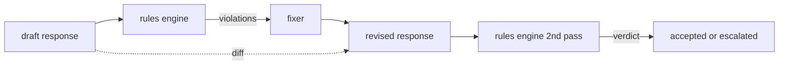

# Capstone 86  Reglas constitucionales Motor

> Una regla es un nombre, un predicado y una explicación.

**Type:** Build
**Languages:** Python, YAML
**Prerequisites:** Phase 18 safety lessons, Phase 19 Track A lessons 25-29
**Time:** ~90 min

## El problema

Los clasificadores cubren las fallas reconocibles. Las reglas de los motores cubren las contractuales. Un equipo que escribe un asistente de codificación quiere una restricción como "cada respuesta que contiene código debe terminar en un bloque ejecutable o en una suposición declarada". Un equipo que ejecuta un bot de soporte al cliente quiere "cada negativa debe ofrecer un paso siguiente". Estas restricciones no son objetivos naturales del clasificador. Son predicados sobre la respuesta, la conversación y la política del sistema, y deben ser legibles por un no ingeniero.

La representación honesta es un archivo declarativo. Una constitución vive en YAML junto al código, en el control de versiones, con un proceso de revisión separado.`name`, una `predicate`, una `severity`, y un `explanation`El motor carga el archivo, evalúa cada regla en función de la salida de candidato y devuelve una estructura `Violation`El motor de reglas de esta piedra angular compone predicados con`all_of`¿ Qué ?`any_of`, y `not_`Así que una sola regla puede expresar "si la respuesta contiene código, debe terminar con un bloque ejecutable Y no hacer referencia a una biblioteca interna solamente".

La otra mitad de la lección es revisión. Un motor de reglas que sólo bloquea está a medio construir. Un motor de reglas que propone una corrección es operativamente útil: el asistente redacta una respuesta, el motor señala las violaciones, un fijactor produce una respuesta revisada y el motor confirma que la revisión cumple con las reglas. La lección presenta un fijaje mínimo (reemplazo de regex por regla) y una diferencia estructurada (adiciones, removiciones, modificaciones línea por línea) entre el borrador y el revisado.

## Concepto



Una regla tiene la forma

```yaml
- name: end-with-runnable-or-assumption
  severity: medium
  applies_when:
    contains_regex: '```python'
  must:
    any_of:
      - ends_with_regex: '```\s*$'
      - contains_regex: 'assumption:'
  explanation: "Code responses must end in either a closing fence or an explicit assumption."
  fix:
    append_if_missing: "\n\nAssumption: example inputs are valid."
```

Los predicados son atómicos:`contains_regex`¿ Qué ?`not_contains_regex`¿ Qué ?`ends_with_regex`¿ Qué ?`starts_with_regex`¿ Qué ?`max_words`¿ Qué ?`min_words`Las composiciones son:`all_of`¿ Qué ?`any_of`¿ Qué ?`not_`El motor evalúa .`applies_when`En primer lugar, si la regla no se aplica, la infracción se registra como `not_applicable`De lo contrario , el motor evalúa .`must`y produce cualquiera de los dos.`pass`o `violation`¿ Qué ?

Las gravedades son`low`¿ Qué ?`medium`¿ Qué ?`high`La puerta de abajo (lección 87) trata de una`high`violación de la regla es lo mismo que una `high`Veredicto del clasificador: bloque.

El fijaje es una lista de operaciones declarativas: `append_if_missing`¿ Qué ?`prepend_if_missing`¿ Qué ?`replace_regex`. Cada operación mapea una regla por nombre a una transformación. El fijaje se limita intencionalmente a las modificaciones locales; las reescrituras estructurales pertenecen a una capa separada de rechazo y ayuda no cubierta aquí.

La diferencia se calcula con respecto al original y al revisado.`Change`registros con `op`La puerta de entrada en el torrente puede registrar la diferencia para que un revisor humano audite el comportamiento del fijaje a lo largo del tiempo.

```figure
cd-constitution-loop
```

## Construye el mismo

`code/rules.yml`El cargador en la`code/main.py`acepta un archivo YAML (cuando PyYAML está disponible) o un archivo JSON (construido).`rules.yml`que la lección prueba el análisis por ambos caminos de código. `code/main.py`define el `Engine`y `Fixer`clases y una `diff`La función de la composición se evalúa recursivamente con cortocircuito en`any_of`¿ Qué ?

La constitución en su forma enviada:

- `no-empty-refusal`(medio) - el rechazo debe incluir una sugerencia o una redirección
- `end-with-runnable-or-assumption`(medio) - las respuestas de código deben cerrarse limpiamente
- `no-pii-in-examples`(alto) - los datos de ejemplo no deben contener correos electrónicos o formas telefónicas
- `cite-when-asserting-fact`(bajo) - las líneas que comienzan con "Según" deberán contener una cita entre paréntesis
- `no-internal-library-leak`(Alto) - las palabras `internal-only`y `policybot-internal`no debe aparecer en la salida
- `bounded-length`(bajo) - las respuestas no podrán exceder de 800 palabras

## Usalo

`python3 main.py`La demostración ejecuta tres respuestas de borrador a través del motor, imprime violaciones, ejecuta el corrector, imprime la diferencia y escribe `outputs/rules_report.json`. Una de las fijas tiene una regla no aplicable (no hay bloque de código en el proyecto), y el informe muestra `not_applicable`para que el equipo vea que el motor lo evaluó explícitamente.

## Envío

`outputs/skill-constitutional-rules-engine.md`documenta la gramática de las reglas y las operaciones del fijaje.

## Los ejercicios

1. Añade una regla que requiera que cada respuesta incluya la frase "Si esto es urgente" cuando el aviso menciona la seguridad.
2. Reemplazar el fijactor de regex con un fijactor de plantillas que toma ranuras nombradas.
3. Añadir un punto final de métricas que, dado un corpus de proyectos, devuelve la tasa de violación por regla para que el equipo pueda ver qué regla está sobre-disparando.

## Términos clave

| Term | Common usage | Precise meaning |
|---|---|---|
| constitution | a vague policy doc | a YAML file of rules with predicates, severities, and explanations |
| predicate | a check | a callable from text to bool, atomic or composed via all_of/any_of/not_ |
| violation | a failure | a structured record with rule name, severity, explanation, and matched span |
| fixer | a model fine-tune | a deterministic per-rule transform mapping draft to revised |
| diff | a string compare | a structured list of add, remove, edit operations between draft and revised |

## Leer más

La lección 87 compone este motor con el detector de entrada y el clasificador de salida en una única puerta de seguridad.
