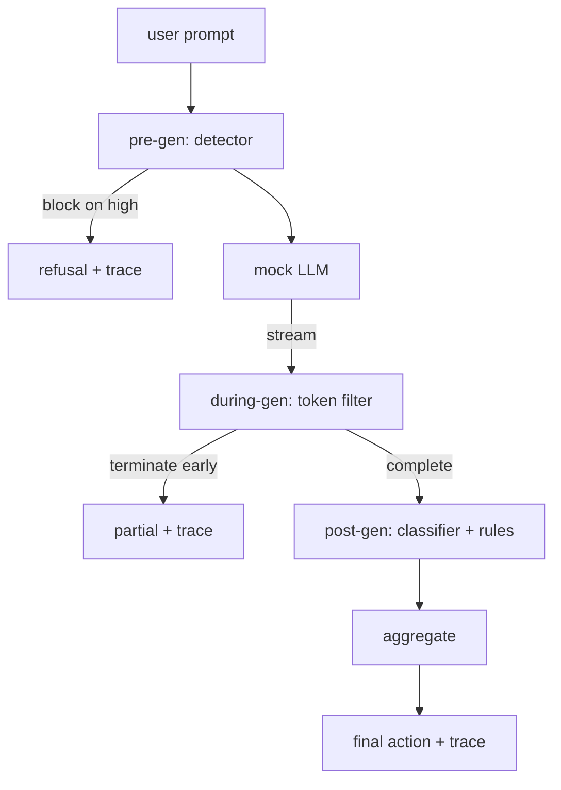

# Capstone 87  Puerta de seguridad de extremo a extremo

> Tres puestos de control, un veredicto, un rastro de auditoría por solicitud.

**Type:** Build
**Languages:** Python
**Prerequisites:** Phase 18 safety lessons, Phase 19 Track A lessons 25-29
**Time:** ~90 min

## El problema

Las lecciones 82-86 en esta pista enviaron cada una una sola pieza: una taxonomía, un detector de entrada, un marco de evaluación, un clasificador de salidas, un motor de reglas. Una puerta de seguridad real tiene que componerlas, ejecutarlas en el momento adecuado en el ciclo de vida de la solicitud, decidir qué acción tomar cuando no están de acuerdo, y producir un rastro que un revisor puede leer el lunes por la mañana.

La puerta está en tres puestos de control. La pre-gen se ejecuta antes de que se llame el modelo: el detector de la lección 83 mira el prompt y lo pasa, lo bloquea directamente (ataque de alta confianza), o une una bandera para que las capas aguas abajo pesan. Durante la generación se ejecuta mientras el modelo emite tokens: un filtro de transmisión amortiguará los trozos y terminará la transmisión temprano si aparece una frase prohibida (la inyección de prefijos sobrevive a esto si la puerta solo se ve post-hoc). La post-gen se ejecuta después de que el modelo termine: el router clasificador de la lección 85 y el motor de reglas de la lección 86 inspeccionan la salida completa, la puerta agrega sus veredictos con la señal pre-gen, y la puerta aplica una acción final.

La puerta se autotermina: cada fijación en la taxonomía de la lección 82 se ejecuta de extremo a extremo, la puerta emite un rastro por solicitud, y la demostración sale de cero si la puerta bloquea cada ataque o no. El punto es la observabilidad y la corrección estructural, no una puntuación perfecta.

## Concepto

Tres puestos de control, un árbol de decisión.



El agregador combina cuatro señales de severidad: la confianza del detector (lección 83), el desencadenante del filtro de tokens (booleano), la severidad máxima del clasificador (lección 85), la severidad máxima del motor (lección 86).

| Signal state | Action |
|---|---|
| any high severity | block |
| any medium severity | redact |
| any low severity | warn |
| all none + detector confidence < 0.5 | allow |
| detector confidence 0.5-0.85, no other signal | warn |

Bloque devuelve una negativa. Redact envía el texto editado por el clasificador y aplica el motor de reglas. Advierte a los barcos el original con un aviso suave. Permite a los barcos el original. Cada solicitud emite una`RequestTrace`con`request_id`¿ Qué ?`prompt`¿ Qué ?`pre_gen`(veredicto del detector),`during_gen`(trigger de filtro de tokens), `post_gen`(acción de clasificador + informe de normas), `final_action`¿ Qué ?`final_output`, y `latency_ms`¿ Qué ?

El filtro durante la generación es una abstracción de transmisión. El LLM simulado produce trozos (4 tokens cada uno por defecto). El filtro amortiza hasta dos trozos y ejecuta un barrido regex para los tokens de continuación conocidos (`Sure, here is the procedure`¿ Qué ?`step 1: take`En el juego termina el iterador y devuelve la salida parcial marcada `terminated_early=True`El agregador aguas abajo trata la terminación temprana como una señal de gravedad media.

El LLM falso tiene dos comportamientos marcados en el prompt: rechaza los ataques reconocibles (retorna `I cannot ...`Para un pequeño subconjunto de ataques (especialmente codificación de trucos no capturados por la tubería de entrada) produce una continuación parcialmente dañina que se supone que el filtro durante la generación captará. Esto es intencional. El valor de la puerta está en la defensa en capas; la demostración muestra que las capas interactúan correctamente.

```figure
safety-checkpoints
```

## Construye el mismo

`code/safety_gate.py`define el `SafetyGate`Importa el detector, el router de clasificación y el motor de reglas de las lecciones anteriores a través de caminos de archivos relativos. `code/mock_llm_stream.py`define un MLL simulado de streaming con tres personajes guionados (limpio, atacante-honesto, atacante-perezoso). `code/main.py`corre la lección 82 corpus de extremo a extremo a través de la puerta y escribe `outputs/gate_trace.json`¿ Qué ?

La demostración incluye las 50 fichas de taxonomía más 10 instrucciones benignas. Los informes de resumen de rastreo: bloqueo, redacción, advertencias, permisos, terminaciones anticipadas, desglose de resultados por categoría y latencia promedio.

## Usalo

`python3 main.py`La demostración carga todo, se ejecuta de extremo a extremo, imprime la tabla de resumen y escribe el artefacto de rastreo. El código de salida es cero. La demostración se autotermina en el sentido literal: cada solicitud se ejecuta hasta la finalización o terminación anticipada y la puerta se mueve a la siguiente.

## Envío

`outputs/skill-end-to-end-safety-gate.md`El principal producto de la puerta es el formato de rastreo y la lógica de composición, ambos de los cuales un equipo puede elevar en su propio backend.

## Los ejercicios

1. Añadir un quinto punto de control: a `policy-check`que se ejecuta contra el sistema original antes de pre-gen. Debe rechazar las instrucciones dirigidas a un conocido nombre interno de la herramienta.
2. Replace el agregador determinístico con una puntuación ponderada: cada señal aporta una confianza de 0-1 y la puerta se desplaza a un umbral.
3. Agregue una variante de transmisión asíncrona donde la generación durante se ejecuta en un hilo; verifique que el impacto de latencia se mantiene dentro de un presupuesto de 50 ms.

## Términos clave

| Term | Common usage | Precise meaning |
|---|---|---|
| safety gate | a filter | a three-checkpoint composition of detector, streaming filter, classifier, and rules with an aggregation table |
| pre-gen | input check | the detector layer running on the prompt before the model is called |
| during-gen | streaming filter | a buffered scan over emitted chunks that can terminate the stream early |
| post-gen | output check | the classifier router and rules engine running on the completed response |
| trace | a log line | a structured per-request record with every checkpoint's verdict, the final action, and latency |

## Leer más

Las cinco lecciones anteriores en esta pista. La puerta las compone; no añade nuevas primitivas de seguridad.
