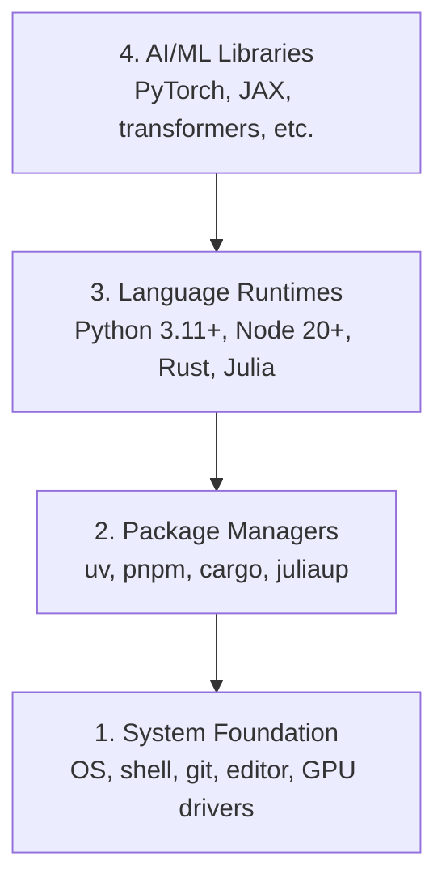

# Environnement de développement

> Vos outils façonnent votre pensée.

**Type:** Build
**Languages:** Python, Node.js, Rust
**Prerequisites:** None
**Time:** ~45 minutes

## Objectifs d'apprentissage

- Configurez Python 3.11+, Node.js 20+ et Rust à partir de zéro
- Configurer des environnements virtuels et des gestionnaires de paquets pour les constructions reproducibles
- Vérifiez l'accès à la GPU avec CUDA/MPS et effectuez une opération de test tenseur
- Comprendre la pile à quatre couches: système, paquets, temps d'exécution, bibliothèques d'IA

## Le problème

Vous allez apprendre l'ingénierie de l'IA sur plus de 500 leçons en utilisant Python, TypeScript, Rust et Julia. Si votre environnement est cassé, chaque leçon devient une lutte contre l'outillage au lieu d'apprendre.

La plupart des gens sautent la configuration de l'environnement, puis passent des heures à déboguer les erreurs d'importation, les conflits de version et les pilotes CUDA manquants.

## Le concept

Un environnement d'ingénierie AI a quatre couches:



Nous installons en bas vers le haut. Chaque couche dépend de celle qui est sous elle.

```figure
s0-env-stack
```

## Faites-le

### Étape 1: Fondation du système

Vérifiez votre système et installez les bases.

```bash
# macOS
xcode-select --install
brew install git curl wget

# Ubuntu/Debian
sudo apt update && sudo apt install -y build-essential git curl wget

# Windows (use WSL2)
wsl --install -d Ubuntu-24.04
```

### Étape 2: Python avec UV

On utilise`uv`Il est 10 à 100 fois plus rapide que le pip et gère automatiquement les environnements virtuels.

```bash
curl -LsSf https://astral.sh/uv/install.sh | sh

uv python install 3.12

uv venv
source .venv/bin/activate  # or .venv\Scripts\activate on Windows

uv pip install numpy matplotlib jupyter
```

Vérifiez:

```python
import sys
print(f"Python {sys.version}")

import numpy as np
print(f"NumPy {np.__version__}")
a = np.array([1, 2, 3])
print(f"Vector: {a}, dot product with itself: {np.dot(a, a)}")
```

### Étape 3: Node.js avec pnpm

Pour les leçons de typeScript (agents, serveurs MCP, applications Web).

```bash
curl -fsSL https://fnm.vercel.app/install | bash
fnm install 22
fnm use 22

npm install -g pnpm

node -e "console.log('Node', process.version)"
```

**macOS / Apple Silicon (M1/M2/M3/M4):**Si l' installateur arrête de`Error: Cannot install under Rosetta 2 in ARM default prefix (/opt/homebrew)`Votre terminal est sous Rosetta 2 (`arch`des empreintes`i386`Installez l'arm64 à force de fnm, branchez-le dans votre coquille, puis réalisez les commandes ci-dessus à partir de`fnm install 22`- Le numéro de la liste:

```bash
arch -arm64 brew install fnm
echo 'eval "$(fnm env --use-on-cd)"' >> ~/.zshrc
source ~/.zshrc
```

### Étape 4: Rost

Pour les leçons critiques de performance (inférence, systèmes).

```bash
curl --proto '=https' --tlsv1.2 -sSf https://sh.rustup.rs | sh

rustc --version
cargo --version
```

### Étape 5: Julia (optionnelle)

Pour des cours de mathématiques où Julia brille.

```bash
curl -fsSL https://install.julialang.org | sh

julia -e 'println("Julia ", VERSION)'
```

### Étape 6: Configuration du GPU (si vous en avez un)

**NVIDIA (Linux / Windows):**

```bash
nvidia-smi

# Install PyTorch with CUDA
uv pip install torch torchvision torchaudio --index-url https://download.pytorch.org/whl/cu124
```

**macOS / Apple Silicon (M1/M2/M3/M4):**Il n'y a pas de CUDA sur un Mac qui soit attendu, pas un échec.**not**Passer .`--index-url .../cuXXX`Installez la construction simple, qui comprend le backend de la GPU MPS (Metal) d'Apple:

```bash
uv pip install torch torchvision torchaudio
```

Vérifiez (fonctionne sur n'importe quelle plateforme):

```python
import torch
print(f"CUDA available: {torch.cuda.is_available()}")           # False on macOS — expected
print(f"MPS available:  {torch.backends.mps.is_available()}")   # True on Apple Silicon
if torch.cuda.is_available():
    print(f"GPU: {torch.cuda.get_device_name(0)}")
```

La plupart des leçons fonctionnent sur le processeur. Pour les leçons lourdes, utilisez Google Colab ou des GPU en nuage.

### Étape 7: Vérifiez la route que vous souhaitez démarrer

Exécutez chaque commande dans cette leçon à partir de la racine du référentiel, le répertoire qui
contient `README.md`et `phases/`Le pré-vol ne vérifie que ce dont vous avez besoin .
Il saute les outils ultérieurs par défaut afin qu'un nouvel apprenant voit
une réponse claire au lieu d'un mur d'avertissements.

Commencez la séquence complète des débutants:

```bash
python3 phases/00-setup-and-tooling/01-dev-environment/code/verify.py --route beginner
```

Ou vérifier seulement la route que vous voulez:

```bash
python3 phases/00-setup-and-tooling/01-dev-environment/code/verify.py --route ml-foundations
python3 phases/00-setup-and-tooling/01-dev-environment/code/verify.py --route llm-engineering
python3 phases/00-setup-and-tooling/01-dev-environment/code/verify.py --route agents
python3 phases/00-setup-and-tooling/01-dev-environment/code/verify.py --route mcp
python3 phases/00-setup-and-tooling/01-dev-environment/code/verify.py --route agent-skills
python3 phases/00-setup-and-tooling/01-dev-environment/code/verify.py --route certification
```

Ajouter `--show-later`lorsque vous voulez le même pré-vol pour inspecter des outils optionnels
Les outils de formation sont utilisés dans les cours suivants.
route sélectionnée.

Chaque vérification requise ayant échoué comprend le chemin détecté ou l'erreur d'importation et un
Les compétences des agents et les routes de certification montrent également que les commandes correctives sont exactes.
Les contrôles manuels de l'hôte parce qu'un script Python ne peut pas prouver qu'un hôte AI a
Vous avez découvert une compétence ou que votre domaine d'expertise est réalisable.

Quand le pré-vol débutant passe, il imprime la première leçon exécutive:

```text
Ready to start Beginner course.
Next: python3 phases/01-math-foundations/01-linear-algebra-intuition/code/vectors.py
```

## Utilisez-le

Votre environnement est prêt à démarrer le parcours que vous avez vérifié.
quand une leçon demande pour eux au lieu de bloquer votre première leçon dans son ensemble
Voici ce que vous utiliserez dans le programme:

| Language | Used In | Package Manager |
|----------|---------|-----------------|
| Python | Phases 1-12 (ML, DL, NLP, Vision, Audio, LLMs) | uv |
| TypeScript | Phases 13-17 (Tools, Agents, Swarms, Infra) | pnpm |
| Rust | Phases 12, 15-17 (Performance-critical systems) | cargo |
| Julia | Phase 1 (Math foundations) | Pkg |

## La faire partir

Cette leçon produit un script de vérification que tout le monde peut exécuter pour vérifier leur configuration.

Regardez !`outputs/prompt-env-check.md`pour une demande qui aide les assistants d'IA à diagnostiquer les problèmes environnementaux.

## Exercices

1. Exécutez le script de vérification et corrigez les pannes
2. Créez un environnement virtuel Python pour ce cours et installez PyTorch
3. Écrivez un "bonjour au monde" dans les quatre langues et faites fonctionner chacune d'elles.
