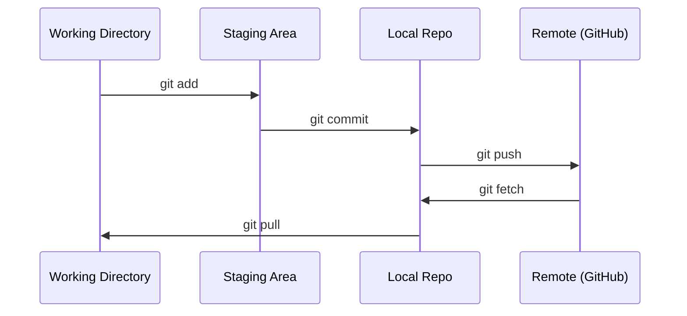

# Git et collaboration

> Chaque expérience, chaque modèle, chaque leçon construite ici est suivi.

**Type:** Learn
**Languages:** --
**Prerequisites:** Phase 0, Lesson 01
**Time:** ~30 minutes

## Objectifs d'apprentissage

- Configurer l'identité git et utiliser le flux de travail quotidien d'ajouter, d'engager et de pousser
- Créer et fusionner des branches pour des expériences isolées sans se défaire
- Écrivez une`.gitignore`qui exclut les points de contrôle modèles et les grands fichiers binaires
- Naviguez dans l' historique des engagements avec `git log`comprendre l'évolution du projet

## Le problème

Vous êtes sur le point d'écrire des centaines de fichiers de code sur 20 phases. Sans contrôle de version, vous perdrez du travail, vous casserez des choses que vous ne pouvez pas annuler, et vous n'aurez aucun moyen de collaborer avec les autres.

Git est l'outil. GitHub est où le code vit. Cette leçon couvre ce dont vous avez besoin pour ce cours et rien de plus.

## Le concept



Trois choses à retenir:
1. Économiser souvent (`git commit`)
2. Poussez à la télécommande (`git push`)
3. Branche des expériences (`git checkout -b experiment`)

```figure
s0-commit-dag
```

## Faites-le

### Étape 1: Configurer git

```bash
git config --global user.name "Your Name"
git config --global user.email "you@example.com"
```

### Étape 2: Le flux de travail quotidien

```bash
git status
git add file.py
git commit -m "Add perceptron implementation"
git push origin main
```

### Étape 3: Branchage pour les expériences

```bash
git checkout -b experiment/new-optimizer

# ... make changes, commit ...

git checkout main
git merge experiment/new-optimizer
```

### Étape 4: Travailler avec ce repo

Vous ne pouvez pas pousser à la repo de cours elle-même  seulement les entretiens ont accès à écrire.`origin`points dans votre propre exemplaire:

```bash
git clone https://github.com/YOUR-USERNAME/ai-engineering-from-scratch.git
cd ai-engineering-from-scratch

git checkout -b my-progress
# work through lessons, commit your code
git push origin my-progress
```

## Utilisez-le

Pour ce cours, vous avez besoin de ces commandes:

| Command | When |
|---------|------|
| `git clone` | Get the course repo |
| `git add` + `git commit` | Save your work |
| `git push` | Back it up to GitHub |
| `git checkout -b` | Try something without breaking main |
| `git log --oneline` | See what you've done |

Vous n'avez pas besoin de base, de sélection de cerises ou de sous-modules pour ce cours.

## Exercices

1. Faites une fourchette, clonnez votre fourchette, créez une branche appelée`my-progress`, faire un dossier, l'engager, pousser
2. Créer une`.gitignore`qui exclut les dossiers de contrôle modèles (`.pt`- Je suis là .`.pth`- Je suis là .`.safetensors`)
3. Regardez l' histoire de ces références avec `git log --oneline`et lire comment les leçons ont été ajoutées

## Les termes clés

| Term | What people say | What it actually means |
|------|----------------|----------------------|
| Commit | "Saving" | A snapshot of your entire project at a point in time |
| Branch | "A copy" | A pointer to a commit that moves forward as you work |
| Merge | "Combining code" | Taking changes from one branch and applying them to another |
| Remote | "The cloud" | A copy of your repo hosted somewhere else (GitHub, GitLab) |
