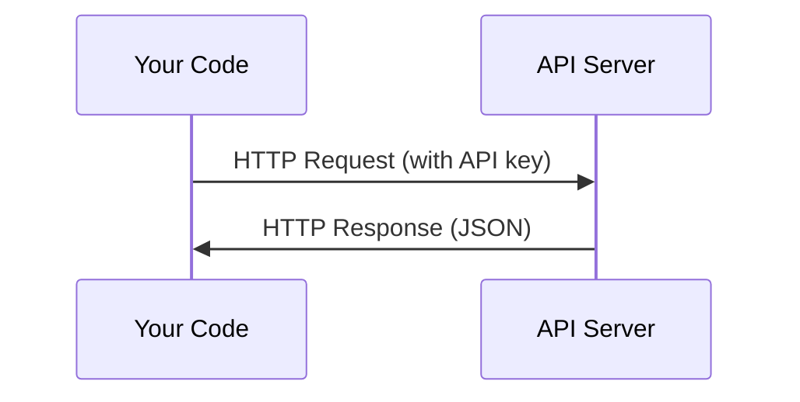

# Les API et les clés

> Chaque API d'IA fonctionne de la même manière: envoyer une demande, obtenir une réponse. Les détails changent, le schéma ne le fait pas.

**Type:** Build
**Languages:** Python, TypeScript
**Prerequisites:** Phase 0, Lesson 01
**Time:** ~30 minutes

## Objectifs d'apprentissage

- Conserver les clés API en toute sécurité en utilisant les variables de l' environnement et `.env`fichiers
- Faites un appel à l'API LLM en utilisant à la fois le SDK Python Anthropic et HTTP brut
- Comparer les formats HTTP de requête/réponse basés sur le SDK et les formats HTTP de réponse brut pour le débogage
- Identifier et gérer les erreurs d'API communes, y compris les limites d'authentification et de taux

## Le problème

À partir de la phase 11, vous allez appeler les API LLM (Anthropic, OpenAI, Google). Dans la phase 13-16 vous allez créer des agents qui utilisent ces API en boucles. Vous devez savoir comment fonctionnent les clés API, comment les stocker en toute sécurité, et comment faire votre premier appel API.

## Le concept



Chaque appel à l' API a:
1. Un point d'extrémité (URL)
2. Une clé API (authentification)
3. Un organisme de demande (ce que vous voulez)
4. Un corps de réponse (ce que vous obtenez en retour)

```figure
s0-secret-inject
```

## Faites-le

### Étape 1: Conserver les clés API en toute sécurité

Ne mettez jamais de clés API dans le code. Utilisez des variables d'environnement.

```bash
export ANTHROPIC_API_KEY="sk-ant-..."
export OPENAI_API_KEY="sk-..."
```

Ou utiliser un`.env`fichier (ajouter à `.gitignore`):

```
ANTHROPIC_API_KEY=sk-ant-...
OPENAI_API_KEY=sk-...
```

### Étape 2: Première appel API (Python)

```python
import os

import anthropic

client = anthropic.Anthropic()

MODEL = os.environ.get("LLM_MODEL", "claude-sonnet-5")

response = client.messages.create(
    model=MODEL,
    max_tokens=256,
    messages=[{"role": "user", "content": "What is a neural network in one sentence?"}]
)

print(response.content[0].text)
```

`LLM_MODEL`Les autres fournisseurs (OpenAI, Google, et autres) suivent le même schéma d'une clé plus un id modèle, mais chacun a son propre SDK, son propre point d'extrémité et son propre schéma de requête / réponse.

### Étape 3: Première appel API (TypeScript)

```typescript
import Anthropic from "@anthropic-ai/sdk";

const client = new Anthropic();

const MODEL = process.env.LLM_MODEL ?? "claude-sonnet-5";

const response = await client.messages.create({
  model: MODEL,
  max_tokens: 256,
  messages: [{ role: "user", content: "What is a neural network in one sentence?" }],
});

console.log(response.content[0].text);
```

### Étape 4: HTTP brut (pas de SDK)

```python
import os
import urllib.request
import json

url = "https://api.anthropic.com/v1/messages"
headers = {
    "Content-Type": "application/json",
    "x-api-key": os.environ["ANTHROPIC_API_KEY"],
    "anthropic-version": "2023-06-01",
}
body = json.dumps({
    "model": os.environ.get("LLM_MODEL", "claude-sonnet-5"),
    "max_tokens": 256,
    "messages": [{"role": "user", "content": "What is a neural network in one sentence?"}],
}).encode()

req = urllib.request.Request(url, data=body, headers=headers, method="POST")
with urllib.request.urlopen(req) as resp:
    result = json.loads(resp.read())
    print(result["content"][0]["text"])
```

C'est ce que font les SDK sous le capot. Comprendre l'appel HTTP brut aide lors du débogage.

## Utilisez-le

Pour ce cours:

| API | When you need it | Free tier |
|-----|-----------------|-----------|
| Anthropic (Claude) | Phases 11-16 (agents, tools) | $5 credit on signup |
| OpenAI | Phase 11 (comparison) | $5 credit on signup |
| Hugging Face | Phases 4-10 (models, datasets) | Free |

Vous n'en avez pas besoin tout de suite, mettez-les en place quand la leçon le demandera.

## La faire partir

Cette leçon donne:
- `outputs/prompt-api-troubleshooter.md`- diagnostiquer les erreurs d' API courantes

## Exercices

1. Obtenez une clé API Anthropic et faites votre premier appel API
2. Essayez la version HTTP brute et comparez le format de réponse à la version SDK
3. Utilisez intentionnellement une mauvaise clé API et lisez le message d'erreur

## Les termes clés

| Term | What people say | What it actually means |
|------|----------------|----------------------|
| API key | "Password for the API" | A unique string that identifies your account and authorizes requests |
| Rate limit | "They're throttling me" | Maximum requests per minute/hour to prevent abuse and ensure fair usage |
| Token | "A word" (in API context) | A billing unit: input and output tokens are counted and charged separately |
| Streaming | "Real-time responses" | Getting the response word by word instead of waiting for the full response |
