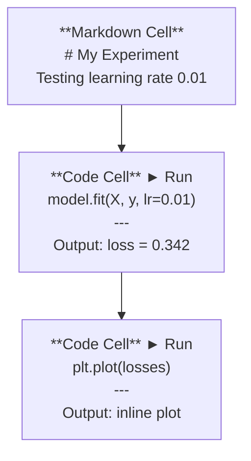
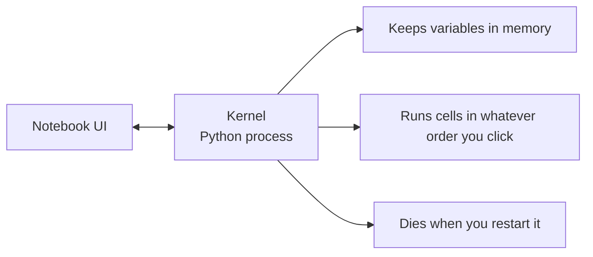

# Les ordinateurs de Jupyter

> Les ordinateurs portables sont le banc de laboratoire de l'ingénierie de l'IA. Vous prototypez ici, puis vous transferez ce qui fonctionne en production.

**Type:** Build
**Languages:** Python
**Prerequisites:** Phase 0, Lesson 01
**Time:** ~30 minutes

## Objectifs d'apprentissage

- Installez et lancez le code JupyterLab, le notebook Jupyter ou VS avec l'extension Jupyter
- Utilisez des commandes magiques (`%timeit`- Je suis là .`%%time`- Je suis là .`%matplotlib inline`) pour comparer et visualiser en ligne
- Distinguer entre les périphériques de notes et les scripts et appliquer le flux de travail "explorer dans les notes, expédier dans les scripts"
- Identifier et éviter les pièges courants des ordinateurs portables: exécution hors ordre, état caché et fuites de mémoire

## Le problème

Chaque article sur l'IA, chaque tutoriel et chaque compétition Kaggle utilise des carnets de notes Jupyter. Ils vous permettent d'exécuter du code en morceaux, de voir les sorties en ligne, de mélanger le code avec les explications et d'itérer rapidement. Si vous essayez d'apprendre l'IA sans carnets, vous faites vos devoirs mathématiques sans graver le papier.

Mais les carnets ont de vrais pièges. Les gens les utilisent pour tout, y compris pour les choses auxquelles ils sont terribles. Savoir quand utiliser un carnets et quand utiliser un script vous épargnera de déboguer les cauchemars plus tard.

## Le concept

Un carnet est une liste de cellules. Chaque cellule est soit un code, soit un texte.



Le noyau est un processus Python exécuté en arrière-plan. Lorsque vous exécutez une cellule, elle envoie le code au noyau, qui l'exécute et renvoie le résultat. Toutes les cellules partagent le même noyau, de sorte que les variables persistent entre les cellules.



Cette partie "quel que soit l'ordre que vous cliquez" est à la fois la superpuissance et le pistolet.

```figure
s0-cell-order
```

## Faites-le

### Étape 1: Choisissez votre interface

Trois options, un format:

| Interface | Install | Best for |
|-----------|---------|----------|
| JupyterLab | `pip install jupyterlab` then `jupyter lab` | Full IDE experience, multiple tabs, file browser, terminal |
| Jupyter Notebook | `pip install notebook` then `jupyter notebook` | Simple, lightweight, one notebook at a time |
| VS Code | Install "Jupyter" extension | Already in your editor, git integration, debugging |

Les trois lisent et écrivent la même chose .`.ipynb`JupyterLab est le plus courant dans le travail d'IA.

```bash
pip install jupyterlab
jupyter lab
```

### Étape 2: raccourcis de clavier qui comptent

Vous opérez en deux modes.`Escape`pour le mode de commande (barre bleue à gauche), `Enter`pour le mode de modification (barre verte).

**Command mode (most used):**

| Key | Action |
|-----|--------|
| `Shift+Enter` | Run cell, move to next |
| `A` | Insert cell above |
| `B` | Insert cell below |
| `DD` | Delete cell |
| `M` | Convert to markdown |
| `Y` | Convert to code |
| `Z` | Undo cell operation |
| `Ctrl+Shift+H` | Show all shortcuts |

**Edit mode:**

| Key | Action |
|-----|--------|
| `Tab` | Autocomplete |
| `Shift+Tab` | Show function signature |
| `Ctrl+/` | Toggle comment |

`Shift+Enter`C'est celui que vous utiliserez mille fois par jour.

### Étape 3: Types de cellules

**Code cells**exécuter Python et afficher la sortie:

```python
import numpy as np
data = np.random.randn(1000)
data.mean(), data.std()
```

Résultats: `(0.0032, 0.9987)`

**Markdown cells**Les textes sont formatés en format. Utilisez-les pour documenter ce que vous faites et pourquoi.`$E = mc^2$`), des tableaux et des images.

### Étape 4: Les commandes magiques

Ce ne sont pas Python, mais des commandes spécifiques à Jupiter qui commencent par`%`(magie de ligne) ou `%%`Je suis en train de faire une magie cellulaire.

**Time your code:**

```python
%timeit np.random.randn(10000)
```

Résultats: `45.2 us +/- 1.3 us per loop`

```python
%%time
model.fit(X_train, y_train, epochs=10)
```

Résultats: `Wall time: 2.34 s`

`%timeit`Il fait plusieurs fois le code et en moyenne. `%%time`- Il le fait une fois.`%timeit`pour les microbesques, `%%time`pour les courses d'entraînement.

**Enable inline plots:**

```python
%matplotlib inline
```

Chaque .`plt.plot()`ou `plt.show()`Maintenant, il rend directement dans le carnet.

**Install packages without leaving the notebook:**

```python
!pip install scikit-learn
```

Le `!`Le préfixe exécute toute commande de shell.

**Check environment variables:**

```python
%env CUDA_VISIBLE_DEVICES
```

### Étape 5: Afficher la sortie en ligne

Les ordinateurs d'ordinateur affichent automatiquement la dernière expression dans une cellule.

```python
import pandas as pd

df = pd.DataFrame({
    "model": ["Linear", "Random Forest", "Neural Net"],
    "accuracy": [0.72, 0.89, 0.94],
    "training_time": [0.1, 2.3, 45.6]
})
df
```

Cela rend une table HTML formatée, pas un dépôt de texte.

```python
import matplotlib.pyplot as plt

plt.figure(figsize=(8, 4))
plt.plot([1, 2, 3, 4], [1, 4, 2, 3])
plt.title("Inline Plot")
plt.show()
```

Le diagramme apparaît juste en dessous de la cellule. C'est pourquoi les ordinateurs dominent le travail de l'IA. Vous voyez les données, le diagramme et le code ensemble.

Pour les images:

```python
from IPython.display import Image, display
display(Image(filename="architecture.png"))
```

### Étape 6: Google Colab

Colab est un ordinateur portable Jupyter gratuit dans le cloud. Il vous donne un GPU, des bibliothèques prédéfinies et l'intégration de Google Drive. Aucune configuration nécessaire.

1. Allez à la[colab.research.google.com](https://colab.research.google.com)
2. Téléchargez tout `.ipynb`fichier de ce cours
3. Temps d'exécution > Modifier le type d'exécution > T4 GPU (gratuit)

Différences entre les collages et les Jupyter locaux:
- Les fichiers ne persistent pas entre les sessions (sauf dans Drive ou téléchargement)
- Préinstallés: numpy, pandas, matplotlib, torche, tensorflow, sklearn
- `from google.colab import files`pour télécharger/charger des fichiers
- `from google.colab import drive; drive.mount('/content/drive')`pour un stockage persistant
- Temps de pause des séances après 90 minutes d'inactivité (niveau gratuit)

## Utilisez-le

### Notebooks vs Scripts: Quand utiliser lequel

| Use notebooks for | Use scripts for |
|-------------------|-----------------|
| Exploring a dataset | Training pipelines |
| Prototyping a model | Reusable utilities |
| Visualizing results | Anything with `if __name__` |
| Explaining your work | Code that runs on a schedule |
| Quick experiments | Production code |
| Course exercises | Packages and libraries |

La règle:**explore in notebooks, ship in scripts**- Je suis désolé .

Un flux de travail commun en IA:
1. Explorer les données dans un carnet
2. Prototype de votre modèle dans le carnet
3. Une fois que cela fonctionne, déplacez le code à `.py`fichiers
4. Importez ces`.py`les fichiers retournés dans le carnet pour de nouvelles expériences

### Traps communs

**Out-of-order execution.**Vous exécutez la cellule 5, puis la cellule 2, puis la cellule 7. Le bloc-notes fonctionne sur votre machine mais se casse quand quelqu'un le fait monter vers le bas.

**Hidden state.**Vous supprimez une cellule mais la variable créée est toujours dans la mémoire. Le bloc-notes semble propre mais dépend d'une cellule fantôme. Correction: redémarrer le noyau régulièrement.

**Memory leaks.**Charger un ensemble de données de 4 Go, entraîner un modèle, charger un autre ensemble de données. Rien ne se libère.`del variable_name`et `gc.collect()`, ou redémarrer le noyau.

## La faire partir

Cette leçon donne:
- `outputs/prompt-notebook-helper.md`pour débogage des problèmes de bloc-notes

## Exercices

1. Ouvrez JupyterLab, créez un carnet et utilisez `%timeit`pour comparer la compréhension de la liste contre numpy pour créer un tableau de 100 000 nombres aléatoires
2. Créez un bloc-notes avec des cellules de marquage et de code qui chargent un CSV, affichent un cadre de données et dessinent un graphique. Puis exécutez Kernel > Restarter & Exécuter tous pour vérifier qu'il fonctionne de haut en bas
3. Prenez le code de `code/notebook_tips.py`, le coller dans un ordinateur portable Colab, et l'exécuter avec un GPU gratuit

## Les termes clés

| Term | What people say | What it actually means |
|------|----------------|----------------------|
| Kernel | "The thing running my code" | A separate Python process that executes cells and keeps variables in memory |
| Cell | "A code block" | An independently runnable unit in a notebook, either code or markdown |
| Magic command | "Jupyter tricks" | Special commands prefixed with `%` or `%%` that control the notebook environment |
| `.ipynb` | "Notebook file" | A JSON file containing cells, outputs, and metadata. Stands for IPython Notebook |

## Pour en savoir plus

- [JupyterLab Docs](https://jupyterlab.readthedocs.io/)pour l'ensemble complet de fonctionnalités
- [Google Colab FAQ](https://research.google.com/colaboratory/faq.html)pour les limites et les caractéristiques spécifiques à Colab
- [28 Jupyter Notebook Tips](https://www.dataquest.io/blog/jupyter-notebook-tips-tricks-shortcuts/)pour les raccourcis utilisateurs d'alimentation
