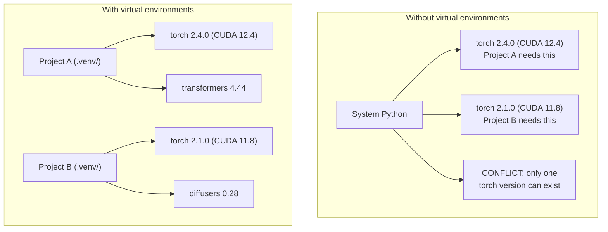

# Environnements Python

> L'enfer de la dépendance est réel.

**Type:** Build
**Languages:** Shell
**Prerequisites:** Phase 0, Lesson 01
**Time:** ~30 minutes

## Objectifs d'apprentissage

- Créer des environnements virtuels isolés en utilisant `uv`- Je suis là .`venv`ou `conda`
- Écrivez une`pyproject.toml`avec des groupes de dépendance facultatifs et générer des fichiers verrouillés pour la reproductibilité
- Diagnostication et réparation des pièges communs: installations globales, mélange pip/conda, incompatibilités de version CUDA
- Mettre en œuvre une stratégie environnementale à chaque étape pour les projets ayant des dépendances en conflit

## Le problème

Vous installez PyTorch 2.4 pour un projet de réglage. La semaine prochaine, un autre projet a besoin de PyTorch 2.1 parce que sa mise en place CUDA est fixée. Vous mettez à niveau mondial, et le premier projet se casse. Vous dégradez, et le second se casse.

C'est l'enfer de la dépendance. Cela arrive constamment dans le travail AI/ML parce que:

- PyTorch, JAX et TensorFlow envoient chacun leurs propres liens CUDA
- Les bibliothèques de modèle sont des versions de cadres spécifiques
- Une organisation mondiale `pip install`Il écris ce qui était là avant.
- Les constructions CUDA 11.8 ne fonctionnent pas avec les pilotes CUDA 12.x (et vice versa)

Le problème: chaque projet a son propre environnement isolé avec ses propres forfaits.

## Le concept



```figure
s0-env-isolation
```

## Faites-le

### Option 1: uv venv (recommandé)

`uv`est le gestionnaire de paquets Python le plus rapide (10-100 fois plus rapide que pip). Il gère des environnements virtuels, des versions Python et une résolution de dépendance dans un seul outil.

```bash
curl -LsSf https://astral.sh/uv/install.sh | sh

uv python install 3.12

cd your-project
uv venv
source .venv/bin/activate
```

Des paquets d'installation:

```bash
uv pip install torch numpy
```

Créer un projet avec `pyproject.toml`en une seule étape:

```bash
uv init my-ai-project
cd my-ai-project
uv add torch numpy matplotlib
```

### Option 2: venv (intégré)

Si vous ne pouvez pas installer `uv`, les navires Python avec `venv`- Le numéro de la liste:

```bash
python3 -m venv .venv
source .venv/bin/activate  # Linux/macOS
.venv\Scripts\activate     # Windows

pip install torch numpy
```

Plus lent que `uv`, mais fonctionne partout où Python est installé.

### Option 3: conda (lorsque vous en avez besoin)

Conda gère des dépendances non Python comme les kits d'outils CUDA, cuDNN et les bibliothèques C. Utilisez-le lorsque:

- Vous avez besoin d'une version spécifique de la trousse d' outils CUDA sans l' installer dans tout le système
- Vous êtes sur un cluster partagé où vous ne pouvez pas installer des paquets système
- Les instructions d'installation d'une bibliothèque disent "utiliser conda"

```bash
# Install miniconda (not the full Anaconda)
curl -LsSf https://repo.anaconda.com/miniconda/Miniconda3-latest-Linux-x86_64.sh -o miniconda.sh
bash miniconda.sh -b

conda create -n myproject python=3.12
conda activate myproject

conda install pytorch torchvision torchaudio pytorch-cuda=12.4 -c pytorch -c nvidia
```

Une règle: si vous utilisez conda pour un environnement, utilisez conda pour tous les emballages de cet environnement.`pip install`dans un conda env provoque des conflits de dépendance qui sont douloureux à déboguer.

### Pour ce cours: stratégie par phase

Vous pouvez créer un environnement pour tout le cours. Ne le faites pas. Différentes phases ont besoin de dépendances différentes (parfois contradictoires).

Stratégie:

```
ai-engineering-from-scratch/
├── .venv/                    <-- shared lightweight env for phases 0-3
├── phases/
│   ├── 04-neural-networks/
│   │   └── .venv/            <-- PyTorch env
│   ├── 05-cnns/
│   │   └── .venv/            <-- same PyTorch env (symlink or shared)
│   ├── 08-transformers/
│   │   └── .venv/            <-- might need different transformer versions
│   └── 11-llm-apis/
│       └── .venv/            <-- API SDKs, no torch needed
```

Le scénario en `code/env_setup.sh`crée l'environnement de base pour ce cours.

## pyproject.toml Basics

Chaque projet Python devrait avoir un`pyproject.toml`Il remplace ...`setup.py`- Je suis là .`setup.cfg`, et `requirements.txt`dans un seul dossier.

```toml
[project]
name = "ai-engineering-from-scratch"
version = "0.1.0"
requires-python = ">=3.11"
dependencies = [
    "numpy>=1.26",
    "matplotlib>=3.8",
    "jupyter>=1.0",
    "scikit-learn>=1.4",
]

[project.optional-dependencies]
torch = ["torch>=2.3", "torchvision>=0.18"]
llm = ["anthropic>=0.39", "openai>=1.50"]
```

Puis installez:

```bash
uv pip install -e ".[torch]"    # base + PyTorch
uv pip install -e ".[llm]"     # base + LLM SDKs
uv pip install -e ".[torch,llm]" # everything
```

## Fichiers de verrouillage

Un fichier de verrouillage pinne toutes les dépendances (y compris les transitives) vers des versions exactes. Cela garantit la reproductibilité: toute personne installant à partir du fichier de verrouillage obtient exactement les mêmes paquets.

```bash
# uv generates uv.lock automatically when using uv add
uv add numpy

# pip-tools approach
uv pip compile pyproject.toml -o requirements.lock
uv pip install -r requirements.lock
```

Quand quelqu'un clone le repo, il installe à partir du fichier de verrouillage et obtient des versions identiques.

## Des erreurs courantes

### 1. Installation à l'échelle mondiale

```bash
pip install torch  # BAD: installs to system Python

source .venv/bin/activate
pip install torch  # GOOD: installs to virtual environment
```

Vérifiez où vont vos colis:

```bash
which python       # should show .venv/bin/python, not /usr/bin/python
which pip           # should show .venv/bin/pip
```

### 2. mélange de pip et de conda

```bash
conda create -n myenv python=3.12
conda activate myenv
conda install pytorch -c pytorch
pip install some-other-package   # BAD: can break conda's dependency tracking
conda install some-other-package # GOOD: let conda manage everything
```

Si vous devez utiliser pip à l'intérieur de conda (certains paquets sont uniquement pip), installez d'abord tous les paquets conda, puis les paquets pip durent.

### 3. Oublier d'activer

```bash
python train.py           # uses system Python, missing packages
source .venv/bin/activate
python train.py           # uses project Python, packages found
```

Votre requête de coque doit afficher le nom de l'environnement:

```
(.venv) $ python train.py
```

### 4. Compromettre .venv à git

```bash
echo ".venv/" >> .gitignore
```

Les environnements virtuels sont de 200 Mo à 2 Go. Ils sont locaux, pas portables entre les machines.`pyproject.toml`et le fichier de verrouillage à la place.

### 5. Ne correspond pas à la version CUDA

```bash
nvidia-smi                # shows driver CUDA version (e.g., 12.4)
python -c "import torch; print(torch.version.cuda)"  # shows PyTorch CUDA version

# These must be compatible.
# PyTorch CUDA version must be <= driver CUDA version.
```

## Utilisez-le

Exécutez le script de configuration pour créer votre environnement de cours:

```bash
bash phases/00-setup-and-tooling/06-python-environments/code/env_setup.sh
```

Cela crée une`.venv`à la racine repo avec des dépendances de base installées et vérifiées.

## Exercices

1. On court .`env_setup.sh`et vérifier le passage de tous les contrôles
2. Créez un deuxième environnement virtuel, installez une version différente de numpy et confirmez que les deux environnements sont isolés
3. Écrivez une`pyproject.toml`pour un projet qui a besoin de PyTorch et de l'SDK Anthropic
4. Installez délibérément un package à l'échelle mondiale (sans activer un venv), notez où il va, puis désinstallez-le

## Les termes clés

| Term | What people say | What it actually means |
|------|----------------|----------------------|
| Virtual environment | "A venv" | An isolated directory containing a Python interpreter and packages, separate from the system Python |
| Lockfile | "Pinned dependencies" | A file listing every package and its exact version, guaranteeing identical installs across machines |
| pyproject.toml | "The new setup.py" | The standard Python project configuration file, replacing setup.py/setup.cfg/requirements.txt |
| Transitive dependency | "A dependency of a dependency" | Package B depends on C; if you install A which depends on B, C is a transitive dependency of A |
| CUDA mismatch | "My GPU isn't working" | PyTorch was compiled for a different CUDA version than what your GPU driver supports |
