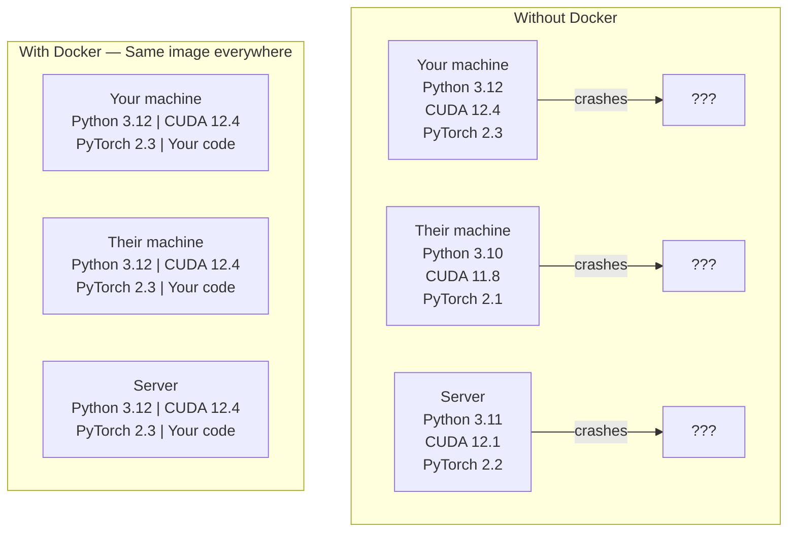

# Docker pour l'IA

> Les conteneurs font du "travail sur ma machine" une chose du passé.

**Type:** Build
**Languages:** Docker
**Prerequisites:** Phase 0, Lessons 01 and 03
**Time:** ~60 minutes

## Objectifs d'apprentissage

- Construire une image Docker fonctionnant avec GPU avec des bibliothèques CUDA, PyTorch et IA à partir d'un fichier Docker
- Montez les annuaires hôtes en tant que volumes pour persister dans les modèles, les ensembles de données et le code à travers les reconstructions de conteneurs
- Configurer le kit d'outils NVIDIA Container pour exposer les GPU à l'intérieur des conteneurs
- Orchestration des applications d'IA multi-service (serveur d'inférence + base de données vectorielle) à l'aide de Docker Compose

## Le problème

Vous avez formé un modèle sur votre ordinateur portable avec PyTorch 2.3, CUDA 12.4 et Python 3.12. Votre collègue a PyTorch 2.1, CUDA 11.8 et Python 3.10. Votre modèle s'écrase sur leur machine. Votre fichier Docker fonctionne sur les deux.

Les projets d'IA sont des cauchemars de dépendance. Une pile typique comprend Python, PyTorch, pilotes CUDA, cuDNN, bibliothèques C au niveau du système et des packages spécialisés comme flash-attn qui nécessitent des versions de compilateur exactes. Docker emballe tout cela en une seule image qui fonctionne de manière identique partout.

## Le concept

Docker enveloppe votre code, votre temps d'exécution, vos bibliothèques et vos outils système dans une unité isolée appelée un conteneur.



### Pourquoi les projets d'IA ont plus besoin de Docker que la plupart

1. **GPU drivers are fragile.**Le code CUDA 12.4 n'est pas exécuté sur CUDA 11.8. Docker isole le kit d'outils CUDA à l'intérieur du conteneur tout en partageant le pilote GPU hôte via le kit d'outils NVIDIA Container.

2. **Model weights are large.**Un modèle de paramètre 7B est de 14 Go en fp16. Vous ne voulez pas le télécharger à chaque fois que vous le reconstruisez.

3. **Multi-service architectures are common.**Une application d'IA réelle n'est pas seulement un script Python. C'est un serveur d'inférence, une base de données vectorielle pour RAG, peut-être un frontend Web. Docker Compose orchestre tout cela avec une seule commande.

### Le vocabulaire clé

| Term | What it means |
|------|---------------|
| Image | A read-only template. Your recipe. Built from a Dockerfile. |
| Container | A running instance of an image. Your kitchen. |
| Dockerfile | Instructions to build an image. Layer by layer. |
| Volume | Persistent storage that survives container restarts. |
| docker-compose | A tool for defining multi-container applications in YAML. |

### Modèles de conteneurs communs dans l'IA

```
Dev Container
  Full toolkit. Editor support. Jupyter. Debugging tools.
  Used during development and experimentation.

Training Container
  Minimal. Just the training script and dependencies.
  Runs on GPU clusters. No editor, no Jupyter.

Inference Container
  Optimized for serving. Small image. Fast cold start.
  Runs behind a load balancer in production.
```

```figure
s0-image-layers
```

## Faites-le

### Étape 1: Installez Docker

```bash
# macOS
brew install --cask docker
open /Applications/Docker.app

# Ubuntu
curl -fsSL https://get.docker.com | sh
sudo usermod -aG docker $USER
# Log out and back in for group change to take effect
```

Vérifiez:

```bash
docker --version
docker run hello-world
```

### Étape 2: Installez le kit d'outils NVIDIA Container (Linux avec GPU NVIDIA)

Cela permet aux conteneurs Docker d'accéder à votre GPU. Les utilisateurs de macOS et Windows (WSL2) peuvent sauter cela; Docker Desktop gère les GPU différemment sur ces plateformes.

```bash
distribution=$(. /etc/os-release;echo $ID$VERSION_ID)
curl -fsSL https://nvidia.github.io/libnvidia-container/gpgkey | sudo gpg --dearmor -o /usr/share/keyrings/nvidia-container-toolkit-keyring.gpg
curl -s -L https://nvidia.github.io/libnvidia-container/$distribution/libnvidia-container.list | \
    sed 's#deb https://#deb [signed-by=/usr/share/keyrings/nvidia-container-toolkit-keyring.gpg] https://#g' | \
    sudo tee /etc/apt/sources.list.d/nvidia-container-toolkit.list

sudo apt-get update
sudo apt-get install -y nvidia-container-toolkit
sudo nvidia-ctk runtime configure --runtime=docker
sudo systemctl restart docker
```

Testez l'accès GPU à l'intérieur d'un conteneur:

```bash
docker run --rm --gpus all nvidia/cuda:12.4.1-base-ubuntu22.04 nvidia-smi
```

Si vous voyez vos informations sur le GPU, le kit d'outils fonctionne.

### Étape 3: Comprendre les images de base

Choisir la bonne image de base permet d'économiser des heures de débogage.

```
nvidia/cuda:12.4.1-devel-ubuntu22.04
  Full CUDA toolkit. Compilers included.
  Use for: building packages that need nvcc (flash-attn, bitsandbytes)
  Size: ~4 GB

nvidia/cuda:12.4.1-runtime-ubuntu22.04
  CUDA runtime only. No compilers.
  Use for: running pre-built code
  Size: ~1.5 GB

pytorch/pytorch:2.6.0-cuda12.4-cudnn9-runtime
  PyTorch pre-installed on top of CUDA.
  Use for: skipping the PyTorch install step
  Size: ~6 GB

python:3.12-slim
  No CUDA. CPU only.
  Use for: inference on CPU, lightweight tools
  Size: ~150 MB
```

### Étape 4: Écrire un fichier Docker pour le développement de l'IA

Voici le fichier Docker dans `code/Dockerfile`- Parcourez-le .

```dockerfile
FROM nvidia/cuda:12.4.1-devel-ubuntu22.04

ENV DEBIAN_FRONTEND=noninteractive
ENV PYTHONUNBUFFERED=1

RUN apt-get update && apt-get install -y --no-install-recommends \
    software-properties-common \
    git \
    curl \
    build-essential \
    && add-apt-repository -y ppa:deadsnakes/ppa \
    && apt-get update && apt-get install -y --no-install-recommends \
    python3.12 \
    python3.12-venv \
    python3.12-dev \
    && rm -rf /var/lib/apt/lists/*

RUN update-alternatives --install /usr/bin/python python /usr/bin/python3.12 1

RUN curl -sSL https://raw.githubusercontent.com/pypa/get-pip/3b73145063be545b649ad9ca83ea8da5fc915a4f/public/get-pip.py -o /tmp/get-pip.py \
    && echo "a341e1a43e38001c551a1508a73ff23636a11970b61d901d9a1cad2a18f57055  /tmp/get-pip.py" | sha256sum -c - \
    && python /tmp/get-pip.py \
    && rm /tmp/get-pip.py \
    && update-alternatives --install /usr/bin/pip pip /usr/local/bin/pip3.12 1

RUN python -m pip install --no-cache-dir --upgrade pip setuptools wheel

RUN python -m pip install --no-cache-dir \
    torch==2.6.0+cu124 \
    torchvision==0.21.0+cu124 \
    torchaudio==2.6.0+cu124 \
    --index-url https://download.pytorch.org/whl/cu124

RUN python -m pip install --no-cache-dir \
    numpy \
    pandas \
    scikit-learn \
    matplotlib \
    jupyter \
    transformers \
    datasets \
    accelerate \
    safetensors

WORKDIR /workspace

VOLUME ["/workspace", "/models"]

EXPOSE 8888

CMD ["python"]
```

- Faites-le !

```bash
docker build -t ai-dev -f phases/00-setup-and-tooling/07-docker-for-ai/code/Dockerfile .
```

Cela prend un certain temps la première fois (téléchargement de l'image de base CUDA + PyTorch).

- Je vais le faire.

```bash
docker run --rm -it --gpus all \
    -v $(pwd):/workspace \
    -v ~/models:/models \
    ai-dev python -c "import torch; print(f'PyTorch {torch.__version__}, CUDA: {torch.cuda.is_available()}')"
```

Exécuter Jupyter à l'intérieur du conteneur:

```bash
docker run --rm -it --gpus all \
    -v $(pwd):/workspace \
    -v ~/models:/models \
    -p 8888:8888 \
    ai-dev jupyter notebook --ip=0.0.0.0 --port=8888 --no-browser --allow-root
```

### Étape 5: Montage de volume pour les données et les modèles

Les montage de volume sont essentiels pour le travail de l'IA. Sans eux, vos téléchargements de modèle de 14 Go disparaissent lorsque le conteneur s'arrête.

```bash
# Mount your code
-v $(pwd):/workspace

# Mount a shared models directory
-v ~/models:/models

# Mount datasets
-v ~/datasets:/data
```

Dans votre script d'entraînement, chargez-vous du chemin monté:

```python
from transformers import AutoModel

model = AutoModel.from_pretrained("/models/llama-7b")
```

Le modèle est installé sur votre système de fichiers hôte.

### Étape 6: Docker Composer pour les applications d'IA multi-service

Une application RAG réelle a besoin d'un serveur d'inférence et d'une base de données vectorielle.

Regardez !`code/docker-compose.yml`- Le numéro de la liste:

```yaml
services:
  ai-dev:
    build:
      context: .
      dockerfile: Dockerfile
    deploy:
      resources:
        reservations:
          devices:
            - driver: nvidia
              count: all
              capabilities: [gpu]
    volumes:
      - ../../../:/workspace
      - ~/models:/models
      - ~/datasets:/data
    ports:
      - "8888:8888"
    stdin_open: true
    tty: true
    command: jupyter notebook --ip=0.0.0.0 --port=8888 --no-browser --allow-root

  qdrant:
    image: qdrant/qdrant:v1.12.5
    ports:
      - "6333:6333"
      - "6334:6334"
    volumes:
      - qdrant_data:/qdrant/storage

volumes:
  qdrant_data:
```

Commencez tout:

```bash
cd phases/00-setup-and-tooling/07-docker-for-ai/code
docker compose up -d
```

Maintenant votre conteneur de développement d' IA peut atteindre la base de données vectorielle à `http://qdrant:6333`Docker Compose crée automatiquement un réseau partagé.

Testez la connexion à l'intérieur du conteneur d'IA:

```python
from qdrant_client import QdrantClient

client = QdrantClient(host="qdrant", port=6333)
print(client.get_collections())
```

Arrêtez tout !

```bash
docker compose down
```

Ajouter `-v`pour supprimer également le volume de qdrant:

```bash
docker compose down -v
```

### Étape 7: Commandes Docker utiles pour le travail d'IA

```bash
# List running containers
docker ps

# List all images and their sizes
docker images

# Remove unused images (reclaim disk space)
docker system prune -a

# Check GPU usage inside a running container
docker exec -it <container_id> nvidia-smi

# Copy a file from container to host
docker cp <container_id>:/workspace/results.csv ./results.csv

# View container logs
docker logs -f <container_id>
```

## Utilisez-le

Vous avez maintenant un environnement de développement d'IA reproduisable.

- Utilisation `docker compose up`pour démarrer votre environnement de développement et vecteur de base de données ensemble
- Montez votre code, vos modèles et vos données en volumes afin que rien ne soit perdu entre les reconstructions
- Lorsque la leçon nécessite un nouveau paquet Python, ajoutez-le au fichier Docker et reconstruisez
- Partagez votre dossier avec vos coéquipiers.

### Pas de GPU ?

Retirez le `--gpus all`Le contenant fonctionne toujours pour les leçons basées sur le processeur PyTorch détecte l'absence de CUDA et revient automatiquement sur le processeur.

## Exercices

1. Construisez le fichier Docker et courez `python -c "import torch; print(torch.__version__)"`à l'intérieur du conteneur
2. Démarrez la pile composée de docker et vérifiez que Qdrant est accessible depuis le conteneur d' IA à `http://qdrant:6333/collections`
3. Ajouter `flask`Pour le fichier Docker, reconstruire et exécuter un serveur API simple sur le port 5000.`-p 5000:5000`
4. Mesurer la taille de l' image avec `docker images`Essayez de changer l' image de base de `devel`à `runtime`et comparer les tailles

## Les termes clés

| Term | What people say | What it actually means |
|------|----------------|----------------------|
| Container | "Lightweight VM" | An isolated process using the host kernel, with its own filesystem and network |
| Image layer | "Cached step" | Each Dockerfile instruction creates a layer. Unchanged layers are cached, so rebuilds are fast. |
| NVIDIA Container Toolkit | "GPU in Docker" | A runtime hook that exposes host GPUs to containers via `--gpus` flag |
| Volume mount | "Shared folder" | A directory on the host mapped into the container. Changes persist after the container stops. |
| Base image | "Starting point" | The `FROM` image your Dockerfile builds on top of. Determines what is pre-installed. |
