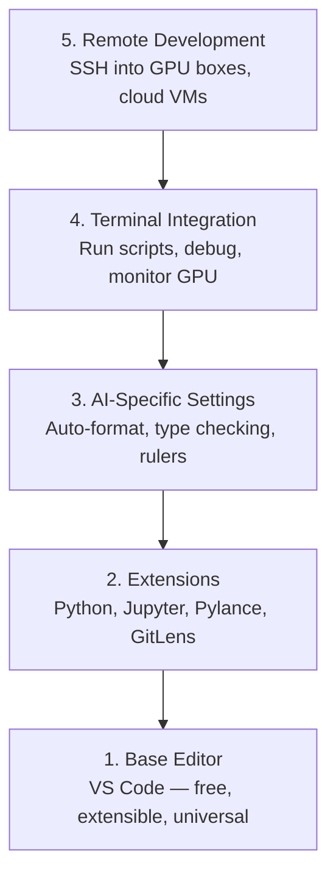

# Configuration de l'éditeur

> Votre éditeur est votre co-pilot, configurez-le une fois pour qu'il reste hors de votre chemin et commence à tirer son poids.

**Type:** Build
**Languages:** --
**Prerequisites:** Phase 0, Lesson 01
**Time:** ~20 minutes

## Objectifs d'apprentissage

- Installez le code VS avec des extensions essentielles pour Python, Jupyter, linting et SSH à distance
- Configurer le format-on-sauvage, la vérification du type et le défilement de sortie du bloc-notes pour les flux de travail d'IA
- Configurer le Remote SSH pour modifier et débogager le code sur les machines GPU distantes comme s' elles étaient locales
- Évaluer les alternatives d'édition (Cursor, Windsurf, Neovim) et leurs compromis pour le travail de l'IA

## Le problème

Vous passerez des milliers d'heures à l'intérieur de votre éditeur à écrire Python, à exécuter des carnets de notes, à déboguer les boucles d'entraînement et à intégrer SSH dans les boîtes GPU. Un éditeur mal configuré transforme chaque session en friction: pas de complément automatique, pas de suggestions de type, pas d'erreurs en ligne, de formatage manuel et un flux de travail terminal maladroit.

La bonne configuration prend 20 minutes, mais sauter ça vous coûte 20 minutes par jour.

## Le concept

Une configuration d'éditeur d'ingénierie AI a besoin de cinq choses:



```figure
s0-lsp-roundtrip
```

## Faites-le

### Étape 1: Installez le code VS

VS Code est l'éditeur recommandé. Il est gratuit, fonctionne sur tous les systèmes d'exploitation, dispose d'une prise en charge notebook Jupyter de première classe, et l'écosystème d'extension couvre tout ce dont vous avez besoin pour le travail d'IA.

Téléchargez-le à partir de [code.visualstudio.com](https://code.visualstudio.com/)- Je suis désolé .

Vérifiez depuis le terminal:

```bash
code --version
```

Si vous`code`n'est pas disponible sur macOS, ouvrez le code VS, appuyez `Cmd+Shift+P`, tapez "Command de coque", puis sélectionnez "Installer la commande "code" dans PATH".

### Étape 2: Installez les extensions essentielles

Ouvrez le terminal intégré dans le code VS (`` Ctrl+``` sur toutes les plateformes) et installer les extensions qui comptent pour le travail de l'IA:

```bash
code --install-extension ms-python.python
code --install-extension ms-python.vscode-pylance
code --install-extension ms-toolsai.jupyter
code --install-extension eamodio.gitlens
code --install-extension ms-vscode-remote.remote-ssh
code --install-extension ms-python.debugpy
code --install-extension ms-python.black-formatter
code --install-extension charliermarsh.ruff
```

Ce que chacun fait:

| Extension | Why |
|-----------|-----|
| Python | Language support, virtual env detection, run/debug |
| Pylance | Fast type checking, autocomplete, import resolution |
| Jupyter | Run notebooks inside VS Code, variable explorer |
| GitLens | See who changed what, inline git blame |
| Remote SSH | Open a folder on a remote GPU box as if it were local |
| Debugpy | Step-through debugging for Python |
| Black Formatter | Auto-format on save, consistent style |
| Ruff | Fast linting, catches common mistakes |

Le dossier `code/.vscode/extensions.json`Lorsque vous ouvrez le dossier du projet, VS Code vous demandera de les installer.

### Étape 3: Configurer les paramètres

Copiez les paramètres à partir de `code/.vscode/settings.json`Dans cette leçon, ou les appliquer manuellement à travers `Settings > Open Settings (JSON)`- Je suis désolé .

Les paramètres clés pour le travail de l'IA:

```jsonc
{
    "python.analysis.typeCheckingMode": "basic",
    "editor.formatOnSave": true,
    "editor.rulers": [88, 120],
    "notebook.output.scrolling": true,
    "files.autoSave": "afterDelay"
}
```

Pourquoi ces questions sont importantes:

- **Type checking on basic**: Capture de mauvais types d'arguments avant d'exécuter. Économise du temps de débogage sur les déséquilibres de forme tensor et les paramètres API incorrects.
- **Format on save**Ne pensez plus à la mise en forme.
- **Rulers at 88 and 120**Le marqueur 120 montre quand les chaînes de documents et les commentaires deviennent trop longs.
- **Notebook output scrolling**Les boucles d'entraînement impriment des milliers de lignes.
- **Auto-save**Vous oublierez de sauvegarder. Votre script d'entraînement exécutera un code obsolète.

### Étape 4: Intégration du terminal

Le terminal intégré de VS Code est où vous exécutez des scripts de formation, surveillez les GPU et gérez les environnements.

Mettez-le correctement.

```jsonc
{
    "terminal.integrated.defaultProfile.osx": "zsh",
    "terminal.integrated.defaultProfile.linux": "bash",
    "terminal.integrated.fontSize": 13,
    "terminal.integrated.scrollback": 10000
}
```

Des raccourcis utiles:

| Action | macOS | Linux/Windows |
|--------|-------|---------------|
| Toggle terminal | `` Ctrl+` `` | `` Ctrl+` `` |
| New terminal | `` Ctrl+Shift+` `` | `` Ctrl+Shift+` `` |
| Split terminal | `Cmd+\` | `Ctrl+Shift+5` |

Les terminaux séparés sont utiles: un pour exécuter votre script, un pour surveiller la GPU avec `nvidia-smi -l 1`ou `watch -n 1 nvidia-smi`- Je suis désolé .

### Étape 5: Développement à distance (SSH dans les boîtes GPU)

C'est l'extension la plus importante pour le travail de l'IA. Vous exécuterez une formation sur des machines distantes (VM cloud, serveurs de laboratoire, Lambda, Vast.ai).

- Le réglage:

1. Installez l'extension SSH à distance (faire à l'étape 2).
2. La presse `Ctrl+Shift+P`(ou `Cmd+Shift+P`), de type "Remote-SSH: Connectez-vous à l'hôte".
3. Entrez .`user@your-gpu-box-ip`- Je suis désolé .
4. VS Code installe automatiquement son composant serveur sur la machine à distance.

Pour un accès sans mot de passe, configurer les clés SSH:

```bash
ssh-keygen -t ed25519 -C "your-email@example.com"
ssh-copy-id user@your-gpu-box-ip
```

Ajoutez l' hôte à `~/.ssh/config`Pour plus de commodité:

```
Host gpu-box
    HostName 203.0.113.50
    User ubuntu
    IdentityFile ~/.ssh/id_ed25519
    ForwardAgent yes
```

- Je suis désolé .`Remote-SSH: Connect to Host > gpu-box`se connecte instantanément.

## Les alternatives

### Le curseur

[cursor.com](https://cursor.com)est un fourchette VS Code avec génération de code intégré AI. Il utilise le même écosystème d'extension et le même format de paramètres. Si vous utilisez Cursor, tout ce qui est dans cette leçon s'applique toujours. Importer la même `settings.json`et `extensions.json`- Je suis désolé .

### Surf à vent

[windsurf.com](https://windsurf.com)C'est une autre fourchette de code VS d'IA. La même histoire: les mêmes extensions, le même format de paramètres, le même support SSH à distance.

### Vim/Neovim

Si vous utilisez déjà Vim ou Neovim et que vous êtes productif, restez là.

- **pyright**ou **pylsp**pour la vérification du type (via la maçonnerie ou l'installation manuelle)
- **nvim-lspconfig**pour l'intégration du serveur de langue
- **jupyter-vim**ou **molten-nvim**pour une exécution similaire à un ordinateur portable
- **telescope.nvim**pour la recherche de fichiers/symbols
- **none-ls.nvim**avec noir et roux pour le formatage/lintage

Si vous n'utilisez pas Vim, ne commencez pas maintenant. La courbe d'apprentissage va rivaliser avec l'apprentissage de l'ingénierie de l'IA. Utilisez VS Code.

## Utilisez-le

Avec cette configuration, votre flux de travail quotidien ressemble à:

1. Ouvrez le dossier du projet dans VS Code (ou connectez-vous via SSH à distance à une boîte GPU).
2. Écrivez Python dans l'éditeur avec autocomplete, astuces de tactile et erreurs en ligne.
3. Exécutez des ordinateurs Jupyter en ligne avec l'extension Jupyter.
4. Utilisez le terminal intégré pour les scripts de formation, `uv pip install`, et la surveillance par GPU.
5. Révisez les modifications avec GitLens avant de s'engager.

## Exercices

1. Installez le code VS et toutes les extensions énumérées à l'étape 2
2. - Copier le `settings.json`de cette leçon dans votre configuration de code VS
3. Ouvrez un fichier Python et vérifiez que Pylance affiche des indices de type et des formats Noirs sur sauvegarde
4. Si vous avez accès à une machine à distance, configurez Remote SSH et ouvrez un dossier dessus

## Les termes clés

| Term | What people say | What it actually means |
|------|----------------|----------------------|
| LSP | "Autocomplete engine" | Language Server Protocol: a standard for editors to get type info, completions, and diagnostics from a language-specific server |
| Pylance | "The Python plugin" | Microsoft's Python language server using Pyright for type checking and IntelliSense |
| Remote SSH | "Working on the server" | VS Code extension that runs a lightweight server on a remote machine and streams the UI to your local editor |
| Format on save | "Auto-prettier" | The editor runs a formatter (Black, Ruff) every time you save, so code style is always consistent |
