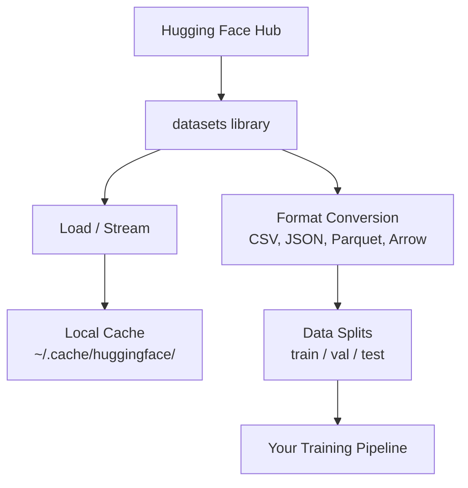

# Gestion des données

> Les données sont le carburant, et la façon dont vous les gérez détermine votre vitesse.

**Type:** Build
**Language:**Python
**Prerequisites:** Phase 0, Lesson 01
**Time:** ~45 minutes

## Objectifs d'apprentissage

- Charger, diffuser et mettre en cache des ensembles de données à l'aide du Face embrasé `datasets`bibliothèque
- Convertir entre les formats CSV, JSON, Parquet et Arrow et expliquer leurs compromis
- Créer des divisions de train/validation/essai reproduisables avec des graines aléatoires fixes
- Gérer les fichiers de grands modèles et ensembles de données en utilisant `.gitignore`, Git LFS ou DVC

## Le problème

Chaque projet d'IA commence par des données. Vous devez trouver des ensembles de données, les télécharger, les convertir entre formats, les diviser pour la formation et l'évaluation, et les modifier pour que les expériences soient reproduisibles. Faire cela manuellement à chaque fois est lent et sujet à erreurs. Vous avez besoin d'un flux de travail répétitif.

## Le concept



Le visage qui s' embrasse`datasets`La bibliothèque est la façon standard de charger des données pour le travail de l'IA. Elle gère le téléchargement, le caching, la conversion de format et le streaming hors boîte.

```figure
s0-data-pipeline
```

## Faites-le

### Étape 1: Installez la bibliothèque des ensembles de données

```bash
pip install datasets huggingface_hub
```

### Étape 2: Charger un ensemble de données

```python
from datasets import load_dataset

dataset = load_dataset("stanfordnlp/imdb")
print(dataset)
print(dataset["train"][0])
```

Ceci télécharge le jeu de données de critique de film IMDB. Après le premier téléchargement, il se charge à partir du cache à `~/.cache/huggingface/datasets/`- Je suis désolé .

### Étape 3: Transférer des ensembles de données de grande taille

Certains ensembles de données sont trop grands pour être mis sur disque.

```python
dataset = load_dataset("wikimedia/wikipedia", "20220301.en", split="train", streaming=True)

for i, example in enumerate(dataset):
    print(example["title"])
    if i >= 4:
        break
```

Le streaming vous donne un`IterableDataset`L'utilisation de la mémoire reste constante indépendamment de la taille du jeu de données.

### Étape 4: Format des ensembles de données

Le `datasets`La bibliothèque utilise Apache Arrow sous le capot. Vous pouvez convertir à d'autres formats selon ce dont votre pipeline a besoin.

```python
dataset = load_dataset("stanfordnlp/imdb", split="train")

dataset.to_csv("imdb_train.csv")
dataset.to_json("imdb_train.json")
dataset.to_parquet("imdb_train.parquet")
```

Comparaison de format:

| Format | Size | Read Speed | Best For |
|--------|------|-----------|----------|
| CSV | Large | Slow | Human readability, spreadsheets |
| JSON | Large | Slow | APIs, nested data |
| Parquet | Small | Fast | Analytics, columnar queries |
| Arrow | Small | Fastest | In-memory processing (what `datasets` uses internally) |

Pour le travail de l'IA, Parquet est le meilleur format de stockage. Arrow est ce que vous travaillez avec dans la mémoire. CSV et JSON sont pour l'échange.

### Étape 5: Divisions de données

Chaque projet ML a besoin de trois divisions:

- **Train**Le modèle en tire des leçons (typiquement 80%)
- **Validation**: Vous vérifiez les progrès réalisés pendant la formation (généralement 10%)
- **Test**: Évaluation finale après la formation (généralement 10%)

Certains ensembles de données sont pré-divisés, et quand ils ne le sont pas, divisez-les vous-même.

```python
dataset = load_dataset("stanfordnlp/imdb", split="train")

split = dataset.train_test_split(test_size=0.2, seed=42)
train_val = split["train"].train_test_split(test_size=0.125, seed=42)

train_ds = train_val["train"]
val_ds = train_val["test"]
test_ds = split["test"]

print(f"Train: {len(train_ds)}, Val: {len(val_ds)}, Test: {len(test_ds)}")
```

Toujours fixer une graine pour la reproductibilité.

### Étape 6: Modèles de téléchargement et de mise en cache

Les modèles sont de grands fichiers.`huggingface_hub`Les bibliothèques gèrent le téléchargement et le caching.

```python
from huggingface_hub import hf_hub_download, snapshot_download

model_path = hf_hub_download(
    repo_id="sentence-transformers/all-MiniLM-L6-v2",
    filename="config.json"
)
print(f"Cached at: {model_path}")

model_dir = snapshot_download("sentence-transformers/all-MiniLM-L6-v2")
print(f"Full model at: {model_dir}")
```

Modèles en cache à `~/.cache/huggingface/hub/`Une fois téléchargés, ils se chargent instantanément sur les circuits suivants.

### Étape 7: Gérer les fichiers de taille

Les poids des modèles et les grands ensembles de données ne doivent pas être inclus dans git.

**Option A: .gitignore (simplest)**

```
*.bin
*.safetensors
*.pt
*.onnx
data/*.parquet
data/*.csv
models/
```

**Option B: Git LFS (track large files in git)**

```bash
git lfs install
git lfs track "*.bin"
git lfs track "*.safetensors"
git add .gitattributes
```

Git LFS stocke les pointeurs dans votre repo et les fichiers réels sur un serveur séparé. GitHub vous donne 1 Go gratuitement.

**Option C: DVC (data version control)**

```bash
pip install dvc
dvc init
dvc add data/training_set.parquet
git add data/training_set.parquet.dvc data/.gitignore
git commit -m "Track training data with DVC"
```

Le DVC crée de petites`.dvc`Les données elles-mêmes sont dans S3, GCS ou un autre backend de stockage à distance.

| Approach | Complexity | Best For |
|----------|-----------|----------|
| .gitignore | Low | Personal projects, downloaded data you can re-fetch |
| Git LFS | Medium | Teams sharing model weights via git |
| DVC | High | Reproducible experiments, large datasets, teams |

Pour ce cours,`.gitignore`Utilisez le DVC quand vous devez reproduire des expériences exactes sur des machines.

### Étape 8: Modèles de stockage

**Local storage**fonctionne pour les ensembles de données de moins de 10 Go. Le cache HF traite cela automatiquement.

**Cloud storage**est pour tout ce qui est plus grand ou partagé entre les machines:

```python
import os

local_path = os.path.expanduser("~/.cache/huggingface/datasets/")

# s3_path = "s3://my-bucket/datasets/"
# gcs_path = "gs://my-bucket/datasets/"
```

Le DVC s'intègre directement avec le S3 et le GCS:

```bash
dvc remote add -d myremote s3://my-bucket/dvc-store
dvc push
```

Pour ce cours, le stockage local est suffisant.

## Les ensembles de données utilisés dans ce cours

| Dataset | Lessons | Size | What It Teaches |
|---------|---------|------|----------------|
| IMDB | Tokenization, classification | 84 MB | Text classification basics |
| WikiText | Language modeling | 181 MB | Next-token prediction |
| SQuAD | QA systems | 35 MB | Question answering, spans |
| Common Crawl (subset) | Embeddings | Varies | Large-scale text processing |
| MNIST | Vision basics | 21 MB | Image classification fundamentals |
| COCO (subset) | Multimodal | Varies | Image-text pairs |

Vous n'avez pas besoin de télécharger toutes ces leçons maintenant.

## Utilisez-le

Exécutez le script utilitaire pour vérifier que tout fonctionne:

```bash
python code/data_utils.py
```

Il télécharge un petit ensemble de données, le convertit, le divise et imprime un résumé.

## La faire partir

Cette leçon donne:
- `code/data_utils.py`- l'utilité de chargement et de mise en cache de données réutilisables
- `outputs/prompt-data-helper.md`- de trouver le bon ensemble de données pour une tâche

## Exercices

1. Chargez le `glue`l' ensemble de données avec le `mrpc`configurer et inspecter les cinq premiers exemples
2. - Je suis en train de passer .`c4`un ensemble de données et compter combien d'exemples vous pouvez traiter en 10 secondes
3. Convertir un ensemble de données en Parquet et comparer la taille du fichier à CSV
4. Créer une séparation de train/val/essai 70/15/15 avec une semence fixe et vérifier les tailles

## Les termes clés

| Term | What people say | What it actually means |
|------|----------------|----------------------|
| Dataset split | "Training data" | A named subset (train/val/test) used at different stages of the ML lifecycle |
| Streaming | "Load it lazily" | Processing data row by row from a remote source without downloading the full dataset |
| Parquet | "Compressed CSV" | A columnar file format optimized for analytical queries and storage efficiency |
| Arrow | "Fast dataframe" | An in-memory columnar format used internally by the datasets library for zero-copy reads |
| Git LFS | "Git for big files" | An extension that stores large files outside the git repo while keeping pointers in version control |
| DVC | "Git for data" | A version control system for datasets and models that integrates with cloud storage |
| Cache | "Already downloaded" | A local copy of previously fetched data, stored at ~/.cache/huggingface/ by default |
