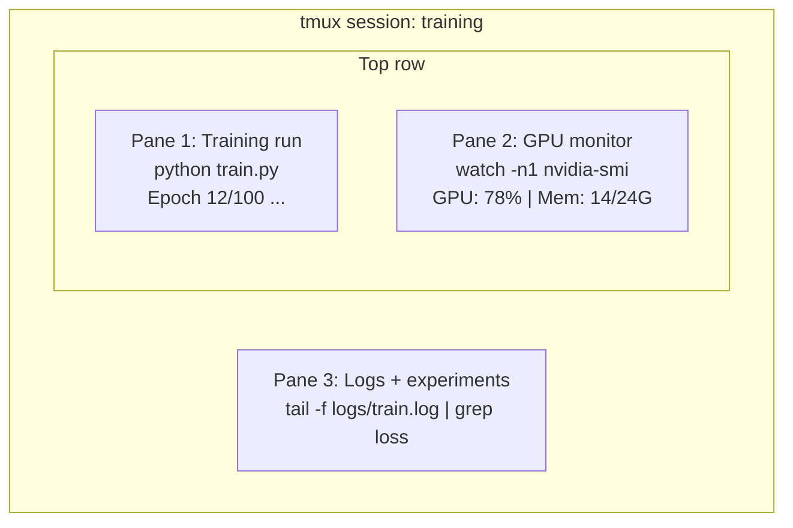

# Terminal et Shell

> Le terminal est où vivent les ingénieurs de l'IA.

**Type:** Learn
**Languages:** --
**Prerequisites:** Phase 0, Lesson 01
**Time:** ~35 minutes

## Objectifs d'apprentissage

- Utilisez des tuyaux, des redirections et `grep`pour filtrer et traiter les journaux d'entraînement à partir de la ligne de commande
- Créer des sessions de tmux persistantes avec plusieurs panneaux pour la formation simultanée et la surveillance de la GPU
- Surveiller les ressources du système et de la GPU avec `htop`- Je suis là .`nvtop`, et `nvidia-smi`
- Transfert de fichiers entre machines locales et distantes à l'aide de SSH, `scp`, et `rsync`

## Le problème

Vous passerez plus de temps dans le terminal que dans n'importe quel éditeur. Exercices de formation, surveillance de GPU, suivi de journaux, sessions SSH à distance, gestion de l'environnement. Chaque flux de travail d'IA touche la coquille. Si vous êtes lent ici, vous êtes lent partout.

Cette leçon couvre les compétences terminales qui comptent pour le travail de l'IA. Pas d'histoire d'Unix. Pas de plongée profonde dans le script Bash.

## Le concept



Trois choses fonctionnent à la fois, un terminal, vous pouvez vous détacher, rentrer chez vous, revenir à la SSH, et vous vous attacher.

```figure
s0-shell-pipeline
```

## Faites-le

### Étape 1: Connaître votre coquille

Vérifiez quel obus vous utilisez:

```bash
echo $SHELL
```

La plupart des systèmes utilisent `bash`ou `zsh`Les commandes de ce cours fonctionnent dans les deux.

Les choses essentielles à savoir:

```bash
# Move around
cd ~/projects/ai-engineering-from-scratch
pwd
ls -la

# History search (most useful shortcut you'll learn)
# Ctrl+R then type part of a previous command
# Press Ctrl+R again to cycle through matches

# Clear terminal
clear   # or Ctrl+L

# Cancel a running command
# Ctrl+C

# Suspend a running command (resume with fg)
# Ctrl+Z
```

### Étape 2: Piping et redirection

Le piping relie les commandes ensemble. C'est ainsi que vous traitez les journaux, la sortie des filtres et les outils de chaîne. Vous utiliserez cela constamment.

```bash
# Count how many times "loss" appears in a log
cat train.log | grep "loss" | wc -l

# Extract just the loss values from training output
grep "loss:" train.log | awk '{print $NF}' > losses.txt

# Watch a log file update in real time, filtering for errors
tail -f train.log | grep --line-buffered "ERROR"

# Sort experiments by final accuracy
grep "final_accuracy" results/*.log | sort -t= -k2 -n -r

# Redirect stdout and stderr to separate files
python train.py > output.log 2> errors.log

# Redirect both to the same file
python train.py > train_full.log 2>&1
```

Les trois redirections dont vous avez besoin:

| Symbol | What it does |
|--------|-------------|
| `>` | Write stdout to file (overwrite) |
| `>>` | Append stdout to file |
| `2>` | Write stderr to file |
| `2>&1` | Send stderr to same place as stdout |
| `\|` | Send stdout of one command as stdin to the next |

### Étape 3: processus de fond

Les entraînements prennent des heures, mais on ne veut pas garder le terminal ouvert tout le temps.

```bash
# Run in background (output still goes to terminal)
python train.py &

# Run in background, immune to hangup (closing terminal won't kill it)
nohup python train.py > train.log 2>&1 &

# Check what's running in background
jobs
ps aux | grep train.py

# Bring a background job to foreground
fg %1

# Kill a background process
kill %1
# or find its PID and kill that
kill $(pgrep -f "train.py")
```

La différence entre `&`- Je suis là .`nohup`, et `screen`- Je suis là.`tmux`- Le numéro de la liste:

| Method | Survives terminal close? | Can reattach? |
|--------|-------------------------|---------------|
| `command &` | No | No |
| `nohup command &` | Yes | No (check log file) |
| `screen` / `tmux` | Yes | Yes |

Pour plus de quelques minutes, utilisez tmux.

### Étape 4:

Tmux vous permet de créer des sessions terminales persistantes avec plusieurs panneaux.

```bash
# Install
# macOS
brew install tmux
# Ubuntu
sudo apt install tmux

# Start a named session
tmux new -s training

# Split horizontally
# Ctrl+B then "

# Split vertically
# Ctrl+B then %

# Navigate between panes
# Ctrl+B then arrow keys

# Detach (session keeps running)
# Ctrl+B then d

# Reattach
tmux attach -t training

# List sessions
tmux ls

# Kill a session
tmux kill-session -t training
```

Une session typique de flux de travail d'IA:

```bash
tmux new -s train

# Pane 1: start training
python train.py --epochs 100 --lr 1e-4

# Ctrl+B, " to split, then run GPU monitor
watch -n1 nvidia-smi

# Ctrl+B, % to split vertically, tail the logs
tail -f logs/experiment.log

# Now detach with Ctrl+B, d
# SSH out, go get coffee, come back
# tmux attach -t train
```

### Étape 5: Surveillance avec htop et nvtop

```bash
# System processes (better than top)
htop

# GPU processes (if you have NVIDIA GPU)
# Install: sudo apt install nvtop (Ubuntu) or brew install nvtop (macOS)
nvtop

# Quick GPU check without nvtop
nvidia-smi

# Watch GPU usage update every second
watch -n1 nvidia-smi

# See which processes are using the GPU
nvidia-smi --query-compute-apps=pid,name,used_memory --format=csv
```

`htop`Les liens de clé que vous utiliserez:
- `F6`ou `>`pour trier par colonne (trier par mémoire pour trouver des fuites de mémoire)
- `F5`pour changer la vue d'arbre (voir processus enfant)
- `F9`pour tuer un processus
- `/`pour rechercher un nom de processus

### Étape 6: SSH pour les boîtes de GPU à distance

Lorsque vous louez un GPU en nuage (Lambda, RunPod, Vast.ai), vous vous connectez via SSH.

```bash
# Basic connection
ssh user@gpu-box-ip

# With a specific key
ssh -i ~/.ssh/my_gpu_key user@gpu-box-ip

# Copy files to remote
scp model.pt user@gpu-box-ip:~/models/

# Copy files from remote
scp user@gpu-box-ip:~/results/metrics.json ./

# Sync a whole directory (faster for many files)
rsync -avz ./data/ user@gpu-box-ip:~/data/

# Port forward (access remote Jupyter/TensorBoard locally)
ssh -L 8888:localhost:8888 user@gpu-box-ip
# Now open localhost:8888 in your browser

# SSH config for convenience
# Add to ~/.ssh/config:
# Host gpu
#     HostName 192.168.1.100
#     User ubuntu
#     IdentityFile ~/.ssh/gpu_key
#
# Then just:
# ssh gpu
```

### Étape 7: Des aliases utiles pour le travail de l'IA

Ajoutez ça à votre .`~/.bashrc`ou `~/.zshrc`- Le numéro de la liste:

```bash
source phases/00-setup-and-tooling/10-terminal-and-shell/code/shell_aliases.sh
```

Ou copier ceux que vous voulez.

```bash
# GPU status at a glance
alias gpu='nvidia-smi --query-gpu=index,name,utilization.gpu,memory.used,memory.total,temperature.gpu --format=csv,noheader'

# Kill all Python training processes
alias killtraining='pkill -f "python.*train"'

# Quick virtual environment activate
alias ae='source .venv/bin/activate'

# Watch training loss
alias watchloss='tail -f logs/*.log | grep --line-buffered "loss"'
```

Regardez !`code/shell_aliases.sh`Pour le jeu complet.

### Étape 8: Modèles de terminaux d'IA communs

Ces questions se posent à plusieurs reprises dans la pratique:

```bash
# Run training, log everything, notify when done
python train.py 2>&1 | tee train.log; echo "DONE" | mail -s "Training complete" you@email.com

# Compare two experiment logs side by side
diff <(grep "accuracy" exp1.log) <(grep "accuracy" exp2.log)

# Find the largest model files (clean up disk space)
find . -name "*.pt" -o -name "*.safetensors" | xargs du -h | sort -rh | head -20

# Download a model from Hugging Face
wget https://huggingface.co/model/resolve/main/model.safetensors

# Untar a dataset
tar xzf dataset.tar.gz -C ./data/

# Count lines in all Python files (see how big your project is)
find . -name "*.py" | xargs wc -l | tail -1

# Check disk space (training data fills disks fast)
df -h
du -sh ./data/*

# Environment variable check before training
env | grep -i cuda
env | grep -i torch
```

## Utilisez-le

Voici quand chaque outil entre en jeu pendant ce cours:

| Tool | When you use it |
|------|----------------|
| tmux | Every training run (Phases 3+) |
| `tail -f` + `grep` | Monitoring training logs |
| `nohup` / `&` | Quick background tasks |
| `htop` / `nvtop` | Debugging slow training, OOM errors |
| SSH + `rsync` | Working on cloud GPUs |
| Piping + redirects | Processing experiment results |
| Aliases | Saving time on repetitive commands |

## Exercices

1. Installez tmux, créez une session avec trois panneaux et exécutez `htop`en une seule, `watch -n1 date`Dans un autre, et un script Python dans le troisième.
2. Ajoutez les aliases de `code/shell_aliases.sh`à votre coquille configurer et recharger avec `source ~/.zshrc`(ou `~/.bashrc`)
3. Créer un faux journal d' entraînement avec `for i in $(seq 1 100); do echo "epoch $i loss: $(echo "scale=4; 1/$i" | bc)"; sleep 0.1; done > fake_train.log`et puis utiliser `grep`- Je suis là .`tail`, et `awk`pour extraire uniquement les valeurs de perte.
4. Configurer une entrée de configuration SSH pour un serveur auquel vous avez accès (ou utilisez `localhost`Pour pratiquer la syntaxe).

## Les termes clés

| Term | What people say | What it actually means |
|------|----------------|----------------------|
| Shell | "The terminal" | The program that interprets your commands (bash, zsh, fish) |
| tmux | "Terminal multiplexer" | A program that lets you run multiple terminal sessions inside one window, and detach/reattach |
| Pipe | "The bar thing" | The `\|` operator that sends one command's output as input to another |
| PID | "Process ID" | A unique number assigned to every running process, used to monitor or kill it |
| nohup | "No hangup" | Runs a command immune to the hangup signal, so closing the terminal won't kill it |
| SSH | "Connecting to the server" | Secure Shell, an encrypted protocol for running commands on a remote machine |
