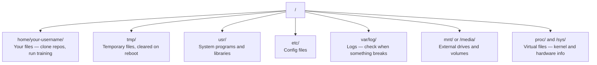

# Linux pour l'IA

> La plupart des IA fonctionnent sur Linux. Vous devez en savoir assez pour ne pas être coincé.

**Type:** Learn
**Languages:** --
**Prerequisites:** Phase 0, Lesson 01
**Time:** ~30 minutes

## Objectifs d'apprentissage

- Naviguez le système de fichiers Linux et effectuez des opérations de fichiers essentielles à partir de la ligne de commande
- Gérer les autorisations de fichier avec `chmod`et `chown`pour résoudre les erreurs "Permission refusée"
- Installez des paquets système avec `apt`et mettre en place une nouvelle boîte de GPU pour le travail de l'IA
- Identifier les différences entre macOS et Linux qui font souvent trébucher les développeurs travaillant sur des machines distantes

## Le problème

Vous développez sur macOS ou Windows. Mais dès que vous mettez un SSH dans une boîte de GPU en nuage, louez une instance Lambda, ou mettez en place une machine EC2, vous atterrissez dans Ubuntu. Le terminal est votre seule interface. Il n'y a pas de Finder, pas d'Explorateur, pas d'interface graphique. Si vous ne pouvez pas naviguer dans le système de fichiers, installer des paquets et gérer les processus à partir de la ligne de commande, vous êtes bloqué à payer pour des heures de GPU en déstabilisation pendant que vous recherchez "comment déchiffrer un fichier dans Linux".

Ceci est un guide de survie. Il couvre exactement ce dont vous avez besoin pour fonctionner sur une machine Linux distante pour le travail de l'IA.

## Layout du système de fichiers

Linux organise tout sous une seule racine `/`Il n' y en a pas .`C:\`ou `/Volumes`Les annuaires que vous toucherez:



Votre répertoire de domicile est `~`ou `/home/your-username`Presque tout ce que vous faites se passe ici.

## Commandements essentiels

Ce sont les 15 commandes qui couvrent 95% de ce que vous ferez sur une boîte de GPU à distance.

### Les déplacements

```bash
pwd                         # Where am I?
ls                          # What's here?
ls -la                      # What's here, including hidden files with details?
cd /path/to/dir             # Go there
cd ~                        # Go home
cd ..                       # Go up one level
```

### Fichiers et annuaires

```bash
mkdir my-project            # Create a directory
mkdir -p a/b/c              # Create nested directories in one shot

cp file.txt backup.txt      # Copy a file
cp -r src/ src-backup/      # Copy a directory (recursive)

mv old.txt new.txt          # Rename a file
mv file.txt /tmp/           # Move a file

rm file.txt                 # Delete a file (no trash, it's gone)
rm -rf my-dir/              # Delete a directory and everything inside
```

`rm -rf`Il n'y a pas de révocation.

### Lire les fichiers

```bash
cat file.txt                # Print entire file
head -20 file.txt           # First 20 lines
tail -20 file.txt           # Last 20 lines
tail -f log.txt             # Follow a log file in real time (Ctrl+C to stop)
less file.txt               # Scroll through a file (q to quit)
```

### La recherche

```bash
grep "error" training.log           # Find lines containing "error"
grep -r "learning_rate" .           # Search all files in current directory
grep -i "cuda" config.yaml          # Case-insensitive search

find . -name "*.py"                 # Find all Python files under current dir
find . -name "*.ckpt" -size +1G     # Find checkpoint files larger than 1GB
```

## Autorisations

Chaque fichier de Linux a un propriétaire et des permissions, vous allez vous retrouver là-bas quand les scripts ne s'exécutent pas ou vous ne pouvez pas écrire dans un répertoire.

```bash
ls -l train.py
# -rwxr-xr-- 1 user group 2048 Mar 19 10:00 train.py
#  ^^^             owner permissions: read, write, execute
#     ^^^          group permissions: read, execute
#        ^^        everyone else: read only
```

Réparations communes:

```bash
chmod +x train.sh           # Make a script executable
chmod 755 deploy.sh         # Owner: full, others: read+execute
chmod 644 config.yaml       # Owner: read+write, others: read only

chown user:group file.txt   # Change who owns a file (needs sudo)
```

Quand quelque chose dit "permission refusée", c'est presque toujours une question de permissions. `chmod +x`ou `sudo`Il va régler la plupart des affaires.

## Gestion des colis (adaptation)

Ubuntu utilise `apt`C'est comme ça que l'on installe un logiciel au niveau du système.

```bash
sudo apt update             # Refresh the package list (always do this first)
sudo apt install -y htop    # Install a package (-y skips confirmation)
sudo apt install -y build-essential  # C compiler, make, etc. Needed by many Python packages
sudo apt install -y tmux    # Terminal multiplexer (keep sessions alive after disconnect)

apt list --installed        # What's installed?
sudo apt remove htop        # Uninstall
```

Les paquets communs que vous installeriez sur une boîte de GPU fraîche:

```bash
sudo apt update && sudo apt install -y \
    build-essential \
    git \
    curl \
    wget \
    tmux \
    htop \
    unzip \
    python3-venv
```

## Utilisateurs et sudo

Vous êtes habituellement connecté en tant qu'utilisateur régulier. Certaines opérations nécessitent un accès root (admin).

```bash
whoami                      # What user am I?
sudo command                # Run a single command as root
sudo su                     # Become root (exit to go back, use sparingly)
```

Dans les instances de GPU cloud, vous êtes généralement le seul utilisateur et avez déjà accès à sudo. Ne pas tout exécuter comme root. Utilisez sudo seulement lorsque nécessaire.

## Processus et systèmes

Quand votre entraînement est suspendu, ou vous devez vérifier ce qui se passe:

```bash
htop                        # Interactive process viewer (q to quit)
ps aux | grep python        # Find running Python processes
kill 12345                  # Gracefully stop process with PID 12345
kill -9 12345               # Force kill (use when graceful doesn't work)
nvidia-smi                  # GPU processes and memory usage
```

systèmed gère les services (daimons de fond). Vous l'utiliserez si vous exécutez des serveurs d'inférence:

```bash
sudo systemctl start nginx          # Start a service
sudo systemctl stop nginx           # Stop it
sudo systemctl restart nginx        # Restart it
sudo systemctl status nginx         # Check if it's running
sudo systemctl enable nginx         # Start automatically on boot
```

## Espace disque

Les boîtes GPU ont souvent un espace disque limité.

```bash
df -h                       # Disk usage for all mounted drives
df -h /home                 # Disk usage for /home specifically

du -sh *                    # Size of each item in current directory
du -sh ~/.cache             # Size of your cache (pip, huggingface models land here)
du -sh /data/checkpoints/   # Check how big your checkpoints are

# Find the biggest space hogs
du -h --max-depth=1 / 2>/dev/null | sort -hr | head -20
```

Économiseurs d'espace communs:

```bash
# Clear pip cache
pip cache purge

# Clear apt cache
sudo apt clean

# Remove old checkpoints you don't need
rm -rf checkpoints/epoch_01/ checkpoints/epoch_02/
```

## Réseaux

Vous téléchargerez des modèles, transférerez des fichiers et saisirez les API à partir de la ligne de commande.

```bash
# Download files
wget https://example.com/model.bin                   # Download a file
curl -O https://example.com/data.tar.gz              # Same thing with curl
curl -s https://api.example.com/health | python3 -m json.tool  # Hit an API, pretty-print JSON

# Transfer files between machines
scp model.bin user@remote:/data/                     # Copy file to remote machine
scp user@remote:/data/results.csv .                  # Copy file from remote to local
scp -r user@remote:/data/checkpoints/ ./local-dir/   # Copy directory

# Sync directories (faster than scp for large transfers, resumes on failure)
rsync -avz --progress ./data/ user@remote:/data/
rsync -avz --progress user@remote:/results/ ./results/
```

Utilisation `rsync`- Je suis passé .`scp`Il ne transfère que des octets modifiés et gère les connexions interrompues.

## Gardez les séances en vie

Quand vous mettez votre ordinateur portable dans une boîte à distance, fermer votre ordinateur portable tue votre course d'entraînement.

```bash
tmux new -s train           # Start a new session named "train"
# ... start your training, then:
# Ctrl+B, then D            # Detach (training keeps running)

tmux ls                     # List sessions
tmux attach -t train        # Reattach to session

# Inside tmux:
# Ctrl+B, then %            # Split pane vertically
# Ctrl+B, then "            # Split pane horizontally
# Ctrl+B, then arrow keys   # Switch between panes
```

Il y a toujours des longs trains à l'intérieur de la machine.

## WSL2 pour les utilisateurs de Windows

Si vous utilisez Windows, WSL2 vous donne un véritable environnement Linux sans double démarrage.

```bash
# In PowerShell (admin)
wsl --install -d Ubuntu-24.04

# After restart, open Ubuntu from Start menu
sudo apt update && sudo apt upgrade -y
```

WSL2 fonctionne avec un véritable noyau Linux. Tout ce qui est dans cette leçon fonctionne à l'intérieur.`/mnt/c/Users/YourName/`de l'intérieur de la WSL.

Le GPU passe par le biais de fonctionne avec les pilotes NVIDIA installés sur le côté Windows. Installez le pilote NVIDIA Windows (pas le Linux), et CUDA sera disponible à l'intérieur de WSL2.

## Gotschas: macOS à Linux

Des choses qui vous étonneront si vous venez de macOS:

| macOS | Linux | Notes |
|-------|-------|-------|
| `brew install` | `sudo apt install` | Different package names sometimes. `brew install htop` vs `sudo apt install htop` works the same, but `brew install readline` vs `sudo apt install libreadline-dev` does not. |
| `open file.txt` | `xdg-open file.txt` | But you won't have a GUI on a remote box. Use `cat` or `less`. |
| `pbcopy` / `pbpaste` | Not available | Pipe to/from clipboard doesn't exist over SSH. |
| `~/.zshrc` | `~/.bashrc` | macOS defaults to zsh. Most Linux servers use bash. |
| `/opt/homebrew/` | `/usr/bin/`, `/usr/local/bin/` | Binaries live in different places. |
| `sed -i '' 's/a/b/' file` | `sed -i 's/a/b/' file` | macOS sed needs an empty string after `-i`. Linux does not. |
| Case-insensitive filesystem | Case-sensitive filesystem | `Model.py` and `model.py` are two different files on Linux. |
| Line endings `\n` | Line endings `\n` | Same. But Windows uses `\r\n`, which breaks bash scripts. Run `dos2unix` to fix. |

## Carte de référence rapide

```
Navigation:     pwd, ls, cd, find
Files:          cp, mv, rm, mkdir, cat, head, tail, less
Search:         grep, find
Permissions:    chmod, chown, sudo
Packages:       apt update, apt install
Processes:      htop, ps, kill, nvidia-smi
Services:       systemctl start/stop/restart/status
Disk:           df -h, du -sh
Network:        curl, wget, scp, rsync
Sessions:       tmux new/attach/detach
```

```figure
s0-process-fork
```

## Exercices

1. SSH dans n'importe quelle machine Linux (ou ouvrir WSL2) et naviguer vers votre répertoire d'accueil.`touch`, puis lister avec `ls -la`- Je suis désolé .
2. Installez`htop`avec apt, l'exécuter, et identifier le processus qui utilise le plus de mémoire.
3. Commencez une séance de tmux, courez `sleep 300`à l'intérieur, détachement, liste des sessions, et reattacher.
4. Utilisation `df -h`pour vérifier l'espace disque disponible, puis utiliser `du -sh ~/.cache/*`pour trouver ce qui occupe de l'espace dans votre cache.
5. Transférer un fichier de votre machine locale à une machine à distance en utilisant `scp`, puis faites le même transfert avec `rsync`et comparer l'expérience.
