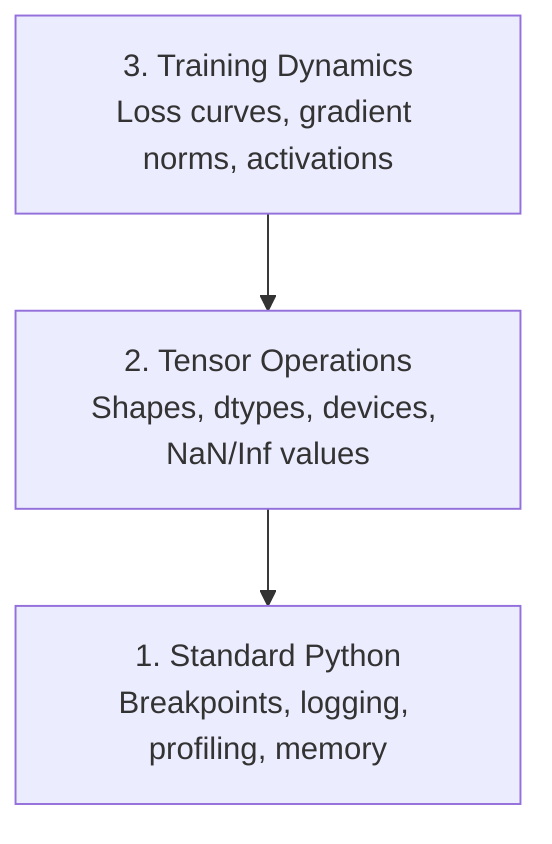

# Débug et profilage

> Les pires insectes d'IA ne s'écrasent pas, ils s'entraînent silencieusement sur les ordures et rapportent une belle courbe de perte.

**Type:** Build
**Language:**Python
**Prerequisites:** Lesson 1 (Dev Environment), basic PyTorch familiarity
**Time:** ~60 minutes

## Objectifs d'apprentissage

- Utilisez conditionné `breakpoint()`et `debug_print`pour inspecter les formes, les types et les valeurs de NaN des tensors au milieu de la formation
- Profil des boucles d' entraînement avec `cProfile`- Je suis là .`line_profiler`, et `tracemalloc`pour trouver des goulots d'étranglement
- Détecter les bugs d'IA courants: déséquilibres de forme, perte de NaN, fuite de données et tenseurs de mauvais appareil
- Configurez TensorBoard pour visualiser les courbes de perte, les histogrammes de poids et les distributions de gradients

## Le problème

Un logiciel Web s'écrase avec une trace de pile. Une boucle de formation mal configurée fonctionne pendant 8 heures, brûle 200 $ en temps de GPU et produit un modèle qui prédit la moyenne de chaque entrée. Le code ne fait jamais d'erreur. Le bug était un tensor sur le mauvais appareil, un oublié.`.detach()`, ou des étiquettes qui se détachent des caractéristiques.

Vous avez besoin d'outils de débogage qui détectent ces défaillances silencieuses avant qu'elles ne vous perdent votre temps et votre calcul.

## Le concept

L'IA débogage fonctionne à trois niveaux:



La plupart des gens sautent directement au niveau 3 (en regardant TensorBoard). Mais 80% des bugs d'IA vivent aux niveaux 1 et 2.

```figure
s0-flame-hot
```

## Faites-le

### Partie 1: Débogage de l'impression (Oui, cela fonctionne)

Pour le code tensor, une déclaration d'impression ciblée vaut mieux que de passer par un débogageur parce que vous devez voir les formes, les types et les gammes de valeurs à la fois.

```python
def debug_print(name, tensor):
    print(f"{name}: shape={tensor.shape}, dtype={tensor.dtype}, "
          f"device={tensor.device}, "
          f"min={tensor.min().item():.4f}, max={tensor.max().item():.4f}, "
          f"mean={tensor.mean().item():.4f}, "
          f"has_nan={tensor.isnan().any().item()}")
```

Appelle-moi après chaque opération suspecte, et quand le bug sera trouvé, retire les empreintes.

### Partie 2: Débogage Python (pdb et point de rupture)

Le débogageur intégré est sous-estimé pour le travail de l'IA.`breakpoint()`dans votre boucle d'entraînement et inspecter les tensors de manière interactive.

```python
def training_step(model, batch, criterion, optimizer):
    inputs, labels = batch
    outputs = model(inputs)
    loss = criterion(outputs, labels)

    if loss.item() > 100 or torch.isnan(loss):
        breakpoint()

    loss.backward()
    optimizer.step()
```

Quand le débogageur vous laisse entrer, des commandes utiles:

- `p outputs.shape`pour vérifier les formes
- `p loss.item()`pour voir la valeur de perte
- `p torch.isnan(outputs).sum()`pour compter les NAN
- `p model.fc1.weight.grad`pour vérifier les gradients
- `c`pour continuer, `q`de démissionner

C'est un débogage conditionnel, on arrête seulement quand quelque chose semble mal, pour une course d'entraînement de 10 000 étapes, ça compte.

### Partie 3: Logging Python

Remplacez les déclarations d'impression par des enregistrements lorsque votre débogage dépasse une vérification rapide.

```python
import logging

logging.basicConfig(
    level=logging.INFO,
    format="%(asctime)s [%(levelname)s] %(message)s",
    handlers=[
        logging.FileHandler("training.log"),
        logging.StreamHandler()
    ]
)
logger = logging.getLogger(__name__)

logger.info("Starting training: lr=%.4f, batch_size=%d", lr, batch_size)
logger.warning("Loss spike detected: %.4f at step %d", loss.item(), step)
logger.error("NaN loss at step %d, stopping", step)
```

La saisie vous donne des timestamps, des niveaux de gravité et des sorties de fichiers. Quand une course d'entraînement échoue à 3 heures du matin, vous voulez un fichier de journaux, pas une sortie du terminal qui a déroulé hors de l'écran.

### Partie 4: Sections de code de délais

Savoir où va le temps est la première étape vers l'optimisation.

```python
import time

class Timer:
    def __init__(self, name=""):
        self.name = name

    def __enter__(self):
        self.start = time.perf_counter()
        return self

    def __exit__(self, *args):
        elapsed = time.perf_counter() - self.start
        print(f"[{self.name}] {elapsed:.4f}s")

with Timer("data loading"):
    batch = next(dataloader_iter)

with Timer("forward pass"):
    outputs = model(batch)

with Timer("backward pass"):
    loss.backward()
```

Les données sont chargées en 60% du temps de formation.`num_workers > 0`dans votre DataLoader, pas un GPU plus rapide.

### Partie 5: cProfil et ligne_profiler

Lorsque vous avez besoin de plus que des temporisateurs manuels:

```bash
python -m cProfile -s cumtime train.py
```

Ceci montre chaque appel de fonction trié par temps cumulé.

```bash
pip install line_profiler
```

```python
@profile
def train_step(model, data, target):
    output = model(data)
    loss = F.cross_entropy(output, target)
    loss.backward()
    return loss

# Run with: kernprof -l -v train.py
```

### Partie 6: Profilisation de la mémoire

#### Mémoire de processeur avec tracemalloc

```python
import tracemalloc

tracemalloc.start()

# your code here
model = build_model()
data = load_dataset()

snapshot = tracemalloc.take_snapshot()
top_stats = snapshot.statistics("lineno")
for stat in top_stats[:10]:
    print(stat)
```

#### Mémoire du processeur avec le profil de mémoire

```bash
pip install memory_profiler
```

```python
from memory_profiler import profile

@profile
def load_data():
    raw = read_csv("data.csv")       # watch memory jump here
    processed = preprocess(raw)       # and here
    return processed
```

Courez avec `python -m memory_profiler your_script.py`pour voir l'utilisation de la mémoire ligne par ligne.

#### Mémoire GPU avec PyTorch

```python
import torch

if torch.cuda.is_available():
    print(torch.cuda.memory_summary())

    print(f"Allocated: {torch.cuda.memory_allocated() / 1e9:.2f} GB")
    print(f"Cached: {torch.cuda.memory_reserved() / 1e9:.2f} GB")
```

Lorsque vous appuyez sur OOM (Out of Memory):

1. Réduire la taille du lot (dans la première tentative, toujours)
2. Utilisation `torch.cuda.empty_cache()`pour libérer la mémoire en cache
3. Utilisation `del tensor`suivie de `torch.cuda.empty_cache()`pour les grands intermédiaires
4. Utiliser une précision mixte (`torch.cuda.amp`) pour réduire de moitié la consommation de mémoire
5. Utiliser la vérification des gradients pour les modèles très profonds

### Partie 7: Les insectes d'IA courants et comment les attraper

#### Des écarts de forme

Le plus fréquent bug.`[batch, features]`lorsque le modèle s' attend `[batch, channels, height, width]`- Je suis désolé .

```python
def check_shapes(model, sample_input):
    print(f"Input: {sample_input.shape}")
    hooks = []

    def make_hook(name):
        def hook(module, inp, out):
            in_shape = inp[0].shape if isinstance(inp, tuple) else inp.shape
            out_shape = out.shape if hasattr(out, "shape") else type(out)
            print(f"  {name}: {in_shape} -> {out_shape}")
        return hook

    for name, module in model.named_modules():
        hooks.append(module.register_forward_hook(make_hook(name)))

    with torch.no_grad():
        model(sample_input)

    for h in hooks:
        h.remove()
```

Faites-le une fois avec un échantillon, il trace chaque transformation de forme dans votre modèle.

#### Perte de la valeur

La perte de NaN signifie quelque chose qui a explosé.

- Taux d'apprentissage trop élevé
- Divisions par zéro en pertes douanières
- Logique de zéro ou de nombre négatif
- Gradients explosants dans les RNN

```python
def detect_nan(model, loss, step):
    if torch.isnan(loss):
        print(f"NaN loss at step {step}")
        for name, param in model.named_parameters():
            if param.grad is not None:
                if torch.isnan(param.grad).any():
                    print(f"  NaN gradient in {name}")
                if torch.isinf(param.grad).any():
                    print(f"  Inf gradient in {name}")
        return True
    return False
```

#### Fuite de données

Votre modèle a une précision de 99% sur le plateau de test.

```python
def check_data_leakage(train_set, test_set, id_column="id"):
    train_ids = set(train_set[id_column].tolist())
    test_ids = set(test_set[id_column].tolist())
    overlap = train_ids & test_ids
    if overlap:
        print(f"DATA LEAKAGE: {len(overlap)} samples in both train and test")
        return True
    return False
```

Vérifiez également la fuite temporelle: en utilisant des données futures pour prédire le passé.

#### Faute de dispositif

Les tensors sur différents appareils (CPU vs GPU) causent des erreurs de fonctionnement. Mais parfois un tensor reste silencieux sur le CPU pendant que tout le reste est sur le GPU, et l'entraînement fonctionne lentement.

```python
def check_devices(model, *tensors):
    model_device = next(model.parameters()).device
    print(f"Model device: {model_device}")
    for i, t in enumerate(tensors):
        if t.device != model_device:
            print(f"  WARNING: tensor {i} on {t.device}, model on {model_device}")
```

### Partie 8: Les bases de la table à tensions

Le TensorBoard vous montre ce qui se passe à l'intérieur de l'entraînement au fil du temps.

```bash
pip install tensorboard
```

```python
from torch.utils.tensorboard import SummaryWriter

writer = SummaryWriter("runs/experiment_1")

for step in range(num_steps):
    loss = train_step(model, batch)

    writer.add_scalar("loss/train", loss.item(), step)
    writer.add_scalar("lr", optimizer.param_groups[0]["lr"], step)

    if step % 100 == 0:
        for name, param in model.named_parameters():
            writer.add_histogram(f"weights/{name}", param, step)
            if param.grad is not None:
                writer.add_histogram(f"grads/{name}", param.grad, step)

writer.close()
```

Lancez-le !

```bash
tensorboard --logdir=runs
```

À quoi chercher:

- **Loss not decreasing**: taux d'apprentissage trop bas ou problème d'architecture de modèle
- **Loss oscillating wildly**: taux d'apprentissage trop élevé
- **Loss goes to NaN**: Instabilité numérique (voir la section NaN ci-dessus)
- **Train loss decreasing, val loss increasing**: surmontant
- **Weight histograms collapsing to zero**: dégradations qui disparaissent
- **Gradient histograms exploding**: besoin de coupe de gradient

### Partie 9: Débugger de code VS

Pour le débogage interactif, configurer le code VS avec un `launch.json`- Le numéro de la liste:

```json
{
    "version": "0.2.0",
    "configurations": [
        {
            "name": "Debug Training",
            "type": "debugpy",
            "request": "launch",
            "program": "${file}",
            "console": "integratedTerminal",
            "justMyCode": false
        }
    ]
}
```

Définir les points de rupture en cliquant sur la goutte. Utilisez le volet variables pour inspecter les propriétés du tensor. La console de débogage vous permet d'exécuter des expressions Python arbitraires au milieu de l'exécution.

Utilisée pour passer par des pipelines de pré-traitement des données où vous voulez voir chaque transformation.

## Utilisez-le

Voici le débogage du flux de travail qui capture la plupart des bugs de l'IA:

1. **Before training**Retour`check_shapes`avec un lot d'échantillon. vérifier que les dimensions d'entrée et de sortie correspondent aux attentes.
2. **First 10 steps**Utilisation `debug_print`Confirmez que rien n'est NaN et que les valeurs sont dans des intervalles raisonnables.
3. **During training**: Perte de journaux, taux d'apprentissage et normes de gradients. Utilisez TensorBoard pour la visualisation.
4. **When something breaks**Laissez tomber .`breakpoint()`- En cas de défaillance, inspectez les tensors.
5. **For performance**Le temps de chargement des données versus l'avant vers l'arrière passe.

## La faire partir

Exécutez le script de débogage:

```bash
python phases/00-setup-and-tooling/12-debugging-and-profiling/code/debug_tools.py
```

Regardez !`outputs/prompt-debug-ai-code.md`pour une demande qui aide à diagnostiquer des bugs spécifiques à l'IA.

## Exercices

1. On court .`debug_tools.py`Modifiez le modèle de mannequin pour introduire un NaN (indice: divisez par zéro dans le passage avant) et regardez le détecteur le capturer.
2. Profiler une boucle d' entraînement avec `cProfile`et identifier la fonction la plus lente.
3. Utilisation `tracemalloc`pour trouver quelle ligne de votre pipeline de chargement de données alloue le plus de mémoire.
4. Configurez TensorBoard pour une simple séance d'entraînement et identifiez si le modèle est trop adapté.
5. Utilisation `breakpoint()`Pratiquez l'inspection des formes, des dispositifs et des valeurs de gradient du débogageur.
