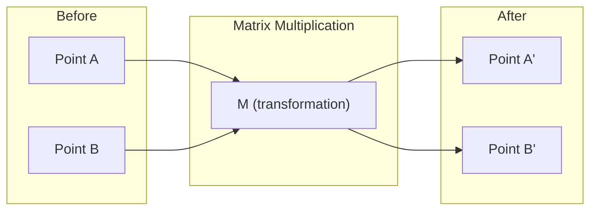
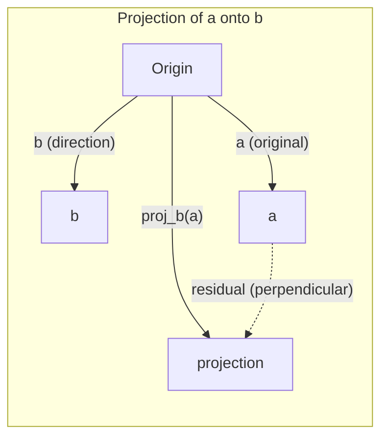

# L'intuition de l'algèbre linéaire

> Chaque modèle d'IA est juste mathématiques de matrice portant un chapeau chic.

**Type:** Learn
**Languages:** Python, Julia
**Prerequisites:** Phase 0
**Time:** ~60 minutes

## Objectifs d'apprentissage

- Implémenter les opérations vectorielles et matricielles (addition, produit de point, multiplication de matrice) à partir de zéro en Python
- Expliquer géométriquement ce que font le produit des points, la projection et le processus Gram-Schmidt
- Déterminez l'indépendance linéaire, le rang et la base d'un ensemble de vecteurs en utilisant la réduction de rang
- Connectez les concepts d'algèbre linéaire à leurs applications d'IA: intégrations, scores d'attention et LoRA

## Le problème

Ouvrez n'importe quel document ML. Dans la première page, vous verrez des vecteurs, des matrices, des produits de points et des transformations. Sans l'intuition de l'algèbre linéaire, ce ne sont que des symboles. Avec elle, vous pouvez voir ce qu'un réseau neural fait réellement - déplacer des points dans l'espace.

Vous n'avez pas besoin d'être mathématicien, vous devez voir ce que ces opérations signifient géométriquement, puis les coder vous-même.

## Le concept

### Les vecteurs sont des points (et des directions)

Un vecteur est juste une liste de nombres. Mais ces nombres signifient quelque chose -- ce sont des coordonnées dans l'espace.

**2D vector [3, 2]:**

| x | y | Point |
|---|---|-------|
| 3 | 2 | The vector points from origin (0,0) to (3, 2) on the plane |

Le vecteur a une magnitude carré ((3^2 + 2^2) = carré ((13) et pointe vers le haut et à droite.

Dans l'IA, les vecteurs représentent tout:
- Un mot → un vecteur de 768 nombres (son "signe" dans l'espace d'intégration)
- Une image → un vecteur de millions de valeurs de pixels
- Un utilisateur → un vecteur de préférences

### Les matrices sont des transformations

Une matrice transforme un vecteur en un autre.



Dans l'IA, les matrices sont le modèle:
- Poids de réseau neuronal → matrices qui transforment les entrées en sorties
- Points d'attention → matrices qui décident de ce sur quoi se concentrer
- Embeddings → matrices qui cartographient les mots en vecteurs

### Les mesures de produit dot sont similaires

Le produit des points de deux vecteurs vous indique à quel point ils sont similaires.

```
a · b = a₁×b₁ + a₂×b₂ + ... + aₙ×bₙ

Same direction:      a · b > 0  (similar)
Perpendicular:       a · b = 0  (unrelated)
Opposite direction:  a · b < 0  (dissimilar)
```

C'est littéralement ainsi que les moteurs de recherche, les systèmes de recommandation et RAG fonctionnent: trouver des vecteurs avec des produits à haute fréquence.

### Indépendance linéaire

Les vecteurs sont linéairement indépendants si aucun vecteur dans l'ensemble ne peut être écrit comme une combinaison des autres. Si v1, v2, v3 sont indépendants, ils couvrent un espace 3D. Si l'un est une combinaison des autres, ils couvrent seulement un plan.

Pourquoi cela importe pour l'IA: votre matrice de caractéristiques devrait avoir des colonnes linéairement indépendantes. Si deux caractéristiques sont parfaitement corrélées (linéairement dépendantes), le modèle ne peut pas distinguer leurs effets. Cela provoque une multicollinéarité en régression - la matrice de poids devient instable, et de petites modifications d'entrée produisent des oscillations de sortie sauvages.

**Concrete example:**

```
v1 = [1, 0, 0]
v2 = [0, 1, 0]
v3 = [2, 1, 0]   # v3 = 2*v1 + v2
```

v1 et v2 sont indépendants - ni un multiple escalier ni une combinaison de l'autre. Mais v3 = 2 * v1 + v2, donc {v1, v2, v3} est un ensemble dépendant. Ces trois vecteurs sont tous situés dans le plan xy. Peu importe comment vous les combinez, vous ne pouvez pas atteindre [0, 0, 1]. Vous avez trois vecteurs mais seulement deux dimensions de liberté.

Dans un ensemble de données: si feature_3 = 2*feature_1 + feature_2, l'ajout de feature_3 donne au modèle zéro nouvelles informations. Pire encore, il rend les équations normales singulières - il n'y a pas de solution unique pour les poids.

### Base et rang

Une base est un ensemble minimal de vecteurs indépendants linéairement qui couvrent l'ensemble de l'espace.

La base standard pour l'espace 3D est {[1,0,0], [0,1,0], [0,0,1]}. Mais n'importe quel vecteur indépendant en 3D forme une base valide.

Rangoir d'une matrice = nombre de colonnes linéairement indépendantes = nombre de lignes linéairement indépendantes. Si le rang < min(lignes, colons), la matrice est déficient de rang.
- Le système a infiniment de solutions (ou pas)
- L'information est perdue dans la transformation
- La matrice ne peut pas être inversée

| Situation | Rank | What it means for ML |
|-----------|------|---------------------|
| Full rank (rank = min(m, n)) | Maximum possible | Unique least-squares solution exists. Model is well-conditioned. |
| Rank deficient (rank < min(m, n)) | Below maximum | Features are redundant. Infinitely many weight solutions. Regularization needed. |
| Rank 1 | 1 | Every column is a scaled copy of one vector. All data lies on a line. |
| Near rank-deficient (small singular values) | Numerically low | Matrix is ill-conditioned. Tiny input noise causes large output changes. Use SVD truncation or ridge regression. |

### Projection

Vecteur de projection **a**sur le vecteur **b**donne la composante de **a**dans la direction de **b**- Le numéro de la liste:

```
proj_b(a) = (a dot b / b dot b) * b
```

Le résidu (a - proj_b(a)) est perpendiculaire à b. Cette décomposition orthogonale est la base de l'ajustement des carrés les plus faibles.

La projection est partout dans ML:
- La régression linéaire réduit au minimum la distance entre les observations et l'espace de colonne - la solution est une projection
- PCA projette des données sur les directions de variance maximale
- L'attention dans les transformateurs compute les projections des requêtes sur les touches



**Example:**a = [3, 4], b = [1, 0]

Le nombre de points de référence est le nombre de points de référence.

La projection fait tomber la composante y. C'est la réduction de dimensionnalité sous sa forme la plus simple -- jeter les directions qui ne vous intéressent pas.

### Processus Gram-Schmidt

Convertir n'importe quel ensemble de vecteurs indépendants en une base orthonormale.

L' algorithme:
1. Prenez le premier vecteur, normaliser
2. Prenez le deuxième vecteur, soustraire sa projection sur le premier, normaliser
3. Prenez le troisième vecteur, soustraire ses projections sur tous les vecteurs précédents, normaliser
4. Répétez pour les vecteurs restants

```
Input:  v1, v2, v3, ... (linearly independent)

u1 = v1 / |v1|

w2 = v2 - (v2 dot u1) * u1
u2 = w2 / |w2|

w3 = v3 - (v3 dot u1) * u1 - (v3 dot u2) * u2
u3 = w3 / |w3|

Output: u1, u2, u3, ... (orthonormal basis)
```

C'est ainsi que la décomposition QR fonctionne en interne. Q est la base orthonormale, R capture les coefficients de projection.
- Résolution des systèmes linéaires (plus stables que l'élimination gaussienne)
- Compteur des valeurs propres (algorithme de RQ)
- Régrésion des carrés minimaux (méthode numérique standard)

```figure
eigen-directions
```

## Faites-le

### Étape 1: Vecteurs à partir de zéro (Python)

```python
class Vector:
    def __init__(self, components):
        self.components = list(components)
        self.dim = len(self.components)

    def __add__(self, other):
        return Vector([a + b for a, b in zip(self.components, other.components)])

    def __sub__(self, other):
        return Vector([a - b for a, b in zip(self.components, other.components)])

    def dot(self, other):
        return sum(a * b for a, b in zip(self.components, other.components))

    def magnitude(self):
        return sum(x**2 for x in self.components) ** 0.5

    def normalize(self):
        mag = self.magnitude()
        return Vector([x / mag for x in self.components])

    def cosine_similarity(self, other):
        return self.dot(other) / (self.magnitude() * other.magnitude())

    def __repr__(self):
        return f"Vector({self.components})"


a = Vector([1, 2, 3])
b = Vector([4, 5, 6])

print(f"a + b = {a + b}")
print(f"a · b = {a.dot(b)}")
print(f"|a| = {a.magnitude():.4f}")
print(f"cosine similarity = {a.cosine_similarity(b):.4f}")
```

### Étape 2: Matrices à partir de zéro (Python)

```python
class Matrix:
    def __init__(self, rows):
        self.rows = [list(row) for row in rows]
        self.shape = (len(self.rows), len(self.rows[0]))

    def __matmul__(self, other):
        if isinstance(other, Vector):
            return Vector([
                sum(self.rows[i][j] * other.components[j] for j in range(self.shape[1]))
                for i in range(self.shape[0])
            ])
        rows = []
        for i in range(self.shape[0]):
            row = []
            for j in range(other.shape[1]):
                row.append(sum(
                    self.rows[i][k] * other.rows[k][j]
                    for k in range(self.shape[1])
                ))
            rows.append(row)
        return Matrix(rows)

    def transpose(self):
        return Matrix([
            [self.rows[j][i] for j in range(self.shape[0])]
            for i in range(self.shape[1])
        ])

    def __repr__(self):
        return f"Matrix({self.rows})"


rotation_90 = Matrix([[0, -1], [1, 0]])
point = Vector([3, 1])

rotated = rotation_90 @ point
print(f"Original: {point}")
print(f"Rotated 90°: {rotated}")
```

### Étape 3: Pourquoi cela importe pour l'IA

```python
import random

random.seed(42)
weights = Matrix([[random.gauss(0, 0.1) for _ in range(3)] for _ in range(2)])
input_vector = Vector([1.0, 0.5, -0.3])

output = weights @ input_vector
print(f"Input (3D): {input_vector}")
print(f"Output (2D): {output}")
print("This is what a neural network layer does -- matrix multiplication.")
```

### Étape 4: version Julia

```julia
a = [1.0, 2.0, 3.0]
b = [4.0, 5.0, 6.0]

println("a + b = ", a + b)
println("a · b = ", a ⋅ b)       # Julia supports unicode operators
println("|a| = ", √(a ⋅ a))
println("cosine = ", (a ⋅ b) / (√(a ⋅ a) * √(b ⋅ b)))

# Matrix-vector multiplication
W = [0.1 -0.2 0.3; 0.4 0.5 -0.1]
x = [1.0, 0.5, -0.3]
println("Wx = ", W * x)
println("This is a neural network layer.")
```

### Étape 5: Indépendance linéaire et projection à partir de zéro (Python)

```python
def is_linearly_independent(vectors):
    n = len(vectors)
    dim = len(vectors[0].components)
    mat = Matrix([v.components[:] for v in vectors])
    rows = [row[:] for row in mat.rows]
    rank = 0
    for col in range(dim):
        pivot = None
        for row in range(rank, len(rows)):
            if abs(rows[row][col]) > 1e-10:
                pivot = row
                break
        if pivot is None:
            continue
        rows[rank], rows[pivot] = rows[pivot], rows[rank]
        scale = rows[rank][col]
        rows[rank] = [x / scale for x in rows[rank]]
        for row in range(len(rows)):
            if row != rank and abs(rows[row][col]) > 1e-10:
                factor = rows[row][col]
                rows[row] = [rows[row][j] - factor * rows[rank][j] for j in range(dim)]
        rank += 1
    return rank == n


def project(a, b):
    scalar = a.dot(b) / b.dot(b)
    return Vector([scalar * x for x in b.components])


def gram_schmidt(vectors):
    orthonormal = []
    for v in vectors:
        w = v
        for u in orthonormal:
            proj = project(w, u)
            w = w - proj
        if w.magnitude() < 1e-10:
            continue
        orthonormal.append(w.normalize())
    return orthonormal


v1 = Vector([1, 0, 0])
v2 = Vector([1, 1, 0])
v3 = Vector([1, 1, 1])
basis = gram_schmidt([v1, v2, v3])
for i, u in enumerate(basis):
    print(f"u{i+1} = {u}")
    print(f"  |u{i+1}| = {u.magnitude():.6f}")

print(f"u1 · u2 = {basis[0].dot(basis[1]):.6f}")
print(f"u1 · u3 = {basis[0].dot(basis[2]):.6f}")
print(f"u2 · u3 = {basis[1].dot(basis[2]):.6f}")
```

## Utilisez-le

Maintenant, la même chose avec NumPy -- ce que vous allez utiliser en pratique:

```python
import numpy as np

a = np.array([1, 2, 3], dtype=float)
b = np.array([4, 5, 6], dtype=float)

print(f"a + b = {a + b}")
print(f"a · b = {np.dot(a, b)}")
print(f"|a| = {np.linalg.norm(a):.4f}")
print(f"cosine = {np.dot(a, b) / (np.linalg.norm(a) * np.linalg.norm(b)):.4f}")

W = np.random.randn(2, 3) * 0.1
x = np.array([1.0, 0.5, -0.3])
print(f"Wx = {W @ x}")
```

### Rangour, projection et QR avec NumPy

```python
import numpy as np

A = np.array([[1, 2], [2, 4]])
print(f"Rank: {np.linalg.matrix_rank(A)}")

a = np.array([3, 4])
b = np.array([1, 0])
proj = (np.dot(a, b) / np.dot(b, b)) * b
print(f"Projection of {a} onto {b}: {proj}")

Q, R = np.linalg.qr(np.random.randn(3, 3))
print(f"Q is orthogonal: {np.allclose(Q @ Q.T, np.eye(3))}")
print(f"R is upper triangular: {np.allclose(R, np.triu(R))}")
```

### PyTorch -- Les tensors sont des vecteurs avec autodiff

```python
import torch

x = torch.randn(3, requires_grad=True)
y = torch.tensor([1.0, 0.0, 0.0])

similarity = torch.dot(x, y)
similarity.backward()

print(f"x = {x.data}")
print(f"y = {y.data}")
print(f"dot product = {similarity.item():.4f}")
print(f"d(dot)/dx = {x.grad}")
```

Le gradient du produit de la dot par rapport à x est juste y. PyTorch a calculé cela automatiquement. Chaque opération dans un réseau neural est construit à partir d'opérations comme celle-ci - les multiplicateurs de matrice, les produits de points, les projections - et les traces de gradients auto-différentes à travers tous.

Vous avez construit à partir de zéro ce que NumPy fait en une seule ligne.

## La faire partir

Cette leçon donne:
- `outputs/prompt-linear-algebra-tutor.md`-- une invitation pour les assistants d'IA à enseigner l'algèbre linéaire à travers l'intuition géométrique

## Les liens

Tout dans cette leçon se connecte à des parties spécifiques de l'IA moderne:

| Concept | Where it shows up |
|---------|------------------|
| Dot product | Attention scores in transformers, cosine similarity in RAG |
| Matrix multiply | Every neural network layer, every linear transformation |
| Linear independence | Feature selection, avoiding multicollinearity |
| Rank | Determining if a system is solvable, LoRA (low-rank adaptation) |
| Projection | Linear regression (projecting onto column space), PCA |
| Gram-Schmidt / QR | Numerical solvers, eigenvalue computation |
| Orthonormal basis | Stable numerical computation, whitening transforms |

LoRA mérite une mention spéciale. Il affinera les grands modèles linguistiques en décomposant les mises à jour de poids en matrices de bas rang. Au lieu de mettre à jour une matrice de poids 4096x4096 (16M paramètres), LoRA met à jour deux matrices de taille 4096x16 et 16x4096 (131K paramètres). La contrainte de rang 16 signifie que LoRA suppose que la mise à jour du poids vit dans un sous-espace 16 dimensions de l'espace complet 4096 dimensions. C'est l'algèbre linéaire qui fait du vrai travail.

## Exercices

1. Mise en œuvre `Vector.angle_between(other)`qui renvoie l'angle en degrés entre deux vecteurs
2. Créer une matrice d'échelle 2D qui double la coordonnée x et triple la coordonnée y, puis l'appliquer au vecteur [1, 1]
3. Compte tenu de 5 vecteurs aléatoires de type mot (dimension 50), trouvez les deux plus similaires en utilisant la similitude cosine
4. Vérifiez que la sortie Gram-Schmidt est vraiment orthonormale: vérifiez que chaque paire a un produit de point 0 et chaque vecteur a une magnitude 1
5. Créer une matrice 3x3 avec rang 2. Vérifiez en utilisant le `rank()`Expliquez ensuite quel objet géométrique les colonnes couvrent.
6. Le vecteur [1, 2, 3] est projeté sur [1, 1, 1].

## Les termes clés

| Term | What people say | What it actually means |
|------|----------------|----------------------|
| Vector | "An arrow" | A list of numbers representing a point or direction in n-dimensional space |
| Matrix | "A table of numbers" | A transformation that maps vectors from one space to another |
| Dot product | "Multiply and sum" | A measure of how aligned two vectors are -- the core of similarity search |
| Embedding | "Some AI magic" | A vector that represents the meaning of something (word, image, user) |
| Linear independence | "They don't overlap" | No vector in the set can be written as a combination of the others |
| Rank | "How many dimensions" | The number of linearly independent columns (or rows) in a matrix |
| Projection | "The shadow" | The component of one vector in the direction of another |
| Basis | "The coordinate axes" | A minimal set of independent vectors that span the space |
| Orthonormal | "Perpendicular unit vectors" | Vectors that are mutually perpendicular and each have length 1 |
