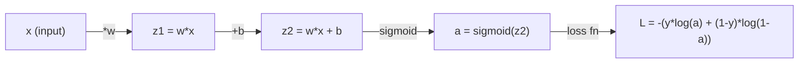
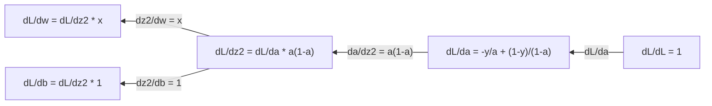
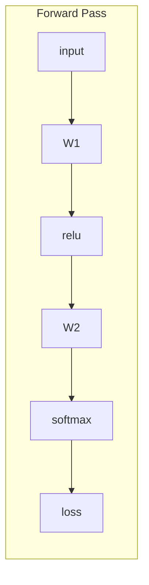
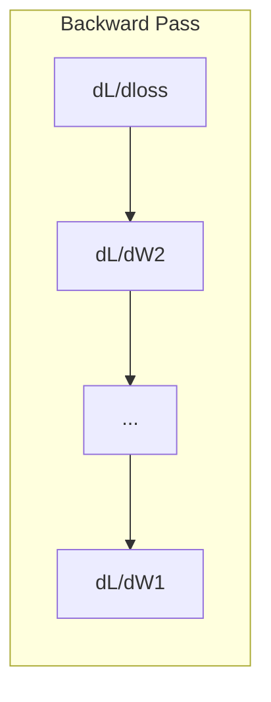

# Calcul pour l'apprentissage automatique

> Les dérivés vous indiquent la direction de la descente.

**Type:** Learn
**Language:**Python
**Prerequisites:** Phase 1, Lessons 01-03
**Time:** ~60 minutes

## Objectifs d'apprentissage

- Compute des dérivés numériques et analytiques pour les fonctions ML communes (x^2, sigmoïde, entropie croisée)
- Implémenter la descente de gradient à partir de zéro pour minimiser une fonction de perte en 1D et 2D
- Dériver le gradient d'un modèle de régression linéaire et le former par des mises à jour manuelles de poids
- Expliquer la matrice hessienne, les approximations de la série Taylor et leur lien avec les méthodes d'optimisation

## Le problème

Vous avez un réseau neuronal avec des millions de poids. Chaque poids est un bouton. Vous devez trouver dans quelle direction tourner chaque bouton pour rendre le modèle légèrement moins mal. Calculus vous donne cette direction.

Sans calcul, entraîner un réseau neural signifierait essayer des changements aléatoires et espérer le meilleur. Avec les dérivés, vous savez exactement comment chaque poids affecte l'erreur. Vous tournez chaque bouton dans la bonne direction, à chaque fois.

## Le concept

### Qu'est-ce qu'un dérivé ?

Une dérivée mesure le taux de changement. Pour une fonction y = f(x), la dérivée f'(x) vous dit: si vous poussez x par une petite quantité, combien y change?

Géométriquement, la dérivée est la pente de la ligne tangente à un point.

**f(x) = x^2:**

| x | f(x) | f'(x) (slope) |
|---|------|---------------|
| 0 | 0    | 0 (flat, at the bottom) |
| 1 | 1    | 2 |
| 2 | 4    | 4 (tangent line slope at this point) |
| 3 | 9    | 6 |

Si vous déplacez x un peu à droite, y augmente d'environ 4 fois cette quantité. à x = 0, la pente est 0. Vous êtes au bas du bol.

La définition formelle:

```
f'(x) = lim   f(x + h) - f(x)
        h->0  -----------------
                     h
```

Dans le code, vous sautez la limite et utilisez juste une très petite h. C'est la dérivée numérique.

### Dérivés partiels: une variable à la fois

Les fonctions réelles ont de nombreuses entrées. Une perte de réseau neuronal dépend de milliers de poids. Une dérivé partielle maintient toutes les variables constantes sauf une, puis prend la dérivé par rapport à celle-ci.

```
f(x, y) = x^2 + 3xy + y^2

df/dx = 2x + 3y     (treat y as a constant)
df/dy = 3x + 2y     (treat x as a constant)
```

Chaque dérivé partiel répond: si je pousse seulement ce poids, comment la perte change-t-elle ?

### Le gradient: vecteur de toutes les dérivées partielles

Le gradient collecte chaque dérivé partiel en un vecteur. Pour une fonction f ((x, y, z), le gradient est:

```
grad f = [ df/dx, df/dy, df/dz ]
```

Le gradient pointe dans la direction de l'ascension la plus raide.

**Contour plot of f(x,y) = x^2 + y^2:**

La fonction forme une forme de bol avec des cercles concentriques comme lignes de contour.

| Point | grad f | -grad f (descent direction) |
|-------|--------|----------------------------|
| (1, 1) | [2, 2] (points uphill, away from minimum) | [-2, -2] (points downhill, toward minimum) |
| (0, 0) | [0, 0] (flat, at the minimum) | [0, 0] |

C'est une descente de gradient dans une image.

### Le lien avec l'optimisation

La formation d'un réseau neural est une optimisation. Vous avez une fonction de perte L ((w1, w2, ..., wn) qui mesure à quel point le modèle est mal. Vous voulez le minimiser.

```
Gradient descent update rule:

  w_new = w_old - learning_rate * dL/dw

For every weight:
  1. Compute the partial derivative of loss with respect to that weight
  2. Subtract a small multiple of it from the weight
  3. Repeat
```

Le taux d'apprentissage contrôle la taille des étapes. Trop grand et vous survoltez. Trop petit et vous rampez.

**Loss landscape (1D slice):**

La fonction de perte L ((w) forme une courbe avec des sommets et des vallées à mesure que le poids w varie.

| Feature | Description |
|---------|-------------|
| Global minimum | The lowest point on the entire curve -- the best solution |
| Local minimum | A valley that is lower than its neighbors but not the lowest overall |
| Slope | Gradient descent follows the slope downhill from any starting point |

La descente graduelle suit la pente en descente. Elle peut s'enfoncer dans les minima locaux, mais dans les espaces haute dimension (millions de poids) c'est rarement un problème pratique.

### Dérivés numériques et analytiques

Il y a deux façons de calculer un dérivé.

Pour le calcul, il est possible de calculer le calcul par la main.

Numérique: approximation en utilisant la définition. Comptez f ((x+h) et f ((x-h) pour un minuscule h, puis utilisez la différence.

```
Numerical (central difference):

f'(x) ~= f(x + h) - f(x - h)
          -----------------------
                  2h

h = 0.0001 works well in practice
```

Les dérivés numériques sont plus lents mais fonctionnent pour n'importe quelle fonction. Les dérivés analytiques sont rapides mais nécessitent que vous dériviez la formule. Les cadres de réseau neuronal utilisent une troisième approche: la différenciation automatique, qui calcule les dérivés exacts mécaniquement.

### Dérivés à la main pour des fonctions simples

Ce sont les dérivés que vous verrez encore et encore dans ML.

```
Function        Derivative       Used in
--------        ----------       -------
f(x) = x^2     f'(x) = 2x      Loss functions (MSE)
f(x) = wx + b  f'(w) = x        Linear layer (gradient w.r.t. weight)
                f'(b) = 1        Linear layer (gradient w.r.t. bias)
                f'(x) = w        Linear layer (gradient w.r.t. input)
f(x) = e^x     f'(x) = e^x     Softmax, attention
f(x) = ln(x)   f'(x) = 1/x     Cross-entropy loss
f(x) = 1/(1+e^-x)  f'(x) = f(x)(1-f(x))   Sigmoid activation
```

Pour f ((x) = x^2:

```
f(x) = x^2    f'(x) = 2x

  x    f(x)   f'(x)   meaning
  -2    4      -4      slope tilts left (decreasing)
  -1    1      -2      slope tilts left (decreasing)
   0    0       0      flat (minimum!)
   1    1       2      slope tilts right (increasing)
   2    4       4      slope tilts right (increasing)
```

Pour f(w) = wx + b avec x=3, b=1:

```
f(w) = 3w + 1    f'(w) = 3

The derivative with respect to w is just x.
If x is big, a small change in w causes a big change in output.
```

### La règle de la chaîne

Lorsque les fonctions sont composées, la règle de la chaîne vous dit comment différencier.

```
If y = f(g(x)), then dy/dx = f'(g(x)) * g'(x)

Example: y = (3x + 1)^2
  outer: f(u) = u^2       f'(u) = 2u
  inner: g(x) = 3x + 1    g'(x) = 3
  dy/dx = 2(3x + 1) * 3 = 6(3x + 1)
```

Les réseaux neuronaux sont des chaînes de fonctions: entrée -> linéaire -> activation -> linéaire -> activation -> perte. La répartition en arrière est la règle de chaîne appliquée à plusieurs reprises de la sortie à l'entrée.

### La Matrice hessienne

Le gradient indique la pente, le Hessien la courbure.

Le hessien est la matrice des dérivés partiels de deuxième ordre. Pour une fonction f ((x1, x2, ..., xn), l'entrée (i, j) du hessien est:

```
H[i][j] = d^2f / (dx_i * dx_j)
```

Pour une fonction à 2 variables f ((x, y):

```
H = | d^2f/dx^2    d^2f/dxdy |
    | d^2f/dydx    d^2f/dy^2 |
```

**What the Hessian tells you at a critical point (where gradient = 0):**

| Hessian property | Meaning | Example surface |
|-----------------|---------|-----------------|
| Positive definite (all eigenvalues > 0) | Local minimum | Bowl pointing up |
| Negative definite (all eigenvalues < 0) | Local maximum | Bowl pointing down |
| Indefinite (mixed eigenvalues) | Saddle point | Horse saddle shape |

**Example:**f(x, y) = x^2 - y^2 (une fonction de selle)

```
df/dx = 2x       df/dy = -2y
d^2f/dx^2 = 2    d^2f/dy^2 = -2    d^2f/dxdy = 0

H = | 2   0 |
    | 0  -2 |

Eigenvalues: 2 and -2 (one positive, one negative)
--> Saddle point at (0, 0)
```

Comparer avec f ((x, y) = x^2 + y^2 (un bol):

```
H = | 2  0 |
    | 0  2 |

Eigenvalues: 2 and 2 (both positive)
--> Local minimum at (0, 0)
```

**Why the Hessian matters in ML:**

La méthode de Newton utilise le Hessian pour prendre de meilleures étapes d'optimisation que la descente de gradient.

```
Newton's update:    w_new = w_old - H^(-1) * gradient
Gradient descent:   w_new = w_old - lr * gradient
```

La méthode de Newton converge plus rapidement parce que les "rescales" hessiennes du gradient - les directions raides obtiennent des pas plus petits, les directions plates obtiennent des pas plus grands.

Le problème: pour un réseau neural avec N paramètres, le Hessian est N x N. Un modèle avec 1 million de paramètres aurait besoin d'une matrice d'entrée de 1 trillion.

| Method | What it uses | Cost | Convergence |
|--------|-------------|------|-------------|
| Gradient descent | First derivatives only | O(N) per step | Slow (linear) |
| Newton's method | Full Hessian | O(N^3) per step | Fast (quadratic) |
| L-BFGS | Approximate Hessian from gradient history | O(N) per step | Medium (superlinear) |
| Adam | Per-parameter adaptive rates (diagonal Hessian approx) | O(N) per step | Medium |
| Natural gradient | Fisher information matrix (statistical Hessian) | O(N^2) per step | Fast |

Dans la pratique, Adam est l'optimisateur par défaut pour l'apprentissage profond. Il approximate les informations de deuxième ordre à moindre coût en suivant la moyenne en cours et la variance des gradients par paramètre.

### Approximation de la série Taylor

Toute fonction lisse peut être approximée localement par un polynôme:

```
f(x + h) = f(x) + f'(x)*h + (1/2)*f''(x)*h^2 + (1/6)*f'''(x)*h^3 + ...
```

Plus vous en incluez, mieux sera l'approximation, mais seulement près du point x.

**Why Taylor series matter for ML:**

- **First-order Taylor = gradient descent.**Lorsque vous utilisez f(x + h) ~ f(x) + f'(x) *h, vous faites une approximation linéaire.

- **Second-order Taylor = Newton's method.**En utilisant f(x + h) ~ f(x) + f'(x) *h + (1/2) *f'(x) *h^2, vous obtenez un modèle quadratique.

- **Loss function design.**Les émissions de MSE et de l'entropie croisée sont lisses, ce qui signifie que leurs élargissements Taylor sont bien comportés.

```
Approximation order    What it captures    Optimization method
-------------------    -----------------   -------------------
0th order (constant)   Just the value      Random search
1st order (linear)     Slope               Gradient descent
2nd order (quadratic)  Curvature           Newton's method
Higher orders          Finer structure     Rarely used in ML
```

L'idée principale: toute optimisation basée sur le gradient consiste à approximer la fonction de perte localement et à atteindre le minimum de cette approximation.

### Intégrales dans le ML

Les dérivés vous indiquent les taux de changement.

En ML, vous comptez rarement les intégrales à la main, mais le concept est partout:

**Probability.**Pour une variable aléatoire continue avec une densité p ((x):
```
P(a < X < b) = integral from a to b of p(x) dx
```
La surface sous la courbe de densité de probabilité entre a et b est la probabilité d'atterrissage dans cette plage.

**Expected value.**Le résultat moyen pondéré par probabilité:
```
E[f(X)] = integral of f(x) * p(x) dx
```
La perte attendue sur une distribution de données est une partie intégrante.

**KL divergence.**Mesure la différence entre deux répartitions:
```
KL(p || q) = integral of p(x) * log(p(x) / q(x)) dx
```
Utilisé dans les VAE, la distillation du savoir et l'inférence bayésienne.

**Normalization constants.**Dans l' inférence bayésienne:
```
p(w | data) = p(data | w) * p(w) / integral of p(data | w) * p(w) dw
```
Le dénominateur est une intégrale sur toutes les valeurs de paramètres possibles. Il est souvent intractable, c'est pourquoi nous utilisons des approximations comme MCMC et l'inférence variationnelle.

| Integral concept | Where it appears in ML |
|-----------------|----------------------|
| Area under curve | Probability from density functions |
| Expected value | Loss functions, risk minimization |
| KL divergence | VAEs, policy optimization, distillation |
| Normalization | Bayesian posteriors, softmax denominator |
| Marginal likelihood | Model comparison, evidence lower bound (ELBO) |

### Règle de chaîne multivariée dans un graphique de calcul

La règle de la chaîne ne s'applique pas seulement aux fonctions scalaires dans une ligne. Dans un réseau neuronal, les variables se dilatent et se fusionnent. Voici comment les dérivés circulent à travers un simple passage vers l'avant:



Le passage en arrière compute les gradients de droite à gauche:



Chaque flèche se multiplie par la dérivé locale. Le gradient pour un paramètre est le produit de toutes les dérivées locales le long du chemin de la perte à ce paramètre. Lorsque les chemins se ramifient et se fusionnent, vous additionnez les contributions (règle de la chaîne multivariée).

C'est tout la répartition en arrière: la règle de la chaîne appliquée systématiquement à travers un graphique de calcul, de la sortie aux entrées.

### La matrice jacobie

Lorsqu'une fonction cartographiant un vecteur à un vecteur (comme une couche de réseau neuronal), sa dérivé est une matrice.

Pour f: R^n -> R^m, le Jacobien J est une matrice m x n:

| | x1 | x2 | ... | xn |
|---|---|---|---|---|
| f1 | df1/dx1 | df1/dx2 | ... | df1/dxn |
| f2 | df2/dx1 | df2/dx2 | ... | df2/dxn |
| ... | ... | ... | ... | ... |
| fm | dfm/dx1 | dfm/dx2 | ... | dfm/dxn |

Vous ne pouvez pas calculer les Jacobiens à la main pour les réseaux neuraux. PyTorch le gère. Mais sachant qu'il existe vous aide à comprendre les formes en rétroviseur: si une couche repère R^n à R^m, son Jacobian est m x n. Le gradient coule vers l'arrière à travers la transposition de cette matrice.

### Pourquoi cela importe pour les réseaux neuronaux

Chaque poids dans un réseau neuronal obtient un gradient. Le gradient vous indique comment ajuster ce poids pour réduire la perte.





Chaque mise à jour de poids:
- `W1 = W1 - lr * dL/dW1`
- `W2 = W2 - lr * dL/dW2`

Le passage avant calcule la prédiction et la perte. Le passage arrière calcule le gradient de la perte par rapport à chaque poids. Ensuite, chaque poids fait un petit pas en descente. Répétez pour des millions de pas. C'est l'apprentissage profond.

```figure
derivative-tangent
```

## Faites-le

### Étape 1: Dérivé numérique à partir de zéro

```python
def numerical_derivative(f, x, h=1e-7):
    return (f(x + h) - f(x - h)) / (2 * h)

def f(x):
    return x ** 2

for x in [-2, -1, 0, 1, 2]:
    numerical = numerical_derivative(f, x)
    analytical = 2 * x
    print(f"x={x:2d}  f'(x) numerical={numerical:.6f}  analytical={analytical:.1f}")
```

La dérivée numérique correspond à celle analytique à plusieurs décimales.

### Étape 2: Dérivés et gradients partiels

```python
def numerical_gradient(f, point, h=1e-7):
    gradient = []
    for i in range(len(point)):
        point_plus = list(point)
        point_minus = list(point)
        point_plus[i] += h
        point_minus[i] -= h
        partial = (f(point_plus) - f(point_minus)) / (2 * h)
        gradient.append(partial)
    return gradient

def f_multi(point):
    x, y = point
    return x**2 + 3*x*y + y**2

grad = numerical_gradient(f_multi, [1.0, 2.0])
print(f"Numerical gradient at (1,2): {[f'{g:.4f}' for g in grad]}")
print(f"Analytical gradient at (1,2): [2*1+3*2, 3*1+2*2] = [{2*1+3*2}, {3*1+2*2}]")
```

### Étape 3: Descente graduelle pour trouver le minimum de f ((x) = x^2

```python
x = 5.0
lr = 0.1
for step in range(20):
    grad = 2 * x
    x = x - lr * grad
    print(f"step {step:2d}  x={x:8.4f}  f(x)={x**2:10.6f}")
```

À partir de x=5, chaque étape se rapproche de x=0 (le minimum).

### Étape 4: Déclin gradient sur une fonction 2D

```python
def f_2d(point):
    x, y = point
    return x**2 + y**2

point = [4.0, 3.0]
lr = 0.1
for step in range(30):
    grad = numerical_gradient(f_2d, point)
    point = [p - lr * g for p, g in zip(point, grad)]
    loss = f_2d(point)
    if step % 5 == 0 or step == 29:
        print(f"step {step:2d}  point=({point[0]:7.4f}, {point[1]:7.4f})  f={loss:.6f}")
```

### Étape 5: Comparer les dérivés numériques et analytiques

```python
import math

test_functions = [
    ("x^2",      lambda x: x**2,          lambda x: 2*x),
    ("x^3",      lambda x: x**3,          lambda x: 3*x**2),
    ("sin(x)",   lambda x: math.sin(x),   lambda x: math.cos(x)),
    ("e^x",      lambda x: math.exp(x),   lambda x: math.exp(x)),
    ("1/x",      lambda x: 1/x,           lambda x: -1/x**2),
]

x = 2.0
print(f"{'Function':<12} {'Numerical':>12} {'Analytical':>12} {'Error':>12}")
print("-" * 50)
for name, f, df in test_functions:
    num = numerical_derivative(f, x)
    ana = df(x)
    err = abs(num - ana)
    print(f"{name:<12} {num:12.6f} {ana:12.6f} {err:12.2e}")
```

### Étape 6: Calculer le hessien numériquement

```python
def hessian_2d(f, x, y, h=1e-5):
    fxx = (f(x + h, y) - 2 * f(x, y) + f(x - h, y)) / (h ** 2)
    fyy = (f(x, y + h) - 2 * f(x, y) + f(x, y - h)) / (h ** 2)
    fxy = (f(x + h, y + h) - f(x + h, y - h) - f(x - h, y + h) + f(x - h, y - h)) / (4 * h ** 2)
    return [[fxx, fxy], [fxy, fyy]]

def saddle(x, y):
    return x ** 2 - y ** 2

def bowl(x, y):
    return x ** 2 + y ** 2

H_saddle = hessian_2d(saddle, 0.0, 0.0)
H_bowl = hessian_2d(bowl, 0.0, 0.0)
print(f"Saddle Hessian: {H_saddle}")  # [[2, 0], [0, -2]] -- mixed signs
print(f"Bowl Hessian:   {H_bowl}")    # [[2, 0], [0, 2]]  -- both positive
```

Le Hessian de la fonction de selle a des valeurs propres 2 et -2 (signes mixtes, confirmant un point de selle).

### Étape 7: Approximation de Taylor en action

```python
import math

def taylor_approx(f, f_prime, f_double_prime, x0, h, order=2):
    result = f(x0)
    if order >= 1:
        result += f_prime(x0) * h
    if order >= 2:
        result += 0.5 * f_double_prime(x0) * h ** 2
    return result

x0 = 0.0
for h in [0.1, 0.5, 1.0, 2.0]:
    true_val = math.sin(h)
    t1 = taylor_approx(math.sin, math.cos, lambda x: -math.sin(x), x0, h, order=1)
    t2 = taylor_approx(math.sin, math.cos, lambda x: -math.sin(x), x0, h, order=2)
    print(f"h={h:.1f}  sin(h)={true_val:.4f}  order1={t1:.4f}  order2={t2:.4f}")
```

Près de x0 = 0, sin(x) ~ x (Taylor de premier ordre). L'approximation est excellente pour les petites h mais se décompose pour les grandes h. C'est pourquoi la descente de gradient fonctionne mieux avec de petits taux d'apprentissage - chaque étape suppose que l'approximation linéaire est exacte.

### Étape 8: Pourquoi cela est important pour un réseau neuronal

```python
import random

random.seed(42)

w = random.gauss(0, 1)
b = random.gauss(0, 1)
lr = 0.01

xs = [1.0, 2.0, 3.0, 4.0, 5.0]
ys = [3.0, 5.0, 7.0, 9.0, 11.0]

for epoch in range(200):
    total_loss = 0
    dw = 0
    db = 0
    for x, y in zip(xs, ys):
        pred = w * x + b
        error = pred - y
        total_loss += error ** 2
        dw += 2 * error * x
        db += 2 * error
    dw /= len(xs)
    db /= len(xs)
    total_loss /= len(xs)
    w -= lr * dw
    b -= lr * db
    if epoch % 40 == 0 or epoch == 199:
        print(f"epoch {epoch:3d}  w={w:.4f}  b={b:.4f}  loss={total_loss:.6f}")

print(f"\nLearned: y = {w:.2f}x + {b:.2f}")
print(f"Actual:  y = 2x + 1")
```

Chaque boucle d'entraînement basée sur des gradients suit ce modèle: prédiction, perte de calcul, gradients de calcul, poids de mise à jour.

## Utilisez-le

Avec NumPy, les mêmes opérations sont plus rapides et plus concises:

```python
import numpy as np

x = np.array([1, 2, 3, 4, 5], dtype=float)
y = np.array([3, 5, 7, 9, 11], dtype=float)

w, b = np.random.randn(), np.random.randn()
lr = 0.01

for epoch in range(200):
    pred = w * x + b
    error = pred - y
    loss = np.mean(error ** 2)
    dw = np.mean(2 * error * x)
    db = np.mean(2 * error)
    w -= lr * dw
    b -= lr * db

print(f"Learned: y = {w:.2f}x + {b:.2f}")
```

PyTorch automatique le calcul des gradients, mais la boucle de mise à jour est identique.

## Exercices

1. Mise en œuvre `numerical_second_derivative(f, x)`en utilisant `numerical_derivative`Vérifiez que la deuxième dérivée de x^3 à x=2 est 12.
2. Utilisez la descente de gradient pour trouver le minimum de f ((x, y) = (x - 3) ^ 2 + (y + 1) ^ 2. Commencez à partir de (0, 0). La réponse devrait converger à (3, -1).
3. Ajouter de l'élan à la boucle de descente des gradients: maintenir un vecteur de vitesse qui accumule des gradients passés.

## Les termes clés

| Term | What people say | What it actually means |
|------|----------------|----------------------|
| Derivative | "The slope" | The rate of change of a function at a point. Tells you how much the output changes per unit change in input. |
| Partial derivative | "Derivative of one variable" | The derivative with respect to one variable while all others are held constant. |
| Gradient | "Direction of steepest ascent" | A vector of all partial derivatives. Points in the direction that increases the function fastest. |
| Gradient descent | "Go downhill" | Subtract the gradient (times a learning rate) from the parameters to reduce the loss. The core of neural network training. |
| Learning rate | "Step size" | A scalar that controls how big each gradient descent step is. Too large: diverge. Too small: converge slowly. |
| Chain rule | "Multiply the derivatives" | The rule for differentiating composed functions: df/dx = df/dg * dg/dx. The mathematical basis of backpropagation. |
| Jacobian | "Matrix of derivatives" | When a function maps vectors to vectors, the Jacobian is the matrix of all partial derivatives of outputs with respect to inputs. |
| Numerical derivative | "Finite differences" | Approximating a derivative by evaluating the function at two nearby points and computing the slope between them. |
| Backpropagation | "Reverse-mode autodiff" | Computing gradients layer by layer from output to input using the chain rule. How neural networks learn. |
| Hessian | "Matrix of second derivatives" | The matrix of all second-order partial derivatives. Describes the curvature of a function. Positive definite Hessian at a critical point means local minimum. |
| Taylor series | "Polynomial approximation" | Approximating a function near a point using its derivatives: f(x+h) ~ f(x) + f'(x)h + (1/2)f''(x)h^2 + ... The basis for understanding why gradient descent and Newton's method work. |
| Integral | "Area under the curve" | The accumulation of a quantity over a range. In ML, integrals define probabilities, expected values, and KL divergence. |

## Pour en savoir plus

- [3Blue1Brown: Essence of Calculus](https://www.3blue1brown.com/topics/calculus)- intuition visuelle pour les dérivés, les intégrales et la règle de la chaîne
- [Stanford CS231n: Backpropagation](https://cs231n.github.io/optimization-2/)- comment les gradients circulent à travers les couches du réseau neuronal
