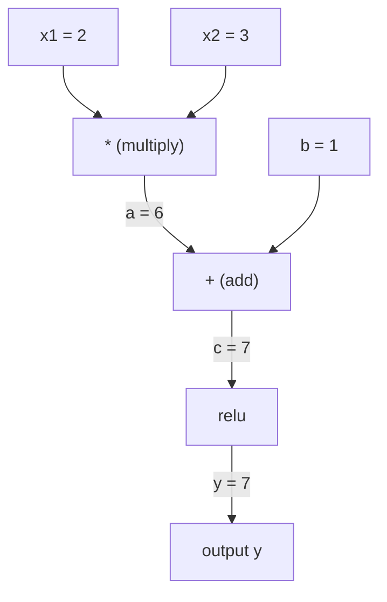
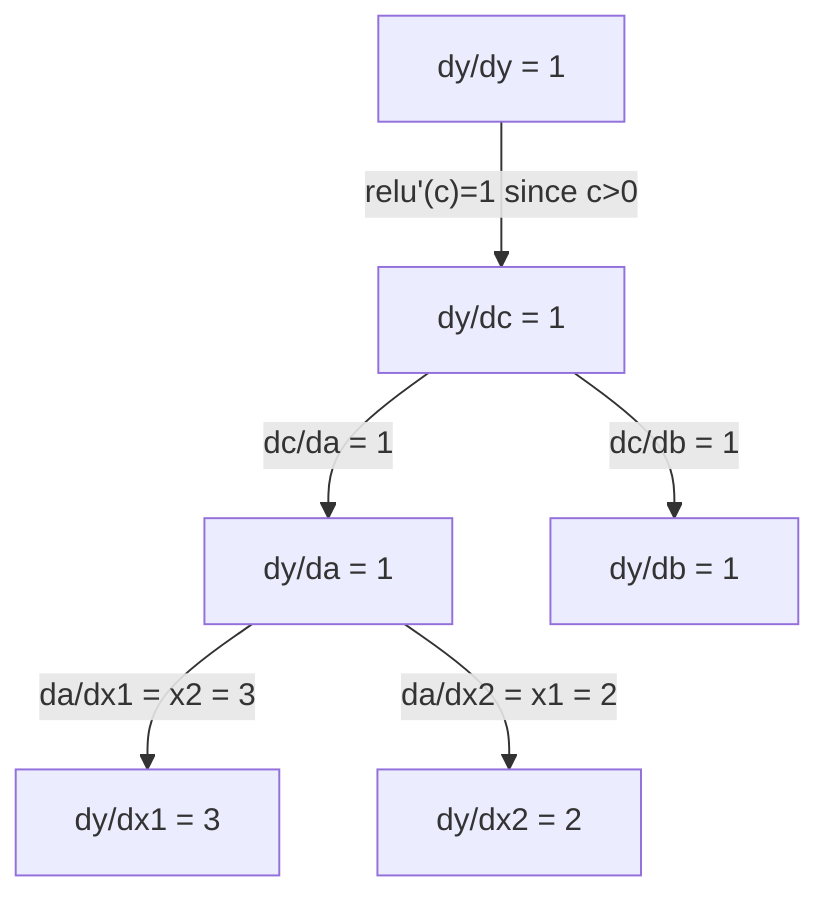

# Règlement de chaîne et différenciation automatique

> La règle de la chaîne est le moteur derrière chaque réseau neuronal qui apprend.

**Type:** Build
**Language:**Python
**Prerequisites:** Phase 1, Lesson 04 (Derivatives & Gradients)
**Time:** ~90 minutes

## Objectifs d'apprentissage

- Construire un moteur autograd minimal (classe de valeur) qui enregistre les opérations et calcule les gradients via l'autodiff en mode inverse
- Implémenter des passages vers l'avant et vers l'arrière à travers un graphique de calcul en utilisant le tri topologique
- Construire et entraîner un perceptron multicouche sur XOR en utilisant uniquement le moteur autograd de zéro
- Vérifiez la précision de l'auto-diffusion en utilisant la vérification des gradients contre les différences finites numériques

## Le problème

Vous pouvez calculer des dérivés de fonctions simples. Mais un réseau neuronal n'est pas une fonction simple. Il s'agit de centaines de fonctions composées ensemble: matrice multipliée, ajouter biais, appliquer l'activation, matrice multipliée à nouveau, softmax, perte d'entropie croisée.

Pour former le réseau, il faut le gradient de perte par rapport à chaque poids. Le faire à la main est impossible pour des millions de paramètres. Le faire numériquement (différences finites) est trop lent.

La règle de la chaîne vous donne les mathématiques. La différenciation automatique vous donne l'algorithme. Ensemble, ils vous permettent de calculer des gradients exacts à travers des compositions arbitraires de fonctions dans le temps proportionnelles à un seul passage vers l'avant.

C'est ainsi que PyTorch, TensorFlow et JAX fonctionnent. Vous construirez une version miniature à partir de zéro.

## Le concept

### La règle de la chaîne

Si vous`y = f(g(x))`, le dérivé de `y`en ce qui concerne `x`est:

```
dy/dx = dy/dg * dg/dx = f'(g(x)) * g'(x)
```

Multipliez les dérivés le long de la chaîne.

Exemple: `y = sin(x^2)`

```
g(x) = x^2       g'(x) = 2x
f(g) = sin(g)     f'(g) = cos(g)

dy/dx = cos(x^2) * 2x
```

Pour les compositions plus profondes, la chaîne s'étend:

```
y = f(g(h(x)))

dy/dx = f'(g(h(x))) * g'(h(x)) * h'(x)
```

Chaque couche d'un réseau neuronal est un seul maillon de cette chaîne.

### Graphiques de calcul

Un graphique de calcul rend la règle de la chaîne visuelle. Chaque opération devient un nœud. Les données circulent vers l'avant à travers le graphique.

**Forward pass (compute values):**



**Backward pass (compute gradients):**



Le passage à l'arrière applique la règle de la chaîne à chaque nœud, propagant les gradients de la sortie aux entrées.

### Mode avant vers le mode arrière

Il y a deux façons d'appliquer la règle de la chaîne à travers un graphique.

**Forward mode**Il commence par les entrées et pousse les dérivés vers l'avant.`dx/dx = 1`C'est bon quand on a peu d'entrée et beaucoup de sortie.

```
Forward mode: seed dx/dx = 1, propagate forward

  x = 2       (dx/dx = 1)
  a = x^2     (da/dx = 2x = 4)
  y = sin(a)  (dy/dx = cos(a) * da/dx = cos(4) * 4 = -2.615)
```

**Reverse mode**Il commence à la sortie et tire les gradients en arrière.`dy/dy = 1`Il est bon quand vous avez beaucoup d'entrées et peu de sorties.

```
Reverse mode: seed dy/dy = 1, propagate backward

  y = sin(a)  (dy/dy = 1)
  a = x^2     (dy/da = cos(a) = cos(4) = -0.654)
  x = 2       (dy/dx = dy/da * da/dx = -0.654 * 4 = -2.615)
```

Les réseaux neuronaux ont des millions d'entrées (poids) et une sortie (perte). Le mode inverse calcule tous les gradients dans un seul passage arrière. C'est pourquoi la propagation arrière utilise le mode inverse.

| Mode | Seed | Direction | Best when |
|------|------|-----------|-----------|
| Forward | `dx_i/dx_i = 1` | Input to output | Few inputs, many outputs |
| Reverse | `dy/dy = 1` | Output to input | Many inputs, few outputs (neural nets) |

### Numéros doubles pour le mode avant

Le mode avant peut être mis en œuvre avec élégance avec des nombres doubles.`a + b*epsilon`où `epsilon^2 = 0`- Je suis désolé .

```
Dual number: (value, derivative)

(2, 1) means: value is 2, derivative w.r.t. x is 1

Arithmetic rules:
  (a, a') + (b, b') = (a+b, a'+b')
  (a, a') * (b, b') = (a*b, a'*b + a*b')
  sin(a, a')         = (sin(a), cos(a)*a')
```

Sélectionnez la variable d'entrée avec dérivé 1. La dérivé se propage automatiquement à chaque opération.

### Construire un moteur Autograd

Un moteur autograd a besoin de trois choses:

1. **Value wrapping.**Enveloppez chaque nombre dans un objet qui stocke sa valeur et son gradient.
2. **Graph recording.**Chaque opération enregistre ses entrées et la fonction de gradient local.
3. **Backward pass.**On triera le graphique topologiquement, puis on le marche à l'envers, en appliquant la règle de la chaîne à chaque nœud.

C'est exactement ce que PyTorch est.`autograd`- Il est.`torch.Tensor`classe enveloppe les valeurs, enregistre les opérations lorsque `requires_grad=True`, et compute les gradients quand vous appelez `.backward()`- Je suis désolé .

### Comment fonctionne le pyTorch Autograd sous le capot

Quand vous écrivez le code PyTorch:

```python
x = torch.tensor(2.0, requires_grad=True)
y = x ** 2 + 3 * x + 1
y.backward()
print(x.grad)  # 7.0 = 2*x + 3 = 2*2 + 3
```

PyTorch à l'intérieur:

1. C' est une`Tensor`nœud pour `x`avec `requires_grad=True`
2. Chaque opération (`**`- Je suis là .`*`- Je suis là .`+`) crée un nouveau nœud et enregistre la fonction rétroactive
3. `y.backward()`déclenche le démarrage automatique en mode inverse à travers le graphique enregistré
4. Chaque nœud est `grad_fn`Compute les gradients locaux et les passe aux nœuds parents
5. Les gradients s' accumulent dans `.grad`attributs par addition (pas remplacement)

Le graphique est dynamique (définition par course). Un nouveau graphique est construit sur chaque passage avant.

```figure
chain-rule
```

## Faites-le

### Étape 1: La classe de valeur

```python
class Value:
    def __init__(self, data, children=(), op=''):
        self.data = data
        self.grad = 0.0
        self._backward = lambda: None
        self._prev = set(children)
        self._op = op

    def __repr__(self):
        return f"Value(data={self.data:.4f}, grad={self.grad:.4f})"
```

Chaque .`Value`stocke ses données numériques, son gradient (initialement zéro), une fonction rétroactive et pointe vers les nœuds enfants qui l'ont produit.

### Étape 2: Opérations arithmétiques avec suivi des gradients

```python
    def __add__(self, other):
        other = other if isinstance(other, Value) else Value(other)
        out = Value(self.data + other.data, (self, other), '+')
        def _backward():
            self.grad += out.grad
            other.grad += out.grad
        out._backward = _backward
        return out

    def __mul__(self, other):
        other = other if isinstance(other, Value) else Value(other)
        out = Value(self.data * other.data, (self, other), '*')
        def _backward():
            self.grad += other.data * out.grad
            other.grad += self.data * out.grad
        out._backward = _backward
        return out

    def relu(self):
        out = Value(max(0, self.data), (self,), 'relu')
        def _backward():
            self.grad += (1.0 if out.data > 0 else 0.0) * out.grad
        out._backward = _backward
        return out
```

Chaque opération crée une fermeture qui sait calculer les gradients locaux et multiplier par le gradient en amont (`out.grad`Le `+=`traite le cas où une valeur est utilisée dans plusieurs opérations.

### Étape 3: Pass en arrière

```python
    def backward(self):
        topo = []
        visited = set()
        def build_topo(v):
            if v not in visited:
                visited.add(v)
                for child in v._prev:
                    build_topo(child)
                topo.append(v)
        build_topo(self)

        self.grad = 1.0
        for v in reversed(topo):
            v._backward()
```

Le tri topologique assure que le gradient de chaque nœud est entièrement calculé avant de se propager à ses enfants.

### Étape 4: Plus d'opérations pour un moteur complet

La classe de valeur de base traite l'addition, la multiplication et le relou. Un véritable moteur autograd a besoin de plus. Voici les opérations dont vous avez besoin pour construire des réseaux neuronaux:

```python
    def __neg__(self):
        return self * -1

    def __sub__(self, other):
        return self + (-other)

    def __radd__(self, other):
        return self + other

    def __rmul__(self, other):
        return self * other

    def __rsub__(self, other):
        return other + (-self)

    def __pow__(self, n):
        out = Value(self.data ** n, (self,), f'**{n}')
        def _backward():
            self.grad += n * (self.data ** (n - 1)) * out.grad
        out._backward = _backward
        return out

    def __truediv__(self, other):
        return self * (other ** -1) if isinstance(other, Value) else self * (Value(other) ** -1)

    def exp(self):
        import math
        e = math.exp(self.data)
        out = Value(e, (self,), 'exp')
        def _backward():
            self.grad += e * out.grad
        out._backward = _backward
        return out

    def log(self):
        import math
        out = Value(math.log(self.data), (self,), 'log')
        def _backward():
            self.grad += (1.0 / self.data) * out.grad
        out._backward = _backward
        return out

    def tanh(self):
        import math
        t = math.tanh(self.data)
        out = Value(t, (self,), 'tanh')
        def _backward():
            self.grad += (1 - t ** 2) * out.grad
        out._backward = _backward
        return out
```

**Why each operation matters:**

| Operation | Backward rule | Used in |
|-----------|--------------|---------|
| `__sub__` | Reuses add + neg | Loss computation (pred - target) |
| `__pow__` | n * x^(n-1) | Polynomial activations, MSE (error^2) |
| `__truediv__` | Reuses mul + pow(-1) | Normalization, learning rate scaling |
| `exp` | exp(x) * upstream | Softmax, log-likelihood |
| `log` | (1/x) * upstream | Cross-entropy loss, log probabilities |
| `tanh` | (1 - tanh^2) * upstream | Classic activation function |

La partie intelligente:`__sub__`et `__truediv__`Les valeurs de la chaîne sont définies en termes d'opérations existantes.

### Étape 5: Mini MLP à partir de zéro

Avec une classe de valeurs complète, vous pouvez construire un réseau neural sans PyTorch, sans NumPy, juste des valeurs et la règle de la chaîne.

```python
import random

class Neuron:
    def __init__(self, n_inputs):
        self.w = [Value(random.uniform(-1, 1)) for _ in range(n_inputs)]
        self.b = Value(0.0)

    def __call__(self, x):
        act = sum((wi * xi for wi, xi in zip(self.w, x)), self.b)
        return act.tanh()

    def parameters(self):
        return self.w + [self.b]

class Layer:
    def __init__(self, n_inputs, n_outputs):
        self.neurons = [Neuron(n_inputs) for _ in range(n_outputs)]

    def __call__(self, x):
        return [n(x) for n in self.neurons]

    def parameters(self):
        return [p for n in self.neurons for p in n.parameters()]

class MLP:
    def __init__(self, sizes):
        self.layers = [Layer(sizes[i], sizes[i+1]) for i in range(len(sizes)-1)]

    def __call__(self, x):
        for layer in self.layers:
            x = layer(x)
        return x[0] if len(x) == 1 else x

    def parameters(self):
        return [p for layer in self.layers for p in layer.parameters()]
```

Une .`Neuron`calculs `tanh(w1*x1 + w2*x2 + ... + b)`- Je suis un .`Layer`est une liste de neurones.`MLP`Chaque poids est un`Value`, alors appelez `loss.backward()`Propage les gradients à chaque paramètre.

**Training on XOR:**

```python
random.seed(42)
model = MLP([2, 4, 1])  # 2 inputs, 4 hidden neurons, 1 output

xs = [[0, 0], [0, 1], [1, 0], [1, 1]]
ys = [-1, 1, 1, -1]  # XOR pattern (using -1/1 for tanh)

for step in range(100):
    preds = [model(x) for x in xs]
    loss = sum((p - y) ** 2 for p, y in zip(preds, ys))

    for p in model.parameters():
        p.grad = 0.0
    loss.backward()

    lr = 0.05
    for p in model.parameters():
        p.data -= lr * p.grad

    if step % 20 == 0:
        print(f"step {step:3d}  loss = {loss.data:.4f}")

print("\nPredictions after training:")
for x, y in zip(xs, ys):
    print(f"  input={x}  target={y:2d}  pred={model(x).data:6.3f}")
```

C'est un micrograde. Une boucle d'entraînement complète de réseau neuronal en Python pur avec une différenciation automatique.

### Étape 6: vérification des degrés

Comment savoir si votre auto-diff est correct ? Comparer avec des dérivés numériques.

```python
def gradient_check(build_expr, x_val, h=1e-7):
    x = Value(x_val)
    y = build_expr(x)
    y.backward()
    autodiff_grad = x.grad

    y_plus = build_expr(Value(x_val + h)).data
    y_minus = build_expr(Value(x_val - h)).data
    numerical_grad = (y_plus - y_minus) / (2 * h)

    diff = abs(autodiff_grad - numerical_grad)
    return autodiff_grad, numerical_grad, diff
```

Testez-le sur une expression complexe:

```python
def expr(x):
    return (x ** 3 + x * 2 + 1).tanh()

ad, num, diff = gradient_check(expr, 0.5)
print(f"Autodiff:  {ad:.8f}")
print(f"Numerical: {num:.8f}")
print(f"Difference: {diff:.2e}")
# Difference should be < 1e-5
```

La vérification des degrés est essentielle lors de la mise en œuvre de nouvelles opérations. Si votre passe arrière a un bug, la vérification numérique le détecte.

**When to use gradient checking:**

| Situation | Do gradient check? |
|-----------|-------------------|
| Adding a new operation to your autograd | Yes, always |
| Debugging a training loop that won't converge | Yes, check gradients first |
| Production training | No, too slow (2x forward passes per parameter) |
| Unit tests for autograd code | Yes, automate it |

### Étape 7: Vérifiez contre le calcul manuel

```python
x1 = Value(2.0)
x2 = Value(3.0)
a = x1 * x2          # a = 6.0
b = a + Value(1.0)    # b = 7.0
y = b.relu()          # y = 7.0

y.backward()

print(f"y = {y.data}")          # 7.0
print(f"dy/dx1 = {x1.grad}")   # 3.0 (= x2)
print(f"dy/dx2 = {x2.grad}")   # 2.0 (= x1)
```

Vérifie manuelle: `y = relu(x1*x2 + 1)`Depuis .`x1*x2 + 1 = 7 > 0`Relu est l'identité.
`dy/dx1 = x2 = 3`- Je suis là .`dy/dx2 = x1 = 2`- Le moteur correspond.

## Utilisez-le

### Vérifiez contre PyTorch

```python
import torch

x1 = torch.tensor(2.0, requires_grad=True)
x2 = torch.tensor(3.0, requires_grad=True)
a = x1 * x2
b = a + 1.0
y = torch.relu(b)
y.backward()

print(f"PyTorch dy/dx1 = {x1.grad.item()}")  # 3.0
print(f"PyTorch dy/dx2 = {x2.grad.item()}")  # 2.0
```

Votre moteur compute le même résultat que PyTorch parce que les mathématiques sont les mêmes: inverse mode auto-diffusion via la règle de la chaîne.

### Une expression plus complexe

```python
a = Value(2.0)
b = Value(-3.0)
c = Value(10.0)
f = (a * b + c).relu()  # relu(2*(-3) + 10) = relu(4) = 4

f.backward()
print(f"df/da = {a.grad}")  # -3.0 (= b)
print(f"df/db = {b.grad}")  #  2.0 (= a)
print(f"df/dc = {c.grad}")  #  1.0
```

## La faire partir

Cette leçon donne:
- `outputs/skill-autodiff.md`-- une compétence pour la construction et le débogage de systèmes autograd
- `code/autodiff.py`-- un moteur autograd minimal que vous pouvez étendre

La classe de valeur construite ici est la base pour la boucle d'entraînement du réseau neuronal dans la phase 3.

## Exercices

1. Ajouter `__pow__`à la classe de valeur pour pouvoir calculer `x ** n`Vérifiez ça .`d/dx(x^3)`à`x=2`égale `12.0`- Je suis désolé .

2. Ajouter `tanh`comme une fonction d'activation.`tanh'(0) = 1`et `tanh'(2) = 0.0707`- Je suis d'accord.

3. Construisez un graphique de calcul pour un seul neurone: `y = relu(w1*x1 + w2*x2 + b)`Compute les cinq gradients et vérifie contre PyTorch.

4. Implémenter l'autodiff en mode avant en utilisant des numéros doubles.`Dual`classe et vérifier qu'il donne les mêmes dérivés que votre moteur en mode inverse.

## Les termes clés

| Term | What people say | What it actually means |
|------|----------------|----------------------|
| Chain rule | "Multiply the derivatives" | The derivative of composed functions equals the product of each function's local derivative, evaluated at the right point |
| Computational graph | "The network diagram" | A directed acyclic graph where nodes are operations and edges carry values (forward) or gradients (backward) |
| Forward mode | "Push derivatives forward" | Autodiff that propagates derivatives from inputs to outputs. One pass per input variable. |
| Reverse mode | "Backpropagation" | Autodiff that propagates gradients from outputs to inputs. One pass per output variable. |
| Autograd | "Automatic gradients" | A system that records operations on values, builds a graph, and computes exact gradients via the chain rule |
| Dual numbers | "Value plus derivative" | Numbers of the form a + b*epsilon (epsilon^2 = 0) that carry derivative information through arithmetic |
| Topological sort | "Dependency order" | Ordering graph nodes so every node comes after all its dependencies. Required for correct gradient propagation. |
| Gradient accumulation | "Add, don't replace" | When a value feeds into multiple operations, its gradient is the sum of all incoming gradient contributions |
| Dynamic graph | "Define by run" | A computation graph rebuilt on every forward pass, allowing Python control flow inside models (PyTorch style) |
| Gradient checking | "Numerical verification" | Comparing autodiff gradients against numerical finite-difference gradients to verify correctness. Essential for debugging. |
| MLP | "Multi-layer perceptron" | A neural network with one or more hidden layers of neurons. Each neuron computes a weighted sum plus bias, then applies an activation function. |
| Neuron | "Weighted sum + activation" | The basic unit: output = activation(w1*x1 + w2*x2 + ... + b). The weights and bias are learnable parameters. |

## Pour en savoir plus

- [3Blue1Brown: Backpropagation calculus](https://www.youtube.com/watch?v=tIeHLnjs5U8)-- une explication visuelle de la règle de la chaîne dans les réseaux neuronaux
- [PyTorch Autograd mechanics](https://pytorch.org/docs/stable/notes/autograd.html)- comment le système réel fonctionne
- [Baydin et al., Automatic Differentiation in Machine Learning: a Survey](https://arxiv.org/abs/1502.05767)-- référence globale
