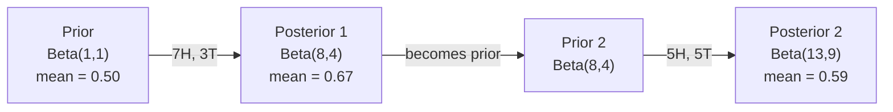

# Le théorème de Bayes

> La probabilité est ce que vous attendez, le théorème de Bayes est ce que vous apprenez.

**Type:** Build
**Language:**Python
**Prerequisites:** Phase 1, Lesson 06 (Probability Fundamentals)
**Time:** ~75 minutes

## Objectifs d'apprentissage

- Appliquer le théorème de Bayes pour calculer les probabilités ultérieures à partir de prédécesseurs, de probabilités et de preuves
- Construisez un classificateur de texte naïf Bayes à partir de zéro avec Laplace lissage et le calcul de l'espace log
- Comparer l'estimation de MLE et de MAP et expliquer comment le MAP correspond à la régularisation de L2
- Implementer une mise à jour séquentielle bayésienne à l'aide de préjôts conjugués bêta-binomial pour les tests A/B

## Le problème

Un test médical est à 99% exact, vous êtes positif, quelle est la probabilité que vous ayez la maladie ?

La plupart des gens disent 99%. La vraie réponse dépend de la rareté de la maladie. Si 1 personne sur 10 000 en souffre, un résultat positif ne donne qu'environ 1% de chances de tomber malade. Les autres 99% des résultats positifs sont de fausses alarmes de personnes en bonne santé.

Ce n'est pas une question de ruse. C'est le théorème de Bayes. Chaque filtre de spam, chaque diagnostic médical, chaque modèle d'apprentissage automatique qui quantifie l'incertitude utilise ce raisonnement exact. Vous commencez par une croyance. Vous voyez des preuves. Vous mettez à jour.

Si vous construisez des systèmes de machine à écrire sans comprendre cela, vous interpréterez mal les résultats des modèles, fixerez de mauvais seuils et vous enverrez des prédictions trop confiantes.

## Le concept

### De la probabilité commune à Bayes

Vous savez déjà de la leçon 06 que la probabilité conditionnelle est:

```
P(A|B) = P(A and B) / P(B)
```

Et symétriquement:

```
P(B|A) = P(A and B) / P(A)
```

Les deux expressions partagent le même numérateur: P(A et B.

```
P(A and B) = P(A|B) * P(B) = P(B|A) * P(A)

Therefore:

P(A|B) = P(B|A) * P(A) / P(B)
```

C'est le théorème de Bayes, quatre quantités, une équation.

### Les quatre parties

| Part | Name | What it means |
|------|------|---------------|
| P(A\|B) | Posterior | Your updated belief about A after seeing evidence B |
| P(B\|A) | Likelihood | How probable the evidence B is if A is true |
| P(A) | Prior | Your belief about A before seeing any evidence |
| P(B) | Evidence | Total probability of seeing B under all possibilities |

Le terme preuve P(B) agit comme un normalisateur. Vous pouvez l'étendre en utilisant la loi de la probabilité totale:

```
P(B) = P(B|A) * P(A) + P(B|not A) * P(not A)
```

### Exemple de test médical

Une maladie touche 1 personne sur 10 000. Le test est 99% précis (capture 99% des malades, donne de faux résultats 1% du temps).

```
P(sick)          = 0.0001     (prior: disease is rare)
P(positive|sick) = 0.99       (likelihood: test catches it)
P(positive|healthy) = 0.01    (false positive rate)

P(positive) = P(positive|sick) * P(sick) + P(positive|healthy) * P(healthy)
            = 0.99 * 0.0001 + 0.01 * 0.9999
            = 0.000099 + 0.009999
            = 0.010098

P(sick|positive) = P(positive|sick) * P(sick) / P(positive)
                 = 0.99 * 0.0001 / 0.010098
                 = 0.0098
                 = 0.98%
```

Les tests préliminaires dominent, et même les tests précis donnent des résultats fausses.

### Exemple de filtre à spam

Vous recevez un e-mail contenant le mot "loterie". Est-ce du spam?

```
P(spam)                = 0.3      (30% of email is spam)
P("lottery"|spam)      = 0.05     (5% of spam emails contain "lottery")
P("lottery"|not spam)  = 0.001    (0.1% of legitimate emails contain "lottery")

P("lottery") = 0.05 * 0.3 + 0.001 * 0.7
             = 0.015 + 0.0007
             = 0.0157

P(spam|"lottery") = 0.05 * 0.3 / 0.0157
                  = 0.955
                  = 95.5%
```

Un mot change la probabilité de 30% à 95,5%. Un vrai filtre de spam applique Bayes sur des centaines de mots simultanément.

### Bayes naïf: supposition d'indépendance

Naïve Bayes étend cela à plusieurs caractéristiques en supposant que toutes les caractéristiques sont conditionnellement indépendantes étant donné la classe:

```
P(class | feature_1, feature_2, ..., feature_n)
  = P(class) * P(feature_1|class) * P(feature_2|class) * ... * P(feature_n|class)
    / P(feature_1, feature_2, ..., feature_n)
```

La partie "naïve" est l'hypothèse d'indépendance. Dans le texte, les occurrences de mots ne sont pas indépendantes ("New" et "York" sont corrélés). Mais l'hypothèse fonctionne étonnamment bien dans la pratique parce que le classifiant ne doit que classer les classes, pas produire des probabilités calibrées.

Comme le dénominateur est le même pour toutes les classes, vous pouvez le sauter et simplement comparer les numérateurs:

```
score(class) = P(class) * product of P(feature_i | class)
```

Choisissez la classe avec le score le plus élevé.

### Évaluation maximale de probabilité (MLE)

Comment obtenir la P "feature " (class de fonctionnement) des données de formation ?

```
P("free"|spam) = (number of spam emails containing "free") / (total spam emails)
```

C'est MLE: choisissez les valeurs de paramètre qui rendent les données observées les plus probables. Vous maximiserez la fonction de probabilité, qui pour les comptes discrets se réduit à la fréquence relative.

Problème: si un mot n'apparaît jamais dans le spam pendant la formation, MLE lui donne une probabilité zéro. Un mot invisible tue l'ensemble du produit.

```
P(word|class) = (count(word, class) + 1) / (total_words_in_class + vocabulary_size)
```

Ajouter 1 à chaque compte assure qu'aucune probabilité n'est jamais nulle.

### Le maximum a posteriori (MAP)

MLE pose la question: quels paramètres maximisent les paramètres de données P ?

Le MAP pose la question: quels paramètres maximisent les paramètres P  dans les données ?

Selon le théorème de Bayes:

```
P(parameters|data) proportional to P(data|parameters) * P(parameters)
```

Le MAP ajoute un prior sur les paramètres eux-mêmes. Si vous pensez que les paramètres devraient être petits, vous le codez comme un prior qui pénalise les grandes valeurs.

| Estimation | Optimizes | ML equivalent |
|------------|-----------|---------------|
| MLE | P(data\|params) | Unregularized training |
| MAP | P(data\|params) * P(params) | L2 / L1 regularization |

### Bayésien et fréquentiste: la différence pratique

Les fréquentistes considèrent les paramètres comme des inconnus fixes. " Si je répetais cette expérience plusieurs fois, demandent- ils, que se passerait- il? "

Les Bayésiens considèrent les paramètres comme des répartitions. " Compte tenu de ce que j'ai observé, que crois- je des paramètres? " demandent- ils.

Pour la construction de systèmes ML, la différence pratique:

| Aspect | Frequentist | Bayesian |
|--------|-------------|----------|
| Output | Point estimate | Distribution over values |
| Uncertainty | Confidence intervals (about procedure) | Credible intervals (about parameter) |
| Small data | Can overfit | Prior acts as regularization |
| Computation | Usually faster | Often requires sampling (MCMC) |

La plupart des méthodes de production sont fréquentistes (SGD, estimations de points). Les méthodes bayésiennes brillent lorsque vous avez besoin d'une incertitude calibrée (décisions médicales, systèmes critiques pour la sécurité) ou lorsque les données sont rares (apprentissage à quelques coups, démarrage à froid).

### Pourquoi la pensée bayésienne est importante pour l'IM

Le lien est plus profond que l' analogie:

**Priors are regularization.**Un préalable gaussien sur les poids est la régularisation de L2. Un préalable de Laplace est L1. Chaque fois que vous ajoutez un terme de régularisation, vous faites une déclaration bayésienne sur les valeurs de paramètre que vous attendez.

**Posteriors are uncertainty.**Une seule probabilité prévue ne vous dit rien sur la confiance du modèle dans cette estimation.

**Bayes updates are online learning.**Le postérieur d'aujourd'hui devient le prior de demain. Quand votre modèle voit de nouvelles données, il met à jour ses croyances progressivement au lieu de se réapproprier à partir de zéro.

**Model comparison is Bayesian.**Le critère Bayésien de l'information (BIC), la probabilité marginale et les facteurs Bayésiens utilisent tous le raisonnement Bayésien pour choisir entre des modèles sans sur-adaptation.

```figure
bayes-update
```

## Faites-le

### Étape 1: Fonction du théorème de Bayes

```python
def bayes(prior, likelihood, false_positive_rate):
    evidence = likelihood * prior + false_positive_rate * (1 - prior)
    posterior = likelihood * prior / evidence
    return posterior

result = bayes(prior=0.0001, likelihood=0.99, false_positive_rate=0.01)
print(f"P(sick|positive) = {result:.4f}")
```

### Étape 2: Classificateur Bayes naïf

```python
import math
from collections import defaultdict

class NaiveBayes:
    def __init__(self, smoothing=1.0):
        self.smoothing = smoothing
        self.class_counts = defaultdict(int)
        self.word_counts = defaultdict(lambda: defaultdict(int))
        self.class_word_totals = defaultdict(int)
        self.vocab = set()

    def train(self, documents, labels):
        for doc, label in zip(documents, labels):
            self.class_counts[label] += 1
            words = doc.lower().split()
            for word in words:
                self.word_counts[label][word] += 1
                self.class_word_totals[label] += 1
                self.vocab.add(word)

    def predict(self, document):
        words = document.lower().split()
        total_docs = sum(self.class_counts.values())
        vocab_size = len(self.vocab)
        best_class = None
        best_score = float("-inf")
        for cls in self.class_counts:
            score = math.log(self.class_counts[cls] / total_docs)
            for word in words:
                count = self.word_counts[cls].get(word, 0)
                total = self.class_word_totals[cls]
                score += math.log((count + self.smoothing) / (total + self.smoothing * vocab_size))
            if score > best_score:
                best_score = score
                best_class = cls
        return best_class
```

Les probabilités de logs empêchent le sous-flow. Multiplication de nombreuses petites probabilités produit des nombres trop petits pour un point flottant. La somme des probabilités de logs est numériquement stable et mathématiquement équivalente.

### Étape 3: Trainer les données de spam

```python
train_docs = [
    "win free money now",
    "free lottery ticket winner",
    "claim your prize today free",
    "urgent offer free cash",
    "congratulations you won free",
    "meeting tomorrow at noon",
    "project update attached",
    "can we schedule a call",
    "quarterly report review",
    "lunch on thursday sounds good",
    "team standup notes attached",
    "please review the pull request",
]

train_labels = [
    "spam", "spam", "spam", "spam", "spam",
    "ham", "ham", "ham", "ham", "ham", "ham", "ham",
]

classifier = NaiveBayes()
classifier.train(train_docs, train_labels)

test_messages = [
    "free money waiting for you",
    "meeting rescheduled to friday",
    "you won a free prize",
    "please review the attached report",
]

for msg in test_messages:
    print(f"  '{msg}' -> {classifier.predict(msg)}")
```

### Étape 4: Examinez les probabilités apprises

```python
def show_top_words(classifier, cls, n=5):
    vocab_size = len(classifier.vocab)
    total = classifier.class_word_totals[cls]
    probs = {}
    for word in classifier.vocab:
        count = classifier.word_counts[cls].get(word, 0)
        probs[word] = (count + classifier.smoothing) / (total + classifier.smoothing * vocab_size)
    sorted_words = sorted(probs.items(), key=lambda x: x[1], reverse=True)
    for word, prob in sorted_words[:n]:
        print(f"    {word}: {prob:.4f}")

print("\nTop spam words:")
show_top_words(classifier, "spam")
print("\nTop ham words:")
show_top_words(classifier, "ham")
```

## Utilisez-le

Les navires de ski-apprentissage prêts à la production

```python
from sklearn.feature_extraction.text import CountVectorizer
from sklearn.naive_bayes import MultinomialNB
from sklearn.metrics import classification_report

vectorizer = CountVectorizer()
X_train = vectorizer.fit_transform(train_docs)
clf = MultinomialNB()
clf.fit(X_train, train_labels)

X_test = vectorizer.transform(test_messages)
predictions = clf.predict(X_test)
for msg, pred in zip(test_messages, predictions):
    print(f"  '{msg}' -> {pred}")
```

Le même algorithme. CountVectorizer gère la symbolisation et la construction du vocabulaire. MultinomialNB gère le smoothing et les probabilités de journaux en interne. Votre version à partir de zéro fait la même chose en 40 lignes.

## La faire partir

La classe NaiveBayes construite ici démontre l'ensemble du pipeline: la tokenization, l'estimation de probabilité avec le lissage de Laplace, la prédiction de l'espace log.`code/bayes.py`fonctionne de bout en bout sans dépendances au-delà de la bibliothèque standard de Python.

### Les prédécesseurs conjugaux

Lorsque le précédent et le posterior appartiennent à la même famille de distributions, le prior est appelé "conjugé". Cela rend la mise à jour algébrique bayésienne propre - vous obtenez une forme fermée de l'arrière sans intégration numérique.

| Likelihood | Conjugate Prior | Posterior | Example |
|-----------|----------------|-----------|---------|
| Bernoulli | Beta(a, b) | Beta(a + successes, b + failures) | Coin flip bias estimation |
| Normal (known variance) | Normal(mu_0, sigma_0) | Normal(weighted mean, smaller variance) | Sensor calibration |
| Poisson | Gamma(a, b) | Gamma(a + sum of counts, b + n) | Modeling arrival rates |
| Multinomial | Dirichlet(alpha) | Dirichlet(alpha + counts) | Topic modeling, language models |

Pourquoi cela importe: sans précédents conjugués, vous avez besoin de l'échantillonnage de Monte Carlo ou d'une inférence variationnelle pour approximer le posterior.

La répartition bêta est le précurseur conjugué le plus courant en pratique. Beta(a, b) représente votre croyance sur un paramètre de probabilité. La moyenne est a/(a+b). Plus a+b est grand, plus la répartition est concentrée (confiante).

Cas particuliers de la période de Beta précédente:
- Beta(1, 1) = uniforme. Vous n'avez pas d'opinion sur le paramètre.
- Beta ((10, 10) = atteint le point culminant à 0,5. Vous croyez fermement que le paramètre est proche de 0,5.
- Beta(1, 10) = dévié vers 0, vous pensez que le paramètre est petit.

La règle de mise à jour est très simple:

```
Prior:     Beta(a, b)
Data:      s successes, f failures
Posterior: Beta(a + s, b + f)
```

Pas d'intégrales, pas de prélèvement, juste d'addition.

### Mise à jour séquentielle bayésienne

L'inférence bayésienne est naturellement séquentielle. Le postérieur d'aujourd'hui devient le prior de demain. C'est ainsi que les systèmes réels apprennent progressivement sans refaire tout le traitement des données historiques.

Exemple concret: évaluer si une pièce est juste.

**Day 1: No data yet.**
Commencez par Beta: 1, 1 -- un précurseur uniforme. Vous n'avez pas d'opinion.
- Moyenne antérieure: 0,5
- Le prior est plat à travers [0, 1]

**Day 2: Observe 7 heads, 3 tails.**
Le référentiel est le référentiel de la carte de crédit.
- Moyenne postérieure: 8/12 = 0,667
- Les preuves suggèrent que la pièce est orientée vers les têtes

**Day 3: Observe 5 more heads, 5 more tails.**
Utilisez le postérieur d'hier comme le prior d'aujourd'hui.
Le arrière est Beta(8 + 5, 4 + 5) = Beta(13, 9)
- Moyenne postérieure: 13/22 = 0,591
- Les nouvelles données équilibrées ont ramené l'estimation vers 0,5.



L'ordre des observations n'a pas d'importance. Beta(1,1) mis à jour avec les 12 têtes et 8 queues à la fois donne Beta(13, 9) - le même résultat. La mise à jour séquentielle et la mise à jour de lot sont mathématiquement équivalentes. Mais la mise à jour séquentielle vous permet de prendre des décisions à chaque étape sans stocker des données brutes.

C'est la base de l'apprentissage en ligne dans les systèmes ML de production. L'échantillonnage de Thompson pour les bandits, les systèmes de recommandation incrémentielle et les détecteurs d'anomalies de streaming utilisent tous ce modèle.

### Connexion aux tests A/B

Les tests A/B sont des déductions bayésiennes déguisées.

Configuration: vous testez deux couleurs de boutons: la variante A (bleu) et la variante B (vert). Vous voulez savoir lequel obtient le plus de clics.

Le test Bayésien A/B:

1. **Prior.**Commencez par Beta(1, 1) pour les deux variantes.
2. **Data.**La variante A: 50 clics sur 1000 vues. La variante B: 65 clics sur 1000 vues.
3. **Posteriors.**
   - R: Beta(1 + 50, 1 + 950) = Beta(51, 951). La moyenne est de 0,051
   - B: Beta(1 + 65, 1 + 935) = Beta(66, 936). La moyenne = 0,066
4. **Decision.**Compute P ((B > A) -- la probabilité que le taux de conversion vrai de B est plus élevé que celui de A.

Le calcul de P (B) est difficile, mais Monte Carlo le rend trivial.

```
1. Draw 100,000 samples from Beta(51, 951)  -> samples_A
2. Draw 100,000 samples from Beta(66, 936)  -> samples_B
3. P(B > A) = fraction of samples where B > A
```

Si P(B > A) > 0,95, vous expédez la variante B. Si elle est entre 0,05 et 0,95, vous continuez à collecter des données. Si P(B > A) < 0,05, vous expédez la variante A.

Les avantages par rapport aux tests A/B fréquentistes:
- Vous obtenez une déclaration de probabilité directe: "il y a 97% de chances que B est meilleur"
- Pas de confusion sur la valeur de p, pas de couverture "faut rejeter l'hypothèse nulle".
- Vous pouvez vérifier les résultats à tout moment sans gonfler de taux de faux positifs (pas de "problème de recherche")
- Vous pouvez intégrer des connaissances préalables (par exemple, des tests antérieurs suggèrent que les taux de conversion sont généralement de 3-8%)

| Aspect | Frequentist A/B | Bayesian A/B |
|--------|----------------|--------------|
| Output | p-value | P(B > A) |
| Interpretation | "How surprising is this data if A=B?" | "How likely is B better than A?" |
| Early stopping | Inflates false positives | Safe at any point (given a well-chosen prior and correctly specified model) |
| Prior knowledge | Not used | Encoded as Beta prior |
| Decision rule | p < 0.05 | P(B > A) > threshold |

## Exercices

1. **Multiple tests.**Un patient testé positif deux fois sur des tests indépendants (les deux 99% précis, prévalence de la maladie 1 sur 10.000).

2. **Smoothing impact.**Exécutez le classifiateur de spam avec des valeurs de lissage de 0.01, 0.1, 1.0 et 10.0. Comment les probabilités de mots supérieurs changent-elles?

3. **Add features.**Extension de la classe NaiveBayes pour utiliser également la longueur du message (courte/longue) comme fonctionnalité aux côtés du nombre de mots.

4. **MAP by hand.**Compte tenu des données observées (7 têtes sur 10 lancements de pièces), calculer l'estimation du MAP du biais en utilisant un précédent Beta(2,2).

## Les termes clés

| Term | What people say | What it actually means |
|------|----------------|----------------------|
| Prior | "My initial guess" | P(hypothesis) before observing evidence. In ML: the regularization term. |
| Likelihood | "How well the data fits" | P(evidence\|hypothesis). How probable the observed data is under a specific hypothesis. |
| Posterior | "My updated belief" | P(hypothesis\|evidence). The prior multiplied by the likelihood, then normalized. |
| Evidence | "The normalizing constant" | P(data) across all hypotheses. Ensures the posterior sums to 1. |
| Naive Bayes | "That simple text classifier" | A classifier that assumes features are independent given the class. Works well despite the false assumption. |
| Laplace smoothing | "Add-one smoothing" | Adding a small count to every feature to prevent zero probabilities from unseen data. |
| MLE | "Just use the frequencies" | Choose parameters that maximize P(data\|parameters). No prior. Can overfit with small data. |
| MAP | "MLE with a prior" | Choose parameters that maximize P(data\|parameters) * P(parameters). Equivalent to regularized MLE. |
| Log-probability | "Work in log space" | Using log(P) instead of P to avoid floating-point underflow when multiplying many small numbers. |
| False positive | "A wrong alarm" | The test says positive, but the true state is negative. Drives the base rate fallacy. |

## Pour en savoir plus

- [3Blue1Brown: Bayes' theorem](https://www.youtube.com/watch?v=HZGCoVF3YvM)- explication visuelle avec l'exemple du test médical
- [Stanford CS229: Generative Learning Algorithms](https://cs229.stanford.edu/notes2022fall/cs229-notes2.pdf)- Bayes naïf et son lien avec les modèles discriminatoires
- [Think Bayes](https://greenteapress.com/wp/think-bayes/)- livre gratuit, statistiques bayésiennes avec code Python
- [scikit-learn Naive Bayes](https://scikit-learn.org/stable/modules/naive_bayes.html)- les mises en œuvre de la production et le moment de l'utilisation de chaque variante
