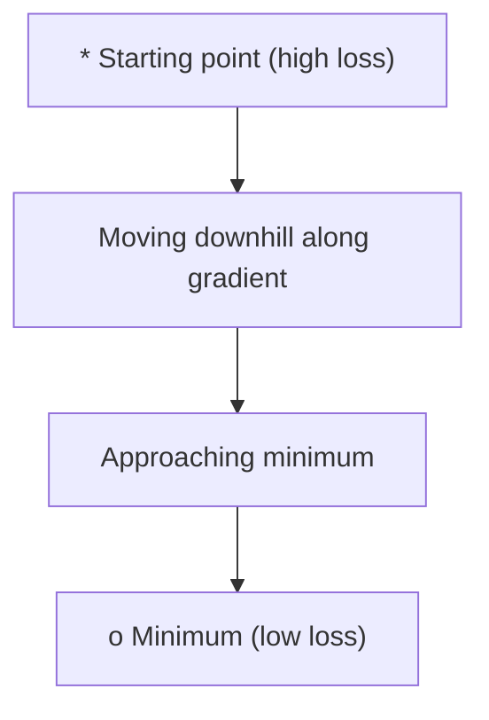
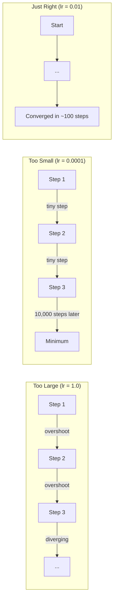
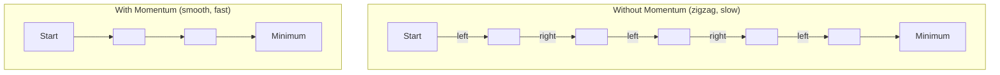
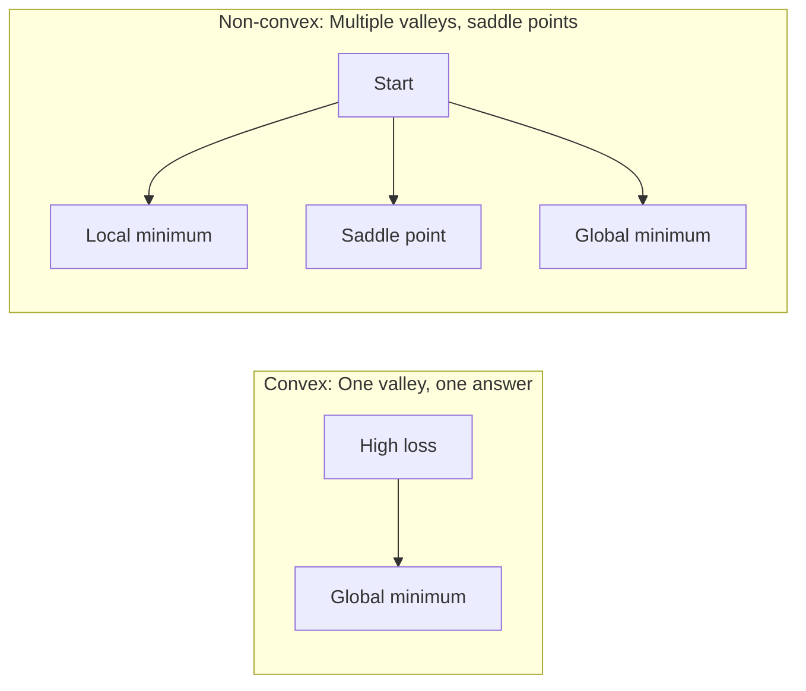
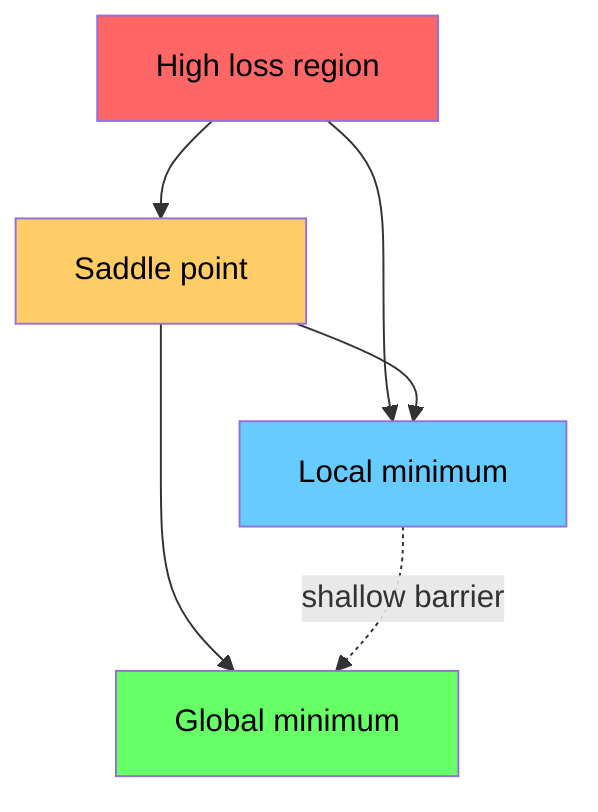

# Optimisation

> Former un réseau neural n'est rien de plus que trouver le fond d'une vallée.

**Type:** Build
**Language:**Python
**Prerequisites:** Phase 1, Lessons 04-05 (Derivatives, Gradients)
**Time:** ~75 minutes

## Objectifs d'apprentissage

- Mettre en œuvre la descente du gradient de la vanille, SGD avec l'élan, et Adam à partir de zéro
- Comparer la convergence de l'optimisateur sur la fonction Rosenbrock et expliquer pourquoi Adam adapte les taux d'apprentissage par poids
- Distinguer les paysages de perte convexes des paysages non convexes et expliquer le rôle des points de selle dans les dimensions élevées
- Configurer les horaires de taux d'apprentissage (décomposition des étapes, annelement cosine, réchauffement) pour assurer la stabilité de l'entraînement

## Le problème

Vous avez une fonction de perte. Il vous dit à quel point votre modèle est faux. Vous avez des gradients. Ils vous disent dans quelle direction la perte est pire. Maintenant vous avez besoin d'une stratégie pour descendre la colline.

L'approche naïve est simple: se déplacer en face du gradient. Étalonnez l'étape par un nombre appelé taux d'apprentissage. Je répète. C'est une descente de gradient, et ça marche. Mais "travaux" a des avertissements. Trop de taux d'apprentissage et vous dépassez complètement la vallée, bondant entre les murs. Trop petit et vous vous déplacez vers la réponse sur des milliers de pas inutiles. Vous frappez un point de selle et vous arrêtez de bouger même si vous n'avez pas trouvé un minimum.

Chaque optimisateur de l'apprentissage profond est une réponse à la même question: comment arriver au fond de la vallée plus rapidement et plus fiablement ?

## Le concept

### Ce que signifie l'optimisation

L'optimisation est la recherche des valeurs d'entrée qui minimisent (ou maximisent) une fonction.

```
minimize L(w) where:
  L = loss function
  w = model weights (could be millions of parameters)
```

### Descent graduel (vanille)

Le plus simple optimisateur. Comptez le gradient de perte par rapport à chaque poids. déplacer chaque poids dans la direction opposée de son gradient. Échanger l'étape par le taux d'apprentissage.

```
w = w - lr * gradient
```

C'est l'ensemble de l'algorithme.



### Taux d'apprentissage: le plus important hyperparamètre

Le taux d'apprentissage contrôle la taille des étapes.



Il n'y a pas de formule pour le bon taux d'apprentissage. Vous le trouvez par expérience. points de départ communs: 0,001 pour Adam, 0,01 pour SGD avec dynamique.

### SGD vs lot vs mini lot

La descente du gradient de la vanille calcule la descente sur l'ensemble des données avant de prendre une étape.

La descente du gradient stochastique (SGD) calcule le gradient sur un seul échantillon aléatoire et marche immédiatement.

La descente de gradient mini-partie divise la différence. Computez le gradient sur un petit lot (32, 64, 128, 256 échantillons), puis passez. C'est ce que tout le monde utilise réellement.

| Variant | Batch size | Gradient quality | Speed per step | Noise |
|---------|-----------|-----------------|---------------|-------|
| Batch GD | Entire dataset | Exact | Slow | None |
| SGD | 1 sample | Very noisy | Fast | High |
| Mini-batch | 32-256 | Good estimate | Balanced | Moderate |

Le bruit dans les SGD et les mini-parties n'est pas un bug.

### Momentum: la balle en train de rouler en descente

La descente du gradient de la vanille ne regarde que le gradient courant. Si le gradient zigzag (common dans les vallées étroites), le progrès est lent.

```
v = beta * v + gradient
w = w - lr * v
```

L'analogie: une balle qui roule en descente. Elle ne s'arrête pas et ne redémarre pas à chaque bosse.



`beta`Un meilleur beta signifie plus de dynamique, des chemins plus lisses, mais une réponse plus lente aux changements de direction.

### Adam: taux d'apprentissage adaptatif

Les poids différents ont besoin de taux d'apprentissage différents. Un poids qui obtient rarement de grands gradients devrait prendre des mesures plus importantes quand il le fera enfin. Un poids qui obtient constamment des gradients énormes devrait prendre des mesures plus petites.

Adam (estimation du moment adaptatif) suit deux choses par poids:

1. Première minute (m): moyenne continue des gradients (comme la vitesse)
2. Deuxième moment (v): moyenne continue des gradients carrés (magnitude de gradient)

```
m = beta1 * m + (1 - beta1) * gradient
v = beta2 * v + (1 - beta2) * gradient^2

m_hat = m / (1 - beta1^t)    bias correction
v_hat = v / (1 - beta2^t)    bias correction

w = w - lr * m_hat / (sqrt(v_hat) + epsilon)
```

La division par `sqrt(v_hat)`Les poids avec de grands gradients sont divisés par un grand nombre (petit pas effectif). Les poids avec de petits gradients sont divisés par un petit nombre (grand pas effectif). Chaque poids obtient son propre taux d'apprentissage adaptatif.

Hyperparamètres par défaut: `lr=0.001, beta1=0.9, beta2=0.999, epsilon=1e-8`Ces défauts fonctionnent bien pour la plupart des problèmes.

### Les horaires de taux d'apprentissage

Un taux d'apprentissage fixe est un compromis. Au début de la formation, vous voulez des grandes étapes pour progresser rapidement.

Les horaires communs:

| Schedule | Formula | Use case |
|----------|---------|----------|
| Step decay | lr = lr * factor every N epochs | Simple, manual control |
| Exponential decay | lr = lr_0 * decay^t | Smooth reduction |
| Cosine annealing | lr = lr_min + 0.5 * (lr_max - lr_min) * (1 + cos(pi * t / T)) | Transformers, modern training |
| Warmup + decay | Linear ramp up, then decay | Large models, prevents early instability |

### Convexe contre non convexe

Une fonction convexe a un minimum. la descente gradiente le trouve toujours.`f(x) = x^2`est convexe.

Les fonctions de perte de réseau neural ne sont pas convexes. Elles ont de nombreux minima locaux, des points de selle et des régions plates.



En pratique, les minima locaux dans les réseaux neuronaux haute dimension sont rarement un problème. La plupart des minima locaux ont des valeurs de perte proches du minimum mondial. Les points de selle (palets dans certaines directions, courbes dans d'autres) sont le véritable obstacle.

### Visualisation du paysage perdu

La perte est une fonction de tous les poids. Pour un modèle avec 1 million de poids, le paysage de perte vit dans un espace de 1 000 001 dimensions. Nous le visualisons en choisissant deux directions aléatoires dans l'espace de poids et en traçant la perte le long de ces directions, produisant une surface 2D.



Les minima nettes généralisent mal. Les minima plates généralisent bien. C'est une des raisons pour lesquelles SGD avec dynamique surpasse souvent Adam sur la précision du test final: son bruit empêche de s'installer dans les minima nettes.

```figure
gradient-descent
```

## Faites-le

### Étape 1: Définir une fonction d'essai

La fonction Rosenbrock est un critère de référence classique d'optimisation. Son minimum est à (1, 1) à l'intérieur d'une vallée courbe étroite qui est facile à trouver mais difficile à suivre.

```
f(x, y) = (1 - x)^2 + 100 * (y - x^2)^2
```

```python
def rosenbrock(params):
    x, y = params
    return (1 - x) ** 2 + 100 * (y - x ** 2) ** 2

def rosenbrock_gradient(params):
    x, y = params
    df_dx = -2 * (1 - x) + 200 * (y - x ** 2) * (-2 * x)
    df_dy = 200 * (y - x ** 2)
    return [df_dx, df_dy]
```

### Étape 2: descente du gradient de la vanille

```python
class GradientDescent:
    def __init__(self, lr=0.001):
        self.lr = lr

    def step(self, params, grads):
        return [p - self.lr * g for p, g in zip(params, grads)]
```

### Étape 3: SGD avec dynamique

```python
class SGDMomentum:
    def __init__(self, lr=0.001, momentum=0.9):
        self.lr = lr
        self.momentum = momentum
        self.velocity = None

    def step(self, params, grads):
        if self.velocity is None:
            self.velocity = [0.0] * len(params)
        self.velocity = [
            self.momentum * v + g
            for v, g in zip(self.velocity, grads)
        ]
        return [p - self.lr * v for p, v in zip(params, self.velocity)]
```

### Étape 4: Adam

```python
class Adam:
    def __init__(self, lr=0.001, beta1=0.9, beta2=0.999, epsilon=1e-8):
        self.lr = lr
        self.beta1 = beta1
        self.beta2 = beta2
        self.epsilon = epsilon
        self.m = None
        self.v = None
        self.t = 0

    def step(self, params, grads):
        if self.m is None:
            self.m = [0.0] * len(params)
            self.v = [0.0] * len(params)

        self.t += 1

        self.m = [
            self.beta1 * m + (1 - self.beta1) * g
            for m, g in zip(self.m, grads)
        ]
        self.v = [
            self.beta2 * v + (1 - self.beta2) * g ** 2
            for v, g in zip(self.v, grads)
        ]

        m_hat = [m / (1 - self.beta1 ** self.t) for m in self.m]
        v_hat = [v / (1 - self.beta2 ** self.t) for v in self.v]

        return [
            p - self.lr * mh / (vh ** 0.5 + self.epsilon)
            for p, mh, vh in zip(params, m_hat, v_hat)
        ]
```

### Étape 5: Comparez

```python
def optimize(optimizer, func, grad_func, start, steps=5000):
    params = list(start)
    history = [params[:]]
    for _ in range(steps):
        grads = grad_func(params)
        params = optimizer.step(params, grads)
        history.append(params[:])
    return history

start = [-1.0, 1.0]

gd_history = optimize(GradientDescent(lr=0.0005), rosenbrock, rosenbrock_gradient, start)
sgd_history = optimize(SGDMomentum(lr=0.0001, momentum=0.9), rosenbrock, rosenbrock_gradient, start)
adam_history = optimize(Adam(lr=0.01), rosenbrock, rosenbrock_gradient, start)

for name, history in [("GD", gd_history), ("SGD+M", sgd_history), ("Adam", adam_history)]:
    final = history[-1]
    loss = rosenbrock(final)
    print(f"{name:6s} -> x={final[0]:.6f}, y={final[1]:.6f}, loss={loss:.8f}")
```

La production attendue: Adam converge le plus rapidement. SGD avec l'élan suit un chemin plus lisse. Vanille GD progresse lentement le long de la vallée étroite.

## Utilisez-le

En pratique, utilisez des optimisateurs PyTorch ou JAX. Ils gèrent les groupes de paramètres, la dégradation du poids, le coupage des gradients et l'accélération de la GPU.

```python
import torch

model = torch.nn.Linear(784, 10)

sgd = torch.optim.SGD(model.parameters(), lr=0.01, momentum=0.9)
adam = torch.optim.Adam(model.parameters(), lr=0.001)
adamw = torch.optim.AdamW(model.parameters(), lr=0.001, weight_decay=0.01)

scheduler = torch.optim.lr_scheduler.CosineAnnealingLR(adam, T_max=100)
```

Règles générales:

- Commencez par Adam (lr=0,001). Il fonctionne pour la plupart des problèmes sans réglage.
- Passez à SGD avec élan (lr=0,01, élan=0,9) lorsque vous avez besoin de la meilleure précision finale et que vous pouvez vous permettre de plus d'ajustement.
- Utilisez AdamW (Adam avec décomposition de poids découplée) pour les transformateurs.
- Utilisez toujours un calendrier de taux d'apprentissage pour les formations qui durent plus longtemps que quelques périodes.
- Si la formation est instable, réduisez le taux d'apprentissage.

## La faire partir

Cette leçon fournit une indication pour choisir le bon optimisateur.`outputs/prompt-optimizer-guide.md`- Je suis désolé .

Les classes d'optimisation construites ici réapparaissent dans la phase 3 lorsque nous entraînons un réseau neuronal à partir de zéro.

## Exercices

1. **Learning rate sweep.**Exécutez la descente du gradient de vanille sur la fonction Rosenbrock avec les taux d'apprentissage [0.0001, 0.0005, 0.001, 0.005, 0.01].

2. **Momentum comparison.**Exécutez SGD avec des valeurs de momentum [0,0,0,5,0,9,0,99] sur la fonction Rosenbrock. Suivez la perte à chaque étape. Quelle valeur de momentum converge le plus rapidement?

3. **Saddle point escape.**Définir la fonction `f(x, y) = x^2 - y^2`Comparer comment la vanille GD, SGD avec l'élan, et Adam se comportent.

4. **Implement learning rate decay.**Ajouter un calendrier de déclin exponentiel à la classe GradientDescent: `lr = lr_0 * 0.999^step`Comparer la convergence avec et sans décomposition de la fonction Rosenbrock.

## Les termes clés

| Term | What people say | What it actually means |
|------|----------------|----------------------|
| Gradient descent | "Go downhill" | Update weights by subtracting the gradient scaled by the learning rate. The most basic optimizer. |
| Learning rate | "Step size" | A scalar that controls how far each update moves the weights. Too large causes divergence. Too small wastes compute. |
| Momentum | "Keep rolling" | Accumulate past gradients into a velocity vector. Dampens oscillations and accelerates movement through consistent directions. |
| SGD | "Random sampling" | Stochastic gradient descent. Compute gradient on a random subset instead of the full dataset. Almost always means mini-batch SGD in practice. |
| Mini-batch | "A chunk of data" | A small subset of training data (32-256 samples) used to estimate the gradient. Balances speed and gradient accuracy. |
| Adam | "The default optimizer" | Adaptive Moment Estimation. Tracks per-weight running averages of gradients and squared gradients to give each weight its own learning rate. |
| Bias correction | "Fix the cold start" | Adam's first and second moments are initialized to zero. Bias correction divides by (1 - beta^t) to compensate during early steps. |
| Learning rate schedule | "Change lr over time" | A function that adjusts the learning rate during training. Large steps early, small steps late. |
| Convex function | "One valley" | A function where any local minimum is the global minimum. Gradient descent always finds it. Neural network losses are not convex. |
| Saddle point | "Flat but not a minimum" | A point where the gradient is zero but it is a minimum in some directions and a maximum in others. Common in high dimensions. |
| Loss landscape | "The terrain" | The loss function plotted over weight space. Visualized by slicing along two random directions. |
| Convergence | "Getting there" | The optimizer has reached a point where further steps do not meaningfully reduce the loss. |

## Pour en savoir plus

- [Sebastian Ruder: An overview of gradient descent optimization algorithms](https://ruder.io/optimizing-gradient-descent/)- enquête exhaustive sur tous les principaux optimisateurs
- [Why Momentum Really Works (Distill)](https://distill.pub/2017/momentum/)- visualisation interactive de la dynamique de l'élan
- [Adam: A Method for Stochastic Optimization (Kingma & Ba, 2014)](https://arxiv.org/abs/1412.6980)- le papier original Adam, lisible et court
- [Visualizing the Loss Landscape of Neural Nets (Li et al., 2018)](https://arxiv.org/abs/1712.09913)- le document qui a montré des minima nettes et plates
