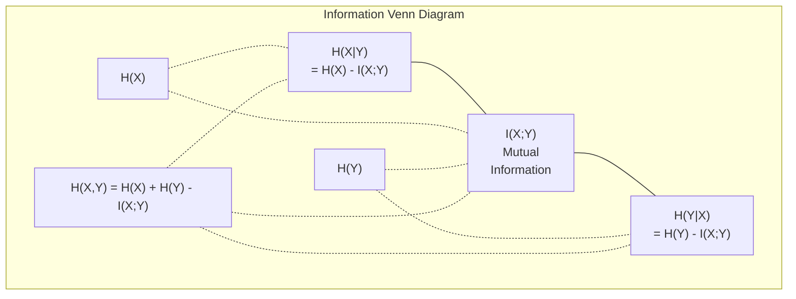

# Théorie de l'information

> La théorie de l'information mesure la surprise.

**Type:** Learn
**Language:**Python
**Prerequisites:** Phase 1, Lesson 06 (Probability)
**Time:** ~60 minutes

## Objectifs d'apprentissage

- Compute l'entropie, l'entropie croisée et la divergence KL à partir de zéro et explique leur relation
- Déduire pourquoi minimiser la perte d'entropie croisée est équivalent à maximiser la probabilité de logement
- Calculer les informations mutuelles entre les caractéristiques et une cible pour classer l'importance des caractéristiques
- Expliquer la perplexité en tant que taille de vocabulaire efficace choisie par un modèle de langue

## Le problème

Vous appelez .`CrossEntropyLoss()`Vous voyez "perplexité" dans chaque modèle de langage. Vous lisez sur la divergence KL dans les VAE, la distillation et la RLHF. Ce ne sont pas des concepts déconnectés.

La théorie de l'information vous donne le langage pour raisonner sur l'incertitude, la compression et la prédiction. Claude Shannon l'a inventé en 1948 pour résoudre les problèmes de communication.

Cette leçon construit chaque formule à partir de zéro pour que vous puissiez voir d'où elle vient et pourquoi elle fonctionne.

## Le concept

### Contenu d'information (surprise)

Quand quelque chose d'improbable se produit, il contient plus d'informations.

Le contenu d'information d'un événement avec probabilité p est:

```
I(x) = -log(p(x))
```

L'utilisation de la base log 2 vous donne des bits.

```
Event              Probability    Surprise (bits)
Fair coin heads    0.5            1.0
Rolling a 6        0.167          2.58
1-in-1000 event    0.001          9.97
Certain event      1.0            0.0
```

Certains événements ne contiennent aucune information.

### Entropie (surprise moyenne)

L'entropie est la surprise attendue sur tous les résultats possibles d'une distribution.

```
H(P) = -sum( p(x) * log(p(x)) )  for all x
```

Une pièce équitable a une entropie maximale pour une variable binaire: 1 bit. Une pièce biaisée (99% de tête) a une entropie faible: 0,08 bits. Vous savez déjà ce qui va se passer, donc chaque détour ne vous dit presque rien.

```
Fair coin:    H = -(0.5 * log2(0.5) + 0.5 * log2(0.5)) = 1.0 bit
Biased coin:  H = -(0.99 * log2(0.99) + 0.01 * log2(0.01)) = 0.08 bits
```

L'entropie mesure l'incertitude irréductible dans une distribution.

### La fonction de perte que vous utilisez tous les jours

L'entropie croisée mesure la surprise moyenne lorsque vous utilisez la distribution Q pour encoder des événements qui proviennent réellement de la distribution P.

```
H(P, Q) = -sum( p(x) * log(q(x)) )  for all x
```

P est la répartition réelle (les étiquettes). Q est la prédiction de votre modèle. Si Q correspond parfaitement à P, l'entropie croisée est égale à l'entropie.

En classification, P est un vecteur à une chaleur (la vraie classe a une probabilité de 1, tout le reste est 0.) Cela simplifie l'entropie croisée à:

```
H(P, Q) = -log(q(true_class))
```

C'est la formule de perte de l'entropie croisée pour la classification.

### KL Divergence (distance entre les distributions)

La divergence KL mesure la surprise supplémentaire que vous obtenez en utilisant Q au lieu de P.

```
D_KL(P || Q) = sum( p(x) * log(p(x) / q(x)) )  for all x
             = H(P, Q) - H(P)
```

L'entropie croisée est l'entropie plus la divergence KL. Puisque l'entropie de la vraie distribution est constante pendant l'entraînement, minimiser l'entropie croisée est la même chose que minimiser la divergence KL. Vous poussez la distribution de votre modèle vers la vraie distribution.

La divergence KL n'est pas symétrique: D_KL(P ∫ Q) != D_KL(Q ∫ P). Ce n'est pas une mesure de distance réelle.

### Informations mutuelles

L'information mutuelle mesure la quantité de savoir une variable vous dit sur une autre.

```
I(X; Y) = H(X) - H(X|Y)
        = H(X) + H(Y) - H(X, Y)
```

Si X et Y sont indépendants, les informations mutuelles sont zéro. Le fait de connaître l'une ne vous dit rien de l'autre. Si elles sont parfaitement corrélées, les informations mutuelles sont égales à l'entropie de l'une ou l'autre des variables.

Dans la sélection des caractéristiques, une information mutuelle élevée entre une caractéristique et la cible signifie que la caractéristique est utile.

### Entropie conditionnelle

H(Y de X) mesure la quantité d'incertitude qui reste à propos de Y après l'observation de X.

```
H(Y|X) = H(X,Y) - H(X)
```

Deux extrêmes:
- Si X détermine complètement Y, alors H(Y ≠X) = 0. Connaître X élimine toute incertitude à propos de Y. Exemple: X = température en Celsius, Y = température en Fahrenheit.
- Si X ne vous dit rien sur Y, alors H(YX ) = H(Y). Savoir X ne réduit pas votre incertitude du tout. Exemple: X = retour de monnaie, Y = la météo de demain.

L'entropie conditionnelle est toujours non négative et ne dépasse jamais H(Y):

```
0 <= H(Y|X) <= H(Y)
```

Dans l'apprentissage automatique, l'entropie conditionnelle apparaît dans les arbres de décision. À chaque fraction, l'algorithme choisit la fonction X qui minimise H(Y) - la fonction qui élimine la plus grande incertitude sur l'étiquette Y.

### Entropie conjointe

H ((X,Y) est l'entropie de la distribution commune de X et Y ensemble.

```
H(X,Y) = -sum sum p(x,y) * log(p(x,y))   for all x, y
```

Propriété clé:

```
H(X,Y) <= H(X) + H(Y)
```

L'égalité est valable lorsque X et Y sont indépendants. Si ils partagent des informations, l'entropie commune est inférieure à la somme des entropies individuelles. L'entropie " manquante " est exactement l'information mutuelle.



Les relations:
- H(X,Y) = H(X) + H(Y
- Le nombre de personnes concernées est de 0,5% à 0,5%
- H(X,Y) = H(X) + H(Y) - I(X;Y)

### Informations mutuelles (couche profonde)

L'information mutuelle I(X;Y) quantifie à quel point la connaissance d'une variable réduit l'incertitude quant à l'autre.

```
I(X;Y) = H(X) - H(X|Y)
       = H(Y) - H(Y|X)
       = H(X) + H(Y) - H(X,Y)
       = sum sum p(x,y) * log(p(x,y) / (p(x) * p(y)))
```

Propriétés:
- J'ai toujours X, Y, >= 0, vous ne perdez jamais d'information en observant quelque chose.
- I(X;Y) = 0 si et seulement si X et Y sont indépendants.
- Il est symétrique, contrairement à la divergence KL.
- I(X;X) = H(X). Une variable partage toutes ses informations avec elle-même.

**Mutual information for feature selection.**Dans ML, vous voulez des fonctionnalités qui sont informatives sur la cible.

1. Pour chaque fonction X_i, calculer I(X_i; Y) où Y est la variable cible.
2. Les caractéristiques de classement par score MI.
3. Gardez les caractéristiques de haut.

Cela fonctionne pour toute relation entre fonction et cible -- linéaire, non linéaire, monotone, ou non. La corrélation ne capture que les relations linéaires.

| Method | Detects | Computational cost | Handles categorical? |
|--------|---------|-------------------|---------------------|
| Pearson correlation | Linear relationships | O(n) | No |
| Spearman correlation | Monotonic relationships | O(n log n) | No |
| Mutual information | Any statistical dependency | O(n log n) with binning | Yes |

### Légimentation des étiquettes et entropie croisée

La classification standard utilise des cibles dures: [0, 0, 1, 0]. La vraie classe obtient la probabilité 1, tout le reste obtient 0.

```
soft_target = (1 - epsilon) * hard_target + epsilon / num_classes
```

Avec epsilon = 0,1 et 4 classes:
- Cible difficile: [0, 0, 1, 0]
- Cible douce: [0,025, 0,025, 0,925, 0,025]

D'un point de vue de la théorie de l'information, le lissage des étiquettes augmente l'entropie de la distribution cible. Les cibles dures à une seule chaleur ont une entropie de 0 - il n'y a pas d'incertitude. Les cibles douces ont une entropie positive.

Pourquoi cela aide- t- il ?
- empêche le modèle de faire passer les logits à des valeurs extrêmes (il faudrait des logits infinies pour correspondre parfaitement à une cible à un seul point chaud sous entropie croisée)
- Agit comme une régularisation: le modèle ne peut pas être 100% sûr
- Améliore l'étalonnage: les probabilités prévues reflètent mieux l'incertitude réelle
- Réduit l'écart entre la formation et le comportement d'inférence

La perte d'entropie croisée avec l'allumage des étiquettes devient:

```
L = (1 - epsilon) * CE(hard_target, prediction) + epsilon * H_uniform(prediction)
```

Le deuxième terme pénalise les prédictions qui sont loin d'être uniformes -- une régularisation directe de la confiance.

### Pourquoi l'entropie croisée est la perte de classification

Trois points de vue, la même conclusion.

**Information theory view.**L'entropie croisée mesure le nombre de bits que vous gaspillez en utilisant la distribution de votre modèle au lieu de la réelle distribution.

**Maximum likelihood view.**Pour les échantillons de formation N avec des classes vraies y_i:

```
Likelihood     = product( q(y_i) )
Log-likelihood = sum( log(q(y_i)) )
Negative log-likelihood = -sum( log(q(y_i)) )
```

Cette dernière ligne est la perte d'entropie croisée.

**Gradient view.**Le gradient de l'entropie croisée par rapport aux logits est simple (prédit - vrai). propre, stable et rapide à calculer. C'est pourquoi il s'accouple parfaitement avec softmax.

### Les bits contre les nats

La seule différence est la base du log.

```
log base 2   -> bits      (information theory tradition)
log base e   -> nats      (machine learning convention)
log base 10  -> hartleys  (rarely used)
```

1 nat = 1/ln(2) bits = 1,4427 bits. PyTorch et TensorFlow utilisent par défaut des logs naturels (nats).

### La perplexité

La perplexité est l'exponentiel de l'entropie croisée.

```
Perplexity = 2^H(P,Q)   (if using bits)
Perplexity = e^H(P,Q)   (if using nats)
```

Un modèle de langage avec une complexité de 50 est, en moyenne, aussi confus qu'il devait choisir uniformément parmi 50 prochains jetons possibles.

GPT-2 a atteint une perplexité de ~30 sur les critères de référence communs.

```figure
entropy-kl
```

## Faites-le

### Étape 1: Contenu et entropie de l'information

```python
import math

def information_content(p, base=2):
    if p <= 0 or p > 1:
        return float('inf') if p <= 0 else 0.0
    return -math.log(p) / math.log(base)

def entropy(probs, base=2):
    return sum(
        p * information_content(p, base)
        for p in probs if p > 0
    )

fair_coin = [0.5, 0.5]
biased_coin = [0.99, 0.01]
fair_die = [1/6] * 6

print(f"Fair coin entropy:   {entropy(fair_coin):.4f} bits")
print(f"Biased coin entropy: {entropy(biased_coin):.4f} bits")
print(f"Fair die entropy:    {entropy(fair_die):.4f} bits")
```

### Étape 2: Entropie croisée et divergence KL

```python
def cross_entropy(p, q, base=2):
    total = 0.0
    for pi, qi in zip(p, q):
        if pi > 0:
            if qi <= 0:
                return float('inf')
            total += pi * (-math.log(qi) / math.log(base))
    return total

def kl_divergence(p, q, base=2):
    return cross_entropy(p, q, base) - entropy(p, base)

true_dist = [0.7, 0.2, 0.1]
good_model = [0.6, 0.25, 0.15]
bad_model = [0.1, 0.1, 0.8]

print(f"Entropy of true dist:     {entropy(true_dist):.4f} bits")
print(f"CE (good model):          {cross_entropy(true_dist, good_model):.4f} bits")
print(f"CE (bad model):           {cross_entropy(true_dist, bad_model):.4f} bits")
print(f"KL divergence (good):     {kl_divergence(true_dist, good_model):.4f} bits")
print(f"KL divergence (bad):      {kl_divergence(true_dist, bad_model):.4f} bits")
```

### Étape 3: Entropie croisée en tant que perte de classification

```python
def softmax(logits):
    max_logit = max(logits)
    exps = [math.exp(z - max_logit) for z in logits]
    total = sum(exps)
    return [e / total for e in exps]

def cross_entropy_loss(true_class, logits):
    probs = softmax(logits)
    return -math.log(probs[true_class])

logits = [2.0, 1.0, 0.1]
true_class = 0

probs = softmax(logits)
loss = cross_entropy_loss(true_class, logits)

print(f"Logits:      {logits}")
print(f"Softmax:     {[f'{p:.4f}' for p in probs]}")
print(f"True class:  {true_class}")
print(f"Loss:        {loss:.4f} nats")
print(f"Perplexity:  {math.exp(loss):.2f}")
```

### Étape 4: L'entropie croisée est égale à la probabilité de log négatif

```python
import random

random.seed(42)

n_samples = 1000
n_classes = 3
true_labels = [random.randint(0, n_classes - 1) for _ in range(n_samples)]
model_logits = [[random.gauss(0, 1) for _ in range(n_classes)] for _ in range(n_samples)]

ce_loss = sum(
    cross_entropy_loss(label, logits)
    for label, logits in zip(true_labels, model_logits)
) / n_samples

nll = -sum(
    math.log(softmax(logits)[label])
    for label, logits in zip(true_labels, model_logits)
) / n_samples

print(f"Cross-entropy loss:      {ce_loss:.6f}")
print(f"Negative log-likelihood: {nll:.6f}")
print(f"Difference:              {abs(ce_loss - nll):.2e}")
```

### Étape 5: Informations mutuelles

```python
def mutual_information(joint_probs, base=2):
    rows = len(joint_probs)
    cols = len(joint_probs[0])

    margin_x = [sum(joint_probs[i][j] for j in range(cols)) for i in range(rows)]
    margin_y = [sum(joint_probs[i][j] for i in range(rows)) for j in range(cols)]

    mi = 0.0
    for i in range(rows):
        for j in range(cols):
            pxy = joint_probs[i][j]
            if pxy > 0:
                mi += pxy * math.log(pxy / (margin_x[i] * margin_y[j])) / math.log(base)
    return mi

independent = [[0.25, 0.25], [0.25, 0.25]]
dependent = [[0.45, 0.05], [0.05, 0.45]]

print(f"MI (independent): {mutual_information(independent):.4f} bits")
print(f"MI (dependent):   {mutual_information(dependent):.4f} bits")
```

## Utilisez-le

Les mêmes concepts utilisant NumPy, la façon dont vous les utiliserez en pratique:

```python
import numpy as np

def np_entropy(p):
    p = np.asarray(p, dtype=float)
    mask = p > 0
    result = np.zeros_like(p)
    result[mask] = p[mask] * np.log(p[mask])
    return -result.sum()

def np_cross_entropy(p, q):
    p, q = np.asarray(p, dtype=float), np.asarray(q, dtype=float)
    mask = p > 0
    return -(p[mask] * np.log(q[mask])).sum()

def np_kl_divergence(p, q):
    return np_cross_entropy(p, q) - np_entropy(p)

true = np.array([0.7, 0.2, 0.1])
pred = np.array([0.6, 0.25, 0.15])
print(f"Entropy:    {np_entropy(true):.4f} nats")
print(f"Cross-ent:  {np_cross_entropy(true, pred):.4f} nats")
print(f"KL div:     {np_kl_divergence(true, pred):.4f} nats")
```

Tu as construit de rien .`torch.nn.CrossEntropyLoss()`Vous savez maintenant pourquoi la perte diminue pendant l'entraînement: la distribution prévue de votre modèle approche de la réelle distribution, mesurée en nœuds d'informations gaspillées.

## Exercices

1. Comptez l'entropie de l'alphabet anglais en supposant une répartition uniforme (26 lettres). Puis évaluez-la en utilisant les fréquences de lettres réelles.

2. Un modèle donne des logits [5,0, 2.0, 0.5] pour un échantillon avec une classe vraie 1. Calculer la perte d'entropie croisée à la main, puis vérifier avec votre `cross_entropy_loss`Quelle logite donnerait zéro perte ?

3. Montrez que la divergence KL n'est pas symétrique. Choisissez deux distributions P et Q et comptez D_KL_P_K  Q) et DL Q  P). Expliquez pourquoi elles diffèrent.

4. Construisez une fonction qui calcule la perplexité d'une séquence de prédictions de jetons.

## Les termes clés

| Term | What people say | What it actually means |
|------|----------------|----------------------|
| Information content | "Surprise" | The number of bits (or nats) needed to encode an event: -log(p) |
| Entropy | "Randomness" | The average surprise across all outcomes of a distribution. Measures irreducible uncertainty. |
| Cross-entropy | "The loss function" | Average surprise when using model distribution Q to encode events from true distribution P. |
| KL divergence | "Distance between distributions" | Extra bits wasted by using Q instead of P. Equals cross-entropy minus entropy. Not symmetric. |
| Mutual information | "How related are X and Y" | Reduction in uncertainty about X from knowing Y. Zero means independent. |
| Softmax | "Turn logits into probabilities" | Exponentiate and normalize. Maps any real-valued vector to a valid probability distribution. |
| Perplexity | "How confused the model is" | Exponential of cross-entropy. The effective vocabulary size the model is choosing from at each step. |
| Bits | "Shannon's unit" | Information measured with log base 2. One bit resolves one fair coin flip. |
| Nats | "ML's unit" | Information measured with natural log. Used by PyTorch and TensorFlow by default. |
| Negative log-likelihood | "NLL loss" | Identical to cross-entropy loss for one-hot labels. Minimizing it maximizes the probability of correct predictions. |

## Pour en savoir plus

- [Shannon 1948: A Mathematical Theory of Communication](https://people.math.harvard.edu/~ctm/home/text/others/shannon/entropy/entropy.pdf)- le papier original, toujours lisible
- [Visual Information Theory (Chris Olah)](https://colah.github.io/posts/2015-09-Visual-Information/)- la meilleure explication visuelle de l'entropie et de la divergence KL
- [PyTorch CrossEntropyLoss docs](https://pytorch.org/docs/stable/generated/torch.nn.CrossEntropyLoss.html)- comment le cadre met en œuvre ce que vous venez de construire
