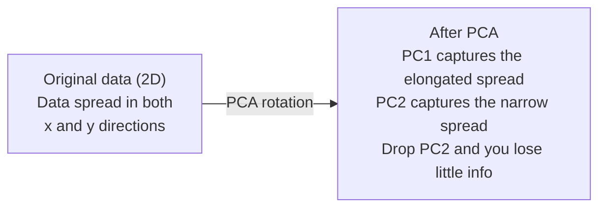

# Réduction de la dimensionnalité

> Les données haute dimension ont une structure. Vous pouvez les trouver en regardant sous le bon angle.

**Type:** Build
**Language:**Python
**Prerequisites:** Phase 1, Lessons 01 (Linear Algebra Intuition), 02 (Vectors, Matrices & Operations), 03 (Eigenvalues & Eigenvectors), 06 (Probability & Distributions)
**Time:** ~90 minutes

## Objectifs d'apprentissage

- Implémentation de PCA à partir de zéro: données centrales, calcul de la matrice de covariance, proprecomposition et projet
- Utiliser le ratio de variance expliqué et la méthode du coude pour choisir le nombre de composants principaux
- Comparer PCA, t-SNE et UMAP pour visualiser les chiffres MNIST en 2D et expliquer leurs compromis
- Appliquer le noyau PCA avec un noyau RBF pour séparer les structures de données non linéaires que le PCA standard ne peut pas gérer

## Le problème

Vous avez un ensemble de données avec 784 caractéristiques par échantillon. Peut-être que ce sont des valeurs de pixels de chiffres écrits à la main. Peut-être que ce sont des niveaux d'expression des gènes. Peut-être que ce sont des signaux de comportement de l'utilisateur. Vous ne pouvez pas visualiser 784 dimensions. Vous ne pouvez pas les tracer. Vous ne pouvez même pas penser à eux.

Mais la plupart de ces 784 sont redondants. L'information réelle vit sur une surface beaucoup plus petite. Un "7" écrit à la main n'a pas besoin de 784 numéros indépendants pour le décrire. Il a besoin de quelques-uns: l'angle du coup, la longueur de la barre croisée, combien elle penche. Le reste est le bruit.

La réduction de dimension trouve cette surface plus petite, elle prend vos données 784 dimensions et les comprime à 2, 10 ou 50 dimensions tout en conservant la structure qui compte.

## Le concept

### La malédiction de la dimensionnalité

Les espaces haute dimension sont inintuitifs.

**Distance becomes meaningless.**Dans les dimensions élevées, la distance entre deux points aléatoires converge à la même valeur. Si chaque point est à peu près la même distance de chaque autre point, la recherche du voisin le plus proche cesse de fonctionner.

```
Dimension    Avg distance ratio (max/min between random points)
2            ~5.0
10           ~1.8
100          ~1.2
1000         ~1.02
```

**Volume concentrates in corners.**Un hypercube unitaire en dimensions d a des coins 2D. Dans 100 dimensions, presque tout le volume est dans les coins, loin du centre.

**You need exponentially more data.**Pour maintenir la même densité d'échantillons dans un espace, passer de 2D à 20D signifie que vous avez besoin de 10 à 18 fois plus de données. Vous n'en avez jamais assez. La réduction des dimensions ramène la densité des données à quelque chose de viable.

### PCA: trouver les directions qui comptent

L'analyse des composants principaux (PCA) détermine les axes sur lesquels vos données varient le plus. Il fait tourner votre système de coordonnées de sorte que le premier axe capture le plus de variance, le second le plus de variance, et ainsi de suite.

L' algorithme:

```
1. Center the data        (subtract the mean from each feature)
2. Compute covariance     (how features move together)
3. Eigendecomposition     (find the principal directions)
4. Sort by eigenvalue     (biggest variance first)
5. Project               (keep top k eigenvectors, drop the rest)
```

Pourquoi la composition propre ? La matrice de covariance est symétrique et semi-définie positive. Ses propres vecteurs sont des directions orthogonales dans l'espace de caractéristiques. Les valeurs propres vous indiquent combien de variance chaque direction capture. Le propre vecteur avec les plus grands points de valeur propre le long de la direction de la variance maximale.



- **Before PCA:**Le nuage de données est dispersé en diagonale sur les axes x et y
- **After PCA:**Le système de coordonnées est tourné de sorte que PC1 s'aligne avec la direction de la variance maximale (différence allongée) et PC2 avec la direction de la variance minimale (différence étroite).
- **Dimensionality reduction:**Le PC2 projette les données sur PC1, perdant très peu d'informations

### Ratio de variance expliqué

Chaque composant principal capture une fraction de la variance totale.

```
Component    Eigenvalue    Explained ratio    Cumulative
PC1          4.73          0.473              0.473
PC2          2.51          0.251              0.724
PC3          1.12          0.112              0.836
PC4          0.89          0.089              0.925
...
```

Lorsque la variance cumulée expliquée atteint 0,95, vous savez que de nombreux composants capturent 95% des informations.

### Choisir le nombre de composants

Trois stratégies:

1. **Threshold.**Conservez suffisamment de composants pour expliquer 90 à 95% de la variance.
2. **Elbow method.**Le complot explique la variance par composant.
3. **Downstream performance.**Utilisez le PCA comme préprocessage.

### T-SNE: préserver les quartiers

t-Distributed Stochastic Neighbor Embedding (t-SNE) est conçu pour la visualisation. Il cartographient les données haute dimension en 2D (ou 3D) tout en préservant les points proches les uns des autres.

L'intuition: dans l'espace original, calculer une répartition de probabilité sur des paires de points en fonction de leurs distances. Les points proches obtiennent une probabilité élevée. Les points éloignés obtiennent une probabilité faible. Alors trouver un arrangement 2D où la même répartition de probabilité est valable.

Propriétés clés de t-SNE:
- Il peut déployer des variétés complexes que l'ACP ne peut pas.
- Les différentes courses produisent des dispositions différentes.
- Le paramètre de perplexité détermine le nombre de voisins à considérer (intervalle typique: 5-50).
- Les distances entre les grappes dans la sortie ne sont pas significatives.
- Lent sur les grands ensembles de données.

### UMAP: une structure globale plus rapide et meilleure

L'approximation et la projection à manifold uniforme (UMAP) fonctionne de la même manière que t-SNE, mais avec deux avantages:
- Il utilise des graphiques proches du voisinage plutôt que de calculer toutes les distances par paires.
- La structure globale améliorée: les positions relatives des groupes dans la production ont tendance à être plus significatives que dans les T-SNE.

UMAP construit un graphique pondéré dans l'espace haute dimension (la "représentation topologique floue") et trouve ensuite un plan bas-dimensionnel qui préserve ce graphique aussi bien que possible.

Paramètres clés:
- `n_neighbors`Les valeurs plus élevées préservent une structure plus globale.
- `min_dist`Les valeurs inférieures créent des grappes plus denses.

### Quand utiliser quel

| Method | Use case | Preserves | Speed |
|--------|----------|-----------|-------|
| PCA | Preprocessing before training | Global variance | Fast (exact), works on millions of samples |
| PCA | Quick exploratory visualization | Linear structure | Fast |
| t-SNE | Publication-quality 2D plots | Local neighborhoods | Slow (< 10k samples ideal) |
| UMAP | 2D visualization at scale | Local + some global structure | Medium (handles millions) |
| PCA | Feature reduction for models | Variance-ranked features | Fast |
| t-SNE / UMAP | Understanding cluster structure | Cluster separation | Medium to slow |

Règle générale: utilisez PCA pour le prétraitement et la compression des données. Utilisez t-SNE ou UMAP lorsque vous devez visualiser la structure en 2D.

### PCA du noyau

Le PCA standard trouve des sous-espaces linéaires. Il tourne votre système de coordonnées et dépose les axes. Mais que se passe-t-il si les données se trouvent sur un polyvalent non linéaire? Un cercle en 2D ne peut être séparé par aucune ligne.

Le noyau PCA applique le PCA dans un espace de fonctionnalités haute dimension induit par une fonction du noyau, sans calculer explicitement les coordonnées dans cet espace.

L' algorithme:
1. Compute la matrice du noyau K où K_ij = k(x_i, x_j)
2. Centrez la matrice du noyau dans l'espace des fonctionnalités
3. Eigendecompose la matrice du noyau centrée
4. Les vecteurs propres supérieurs (échelonnés par 1/sqrt(value propre)) sont les projections

Fonctions courantes du noyau:

| Kernel | Formula | Good for |
|--------|---------|----------|
| RBF (Gaussian) | exp(-gamma * \|\|x - y\|\|^2) | Most nonlinear data, smooth manifolds |
| Polynomial | (x . y + c)^d | Polynomial relationships |
| Sigmoid | tanh(alpha * x . y + c) | Neural network-like mappings |

Lorsque l'utilisation du noyau PCA par rapport à l'utilisation standard PCA:

| Criterion | Standard PCA | Kernel PCA |
|-----------|-------------|------------|
| Data structure | Linear subspace | Nonlinear manifold |
| Speed | O(min(n^2 d, d^2 n)) | O(n^2 d + n^3) |
| Interpretability | Components are linear combinations of features | Components lack direct feature interpretation |
| Scalability | Works on millions of samples | Kernel matrix is n x n, memory-limited |
| Reconstruction | Direct inverse transform | Requires pre-image approximation |

L'exemple classique: cercles concentriques en 2D. Deux cercles de points, l'un à l'intérieur de l'autre. PCA standard projette les deux sur la même ligne - inutile pour la classification. PCA du noyau avec un noyau RBF cartographient le cercle intérieur et le cercle extérieur vers différentes régions, les rendant linéairement séparables.

### Erreur de reconstruction

Vous avez comprimé 784 dimensions à 50.

Mesurer l'erreur de reconstruction:
1. Données du projet à k dimensions: X_réduit = X @ W_k
2. Reconstruire: X_hat = X_reducé @ W_k^T
3. MSE de calcul: moyenne (X - X_hat) ^2)

Pour PCA, l'erreur de reconstruction a une relation nette avec la variance expliquée:

```
Reconstruction error = sum of eigenvalues NOT included
Total variance = sum of ALL eigenvalues
Fraction lost = (sum of dropped eigenvalues) / (sum of all eigenvalues)
```

Le rapport de variance expliqué pour chaque composant est le suivant:

```
explained_ratio_k = eigenvalue_k / sum(all eigenvalues)
```

Le tracé de la variance cumulative expliquée par rapport au nombre de composants vous donne la courbe "coup d'épaule".
- La courbe s'applique (rendement en diminution)
- La variance cumulée dépasse votre seuil (généralement 0,90 ou 0,95)
- Plateaux de performance des tâches en aval

L'erreur de reconstruction est utile au-delà du choix de k. Vous pouvez l'utiliser pour la détection d'anomalies: les échantillons présentant une erreur de reconstruction élevée sont des échantillons hors de rapport qui ne correspondent pas au sous-espace appris.

```figure
pca-axes
```

## Faites-le

### Étape 1: PCA à partir de zéro

```python
import numpy as np

class PCA:
    def __init__(self, n_components):
        self.n_components = n_components
        self.components = None
        self.mean = None
        self.eigenvalues = None
        self.explained_variance_ratio_ = None

    def fit(self, X):
        self.mean = np.mean(X, axis=0)
        X_centered = X - self.mean

        cov_matrix = np.cov(X_centered, rowvar=False)

        eigenvalues, eigenvectors = np.linalg.eigh(cov_matrix)

        sorted_idx = np.argsort(eigenvalues)[::-1]
        eigenvalues = eigenvalues[sorted_idx]
        eigenvectors = eigenvectors[:, sorted_idx]

        self.components = eigenvectors[:, :self.n_components].T
        self.eigenvalues = eigenvalues[:self.n_components]
        total_var = np.sum(eigenvalues)
        self.explained_variance_ratio_ = self.eigenvalues / total_var

        return self

    def transform(self, X):
        X_centered = X - self.mean
        return X_centered @ self.components.T

    def fit_transform(self, X):
        self.fit(X)
        return self.transform(X)
```

### Étape 2: Test sur les données synthétiques

```python
np.random.seed(42)
n_samples = 500

t = np.random.uniform(0, 2 * np.pi, n_samples)
x1 = 3 * np.cos(t) + np.random.normal(0, 0.2, n_samples)
x2 = 3 * np.sin(t) + np.random.normal(0, 0.2, n_samples)
x3 = 0.5 * x1 + 0.3 * x2 + np.random.normal(0, 0.1, n_samples)

X_synthetic = np.column_stack([x1, x2, x3])

pca = PCA(n_components=2)
X_reduced = pca.fit_transform(X_synthetic)

print(f"Original shape: {X_synthetic.shape}")
print(f"Reduced shape:  {X_reduced.shape}")
print(f"Explained variance ratios: {pca.explained_variance_ratio_}")
print(f"Total variance captured: {sum(pca.explained_variance_ratio_):.4f}")
```

### Étape 3: chiffres MNIST en 2D

```python
from sklearn.datasets import fetch_openml

mnist = fetch_openml("mnist_784", version=1, as_frame=False, parser="auto")
X_mnist = mnist.data[:5000].astype(float)
y_mnist = mnist.target[:5000].astype(int)

pca_mnist = PCA(n_components=50)
X_pca50 = pca_mnist.fit_transform(X_mnist)
print(f"50 components capture {sum(pca_mnist.explained_variance_ratio_):.2%} of variance")

pca_2d = PCA(n_components=2)
X_pca2d = pca_2d.fit_transform(X_mnist)
print(f"2 components capture {sum(pca_2d.explained_variance_ratio_):.2%} of variance")
```

### Étape 4: Comparer avec sklearn

```python
from sklearn.decomposition import PCA as SklearnPCA
from sklearn.manifold import TSNE

sklearn_pca = SklearnPCA(n_components=2)
X_sklearn_pca = sklearn_pca.fit_transform(X_mnist)

print(f"\nOur PCA explained variance:     {pca_2d.explained_variance_ratio_}")
print(f"Sklearn PCA explained variance: {sklearn_pca.explained_variance_ratio_}")

diff = np.abs(np.abs(X_pca2d) - np.abs(X_sklearn_pca))
print(f"Max absolute difference: {diff.max():.10f}")

tsne = TSNE(n_components=2, perplexity=30, random_state=42)
X_tsne = tsne.fit_transform(X_mnist)
print(f"\nt-SNE output shape: {X_tsne.shape}")
```

### Étape 5: Comparation de l'UMAP

```python
try:
    from umap import UMAP

    reducer = UMAP(n_components=2, n_neighbors=15, min_dist=0.1, random_state=42)
    X_umap = reducer.fit_transform(X_mnist)
    print(f"UMAP output shape: {X_umap.shape}")
except ImportError:
    print("Install umap-learn: pip install umap-learn")
```

## Utilisez-le

L'APC comme préprocessage avant un classifiant:

```python
from sklearn.decomposition import PCA as SklearnPCA
from sklearn.linear_model import LogisticRegression
from sklearn.model_selection import train_test_split
from sklearn.metrics import accuracy_score

X_train, X_test, y_train, y_test = train_test_split(
    X_mnist, y_mnist, test_size=0.2, random_state=42
)

results = {}
for k in [10, 30, 50, 100, 200]:
    pca_k = SklearnPCA(n_components=k)
    X_tr = pca_k.fit_transform(X_train)
    X_te = pca_k.transform(X_test)

    clf = LogisticRegression(max_iter=1000, random_state=42)
    clf.fit(X_tr, y_train)
    acc = accuracy_score(y_test, clf.predict(X_te))
    var_captured = sum(pca_k.explained_variance_ratio_)
    results[k] = (acc, var_captured)
    print(f"k={k:>3d}  accuracy={acc:.4f}  variance={var_captured:.4f}")
```

Des plateaux de performance bien avant les dimensions 784.

## La faire partir

Cette leçon donne:
- `outputs/skill-dimensionality-reduction.md`- une aptitude à choisir la bonne technique de réduction de dimensionnalité pour une tâche donnée

## Exercices

1. Modifier la classe PCA pour soutenir `inverse_transform`. Reconstruire les chiffres MNIST à partir de 10, 50 et 200 composants. Imprimez l'erreur de reconstruction (différence moyenne carré de l'original) pour chacun.

2. Exécuter t-SNE sur le même sous-ensemble MNIST avec des valeurs de perplexité de 5, 30 et 100. Décrivez comment la sortie change. Pourquoi la perplexité affecte-t-elle la fermeté du cluster?

3. Prenez un ensemble de données de 50 caractéristiques dont seulement 5 sont informatives (générez une avec `sklearn.datasets.make_classification`) Appliquer le PCA et vérifier si la courbe de variance expliquée identifie correctement que les données sont effectivement cinq dimensions.

## Les termes clés

| Term | What people say | What it actually means |
|------|----------------|----------------------|
| Curse of dimensionality | "Too many features" | Distances, volumes, and data density all behave counterintuitively as dimensions grow. Models need exponentially more data to compensate. |
| PCA | "Reduce dimensions" | Rotate your coordinate system so the axes align with the directions of maximum variance, then drop the low-variance axes. |
| Principal component | "An important direction" | An eigenvector of the covariance matrix. The direction in feature space along which the data varies most. |
| Explained variance ratio | "How much info this component has" | The fraction of total variance captured by one principal component. Sum the top k ratios to see how much k components preserve. |
| Covariance matrix | "How features correlate" | A symmetric matrix where entry (i,j) measures how feature i and feature j move together. Diagonal entries are individual variances. |
| t-SNE | "That cluster plot" | A nonlinear method that maps high-dimensional data to 2D by preserving pairwise neighborhood probabilities. Good for visualization, not for preprocessing. |
| UMAP | "Faster t-SNE" | A nonlinear method based on topological data analysis. Preserves both local and some global structure. Scales better than t-SNE. |
| Perplexity | "A t-SNE knob" | Controls the effective number of neighbors each point considers. Low perplexity focuses on very local structure. High perplexity captures broader patterns. |
| Manifold | "The surface the data lives on" | A lower-dimensional surface embedded in a higher-dimensional space. A sheet of paper crumpled in 3D is a 2D manifold. |

## Pour en savoir plus

- [A Tutorial on Principal Component Analysis](https://arxiv.org/abs/1404.1100)(Shlens) - dérivation claire de l'ACP à partir de zéro
- [How to Use t-SNE Effectively](https://distill.pub/2016/misread-tsne/)(Wattenberg et coll.) - guide interactif sur les pièges et les choix de paramètres de l'ENE
- [UMAP documentation](https://umap-learn.readthedocs.io/)- la théorie et les orientations pratiques des auteurs de l'UMAP
