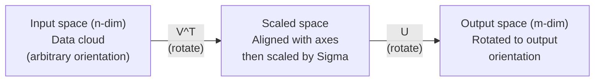
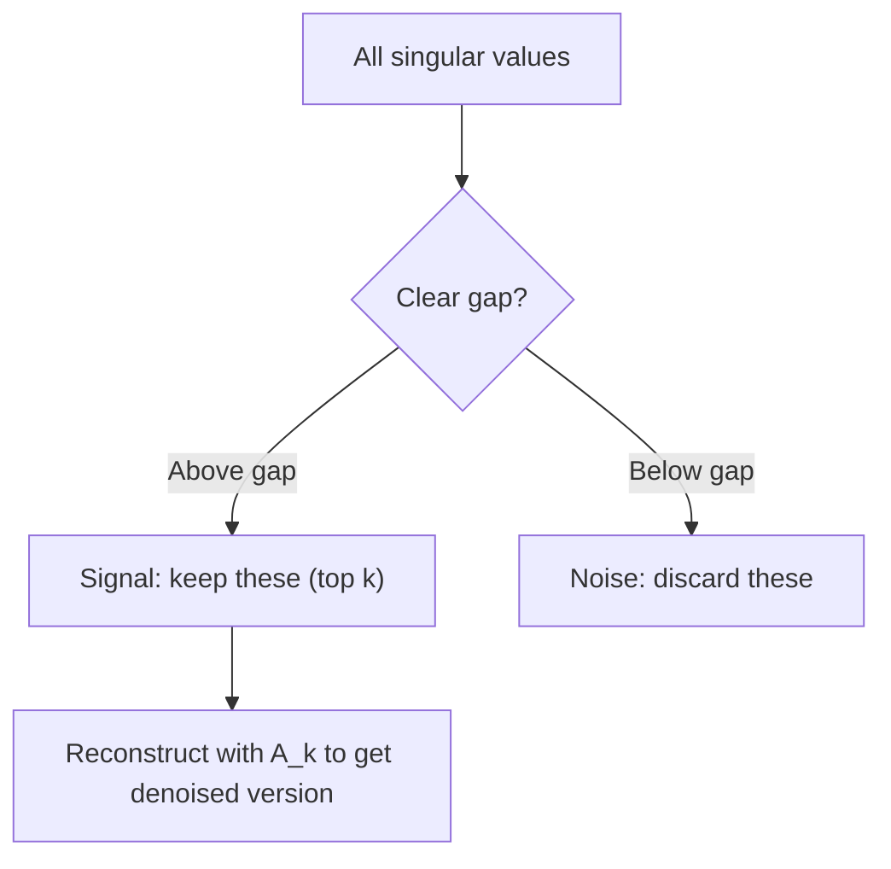

# Décomposition de la valeur singulière

> Le SVD est le couteau de l'armée suisse de l'algèbre linéaire.

**Type:** Build
**Languages:** Python, Julia
**Prerequisites:** Phase 1, Lessons 01 (Linear Algebra Intuition), 02 (Vectors & Matrices Operations), 03 (Matrix Transformations)
**Time:** ~120 minutes

## Objectifs d'apprentissage

- Implémenter le SVD par l'itération de puissance et expliquer la signification géométrique de U, Sigma et V^T
- Appliquer des SVD tronqués pour la compression d'image et mesurer le rapport compression vs erreur de reconstruction
- Compute la pseudo-inverse Moore-Penrose via SVD pour résoudre les systèmes de plus-quadrés définies
- Connecter le SVD à la PCA, les systèmes de recommandation (facteurs latente) et l'analyse sémantique latente en PNL

## Le problème

Vous avez une matrice 1000x2000. Peut-être que c'est une note de film utilisateur. Peut-être que c'est une table de fréquences à terme document. Peut-être que c'est les valeurs de pixels d'une image. Vous devez la compresser, la dénoncer, trouver une structure cachée en elle, ou résoudre un système de minuscules carrés avec elle. Eigendecomposition ne fonctionne que sur des matrices carrées. Même alors, il faut que la matrice ait un ensemble complet de propriété vecteurs indépendants linéairement.

Le SVD fonctionne sur n'importe quelle matrice, n'importe quelle forme, n'importe quel rang, aucune condition, il décompose la matrice en trois facteurs qui révèlent la géométrie de ce que la matrice fait à l'espace.

## Le concept

### Ce que fait le SVD géométriquement

Chaque matrice, quelle que soit sa forme, effectue trois opérations en séquence: tourner, échelle, tourner.

```
A = U * Sigma * V^T

      m x n     m x m    m x n    n x n
     (any)    (rotate)  (scale)  (rotate)
```

En fonction de la matrice A, le SVD la classe en:
- V^T fait tourner des vecteurs dans l'espace d'entrée (n-dimensionnel)
- Scales sigma le long de chaque axe (étirement ou comprimé)
- U fait tourner le résultat dans l'espace de sortie (m-dimensionnel)



Vous donnez à SVD une matrice qui vous dit: " Cette matrice prend une sphère d'entrée, la tourne d'abord par V^T, puis la traîne dans un ellipsoïde par Sigma, puis tourne l'ellipsoïde par U. " Les valeurs singulières sont les longitudes des axes de l'ellipsoïde.

### La décomposition complète

Pour une matrice A de forme m x n:

```
A = U * Sigma * V^T

where:
  U     is m x m, orthogonal (U^T U = I)
  Sigma is m x n, diagonal (singular values on the diagonal)
  V     is n x n, orthogonal (V^T V = I)

The singular values sigma_1 >= sigma_2 >= ... >= sigma_r > 0
where r = rank(A)
```

Les colonnes de U sont appelées vecteurs singuliers gauche. Les colonnes de V sont appelées vecteurs singuliers droites. Les entrées diagonales de Sigma sont appelées valeurs singulières. Elles sont toujours non négatives et classifiées conventionnellement dans un ordre décroissant.

### Vecteurs singuliers gauche, valeurs singulières, vecteurs singuliers droits

Chaque composant du SVD a une signification géométrique distincte.

**Right singular vectors (columns of V):**Ces éléments constituent une base orthonormale pour l'espace d'entrée (R^n). Ce sont les directions dans l'espace d'entrée que la matrice trace vers des directions orthogonales dans l'espace de sortie.

**Singular values (diagonal of Sigma):**La valeur singulière de la matrice est la valeur de l'échelle de l'échelle.

**Left singular vectors (columns of U):**Ces éléments constituent une base orthonormale pour l'espace de sortie (R^m). Le ième vecteur singulier gauche est la direction dans l'espace de sortie où le ième vecteur singulier droit atterrit (après l'échelle).

La relation entre eux:

```
A * v_i = sigma_i * u_i

The matrix A takes the i-th right singular vector v_i,
scales it by sigma_i, and maps it to the i-th left singular vector u_i.
```

Cela vous donne une image coordonnée par coordonnée de ce que fait une matrice.

### Forme de produit externe

Le SVD peut être écrit comme une somme de matrices de rang 1:

```
A = sigma_1 * u_1 * v_1^T + sigma_2 * u_2 * v_2^T + ... + sigma_r * u_r * v_r^T

Each term sigma_i * u_i * v_i^T is a rank-1 matrix (an outer product).
The full matrix is the sum of r such matrices, where r is the rank.
```

Cette forme est la base de l'approximation de rang inférieur. Chaque terme ajoute une couche de structure. Le premier terme capture le modèle le plus important. Le second capture le plus important suivant. Et ainsi de suite. Truncation de cette somme vous donne la meilleure approximation possible à un rang donné.

```
Rank-1 approx:    A_1 = sigma_1 * u_1 * v_1^T
                  (captures the dominant pattern)

Rank-2 approx:    A_2 = sigma_1 * u_1 * v_1^T + sigma_2 * u_2 * v_2^T
                  (captures the two most important patterns)

Rank-k approx:    A_k = sum of top k terms
                  (optimal by the Eckart-Young theorem)
```

### Relation avec la composition propre

Les valeurs et vecteurs singuliers d'A proviennent directement des valeurs et vecteurs propres d'A^T A et A^T.

```
A^T A = V * Sigma^T * U^T * U * Sigma * V^T
      = V * Sigma^T * Sigma * V^T
      = V * D * V^T

where D = Sigma^T * Sigma is a diagonal matrix with sigma_i^2 on the diagonal.

So:
- The right singular vectors (V) are eigenvectors of A^T A
- The singular values squared (sigma_i^2) are eigenvalues of A^T A

Similarly:
A A^T = U * Sigma * V^T * V * Sigma^T * U^T
      = U * Sigma * Sigma^T * U^T

So:
- The left singular vectors (U) are eigenvectors of A A^T
- The eigenvalues of A A^T are also sigma_i^2
```

Cette connexion vous dit trois choses:
1. Les valeurs singulières sont toujours réelles et non négatives (elles sont des racines carrées des valeurs propres d'une matrice semi-définie positive).
2. Vous pouvez calculer le SVD par la composition propre de l'A^T A, mais cela square le nombre de condition et perd la précision numérique.
3. Lorsque A est carré et symétrique semi-définie, SVD et eigendecomposition sont la même chose.

### SVD tronqué: approximation de rang inférieur

Le théorème d'Eckart-Young-Mirsky stipule que la meilleure approximation de rang k à A (à la fois Frobenius et la norme spectrale) est obtenue en conservant uniquement les valeurs singulières supérieures de k et leurs vecteurs correspondants:

```
A_k = U_k * Sigma_k * V_k^T

where:
  U_k     is m x k  (first k columns of U)
  Sigma_k is k x k  (top-left k x k block of Sigma)
  V_k     is n x k  (first k columns of V)

Approximation error = sigma_{k+1}  (in spectral norm)
                    = sqrt(sigma_{k+1}^2 + ... + sigma_r^2)  (in Frobenius norm)
```

Ce n'est pas seulement une approximation "bonne". C'est probablement la meilleure approximation possible du rang k. Aucune autre matrice de rang-k n'est plus proche de A.

| Component | Relative magnitude | Kept in rank-3 approx? |
|-----------|-------------------|------------------------|
| sigma_1 | Largest | Yes |
| sigma_2 | Large | Yes |
| sigma_3 | Medium-large | Yes |
| sigma_4 | Medium | No (error) |
| sigma_5 | Medium-small | No (error) |
| sigma_6 | Small | No (error) |
| sigma_7 | Very small | No (error) |
| sigma_8 | Tiny | No (error) |

Restez au sommet 3: A_3 capture les trois plus grandes valeurs singulières. Error = valeurs restantes (sigma_4 à sigma_8).

Si les valeurs singulières se décomposent rapidement, une petite k capture la majeure partie de la matrice.

### Compression d'image avec SVD

Une image à l'échelle de gris est une matrice d'intensité de pixel. Une image de 800x600 a 480.000 valeurs.

```
Original image: 800 x 600 = 480,000 values

SVD with rank k:
  U_k:      800 x k values
  Sigma_k:  k values
  V_k:      600 x k values
  Total:    k * (800 + 600 + 1) = k * 1401 values

  k=10:   14,010 values   (2.9% of original)
  k=50:   70,050 values  (14.6% of original)
  k=100: 140,100 values  (29.2% of original)

  The compression ratio improves as k gets smaller,
  but visual quality degrades.
```

Les premières valeurs singulières capturent la structure large (formes, gradients). Les dernières capturent les détails fins et le bruit.

### SVD pour les systèmes de recommandation

Le prix Netflix a rendu ce film célèbre. Vous avez une matrice de notation de films utilisateur où la plupart des entrées sont manquantes.

```
             Movie1  Movie2  Movie3  Movie4  Movie5
  User1      [  5      ?       3       ?       1  ]
  User2      [  ?      4       ?       2       ?  ]
  User3      [  3      ?       5       ?       ?  ]
  User4      [  ?      ?       ?       4       3  ]

  ? = unknown rating
```

L'idée: cette matrice de notations a un faible rang. Les utilisateurs n'ont pas de goûts complètement indépendants. Il y a une poignée de facteurs latents (action contre drame, vieil contre nouveau, cérébral contre viscéral) qui expliquent la plupart des préférences.

Le SVD de la matrice de notation (remplie) la décompose en:
- U: profils d'utilisateurs dans l'espace de facteurs latents
- Sigma: importance de chaque facteur latent
- V^T: profils de films dans l'espace de facteurs latents

La note prévue d'un utilisateur pour un film est le produit de point de son profil d'utilisateur avec le profil du film (poussé par des valeurs singulières).

En pratique, vous utilisez des variantes comme le SVD ou ALS de Simon Funk qui gèrent directement les données manquantes.

### SVD dans la PNL: analyse sémantique latente

L'analyse sémantique latente (LSA), également appelée indexation sémantique latente (LSI), applique le SVD à une matrice de document de terme.

```
             Doc1   Doc2   Doc3   Doc4
  "cat"      [  3      0      1      0  ]
  "dog"      [  2      0      0      1  ]
  "fish"     [  0      4      1      0  ]
  "pet"      [  1      1      1      1  ]
  "ocean"    [  0      3      0      0  ]

After SVD with rank k=2:

  Each document becomes a point in 2D "concept space."
  Each term becomes a point in the same 2D space.
  Documents about similar topics cluster together.
  Terms with similar meanings cluster together.

  "cat" and "dog" end up near each other (land pets).
  "fish" and "ocean" end up near each other (water concepts).
  Doc1 and Doc3 cluster if they share similar topics.
```

LSA a été l'une des premières méthodes à succès pour capturer la similitude sémantique à partir de texte brut. Il fonctionne parce que les termes synonymes ont tendance à apparaître dans des documents similaires, de sorte que SVD les regroupe dans les mêmes dimensions latentes.

### SVD pour la réduction du bruit

Les données bruyantes ont un signal concentré dans les valeurs singulières supérieures et le bruit réparti sur toutes les valeurs singulières.

**Clean signal singular values:**

| Component | Magnitude | Type |
|-----------|-----------|------|
| sigma_1 | Very large | Signal |
| sigma_2 | Large | Signal |
| sigma_3 | Medium | Signal |
| sigma_4 | Near zero | Negligible |
| sigma_5 | Near zero | Negligible |

**Noisy signal singular values (noise adds to all):**

| Component | Magnitude | Type |
|-----------|-----------|------|
| sigma_1 | Very large | Signal |
| sigma_2 | Large | Signal |
| sigma_3 | Medium | Signal |
| sigma_4 | Small | Noise |
| sigma_5 | Small | Noise |
| sigma_6 | Small | Noise |
| sigma_7 | Small | Noise |



Cette méthode est utilisée dans le traitement des signaux, la mesure scientifique et le nettoyage des données.

### Pseudo-inverse par voie de SVD

Le pseudo-inverse Moore-Penrose A+ généralise l'inversion de la matrice à des matrices non carrées et singulières.

```
If A = U * Sigma * V^T, then:

A+ = V * Sigma+ * U^T

where Sigma+ is formed by:
  1. Transpose Sigma (swap rows and columns)
  2. Replace each non-zero diagonal entry sigma_i with 1/sigma_i
  3. Leave zeros as zeros

For A (m x n):      A+ is (n x m)
For Sigma (m x n):  Sigma+ is (n x m)
```

Si Ax = b n'a pas de solution exacte (système surdéterminé), alors x = A + b est la solution de moins de carrés (minimise le jeu de la fois Ax - b).

```
Overdetermined system (more equations than unknowns):

  [1  1]         [3]
  [2  1] x   =   [5]       No exact solution exists.
  [3  1]         [6]

  x_ls = A+ b = V * Sigma+ * U^T * b

  This gives the x that minimizes the sum of squared residuals.
  Same result as the normal equations (A^T A)^(-1) A^T b,
  but numerically more stable.
```

### Les avantages de la stabilité numérique

Compteur de la composition propre d'A^T A squares les valeurs singulières (values propres d'A^T A sont sigma_i^2).

```
Example:
  A has singular values [1000, 1, 0.001]
  Condition number of A: 1000 / 0.001 = 10^6

  A^T A has eigenvalues [10^6, 1, 10^{-6}]
  Condition number of A^T A: 10^6 / 10^{-6} = 10^{12}

  Computing SVD directly: works with condition number 10^6
  Computing via A^T A:     works with condition number 10^{12}
                           (6 extra digits of precision lost)
```

Les algorithmes SVD modernes (bi-diagonalization Golub-Kahan) fonctionnent directement sur A, ne formant jamais A^T A. C'est pourquoi vous devriez toujours préférer`np.linalg.svd(A)`- Je suis passé .`np.linalg.eig(A.T @ A)`- Je suis désolé .

### Connexion à PCA

C'est un calcul de données centrées, ce n'est pas une analogie, c'est littéralement le même calcul.

```
Given data matrix X (n_samples x n_features), centered (mean subtracted):

Covariance matrix: C = (1/(n-1)) * X^T X

PCA finds eigenvectors of C. But:

  X = U * Sigma * V^T    (SVD of X)

  X^T X = V * Sigma^2 * V^T

  C = (1/(n-1)) * V * Sigma^2 * V^T

So the principal components are exactly the right singular vectors V.
The explained variance for each component is sigma_i^2 / (n-1).

In sklearn, PCA is implemented using SVD, not eigendecomposition.
It is faster and more numerically stable.
```

Cela signifie que tout ce que vous avez appris sur la réduction de dimensionnalité dans la leçon 10 est SVD sous le capot.

```figure
svd-rank-reconstruction
```

## Faites-le

### Étape 1: SVD à partir de zéro en utilisant l'itération de puissance

L'idée: pour trouver la plus grande valeur singulière et ses vecteurs, utiliser l'itération de puissance sur A^T A (ou A^T).

```python
import numpy as np

def power_iteration(M, num_iters=100):
    n = M.shape[1]
    v = np.random.randn(n)
    v = v / np.linalg.norm(v)

    for _ in range(num_iters):
        Mv = M @ v
        v = Mv / np.linalg.norm(Mv)

    eigenvalue = v @ M @ v
    return eigenvalue, v

def svd_from_scratch(A, k=None):
    m, n = A.shape
    if k is None:
        k = min(m, n)

    sigmas = []
    us = []
    vs = []

    A_residual = A.copy().astype(float)

    for _ in range(k):
        AtA = A_residual.T @ A_residual
        eigenvalue, v = power_iteration(AtA, num_iters=200)

        if eigenvalue < 1e-10:
            break

        sigma = np.sqrt(eigenvalue)
        u = A_residual @ v / sigma

        sigmas.append(sigma)
        us.append(u)
        vs.append(v)

        A_residual = A_residual - sigma * np.outer(u, v)

    U = np.column_stack(us) if us else np.empty((m, 0))
    S = np.array(sigmas)
    V = np.column_stack(vs) if vs else np.empty((n, 0))

    return U, S, V
```

### Étape 2: Testez et comparez avec NumPy

```python
np.random.seed(42)
A = np.random.randn(5, 4)

U_ours, S_ours, V_ours = svd_from_scratch(A)
U_np, S_np, Vt_np = np.linalg.svd(A, full_matrices=False)

print("Our singular values:", np.round(S_ours, 4))
print("NumPy singular values:", np.round(S_np, 4))

A_reconstructed = U_ours @ np.diag(S_ours) @ V_ours.T
print(f"Reconstruction error: {np.linalg.norm(A - A_reconstructed):.8f}")
```

### Étape 3: Démo de compression d'image

```python
def compress_image_svd(image_matrix, k):
    U, S, Vt = np.linalg.svd(image_matrix, full_matrices=False)
    compressed = U[:, :k] @ np.diag(S[:k]) @ Vt[:k, :]
    return compressed

image = np.random.seed(42)
rows, cols = 200, 300
image = np.random.randn(rows, cols)

for k in [1, 5, 10, 20, 50]:
    compressed = compress_image_svd(image, k)
    error = np.linalg.norm(image - compressed) / np.linalg.norm(image)
    original_size = rows * cols
    compressed_size = k * (rows + cols + 1)
    ratio = compressed_size / original_size
    print(f"k={k:>3d}  error={error:.4f}  storage={ratio:.1%}")
```

### Étape 4: Réduction du bruit

```python
np.random.seed(42)
clean = np.outer(np.sin(np.linspace(0, 4*np.pi, 100)),
                 np.cos(np.linspace(0, 2*np.pi, 80)))
noise = 0.3 * np.random.randn(100, 80)
noisy = clean + noise

U, S, Vt = np.linalg.svd(noisy, full_matrices=False)
denoised = U[:, :5] @ np.diag(S[:5]) @ Vt[:5, :]

print(f"Noisy error:    {np.linalg.norm(noisy - clean):.4f}")
print(f"Denoised error: {np.linalg.norm(denoised - clean):.4f}")
print(f"Improvement:    {(1 - np.linalg.norm(denoised - clean) / np.linalg.norm(noisy - clean)):.1%}")
```

### Étape 5: Pseudo-inverse

```python
A = np.array([[1, 1], [2, 1], [3, 1]], dtype=float)
b = np.array([3, 5, 6], dtype=float)

U, S, Vt = np.linalg.svd(A, full_matrices=False)
S_inv = np.diag(1.0 / S)
A_pinv = Vt.T @ S_inv @ U.T

x_svd = A_pinv @ b
x_lstsq = np.linalg.lstsq(A, b, rcond=None)[0]
x_pinv = np.linalg.pinv(A) @ b

print(f"SVD pseudoinverse solution:  {x_svd}")
print(f"np.linalg.lstsq solution:   {x_lstsq}")
print(f"np.linalg.pinv solution:    {x_pinv}")
```

## Utilisez-le

Des démonstrations de travail sont en cours .`code/svd.py`. Exécutez-le pour voir SVD appliqué à la compression d'image, aux systèmes de recommandation, à l'analyse sémantique latente et à la réduction du bruit.

```bash
python svd.py
```

La version Julia en `code/svd.jl`démontre les mêmes concepts en utilisant le langage natif de Julia `svd()`fonction et `LinearAlgebra`le colis.

```bash
julia svd.jl
```

## La faire partir

Cette leçon donne:
- `outputs/skill-svd.md`- une compétence pour savoir quand et comment appliquer le SVD dans des projets réels

## Exercices

1. Implémenter la SVD complète à partir de zéro sans utiliser l'itération de puissance. Au lieu de cela, calculer la propre composition d'A^T A pour obtenir V et les valeurs singulières, puis calculer U = A V Sigma^{-1}. Comparer la précision numérique avec votre version d'itération de puissance et avec NumPy.

2. Chargez une image à l'échelle de gris réelle (ou convertissez-la en échelle de gris). Comprimez-la aux rangs 1, 5, 10, 25, 50, 100. Pour chaque rang, calculer le ratio de compression et l'erreur relative. Trouvez la rangée où l'image devient visuellement acceptable.

3. Construisez un système de recommandations minuscule. Créez une matrice de notations de films utilisateur 10x8 avec quelques entrées connues. Remplissez les entrées manquantes avec des moyens de rang. Computez le SVD et reconstruisez une approximation de rang 3. Utilisez la matrice reconstituée pour prédire les notations manquantes. Vérifiez que les prédictions sont raisonnables.

4. Créer une matrice de 100x50 documents avec 3 sujets synthétiques. Chaque sujet a 5 termes associés. Ajoutez le bruit. Appliquez SVD et vérifiez que les 3 principales valeurs singulières sont beaucoup plus grandes que les autres. Projeter des documents dans l'espace latent 3D et vérifier que les documents du même groupe de sujets ensemble.

5. Générez une matrice de bas rang propre (rang 3, taille 50x40) et ajoutez le bruit gaussien à différents niveaux (sigma = 0,1, 0,5, 1,0, 2.0). Pour chaque niveau de bruit, trouvez le rang de troncation optimal en balayant k de 1 à 40 et en mesurant l'erreur de reconstruction par rapport à la matrice propre.

## Les termes clés

| Term | What people say | What it actually means |
|------|----------------|----------------------|
| SVD | "Factor any matrix" | Decompose A into U Sigma V^T where U and V are orthogonal and Sigma is diagonal with non-negative entries. Works for any matrix of any shape. |
| Singular value | "How important this component is" | The i-th diagonal entry of Sigma. Measures how much the matrix stretches along the i-th principal direction. Always non-negative, sorted in decreasing order. |
| Left singular vector | "Output direction" | A column of U. The direction in output space that the i-th right singular vector maps to (after scaling by sigma_i). |
| Right singular vector | "Input direction" | A column of V. The direction in input space that the matrix maps to the i-th left singular vector (after scaling by sigma_i). |
| Truncated SVD | "Low-rank approximation" | Keep only the top k singular values and their vectors. Produces the provably best rank-k approximation to the original matrix (Eckart-Young theorem). |
| Rank | "True dimensionality" | The number of non-zero singular values. Tells you how many independent directions the matrix actually uses. |
| Pseudoinverse | "Generalized inverse" | V Sigma+ U^T. Inverts non-zero singular values, leaves zeros as zeros. Solves least-squares problems for non-square or singular matrices. |
| Condition number | "How sensitive to errors" | sigma_max / sigma_min. A large condition number means small input changes cause large output changes. SVD reveals this directly. |
| Latent factor | "Hidden variable" | A dimension in the low-rank space discovered by SVD. In recommendations, a latent factor might correspond to genre preference. In NLP, it might correspond to a topic. |
| Frobenius norm | "Total matrix size" | Square root of the sum of squared entries. Equals the square root of the sum of squared singular values. Used to measure approximation error. |
| Eckart-Young theorem | "SVD gives the best compression" | For any target rank k, the truncated SVD minimizes the approximation error over all possible rank-k matrices. |
| Power iteration | "Find the biggest eigenvector" | Repeatedly multiply a random vector by the matrix and normalize. Converges to the eigenvector with the largest eigenvalue. The building block of many SVD algorithms. |

## Pour en savoir plus

- [Gilbert Strang: Linear Algebra and Its Applications, Chapter 7](https://math.mit.edu/~gs/linearalgebra/)- traitement complet de la SVD avec des applications
- [3Blue1Brown: But what is the SVD?](https://www.youtube.com/watch?v=vSczTbgc8Rc)- intuition géométrique pour le SVD
- [We Recommend a Singular Value Decomposition](https://www.ams.org/publicoutreach/feature-column/fcarc-svd)- une vue d'ensemble accessible de la Société américaine de mathématiques
- [Netflix Prize and Matrix Factorization](https://sifter.org/~simon/journal/20061211.html)- Le blog original de Simon Funk sur SVD pour des recommandations
- [Latent Semantic Analysis](https://en.wikipedia.org/wiki/Latent_semantic_analysis)- l'application initiale de la PNL de la SVD
- [Numerical Linear Algebra by Trefethen and Bau](https://people.maths.ox.ac.uk/trefethen/text.html)- la norme en or pour la compréhension des algorithmes SVD et de leurs propriétés numériques
