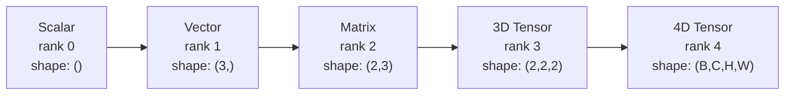
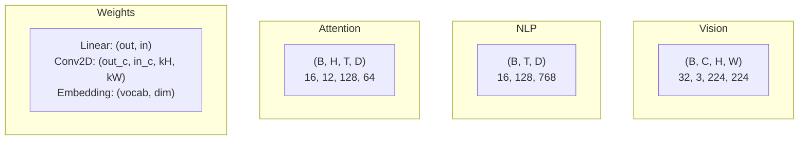
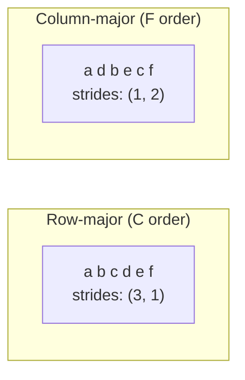
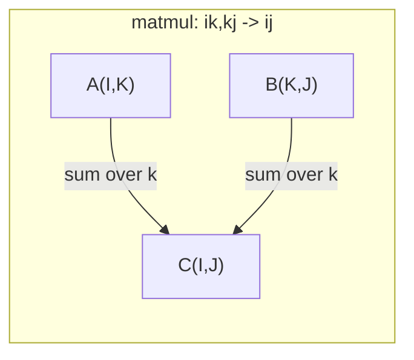

# Opérations de tensions

> Les tensors sont le langage commun entre les données et l'apprentissage profond.

**Type:** Build
**Language:**Python
**Prerequisites:** Phase 1, Lessons 01 (Linear Algebra Intuition), 02 (Vectors, Matrices & Operations)
**Time:** ~90 minutes

## Objectifs d'apprentissage

- Implémenter une classe de tensors avec des opérations de forme, de pas, de remodelage, de transposition et de fonctionnement par élément à partir de zéro
- Appliquer les règles de radiodiffusion pour fonctionner sur des tensors de différentes formes sans copier les données
- Écrire des expressions unis pour les produits dotés, les multiplications de matrice, les produits externes et les opérations en lots
- Tracer les formes de tensor exactes à travers chaque étape de l'attention multi-tête

## Le problème

Vous construisez un transformateur, le pass avant est propre, vous le faites fonctionner et vous obtenez:`RuntimeError: mat1 and mat2 shapes cannot be multiplied (32x768 and 512x768)`Tu regardes les formes, tu essaies de transposer.`Expected 4D input (got 3D input)`Vous ajoutez un non-crasage, et quelque chose d'autre se brise.

Les erreurs de forme sont le bug le plus courant dans le code d'apprentissage profond. Elles ne sont pas difficiles conceptuellement - chaque opération a un contrat de forme - mais elles se multiplient rapidement. Un transformateur a des dizaines de remodèles, de transpositions et de transmissions enchaînés ensemble. Un axe erroné et les cascades d'erreur. Pire encore, certaines erreurs de forme ne font pas de faux pas du tout. Ils produisent silencieusement des ordures en diffusant le mauvais côté ou en les sumant sur le mauvais axe.

Les matrices gèrent les relations par paires entre deux ensembles d'objets. Les données réelles ne s'inscrivent pas dans deux dimensions.`(32, 3, 224, 224)`L' attention personnelle avec 12 têtes est aussi 4D:`(batch, heads, seq_len, head_dim)`Vous avez besoin d'une structure de données qui généralise à un certain nombre de dimensions, avec des opérations qui se composent nettement sur tous. Cette structure est le tensor. Maîtriser ses opérations et les erreurs de forme deviennent trivialement débogables.

## Le concept

### Ce qu'est un tensor

Un tensor est un ensemble multidimensionnel de nombres avec un type de données uniforme.**rank**(ou **order**) Chaque dimension est une dimension**axis**- Le .**shape**est un tuple indiquant la taille le long de chaque axe.



Le nombre total d'éléments = produit de toutes tailles.`(2, 3, 4)`Il tient`2 * 3 * 4 = 24`Les éléments.

### Formes de tensions dans l'apprentissage profond

Différents types de données sont cartographiés à des formes tensorielles spécifiques par convention.



PyTorch utilise NCHW (channels-first). TensorFlow est par défaut NHWC (channels-last).

### Comment fonctionne la mise en page de la mémoire

Un tableau 2D dans la mémoire est une séquence 1D de octets. **Strides**vous dire combien d'éléments sauter pour se déplacer un pas le long de chaque axe.



Transpose ne déplace pas les données, il change les pas, ce qui fait le tensor **non-contiguous**-- les éléments d'une rangée ne sont plus adjacents dans la mémoire.

### Règles de radiodiffusion

La radiodiffusion vous permet d'opérer sur des tensors de différentes formes sans copier les données. alignez les formes de la droite. Deux dimensions sont compatibles lorsqu'elles sont égales ou une est 1.

```
Tensor A:     (8, 1, 6, 1)
Tensor B:        (7, 1, 5)
Padded B:     (1, 7, 1, 5)
Result:       (8, 7, 6, 5)
```

### Einsum: l'opération de tensor universel

La somme d'Einstein étiquette chaque axe avec une lettre. Les axes dans l'entrée mais pas la sortie sont sumés. Les axes dans les deux sont conservés.



Les principaux modèles: `i,i->`(produit à point), `i,j->ij`(produit externe), `ii->`(trace), `ij->ji`(transposer), `bij,bjk->bik`(partie de matmul), `bhtd,bhsd->bhts`(Précédents d'attention).

```figure
tensor-broadcast
```

## Faites-le

Le code est en .`code/tensors.py`- chaque étape fait référence à la mise en œuvre.

### Étape 1: stockage et étapes de tension

Un tensor stocke une liste plate de nombres plus des métadonnées de forme.

```python
class Tensor:
    def __init__(self, data, shape=None):
        if isinstance(data, (list, tuple)):
            self._data, self._shape = self._flatten_nested(data)
        elif isinstance(data, np.ndarray):
            self._data = data.flatten().tolist()
            self._shape = tuple(data.shape)
        else:
            self._data = [data]
            self._shape = ()

        if shape is not None:
            total = reduce(lambda a, b: a * b, shape, 1)
            if total != len(self._data):
                raise ValueError(
                    f"Cannot reshape {len(self._data)} elements into shape {shape}"
                )
            self._shape = tuple(shape)

        self._strides = self._compute_strides(self._shape)

    @staticmethod
    def _compute_strides(shape):
        if len(shape) == 0:
            return ()
        strides = [1] * len(shape)
        for i in range(len(shape) - 2, -1, -1):
            strides[i] = strides[i + 1] * shape[i + 1]
        return tuple(strides)
```

Pour la forme `(3, 4)`, les progrès sont `(4, 1)`-- sauter 4 éléments pour avancer une rangée, sauter 1 élément pour avancer une colonne.

### Étape 2: Ressouffle, presse, déprécie

Resshape change la forme sans changer l'ordre des éléments. Le nombre total d'éléments doit rester le même. Utiliser `-1`pour une dimension pour en déduire la taille.

```python
t = Tensor(list(range(12)), shape=(2, 6))
r = t.reshape((3, 4))
r = t.reshape((-1, 3))
```

Squeeze supprime les axes de taille 1. Unclenchement insère un. Unclenchement est essentiel pour la diffusion - un vecteur de biais`(D,)`ajoutés à un lot `(B, T, D)`Il faut que tu ne le serres pas .`(1, 1, D)`- Je suis désolé .

```python
t = Tensor(list(range(6)), shape=(1, 3, 1, 2))
s = t.squeeze()
v = Tensor([1, 2, 3])
u = v.unsqueeze(0)
```

### Étape 3: Transposer et permuer

Transpose swaps deux axes, permuter réordonne tous les axes, c'est comme ça que vous convertissez entre NCHW et NHWC.

```python
mat = Tensor(list(range(6)), shape=(2, 3))
tr = mat.transpose(0, 1)

t4d = Tensor(list(range(24)), shape=(1, 2, 3, 4))
perm = t4d.permute((0, 2, 3, 1))
```

Après transposition ou permution, le tensor est non contigu à la mémoire.`view`défaillance sur les tensors non contiguës -- utilisation `reshape`ou appeler`.contiguous()`- D'abord.

### Étape 4: Opérations et réductions selon les éléments

Les opérations de calcul des éléments (add, multiplie, soustrait) s'appliquent indépendamment à chaque élément et conservent la forme.

```python
a = Tensor([[1, 2], [3, 4]])
b = Tensor([[10, 20], [30, 40]])
c = a + b
d = a * 2
s = a.sum(axis=0)
```

Le taux moyen mondial de pooling dans une CNN: `(B, C, H, W).mean(axis=[2, 3])`produit `(B, C)`. La moyenne de séquence de pooling dans la PNL: `(B, T, D).mean(axis=1)`produit `(B, D)`- Je suis désolé .

### Étape 5: La diffusion avec NumPy

Le `demo_broadcasting_numpy()`fonction dans `tensors.py`montre les schémas de base.

```python
activations = np.random.randn(4, 3)
bias = np.array([0.1, 0.2, 0.3])
result = activations + bias

images = np.random.randn(2, 3, 4, 4)
scale = np.array([0.5, 1.0, 1.5]).reshape(1, 3, 1, 1)
result = images * scale

a = np.array([1, 2, 3]).reshape(-1, 1)
b = np.array([10, 20, 30, 40]).reshape(1, -1)
outer = a * b
```

Distance par paire par diffusion: remodelage `(M, 2)`à `(M, 1, 2)`et `(N, 2)`à `(1, N, 2)`, soustraire, carré, additionner le long de l'axe dernier, prendre la racine carrée.`(M, N)`- Je suis désolé .

### Étape 6: opérations d'Einsum

Le `demo_einsum()`et `demo_einsum_gallery()`Les fonctions traversent tous les modèles communs.

```python
a = np.array([1.0, 2.0, 3.0])
b = np.array([4.0, 5.0, 6.0])
dot = np.einsum("i,i->", a, b)

A = np.array([[1, 2], [3, 4], [5, 6]], dtype=float)
B = np.array([[7, 8, 9], [10, 11, 12]], dtype=float)
matmul = np.einsum("ik,kj->ij", A, B)

batch_A = np.random.randn(4, 3, 5)
batch_B = np.random.randn(4, 5, 2)
batch_mm = np.einsum("bij,bjk->bik", batch_A, batch_B)
```

Le coût calculé d'une contraction est le produit de toutes les tailles d'indices (contenues et sumées).`bij,bjk->bik`avec B=32, I=128, J=64, K=128: `32 * 128 * 64 * 128 = 33,554,432`les multiples ajoutés.

### Étape 7: Mécanisme d'attention par l'insum

Le `demo_attention_einsum()`La fonction implique une attention multi-tête de bout en bout.

```python
B, H, T, D = 2, 4, 8, 16
E = H * D

X = np.random.randn(B, T, E)
W_q = np.random.randn(E, E) * 0.02

Q = np.einsum("bte,ek->btk", X, W_q)
Q = Q.reshape(B, T, H, D).transpose(0, 2, 1, 3)

scores = np.einsum("bhtd,bhsd->bhts", Q, K) / np.sqrt(D)
weights = softmax(scores, axis=-1)
attn_output = np.einsum("bhts,bhsd->bhtd", weights, V)

concat = attn_output.transpose(0, 2, 1, 3).reshape(B, T, E)
output = np.einsum("bte,ek->btk", concat, W_o)
```

Chaque étape est une opération tensorielle: projection (matmul via einsum), division de tête (reforme + transposition), notes d'attention (batch matmul via einsum), somme pondérée (batch matmul via einsum), fusion de tête (transposition + reforme), projection de sortie (matmul via einsum).

## Utilisez-le

### Scratch vs NumPy

| Operation | Scratch (Tensor class) | NumPy |
|---|---|---|
| Create | `Tensor([[1,2],[3,4]])` | `np.array([[1,2],[3,4]])` |
| Reshape | `t.reshape((3,4))` | `a.reshape(3,4)` |
| Transpose | `t.transpose(0,1)` | `a.T` or `a.transpose(0,1)` |
| Squeeze | `t.squeeze(0)` | `np.squeeze(a, 0)` |
| Sum | `t.sum(axis=0)` | `a.sum(axis=0)` |
| Einsum | N/A | `np.einsum("ij,jk->ik", a, b)` |

### Scratch contre PyTorch

```python
import torch

t = torch.tensor([[1, 2, 3], [4, 5, 6]], dtype=torch.float32)
t.shape
t.stride()
t.is_contiguous()

t.reshape(3, 2)
t.unsqueeze(0)
t.transpose(0, 1)
t.transpose(0, 1).contiguous()

torch.einsum("ik,kj->ij", A, B)
```

PyTorch ajoute autograd, support GPU et noyaux BLAS optimisés. La sémantique de forme est identique. Si vous comprenez la version de grattage, les erreurs de forme PyTorch deviennent lisibles.

### Chaque couche de réseau neuronal comme une opération de tensor

| Operation | Tensor Form | Einsum |
|---|---|---|
| Linear layer | `Y = X @ W.T + b` | `"bd,od->bo"` + bias |
| Attention QKV | `Q = X @ W_q` | `"btd,dh->bth"` |
| Attention scores | `Q @ K.T / sqrt(d)` | `"bhtd,bhsd->bhts"` |
| Attention output | `softmax(scores) @ V` | `"bhts,bhsd->bhtd"` |
| Batch norm | `(X - mu) / sigma * gamma` | element-wise + broadcast |
| Softmax | `exp(x) / sum(exp(x))` | element-wise + reduction |

## La faire partir

Cette leçon produit deux instructions réutilisables:

1. **`outputs/prompt-tensor-shapes.md`**-- Une requête systématique pour déboguer les défauts de forme du tensor. Inclut des tables de décision pour chaque opération commune (matmul, broadcast, cat, linéaire, Conv2d, BatchNorm, softmax) et une table de recherche de correction.

2. **`outputs/prompt-tensor-debugger.md`**-- Une mise en œuvre de débogage étape par étape que vous collez dans n'importe quel assistant d'IA quand une erreur de forme vous bloque.

## Exercices

1. **Easy -- Reshape round-trip.**Prenez un tensor de forme `(2, 3, 4)`- Ressemble à .`(6, 4)`, puis à `(24,)`, puis de retour à `(2, 3, 4)`. L'ordre des éléments de vérification est préservé à chaque étape en imprimant les données plates.

2. **Medium -- Implement broadcasting.**Élargir le `Tensor`classe avec un `broadcast_to(shape)`méthode qui élargit les dimensions de taille 1 pour correspondre à une forme cible.`_elementwise_op`- l'émission automatique avant le fonctionnement.`(3, 1)`et `(1, 4)`de production `(3, 4)`- Je suis désolé .

3. **Hard -- Build einsum from scratch.**La mise en œuvre d'une base `einsum(subscripts, *tensors)`fonction qui gère au moins: produit à point (`i,i->`), le multiplicateur de matrice (`ij,jk->ik`), produit externe (`i,j->ij`), et transposer (`ij->ji`) Analysez la chaîne de sous-scripts, identifiez les indices contractés et faites une boucle sur toutes les combinaisons d'indices.`np.einsum`- Je suis désolé .

4. **Hard -- Attention shape tracker.**Écrivez une fonction qui prend `batch_size`- Je suis là .`seq_len`- Je suis là .`embed_dim`, et `num_heads`Les données de l'interface de l'interface sont fournies par l'intermédiaire de l'interface de l'interface de l'interface de l'interface de l'interface de l'interface de l'interface de l'interface de l'interface de l'interface de l'interface de l'interface de l'interface de l'interface de l'interface de l'interface de l'interface de l'interface de l'interface de l'interface de l'interface de l'interface de l'interface de l'interface de l'interface de l'interface de l'interface de l'interface de l'interface de l'interface de l'interface de l'interface de l'interface de l'interface de l'interface de l'interface de l'interface de l'interface de l'interface de l'interface de l'interface de l'interface de l'interface de l'interface de l'interface de l'interface de l'interface de l'interface de l'interface de l'interface de l'interface de l'interface de l'interface de l'interface de l'interface de l'interface de l'interface de l'interface de l'interface de l'interface de l'interface de l'interface de l'interface de l'interface de l'interface de l'interface de l'interface de l'interface de l'interface de l'interface de l'interface de l'interface.`demo_attention_einsum()`la sortie.

## Les termes clés

| Term | What people say | What it actually means |
|---|---|---|
| Tensor | "A matrix but more dimensions" | A multi-dimensional array with uniform type and defined shape, strides, and operations |
| Rank | "The number of dimensions" | The number of axes. A matrix has rank 2, not rank equal to its matrix rank |
| Shape | "The size of the tensor" | A tuple listing the size along each axis. `(2, 3)` means 2 rows, 3 columns |
| Stride | "How memory is laid out" | The number of elements to skip to advance one position along each axis |
| Broadcasting | "It just works when shapes differ" | A strict set of rules: align from right, dimensions must be equal or one must be 1 |
| Contiguous | "The tensor is normal" | Elements stored sequentially in memory with no gaps or reordering from the logical layout |
| Einsum | "A fancy way to write matmul" | A general notation that expresses any tensor contraction, outer product, trace, or transpose in one line |
| View | "Same as reshape" | A tensor sharing the same memory buffer but with different shape/stride metadata. Fails on non-contiguous data |
| Contraction | "Summing over an index" | The general operation where a shared index between tensors is multiplied and summed, producing a lower-rank result |
| NCHW / NHWC | "PyTorch vs TensorFlow format" | Memory layout conventions for image tensors. NCHW puts channels before spatial dims, NHWC puts them after |

## Pour en savoir plus

- [NumPy Broadcasting](https://numpy.org/doc/stable/user/basics.broadcasting.html)-- Les règles canoniques avec des exemples visuels
- [PyTorch Tensor Views](https://pytorch.org/docs/stable/tensor_view.html)- Quand les vues fonctionnent et quand elles copient
- [einops](https://github.com/arogozhnikov/einops)-- Une bibliothèque qui rend la remodeling de tensor lisible et sûr
- [The Illustrated Transformer](https://jalammar.github.io/illustrated-transformer/)-- Visualise les formes de tensors qui circulent à travers l'attention
- [Einstein Summation in NumPy](https://numpy.org/doc/stable/reference/generated/numpy.einsum.html)-- Documentation complète de l'ensemble avec des exemples
