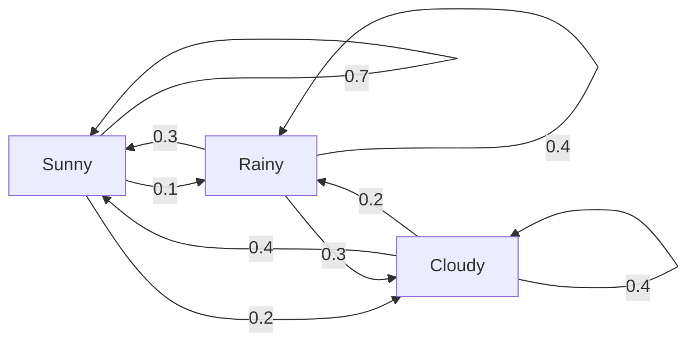
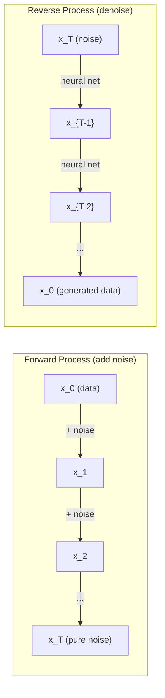

# Procédures stochastiques

> Le mathématicien derrière les promenades aléatoires, les chaînes de Markov et les modèles de diffusion.

**Type:** Learn
**Language:**Python
**Prerequisites:** Phase 1, Lessons 06-07 (probability, Bayes)
**Time:** ~75 minutes

## Objectifs d'apprentissage

- Simuler des promenades aléatoires 1D et 2D et vérifier l'échelle de déplacement
- Construire un simulateur de chaîne Markov et calculer sa distribution stationnaire via une propre composition
- Implementer la dynamique MCMC et Langevin de Metropolis-Hastings pour le prélèvement d'échantillons à partir de distributions cibles
- Connectez le processus de diffusion avant au mouvement Brownien et expliquez comment le processus inverse génère des données

## Le problème

Beaucoup de systèmes d'IA impliquent le hasard qui évolue au fil du temps, pas le hasard statique, le hasard structuré et séquentiel où chaque étape dépend de ce qui est arrivé avant.

Les modèles de langage génèrent des jetons un à la fois. Chaque jeton dépend du contexte précédent. Le modèle produit une distribution de probabilité, des échantillons à partir de lui, et passe à autre chose. C'est un processus stochastique.

Les modèles de diffusion ajoutent du bruit à une image étape par étape jusqu'à ce qu'elle devienne pure statique. Ils inversent ensuite le processus, dénonçant étape par étape jusqu'à ce qu'une nouvelle image émerge.

Les agents d'apprentissage de renforcement prennent des actions dans un environnement. Chaque action conduit à un nouvel état avec une certaine probabilité. L'agent suit une politique aléatoire dans un monde aléatoire.

L'échantillonnage MCMC - la colonne vertébrale de l'inférence bayésienne - construit une chaîne de Markov dont la distribution stationnaire est la partie postérieure dont vous voulez échantillonner.

Tout cela repose sur quatre idées fondamentales:
1. Les promenades aléatoires -- le processus stochastique le plus simple
2. Chaînes de Markov -- structurée au hasard avec une matrice de transition
3. Dynamique de Langevin - descente de gradient avec le bruit
4. Metropolis-Hastings - prélèvement d'échantillons à partir de toute distribution

## Le concept

### Des promenades aléatoires

Commencez à la position 0. À chaque étape, lancez une pièce équitable.

Après n étapes, votre position est la somme de n valeurs aléatoires +/-1. La position attendue est 0 (la marche est impartiale). Mais la distance attendue de l'origine augmente en sqrt(n).

C'est contre-intuitif. La marche est juste - pas de dérive dans les deux sens. Mais avec le temps, il va de plus en plus loin de l'endroit où il a commencé. L'écart standard après n étapes est sqrt(n.

```
Step 0:  Position = 0
Step 1:  Position = +1 or -1
Step 2:  Position = +2, 0, or -2
...
Step 100: Expected distance from origin ~ 10 (sqrt(100))
Step 10000: Expected distance from origin ~ 100 (sqrt(10000))
```

**In 2D**La même échelle s'applique à la distance de l'origine. Le chemin trace un motif fractale.

**Why sqrt(n)?**Chaque étape est +1 ou -1 avec une probabilité égale. Après n étapes, la position S_n = X_1 + X_2 + ... + X_n où chaque X_i est +/-1. La variance de chaque étape est 1, et les étapes sont indépendantes, donc Var(S_n) = n. Déviation standard = sqrt(n.

Cette échelle de n est présente partout dans ML. SGD évalue le bruit comme 1/sqrt(batch_size).

**Connection to Brownian motion.**Prenez une marche aléatoire avec la taille des étapes 1/sqrt(n) et n étapes par unité de temps.

Le mouvement brownien est la base mathématique de la diffusion. Il modélise le vibration aléatoire des particules dans un fluide, les fluctuations des prix des actions et - crucialement - le processus sonore dans les modèles de diffusion.

**Gambler's ruin.**Un marcheur aléatoire commençant à la position k, avec des barrières d'absorption à 0 et N. Quelle est la probabilité d'atteindre N avant 0? Pour une marche équitable: P(atteindre N) = k/N. C'est étonnamment simple et élégant. Il se connecte à la théorie des martingales - la marche aléatoire équitable est un martingale (valeur future attendue = valeur actuelle).

### Chaînes de Markov

Une chaîne de Markov est un système qui transite entre les états selon des probabilités fixes.

```
P(X_{t+1} = j | X_t = i, X_{t-1} = ...) = P(X_{t+1} = j | X_t = i)
```

C'est la propriété de Markov. Cela signifie que vous pouvez décrire toute la dynamique avec une matrice de transition P:

```
P[i][j] = probability of going from state i to state j
```

Chaque rangée de P est une somme de 1 (vous devez aller quelque part).

**Example -- Weather:**

```
States: Sunny (0), Rainy (1), Cloudy (2)

P = [[0.7, 0.1, 0.2],    (if sunny: 70% sunny, 10% rainy, 20% cloudy)
     [0.3, 0.4, 0.3],    (if rainy: 30% sunny, 40% rainy, 30% cloudy)
     [0.4, 0.2, 0.4]]    (if cloudy: 40% sunny, 20% rainy, 40% cloudy)
```

Commencez dans n'importe quel état. Après de nombreuses transitions, la distribution des états converge à la distribution stationnaire pi, où pi * P = pi. C'est le propre vecteur gauche de P avec la valeur propre 1.

Pour la chaîne météorologique, la répartition stationnaire est [0,55, 0,18, 0,27] -- à long terme, il est ensoleillé 55% du temps, quel que soit l'état de départ.



**Computing the stationary distribution.**Il existe deux approches:

1. **Power method**: multipliez une distribution initiale par P à plusieurs reprises.
2. **Eigenvalue method**: trouver le propre vecteur gauche de P avec la valeur propre 1.

Les deux approches exigent que la chaîne remplisse les conditions de convergence.

**Convergence conditions.**Une chaîne Markov converge à une distribution stationnaire unique si elle est:
- **Irreducible**: chaque État est accessible depuis chaque autre État
- **Aperiodic**: la chaîne ne cycle pas avec une période fixe

La plupart des chaînes rencontrées dans ML satisfont aux deux conditions.

**Absorbing states.**Un état est absorbant si une fois que vous y entrez, vous ne quittez jamais (P[i][i] = 1).

**Mixing time.**Combien d'étapes jusqu'à ce que la chaîne soit "close" à la distribution stationnaire? Formellement, le nombre d'étapes jusqu'à ce que la distance totale de variation de la stationarité tombe en dessous d'un certain seuil.

### Connexion avec les modèles linguistiques

La génération de jetons dans un modèle de langage est approximativement un processus de Markov.

```
P(token_i) = exp(logit_i / temperature) / sum(exp(logit_j / temperature))
```

- Température = 1,0: répartition standard
- Température < 1,0: plus nette (plus déterministe)
- Température > 1,0: plus plate (plus aléatoire)
- Température -> 0: argmax (comme l'avidité)

Le prélèvement d'échantillons top-k réduit à k les jetons de plus grande probabilité. Le prélèvement d'échantillons top-p (nucleus) réduit à la plus petite série de jetons dont la probabilité cumulée dépasse p. Les deux modifient les probabilités de transition de Markov.

### Motion brown

La position B ((t) a trois propriétés:
1. B(0) = 0
2. B(t) - B(s) est normalement distribué avec la moyenne 0 et la variance t - s (pour t > s)
3. Les augmentations sur les intervalles non superposés sont indépendantes

Le mouvement brownien est continu mais nulle part différenciable - il se balance à chaque échelle.

Dans une simulation discrète, on approche le mouvement brownien par:

```
B(t + dt) = B(t) + sqrt(dt) * z,    where z ~ N(0, 1)
```

L'échelle sqrt (dt) est importante. Elle vient du théorème de limite centrale appliqué aux promenades aléatoires.

### Dynamique de Langevin

La dynamique de Langevin trouve la distribution de probabilité proportionnelle à exp ((-U ((x) / T), où U est une fonction d'énergie et T est la température.

```
x_{t+1} = x_t - dt * gradient(U(x_t)) + sqrt(2 * T * dt) * z_t
```

Deux forces agissent sur la particule:
1. **Gradient force**(-dt * gradient(U)): pousse vers une faible énergie (comme la descente du gradient)
2. **Random force**(sqrt(2*T*dt) * z): pousse dans des directions aléatoires (exploration)

À température T = 0, c'est une descente de gradient pure. À haute température, c'est presque une marche aléatoire. À la bonne température, la particule explore le paysage énergétique et passe plus de temps dans les régions à faible énergie.

**Connection to diffusion models.**Le processus avancé d'un modèle de diffusion est le suivant:

```
x_t = sqrt(alpha_t) * x_{t-1} + sqrt(1 - alpha_t) * noise
```

C'est une chaîne de Markov qui mélange progressivement les données avec le bruit.

Le processus inverse - passer du bruit à la data - est aussi une chaîne de Markov, mais ses probabilités de transition sont apprises par un réseau neuronal. Le réseau apprend à prédire le bruit qui a été ajouté à chaque étape, puis le soustrait.



### MCMC: Chaîne de Markov à Monte Carlo

Parfois, vous devez échantillonner à partir d'une distribution p ((x) que vous pouvez évaluer (jusqu'à une constante) mais ne peut pas échantillonner directement.

**Metropolis-Hastings**construit une chaîne de Markov dont la distribution stationnaire est p ((x):

1. Commencez à une position x
2. Proposer une nouvelle position x' à partir d'une distribution de proposition Q(x'
3. Ratio d'acceptation de calcul: a(x') * Q(x
4. Acceptez x' avec probabilité min ((1, a).
5. Je répète.

Si Q est symétrique par exemple, Q(x' ( ( ( ( () ), Q(x (x) = N(x, sigma^2)), le rapport se simplifie à a = p(x') / p(x. Vous n'avez besoin que du rapport des probabilités - les constantes normalisantes annulent.

La chaîne est garantie de converger à p*x dans des conditions douces. Mais la convergence peut être lente si la proposition est trop petite (marche aléatoire) ou trop grande (rejettion élevée).

**Why it works.**Le rapport d'acceptation garantit un équilibre détaillé: la probabilité d'être à x et de se déplacer à x' est égale à la probabilité d'être à x' et de se déplacer à x. L'équilibre détaillé implique que p(x) est la distribution stationnaire de la chaîne.

**Practical considerations:**
- **Burn-in**La chaîne a besoin de temps pour atteindre la distribution stationnaire à partir de son point de départ.
- **Thinning**: conserver chaque k-e échantillon pour réduire l'autocorrélation.
- **Multiple chains**Si elles convergent vers la même distribution, vous avez des preuves de convergence.
- **Acceptance rate**Pour les propositions gaussiennes en dimension d, le taux d'acceptation optimal est d'environ 23% (Roberts & Rosenthal, 2001).

### Processus stochastiques dans l'IA

| Process | AI Application |
|---------|---------------|
| Random walk | Exploration in RL, Node2Vec embeddings |
| Markov chain | Text generation, MCMC sampling |
| Brownian motion | Diffusion models (forward process) |
| Langevin dynamics | Score-based generative models, SGLD |
| Markov decision process | Reinforcement learning |
| Metropolis-Hastings | Bayesian inference, posterior sampling |

```figure
random-walk-diffusion
```

## Faites-le

### Étape 1: Simulateur de marche aléatoire

```python
import numpy as np

def random_walk_1d(n_steps, seed=None):
    rng = np.random.RandomState(seed)
    steps = rng.choice([-1, 1], size=n_steps)
    positions = np.concatenate([[0], np.cumsum(steps)])
    return positions


def random_walk_2d(n_steps, seed=None):
    rng = np.random.RandomState(seed)
    directions = rng.choice(4, size=n_steps)
    dx = np.zeros(n_steps)
    dy = np.zeros(n_steps)
    dx[directions == 0] = 1   # right
    dx[directions == 1] = -1  # left
    dy[directions == 2] = 1   # up
    dy[directions == 3] = -1  # down
    x = np.concatenate([[0], np.cumsum(dx)])
    y = np.concatenate([[0], np.cumsum(dy)])
    return x, y
```

La marche 1D stocke les sommes cumulatives. Chaque étape est +1 ou -1. Après n étapes, la position est la somme. La variance augmente linéairement avec n, de sorte que l'écart standard augmente en sqrt(n).

### Étape 2: Chaîne de Markov

```python
class MarkovChain:
    def __init__(self, transition_matrix, state_names=None):
        self.P = np.array(transition_matrix, dtype=float)
        self.n_states = len(self.P)
        self.state_names = state_names or [str(i) for i in range(self.n_states)]

    def step(self, current_state, rng=None):
        if rng is None:
            rng = np.random.RandomState()
        probs = self.P[current_state]
        return rng.choice(self.n_states, p=probs)

    def simulate(self, start_state, n_steps, seed=None):
        rng = np.random.RandomState(seed)
        states = [start_state]
        current = start_state
        for _ in range(n_steps):
            current = self.step(current, rng)
            states.append(current)
        return states

    def stationary_distribution(self):
        eigenvalues, eigenvectors = np.linalg.eig(self.P.T)
        idx = np.argmin(np.abs(eigenvalues - 1.0))
        stationary = np.real(eigenvectors[:, idx])
        stationary = stationary / stationary.sum()
        return np.abs(stationary)
```

La distribution stationnaire est le propre vecteur gauche de P avec valeur propre 1. Nous le trouvons en calculant les propres vecteurs de P^T (transposant les propres vecteurs gauche en propres vecteurs droits).

### Étape 3: Dynamique de Langevin

```python
def langevin_dynamics(grad_U, x0, dt, temperature, n_steps, seed=None):
    rng = np.random.RandomState(seed)
    x = np.array(x0, dtype=float)
    trajectory = [x.copy()]
    for _ in range(n_steps):
        noise = rng.randn(*x.shape)
        x = x - dt * grad_U(x) + np.sqrt(2 * temperature * dt) * noise
        trajectory.append(x.copy())
    return np.array(trajectory)
```

Le gradient pousse x vers une faible énergie. Le bruit empêche qu'il ne se bloque. À l'équilibre, la distribution des échantillons est proportionnelle à exp ((-U ((x) / température).

### Étape 4: Métropole-Hastings

```python
def metropolis_hastings(target_log_prob, proposal_std, x0, n_samples, seed=None):
    rng = np.random.RandomState(seed)
    x = np.array(x0, dtype=float)
    samples = [x.copy()]
    accepted = 0
    for _ in range(n_samples - 1):
        x_proposed = x + rng.randn(*x.shape) * proposal_std
        log_ratio = target_log_prob(x_proposed) - target_log_prob(x)
        if np.log(rng.rand()) < log_ratio:
            x = x_proposed
            accepted += 1
        samples.append(x.copy())
    acceptance_rate = accepted / (n_samples - 1)
    return np.array(samples), acceptance_rate
```

L'algorithme propose un nouveau point, vérifie s'il a une probabilité plus élevée (ou accepte avec probabilité proportionnelle au ratio) et répète.

## Utilisez-le

En pratique, vous utilisez des bibliothèques établies pour ces algorithmes, mais comprendre la mécanique est important pour débogage et réglage.

```python
import numpy as np

rng = np.random.RandomState(42)
walk = np.cumsum(rng.choice([-1, 1], size=10000))
print(f"Final position: {walk[-1]}")
print(f"Expected distance: {np.sqrt(10000):.1f}")
print(f"Actual distance: {abs(walk[-1])}")
```

### numpy pour les matrices de transition

```python
import numpy as np

P = np.array([[0.7, 0.1, 0.2],
              [0.3, 0.4, 0.3],
              [0.4, 0.2, 0.4]])

distribution = np.array([1.0, 0.0, 0.0])
for _ in range(100):
    distribution = distribution @ P

print(f"Stationary distribution: {np.round(distribution, 4)}")
```

Multipliez la distribution initiale par P à plusieurs reprises. Après suffisamment d'itérations, elle converge à la distribution stationnaire indépendamment de l'endroit où vous avez commencé. C'est la méthode de puissance pour trouver le propre vecteur gauche dominant.

### Connexions avec des cadres réels

- **PyTorch diffusion:**Le `DDPMScheduler`Dans une tête enveloppée .`diffusers`met en œuvre les chaînes Markov avant et arrière
- **NumPyro / PyMC:**Utiliser MCMC (échantillonneur NUTS, qui améliore sur Metropolis-Hastings) pour l'inférence bayésienne
- **Gymnasium (RL):**La fonction étape environnement définit un processus de décision Markov

### Vérification de la convergence de la chaîne de Markov

```python
import numpy as np

P = np.array([[0.9, 0.1], [0.3, 0.7]])

eigenvalues = np.linalg.eigvals(P)
spectral_gap = 1 - sorted(np.abs(eigenvalues))[-2]
print(f"Eigenvalues: {eigenvalues}")
print(f"Spectral gap: {spectral_gap:.4f}")
print(f"Approximate mixing time: {1/spectral_gap:.1f} steps")
```

L'écart spectrale vous indique à quelle vitesse la chaîne oublie son état initial. Un écart de 0,2 signifie environ 5 étapes pour mélanger. Un écart de 0,01 signifie environ 100 étapes. Vérifiez toujours cela avant d'exécuter de longues simulations - un calcul de déchets de chaîne mélange lentement.

## La faire partir

Cette leçon donne:
- `outputs/prompt-stochastic-process-advisor.md`-- une requête qui aide à identifier quel cadre de processus stochastique s'applique à un problème donné

## Les liens

| Concept | Where it shows up |
|---------|------------------|
| Random walk | Node2Vec graph embeddings, exploration in RL |
| Markov chain | Token generation in LLMs, MCMC sampling |
| Brownian motion | Forward diffusion process in DDPM, SDE-based models |
| Langevin dynamics | Score-based generative models, stochastic gradient Langevin dynamics (SGLD) |
| Stationary distribution | MCMC convergence target, PageRank |
| Metropolis-Hastings | Bayesian posterior sampling, simulated annealing |
| Temperature | LLM sampling, Boltzmann exploration in RL, simulated annealing |
| Mixing time | Convergence speed of MCMC, spectral gap analysis |
| Absorbing state | End-of-sequence token, terminal states in RL |
| Detailed balance | Correctness guarantee for MCMC samplers |

Les modèles de diffusion méritent une attention particulière.

```
q(x_t | x_{t-1}) = N(x_t; sqrt(1-beta_t) * x_{t-1}, beta_t * I)
```

où beta_t est un calendrier de bruit. Après T étapes, x_T est approximativement N(0, I). Le processus inverse est paramétrifié par un réseau neuronal qui prédit le bruit:

```
p_theta(x_{t-1} | x_t) = N(x_{t-1}; mu_theta(x_t, t), sigma_t^2 * I)
```

Chaque étape de la génération est une étape dans une chaîne de Markov apprise.

Le SGLD (Stochastic Gradient Langevin Dynamics) combine la descente de gradient mini-batch avec le bruit de Langevin. Au lieu de calculer le gradient complet, vous utilisez une estimation stochastique et ajoutez un bruit calibré. Alors que le taux d'apprentissage diminue, le SGLD passe de l'optimisation à l'échantillonnage -- vous obtenez des échantillons Bayésiens approximatifs gratuits. C'est l'un des moyens les plus simples d'obtenir des estimations d'incertitude à partir d'un réseau neuronal.

L'idée clé de toutes ces connexions: les processus stochastiques ne sont pas seulement des outils théoriques. Ce sont les mécanismes informatiques à l'intérieur des systèmes d'IA modernes. Quand vous ajustez la température d'un LLM, vous ajustez une chaîne Markov. Quand vous entraînez un modèle de diffusion, vous apprenez à inverser un processus de mouvement Brownian. Quand vous exécutez l'inférence bayésienne, vous construisez une chaîne qui converge vers l'arrière.

## Exercices

1. **Simulate 1000 random walks of 10000 steps.**Décrire la répartition des positions finales. Vérifiez qu'il est approximativement gaussien avec la moyenne 0 et l'écart standard sqrt ((10000) = 100.

2. **Build a text generator using a Markov chain.**Formez un petit corpus: pour chaque mot, comptez les transitions vers le mot suivant. Construisez la matrice de transition. Générez de nouvelles phrases en prélèvant des échantillons de la chaîne.

3. **Implement simulated annealing**En utilisant Metropolis-Hastings, commencez à haute température (acceptez presque tout) et refroidissez progressivement (acceptez seulement des améliorations).

4. **Compare Langevin dynamics at different temperatures.**Pratique de l'échantillon à partir d'un potentiel de puits double U(x) = (x^2 - 1)^2. à basse température, les échantillons se regroupent dans un puits. à haute température, ils se propagent à travers les deux.

5. **Implement the forward diffusion process.**Commencez par un signal 1D (par exemple, une onde sinusoïde). Ajoutez progressivement le bruit sur 100 étapes avec un calendrier sonore linéaire. Montrez comment le signal se dégrade en bruit pur.

## Les termes clés

| Term | What people say | What it actually means |
|------|----------------|----------------------|
| Random walk | "Coin-flip movement" | A process where position changes by random increments at each step |
| Markov property | "Memoryless" | The future depends only on the present state, not on the history |
| Transition matrix | "The probability table" | P[i][j] = probability of moving from state i to state j |
| Stationary distribution | "The long-run average" | The distribution pi where pi*P = pi -- the chain's equilibrium |
| Brownian motion | "Random jiggling" | The continuous-time limit of a random walk, B(t) ~ N(0, t) |
| Langevin dynamics | "Gradient descent with noise" | Update rule that combines deterministic gradient and random perturbation |
| MCMC | "Walking toward the target" | Constructing a Markov chain whose stationary distribution is the one you want |
| Metropolis-Hastings | "Propose and accept/reject" | MCMC algorithm that uses acceptance ratios to ensure convergence |
| Temperature | "The randomness knob" | Parameter controlling the tradeoff between exploration and exploitation |
| Diffusion process | "Noise in, noise out" | Forward: gradually add noise. Reverse: gradually remove it. Generates data. |

## Pour en savoir plus

- **Ho, Jain, Abbeel (2020)**- "Dénoncer les modèles probabilistiques de diffusion". Le document du DDPM qui a lancé la révolution du modèle de diffusion.
- **Song & Ermon (2019)**-- "Modélisation générative en estimant les gradients de la distribution des données". Approche basée sur le score en utilisant la dynamique de Langevin pour l'échantillonnage.
- **Roberts & Rosenthal (2004)**"Les chaînes Markov et les algorithmes MCMC". La théorie derrière quand et pourquoi MCMC fonctionne.
- **Norris (1997)**- "Markov Chains". Le manuel standard couvre la convergence, les répartitions stationnaires et les temps de frappe.
- **Welling & Teh (2011)**-- "L'apprentissage bayésien via la dynamique de Langevin au degré stochastique". Combine SGD avec la dynamique de Langevin pour une inférence bayésienne évolutive.
