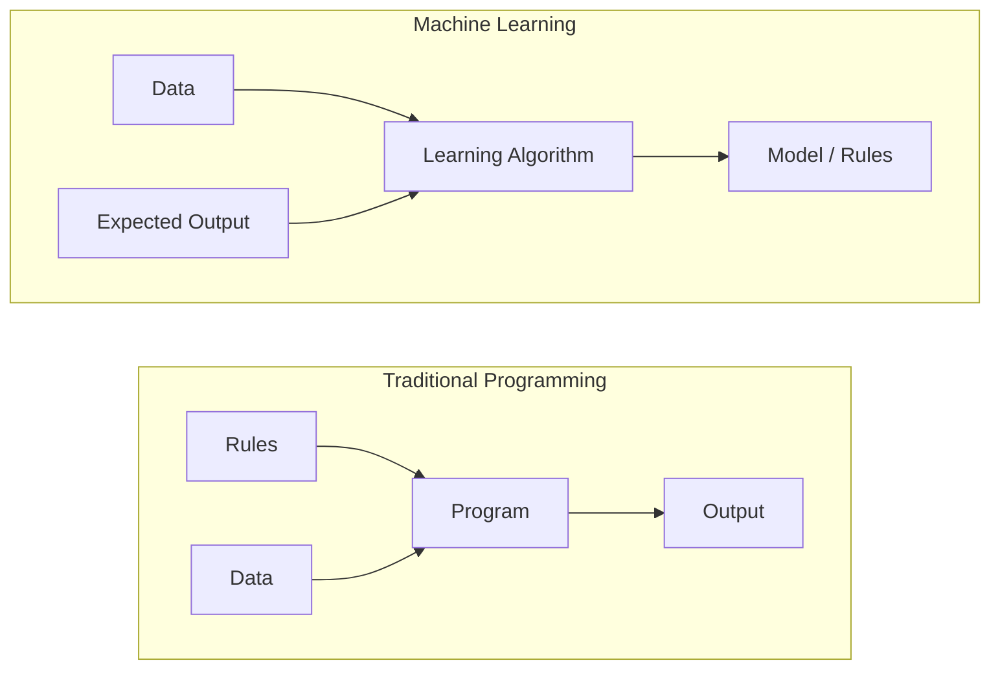
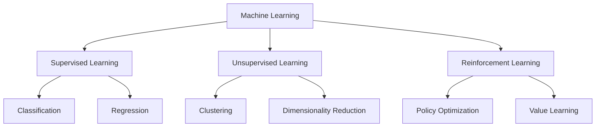
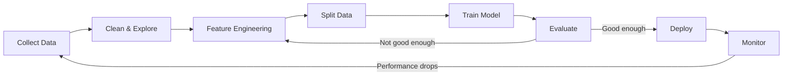
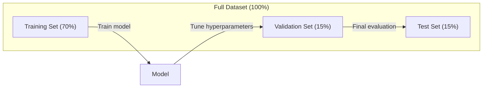
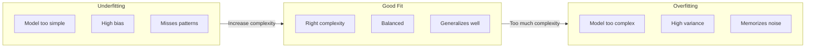
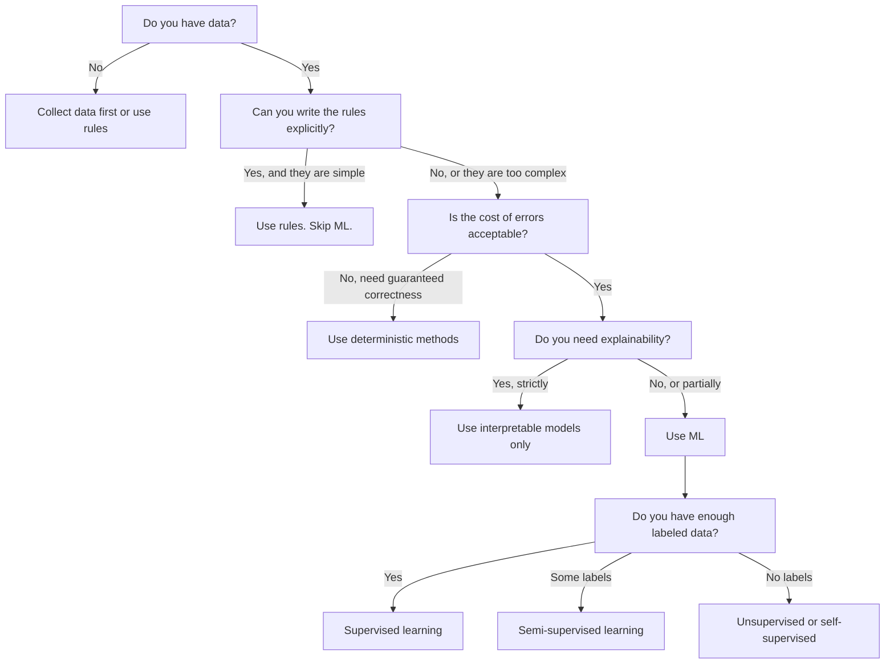

# Ce qu'est l'apprentissage automatique

> L'apprentissage automatique enseigne aux ordinateurs à trouver des modèles dans les données au lieu d'écrire des règles à la main.

**Type:** Learn
**Languages:** Python
**Prerequisites:** Phase 1 (Math Foundations)
**Time:** ~45 minutes

## Objectifs d'apprentissage

- Expliquez la différence entre l'apprentissage supervisé, non supervisé et renforcé et identifiez le type d'apprentissage qui s'applique à un problème donné
- Implémenter un classifiateur centroid le plus proche à partir de zéro et l'évaluer par rapport à une ligne de base aléatoire
- Distinguer les tâches de classification et de régression et sélectionner la fonction de perte appropriée pour chacune
- Évaluer si un problème d'entreprise donné est adapté à la ML ou mieux résolu par des règles déterministes

## Le problème

Vous voulez créer un filtre à spam. L'approche traditionnelle: vous asseoir et écrire des centaines de règles. "Si le courrier électronique contient 'FREE MONEY', marquez-le comme spam. Si il a plus de 3 marques d'exclamation, marquez-le comme spam". Vous passez des semaines à écrire des règles. Alors les spammeurs changent leur libellé. Vos règles se cassent. Vous écrivez plus de règles. Le cycle ne se termine jamais.

L'apprentissage automatique renverse cela. Au lieu d'écrire des règles, vous donnez à l'ordinateur des milliers de courriels étiquetés ("spam" ou "non spam") et laissez-le déterminer les règles par lui-même. L'ordinateur trouve des modèles que vous n'auriez jamais pensé. Lorsque les spammeurs changent de tactique, vous vous entraînez sur de nouvelles données au lieu de réécrire du code.

Ce changement de " règles de programmation " à " apprendre à partir de données " est le cœur de l'apprentissage automatique.

## Le concept

### Apprendre des données, pas des règles

La programmation traditionnelle et l'apprentissage automatique résolvent les problèmes dans des directions opposées.



La programmation traditionnelle: vous écrivez les règles. Le programme les applique aux données pour produire des sorties.

L'apprentissage automatique: vous fournissez des données et des résultats attendus. L'algorithme découvre les règles.

Le "modèle" qui découle de l'entraînement est les règles, codées en nombre (poids, paramètres).

### Les trois types d'apprentissage automatique



**Supervised Learning**Le modèle apprend à cartographier les entrées aux sorties.
- "Voici 10 000 photos avec des étiquettes de chat ou de chien.
- "Voici les caractéristiques et les prix de la maison.

**Unsupervised Learning**Il n'y a pas d'étiquettes, le modèle trouve sa structure.
- "Voici 10 000 historiques d'achats des clients.
- "Voici 1000 points de données dimensionnels, réduisez à 2 dimensions tout en conservant la structure".

**Reinforcement Learning**Un agent prend des mesures dans un environnement et reçoit des récompenses ou des pénalités.
- " Jouez à ce jeu. +1 pour gagner, -1 pour perdre. Déterminez une stratégie. "
- "Contrôle ce bras robot. +1 pour le dépôt de l'objet, -0,01 pour chaque seconde gaspillée".

La plupart de ce que vous allez construire en pratique utilise l'apprentissage supervisé. L'apprentissage non supervisé est courant pour le préprocessage et l'exploration.

### Au-delà des trois grands

Les trois catégories ci-dessus sont propres, mais la méthode de calcul réel brouille souvent les lignes.

**Semi-supervised learning**Il utilise un petit ensemble de données étiquetées et un grand ensemble de données non étiquetées. Vous pouvez avoir 100 images médicales étiquetées et 100 000 non étiquetées.

- **Label propagation:**Construisez un graphique reliant des points de données similaires. Les étiquettes se propagent des nœuds étiquetés aux voisins non étiquetés à travers le graphique.
- **Pseudo-labeling:**Exercez un modèle sur les données étiquetées, utilisez-le pour prédire les étiquettes pour les données non étiquetées, puis reprenez-les.
- **Consistency regularization:**Le modèle doit donner la même prédiction pour une entrée et une version légèrement perturbée de cette entrée.

**Self-supervised learning**Le modèle crée sa propre tâche de prédiction à partir de la structure des données.

- **Masked language modeling (BERT):**Cacher 15% des mots dans une phrase, entraîner le modèle à prédire les mots manquants.
- **Contrastive learning (SimCLR):**Prenez une image, créez deux versions augmentées.
- **Next-token prediction (GPT):**Prédire le prochain mot en tenant compte de tous les mots précédents.

Il s'agit d'une stratégie qui combine des idées supervisées et non supervisées. L'apprentissage autosuffisant est techniquement supervisé (le modèle prédit quelque chose), mais les étiquettes sont générées automatiquement, pas par des humains.

### Classification par rapport à régression

Ce sont les deux principales tâches d'apprentissage supervisé.

| Aspect | Classification | Regression |
|--------|---------------|------------|
| Output | Discrete categories | Continuous numbers |
| Example | "Is this email spam?" | "What will the house price be?" |
| Output space | {cat, dog, bird} | Any real number |
| Loss function | Cross-entropy, accuracy | Mean squared error, MAE |
| Decision | Boundaries between classes | A curve that fits the data |

La classification répond à "quelle catégorie?" la régression répond à "combien?"

Certains problèmes peuvent être encadrés de la même manière. Prédire si une action monte ou descend est une classification. Prédire le prix exact est une régression.

### Le flux de travail de l'équipement

Chaque projet d'apprentissage automatique suit le même pipeline, indépendamment de l'algorithme.



**Collect Data**Les données sont généralement plus importantes que la quantité.

**Clean & Explore**: gérer les valeurs manquantes, supprimer les duplicates, visualiser les distributions, repérer les anomalies.

**Feature Engineering**Les données brutes sont transformées en fonctionnalités que le modèle peut utiliser. Transformer les dates en jours de semaine. Normaliser les colonnes numériques. Encoader les variables catégoriques. Les bonnes fonctionnalités comptent plus que les algorithmes fantaisistes.

**Split Data**Les modèles sont formés sur les données de formation, les hyperparametres sont ajustés sur les données de validation et les résultats finaux sont rapportés sur les données de test.

**Train Model**L'algorithme ajuste les paramètres internes pour minimiser une fonction de perte.

**Evaluate**Si les performances ne sont pas acceptables, retournez et essayez différentes fonctionnalités, algorithmes ou hyperparametres.

**Deploy**: mettre le modèle en production où il fait des prédictions sur de nouvelles données.

**Monitor**: Suivre les performances au fil du temps. Les distributions de données changent (drift de données) et les modèles se dégradent.

### Formation, validation et épreuves partagées

C'est le concept le plus important que les débutants se trompent. Vous devez évaluer votre modèle sur des données qu'il n'a jamais vues lors de l'entraînement. Sinon, vous mesurez la mémorisation, pas l'apprentissage.



| Split | Purpose | When used | Typical size |
|-------|---------|-----------|-------------|
| Training | Model learns from this data | During training | 60-80% |
| Validation | Tune hyperparameters, compare models | After each training run | 10-20% |
| Test | Final unbiased performance estimate | Once, at the very end | 10-20% |

Le jeu de test est sacré. Vous le regardez exactement une fois. Si vous continuez à ajuster votre modèle en fonction des performances du test, vous vous entraînez efficacement sur le jeu de test et vos chiffres rapportés sont sans signification.

Pour les petits ensembles de données, utilisez la validation croisée k-fold: divisez les données en k parties, entraînez sur k-1 parties, validez sur la partie restante, tournez et obtenez des résultats moyens.

### Sur-adaptation contre sous-adaptation



**Underfitting**Le modèle est trop simple pour capturer les modèles dans les données. Une ligne droite essayant de s'adapter à une relation courbe. L'erreur de formation est élevée. L'erreur de test est élevée.

**Overfitting**Le modèle est trop complexe et mémorise les données de formation, y compris son bruit. Une courbe mouvementée qui traverse chaque point de formation mais échoue sur de nouvelles données.

**Good fit**Le modèle capture des modèles réels sans mémoriser le bruit.

Signes de surmatch:
- La précision de la formation est beaucoup plus élevée que celle de la validation
- Le modèle fonctionne bien sur les données de formation mais mal sur les nouvelles données
- L'ajout de plus de données de formation améliore les performances (le modèle était la mémorisation, pas l'apprentissage)

Les pièces de rechange pour l'excès de montage:
- Obtenez plus de données sur la formation
- Réduire la complexité du modèle (moins de paramètres, architecture plus simple)
- Régularisation (ajout d'une pénalité pour les poids élevés)
- Démission (néurones aléatoires au cours de l'entraînement)
- Arrêt précoce (arrêt de formation lorsque l'erreur de validation commence à augmenter)

Les pièces de rechange pour les pièces de rechange:
- Utilisez un modèle plus complexe
- Ajouter d' autres fonctionnalités
- Réduire la régularisation
- Le train est plus long

### Le commerce des variantes partielles

C'est le cadre mathématique derrière le sur-adaptation et le sous-adaptation.

**Bias**Un modèle linéaire a un biais élevé lorsque la relation réelle est non linéaire.

**Variance**Une variance élevée donne des prédictions très différentes lorsqu'elle est formée sur différents sous-ensembles de données.

| Model complexity | Bias | Variance | Result |
|-----------------|------|----------|--------|
| Too low (linear model for curved data) | High | Low | Underfitting |
| Just right | Medium | Medium | Good generalization |
| Too high (degree-20 polynomial for 10 points) | Low | High | Overfitting |

Erreur totale = Bias^2 + Variance + Bruit irréductible

Vous ne pouvez pas réduire le bruit irréductible (c'est le hasard dans les données elles-mêmes).

### Il n'y a pas de théorème du déjeuner gratuit

Il n'existe pas d'algorithme unique qui fonctionne le mieux pour chaque problème. Un algorithme qui fonctionne bien sur une classe de problèmes fonctionnera mal sur une autre. C'est pourquoi les scientifiques des données essaient de multiples algorithmes et comparent les résultats.

En pratique, le choix dépend de:
- Combien de données avez-vous
- Combien de caractéristiques il y a
- Que la relation soit linéaire ou non linéaire
- Si vous avez besoin d'interprétation
- Combien de calculs vous pouvez vous permettre

### Quand ne pas utiliser l'apprentissage automatique

Le ML est puissant, mais pas toujours le bon outil.

**Do not use ML when:**

- **Rules are simple and well-defined.**Le calcul des impôts, les algorithmes de tri, les conversions d'unités.
- **You have no data or very little data.**Il faut des exemples pour apprendre. Avec 10 points de données, vous ne pouvez pas former quoi que ce soit de significatif.
- **The cost of being wrong is catastrophic and you need guaranteed correctness.**Le calcul médical de la posologie, le contrôle des réacteurs nucléaires, la vérification cryptographique. Les modèles ML sont probabilistiques. Ils seront parfois erronés. Si "parfois erroné" est inacceptable, utilisez des méthodes déterministes.
- **A lookup table or heuristic solves the problem.**Si un seuil ou un tableau simple couvre 99% des cas, l'ajout de ML augmente les coûts de maintenance sans amélioration significative.
- **You cannot explain the decision and explainability is required.**Les industries réglementées (prêts, assurances, justice pénale) exigent parfois que chaque décision soit entièrement expliquable.
- **The problem changes faster than you can retrain.**Si les règles changent chaque jour et que la rééducation prend une semaine, le modèle est toujours obsolète.

Utilisez ce diagramme de flux de décision:



```figure
f3-learning-boundary
```

## Faites-le

Le code dans `code/ml_intro.py`Il met en œuvre un classifiateur centroid le plus proche à partir de zéro, l'algorithme ML le plus simple possible. Il démontre l'idée fondamentale: apprendre des données, puis prédire sur de nouvelles données.

### Étape 1: Classificateur centroid le plus proche à partir de zéro

Le classifiateur centroid le plus proche calcule le centre (média) de chaque classe dans les données de formation. Pour prédire, il attribue chaque nouveau point à la classe dont le centre est le plus proche.

```python
class NearestCentroid:
    def fit(self, X, y):
        self.classes = np.unique(y)
        self.centroids = np.array([
            X[y == c].mean(axis=0) for c in self.classes
        ])

    def predict(self, X):
        distances = np.array([
            np.sqrt(((X - c) ** 2).sum(axis=1))
            for c in self.centroids
        ])
        return self.classes[distances.argmin(axis=0)]
```

C'est l'algorithme complet. Fit compute deux moyens. Prédiction compute des distances. Pas de descente de gradient, pas d'itération, pas d'hyperparametres.

### Étape 2: Formation sur les données synthétiques

Nous générons un ensemble de données de classification 2D avec deux classes qui se chevauchent légèrement.

```python
rng = np.random.RandomState(42)
X_class0 = rng.randn(100, 2) + np.array([1.0, 1.0])
X_class1 = rng.randn(100, 2) + np.array([-1.0, -1.0])
X = np.vstack([X_class0, X_class1])
y = np.array([0] * 100 + [1] * 100)
```

### Étape 3: Comparer avec une ligne de départ

Chaque modèle ML doit être comparé à une ligne de base triviale. Ici, la ligne de base prédit une classe aléatoire. Si votre modèle ML ne dépasse pas les devinettes aléatoires, quelque chose ne va pas.

```python
baseline_preds = rng.choice([0, 1], size=len(y_test))
baseline_acc = np.mean(baseline_preds == y_test)
```

Le classeur centroid devrait avoir une précision de plus de 90% sur ce ensemble de données propre.

### Pourquoi cela importe

Le classifiateur centroid le plus proche est trivialement simple. Il n'a pas d'hyperparamètres, aucune itération, aucune descente de gradient.

1. **Learn**une représentation des données de formation (les centroïdes)
2. **Predict**sur les nouvelles données utilisant cette représentation (distance la plus proche)
3. **Evaluate**contre une ligne de base (estimation aléatoire)

Chaque algorithme de l'AM, de la régression logistique aux transformateurs, suit ce même schéma en trois étapes. La représentation devient plus complexe, mais le flux de travail reste le même.

### Étape 4: Ce que le Classificateur Centroid ne peut pas faire

Le classifiateur centroid le plus proche suppose que chaque classe forme une seule tache. Il dessine des limites de décision linéaires.

- Les classes ont plusieurs grappes (par exemple, le chiffre "1" peut être écrit de plusieurs façons différentes)
- La limite de décision est non linéaire (par exemple, une classe se déroulant autour d'une autre)
- Les caractéristiques ont des échelles très différentes (la distance est dominée par la caractéristique à plus grande échelle)

Ces limites motivent tous les autres algorithmes que vous apprendrez. Les voisins K les plus proches gèrent plusieurs grappes. Les arbres de décision gèrent des limites non linéaires. L'échelle des caractéristiques résout le problème d'échelle. Chaque leçon s'appuie sur les limites de l'autre.

## Utilisez-le

sklearn fournit `NearestCentroid`et générateurs de données synthétiques:

```python
from sklearn.neighbors import NearestCentroid
from sklearn.datasets import make_classification
from sklearn.model_selection import train_test_split

X, y = make_classification(
    n_samples=500, n_features=2, n_redundant=0,
    n_clusters_per_class=1, random_state=42
)
X_train, X_test, y_train, y_test = train_test_split(X, y, test_size=0.3)

clf = NearestCentroid()
clf.fit(X_train, y_train)
print(f"Accuracy: {clf.score(X_test, y_test):.3f}")
```

## La faire partir

Cette leçon produit `outputs/prompt-ml-problem-framer.md`-- une requête qui transforme des problèmes d'affaires vagues en tâches de gestion de données concrètes. Donnez-lui une description du problème (" nous voulons réduire le churn " ou " prédire la demande pour le prochain trimestre ") et il identifie le type d'apprentissage, définit l'objectif de prédiction, énumère les caractéristiques des candidats, choisit une métrique de réussite, établit une ligne de base et détecte les pièges tels que la fuite de données ou le déséquilibre de classe. Utilisez-le au début de tout projet de ML pour éviter de construire la mauvaise chose.

## Les termes clés

| Term | What people say | What it actually means |
|------|----------------|----------------------|
| Model | "The AI" | A mathematical function with learnable parameters that maps inputs to outputs |
| Training | "Teaching the AI" | Running an optimization algorithm to adjust model parameters so predictions match known outputs |
| Feature | "An input column" | A measurable property of the data that the model uses to make predictions |
| Label | "The answer" | The known output for a training example, used to compute the error signal |
| Hyperparameter | "A setting you tweak" | A parameter set before training that controls the learning process (learning rate, number of layers) |
| Loss function | "How wrong the model is" | A function that measures the gap between predicted and actual outputs, which training tries to minimize |
| Overfitting | "It memorized the test" | The model learned training-specific noise instead of general patterns, so it fails on new data |
| Underfitting | "It didn't learn anything" | The model is too simple to capture the real patterns in the data |
| Generalization | "It works on new data" | The model's ability to make accurate predictions on data it was not trained on |
| Cross-validation | "Testing on different chunks" | Repeatedly splitting data into train/test folds and averaging results, giving a more robust performance estimate |
| Regularization | "Keeping weights small" | Adding a penalty term to the loss function that discourages overly complex models |
| Data drift | "The world changed" | The statistical distribution of incoming data shifts over time, degrading model performance |

## Exercices

1. Prenez un ensemble de données (par exemple Iris, Titanic) et divisez-le 70/15/15 en train/validation/test. Expliquez pourquoi vous ne devriez pas régler les hyperparamètres sur le jeu de test.
2. Pour chaque problème, identifiez s'il s'agit d'une classification, d'une régression ou d'un regroupement, et si il est supervisé ou non.
3. Un modèle obtient une précision de 99% sur les données de formation mais 60% sur les données de test.

## Pour en savoir plus

- [An Introduction to Statistical Learning](https://www.statlearning.com/)- manuel gratuit couvrant toutes les méthodes classiques de l'EM avec des exemples pratiques
- [Google's Machine Learning Crash Course](https://developers.google.com/machine-learning/crash-course)- une introduction visuelle concise des concepts de l'éducation
- [Scikit-learn User Guide](https://scikit-learn.org/stable/user_guide.html)- la référence pratique pour la mise en œuvre de la LM en Python
