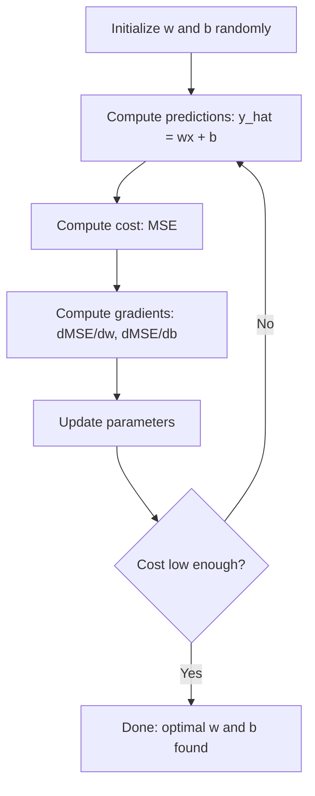

# Régrésion linéaire

> La régression linéaire trace la meilleure ligne droite à travers vos données.

**Type:** Build
**Languages:** Python
**Prerequisites:** Phase 1 (Linear Algebra, Calculus, Optimization), Phase 2 Lesson 1
**Time:** ~90 minutes

## Objectifs d'apprentissage

- Dériver les règles de mise à jour de la descente du gradient pour l'erreur carrée moyenne et mettre en œuvre la régression linéaire à partir de zéro
- Comparer la descente des gradients et l'équation normale en termes de complexité de calcul et quand utiliser chaque
- Construire un modèle de régression linéaire multiple avec la normalisation des caractéristiques et interpréter les poids appris
- Expliquez comment la régression de la Ridge (régularisation de la L2) empêche le surpassage en pénalisant les poids importants.

## Le problème

Vous avez des données: les tailles de la maison et leurs prix de vente. Vous voulez prédire le prix d'une nouvelle maison en fonction de sa taille. Vous pouvez le regarder sur un graphisme de dispersion, mais vous avez besoin d'une formule. Vous avez besoin d'une ligne qui correspond le mieux aux données afin que vous puissiez brancher dans n'importe quelle taille et obtenir une prédiction de prix.

La régression linéaire vous donne cette ligne. Plus important encore, elle introduit l'ensemble de la boucle d'entraînement ML: définir un modèle, définir une fonction de coût, optimiser les paramètres. Chaque algorithme ML suit le même schéma. Maîtrisez-le ici avec le cas le plus simple, et vous le reconnaîtrez partout.

Il s'agit non seulement de problèmes simples, mais aussi de régressions linéaires utilisées dans les systèmes de production pour la prévision de la demande, l'analyse des tests A/B, la modélisation financière et comme base pour chaque tâche de régression.

## Le concept

### Le modèle

La régression linéaire suppose une relation linéaire entre la sortie (x) et la sortie (y):

```
y = wx + b
```

- `w`(poids/inclinaison): combien y change lorsque x augmente de 1
- `b`(bias/intercept): la valeur de y lorsque x = 0

Pour les entrées (features) multiples, cela s'étend à:

```
y = w1*x1 + w2*x2 + ... + wn*xn + b
```

Ou sous forme vectorielle: `y = w^T * x + b`

L'objectif: trouver les valeurs de w et b qui rendent le y prévu le plus proche possible du y réel dans tous les exemples de formation.

### La fonction de coût (erreur moyenne carré)

Comment mesurer " le plus près possible " ? Vous avez besoin d'un seul nombre qui détecte à quel point vos prédictions sont erronées.

```
MSE = (1/n) * sum((y_predicted - y_actual)^2)
```

Pourquoi le carré? Deux raisons. Premièrement, il pénalise les erreurs importantes plus que les erreurs mineures (une erreur de 10 est 100 fois pire qu'une erreur de 1, pas 10x). Deuxièmement, la fonction carré est lisse et différenciable partout, ce qui facilite l'optimisation.

La fonction de coût crée une surface. Pour un seul poids w et un biais b, la surface de l'ESM ressemble à un bol (un paraboloïde convexe).

### Descent graduel

La descente graduelle trouve le fond du bol en faisant des pas en descente.



Les gradients vous disent deux choses: quelle direction déplacer chaque paramètre, et combien de déplacer.

Pour les émissions de masse de masse avec y_hat = wx + b:

```
dMSE/dw = (2/n) * sum((y_hat - y) * x)
dMSE/db = (2/n) * sum(y_hat - y)
```

La règle de mise à jour:

```
w = w - learning_rate * dMSE/dw
b = b - learning_rate * dMSE/db
```

Le taux d'apprentissage contrôle la taille des étapes. Trop grand: vous dépassez le minimum et divergez. Trop petit: la formation prend toujours.

### L'équation normale (solution en forme fermée)

Pour la régression linéaire spécifiquement, il existe une formule directe qui donne les poids optimaux sans aucune itération:

```
w = (X^T * X)^(-1) * X^T * y
```

Il est préférable de faire une descente de gradient, car l'inversion de la matrice est O (n^3) dans le nombre de caractéristiques.

### Régrésion linéaire multiple

Avec plusieurs caractéristiques, le modèle devient:

```
y = w1*x1 + w2*x2 + ... + wn*xn + b
```

Tout fonctionne de la même manière: MSE est la fonction de coût, la descente de gradient met à jour tous les poids simultanément.

Si une caractéristique varie de 0 à 1 et une autre de 0 à 1 000 000, la baisse de gradient aura du mal à se faire parce que la surface des coûts devient allongée.

### Régrésion polynomielle

Et si la relation n'est pas linéaire ? Vous pouvez toujours utiliser la régression linéaire en créant des caractéristiques polynomielles:

```
y = w1*x + w2*x^2 + w3*x^3 + b
```

C'est toujours une régression "linéaire" parce que le modèle est linéaire dans les poids (w1, w2, w3).

Les polynômes de degré supérieur peuvent s'adapter à des courbes plus complexes mais risquent de se surpasser. Un polynôme de degré 10 traversera tous les points d'un ensemble de données de 10 points mais prédira mal les nouvelles données.

### R-quadrés

Le MSE vous dit à quel point vous vous trompez, mais le nombre dépend de l'échelle de y. R-quadré (R^2) donne une mesure indépendante de l'échelle:

```
R^2 = 1 - (sum of squared residuals) / (sum of squared deviations from mean)
    = 1 - SS_res / SS_tot
```

- R^2 = 1,0: prédictions parfaites
- R^2 = 0,0: le modèle n'est pas meilleur que de prédire la moyenne à chaque fois
- R^2 < 0,0: le modèle est pire que de prédire la moyenne

### Révision préliminaire de la régulation (régrésion de la vallée)

Lorsque vous avez de nombreuses caractéristiques, le modèle peut surpasser en attribuant de grands poids.

```
Cost = MSE + lambda * sum(w_i^2)
```

Le terme de pénalité décourage les poids importants. L'hyperparamètre lambda contrôle le compromis: un lambda plus élevé signifie des poids plus petits et plus de régularisation.

```figure
linear-regression-fit
```

## Faites-le

### Étape 1: Générer des données d'échantillon

```python
import random
import math

random.seed(42)

TRUE_W = 3.0
TRUE_B = 7.0
N_SAMPLES = 100

X = [random.uniform(0, 10) for _ in range(N_SAMPLES)]
y = [TRUE_W * x + TRUE_B + random.gauss(0, 2.0) for x in X]

print(f"Generated {N_SAMPLES} samples")
print(f"True relationship: y = {TRUE_W}x + {TRUE_B} (+ noise)")
print(f"First 5 points: {[(round(X[i], 2), round(y[i], 2)) for i in range(5)]}")
```

### Étape 2: Regression linéaire à partir de zéro avec descente de gradient

```python
class LinearRegression:
    def __init__(self, learning_rate=0.01):
        self.w = 0.0
        self.b = 0.0
        self.lr = learning_rate
        self.cost_history = []

    def predict(self, X):
        return [self.w * x + self.b for x in X]

    def compute_cost(self, X, y):
        predictions = self.predict(X)
        n = len(y)
        cost = sum((pred - actual) ** 2 for pred, actual in zip(predictions, y)) / n
        return cost

    def compute_gradients(self, X, y):
        predictions = self.predict(X)
        n = len(y)
        dw = (2 / n) * sum((pred - actual) * x for pred, actual, x in zip(predictions, y, X))
        db = (2 / n) * sum(pred - actual for pred, actual in zip(predictions, y))
        return dw, db

    def fit(self, X, y, epochs=1000, print_every=200):
        for epoch in range(epochs):
            dw, db = self.compute_gradients(X, y)
            self.w -= self.lr * dw
            self.b -= self.lr * db
            cost = self.compute_cost(X, y)
            self.cost_history.append(cost)
            if epoch % print_every == 0:
                print(f"  Epoch {epoch:4d} | Cost: {cost:.4f} | w: {self.w:.4f} | b: {self.b:.4f}")
        return self

    def r_squared(self, X, y):
        predictions = self.predict(X)
        y_mean = sum(y) / len(y)
        ss_res = sum((actual - pred) ** 2 for actual, pred in zip(y, predictions))
        ss_tot = sum((actual - y_mean) ** 2 for actual in y)
        return 1 - (ss_res / ss_tot)


print("=== Training Linear Regression (Gradient Descent) ===")
model = LinearRegression(learning_rate=0.005)
model.fit(X, y, epochs=1000, print_every=200)
print(f"\nLearned: y = {model.w:.4f}x + {model.b:.4f}")
print(f"True:    y = {TRUE_W}x + {TRUE_B}")
print(f"R-squared: {model.r_squared(X, y):.4f}")
```

### Étape 3: équation normale (solution en forme fermée)

```python
class LinearRegressionNormal:
    def __init__(self):
        self.w = 0.0
        self.b = 0.0

    def fit(self, X, y):
        n = len(X)
        x_mean = sum(X) / n
        y_mean = sum(y) / n
        numerator = sum((X[i] - x_mean) * (y[i] - y_mean) for i in range(n))
        denominator = sum((X[i] - x_mean) ** 2 for i in range(n))
        self.w = numerator / denominator
        self.b = y_mean - self.w * x_mean
        return self

    def predict(self, X):
        return [self.w * x + self.b for x in X]

    def r_squared(self, X, y):
        predictions = self.predict(X)
        y_mean = sum(y) / len(y)
        ss_res = sum((actual - pred) ** 2 for actual, pred in zip(y, predictions))
        ss_tot = sum((actual - y_mean) ** 2 for actual in y)
        return 1 - (ss_res / ss_tot)


print("\n=== Normal Equation (Closed-Form) ===")
model_normal = LinearRegressionNormal()
model_normal.fit(X, y)
print(f"Learned: y = {model_normal.w:.4f}x + {model_normal.b:.4f}")
print(f"R-squared: {model_normal.r_squared(X, y):.4f}")
```

### Étape 4: Régrésion linéaire multiple

```python
class MultipleLinearRegression:
    def __init__(self, n_features, learning_rate=0.01):
        self.weights = [0.0] * n_features
        self.bias = 0.0
        self.lr = learning_rate
        self.cost_history = []

    def predict_single(self, x):
        return sum(w * xi for w, xi in zip(self.weights, x)) + self.bias

    def predict(self, X):
        return [self.predict_single(x) for x in X]

    def compute_cost(self, X, y):
        predictions = self.predict(X)
        n = len(y)
        return sum((pred - actual) ** 2 for pred, actual in zip(predictions, y)) / n

    def fit(self, X, y, epochs=1000, print_every=200):
        n = len(y)
        n_features = len(X[0])
        for epoch in range(epochs):
            predictions = self.predict(X)
            errors = [pred - actual for pred, actual in zip(predictions, y)]
            for j in range(n_features):
                grad = (2 / n) * sum(errors[i] * X[i][j] for i in range(n))
                self.weights[j] -= self.lr * grad
            grad_b = (2 / n) * sum(errors)
            self.bias -= self.lr * grad_b
            cost = self.compute_cost(X, y)
            self.cost_history.append(cost)
            if epoch % print_every == 0:
                print(f"  Epoch {epoch:4d} | Cost: {cost:.4f}")
        return self

    def r_squared(self, X, y):
        predictions = self.predict(X)
        y_mean = sum(y) / len(y)
        ss_res = sum((actual - pred) ** 2 for actual, pred in zip(y, predictions))
        ss_tot = sum((actual - y_mean) ** 2 for actual in y)
        return 1 - (ss_res / ss_tot)


random.seed(42)
N = 100
X_multi = []
y_multi = []
for _ in range(N):
    size = random.uniform(500, 3000)
    bedrooms = random.randint(1, 5)
    age = random.uniform(0, 50)
    price = 50 * size + 10000 * bedrooms - 1000 * age + 50000 + random.gauss(0, 20000)
    X_multi.append([size, bedrooms, age])
    y_multi.append(price)


def standardize(X):
    n_features = len(X[0])
    means = [sum(X[i][j] for i in range(len(X))) / len(X) for j in range(n_features)]
    stds = []
    for j in range(n_features):
        variance = sum((X[i][j] - means[j]) ** 2 for i in range(len(X))) / len(X)
        stds.append(variance ** 0.5)
    X_scaled = []
    for i in range(len(X)):
        row = [(X[i][j] - means[j]) / stds[j] if stds[j] > 0 else 0 for j in range(n_features)]
        X_scaled.append(row)
    return X_scaled, means, stds


y_mean_val = sum(y_multi) / len(y_multi)
y_std_val = (sum((yi - y_mean_val) ** 2 for yi in y_multi) / len(y_multi)) ** 0.5
y_scaled = [(yi - y_mean_val) / y_std_val for yi in y_multi]

X_scaled, x_means, x_stds = standardize(X_multi)

print("\n=== Multiple Linear Regression (3 features) ===")
print("Features: house size, bedrooms, age")
multi_model = MultipleLinearRegression(n_features=3, learning_rate=0.01)
multi_model.fit(X_scaled, y_scaled, epochs=1000, print_every=200)

print(f"\nWeights (standardized): {[round(w, 4) for w in multi_model.weights]}")
print(f"Bias (standardized): {multi_model.bias:.4f}")
print(f"R-squared: {multi_model.r_squared(X_scaled, y_scaled):.4f}")
```

### Étape 5: Regression polynomielle

```python
class PolynomialRegression:
    def __init__(self, degree, learning_rate=0.01):
        self.degree = degree
        self.weights = [0.0] * degree
        self.bias = 0.0
        self.lr = learning_rate

    def make_features(self, X):
        return [[x ** (d + 1) for d in range(self.degree)] for x in X]

    def predict(self, X):
        features = self.make_features(X)
        return [sum(w * f for w, f in zip(self.weights, row)) + self.bias for row in features]

    def fit(self, X, y, epochs=1000, print_every=200):
        features = self.make_features(X)
        n = len(y)
        for epoch in range(epochs):
            predictions = [sum(w * f for w, f in zip(self.weights, row)) + self.bias for row in features]
            errors = [pred - actual for pred, actual in zip(predictions, y)]
            for j in range(self.degree):
                grad = (2 / n) * sum(errors[i] * features[i][j] for i in range(n))
                self.weights[j] -= self.lr * grad
            grad_b = (2 / n) * sum(errors)
            self.bias -= self.lr * grad_b
            if epoch % print_every == 0:
                cost = sum(e ** 2 for e in errors) / n
                print(f"  Epoch {epoch:4d} | Cost: {cost:.6f}")
        return self

    def r_squared(self, X, y):
        predictions = self.predict(X)
        y_mean = sum(y) / len(y)
        ss_res = sum((actual - pred) ** 2 for actual, pred in zip(y, predictions))
        ss_tot = sum((actual - y_mean) ** 2 for actual in y)
        return 1 - (ss_res / ss_tot)


random.seed(42)
X_poly = [x / 10.0 for x in range(0, 50)]
y_poly = [0.5 * x ** 2 - 2 * x + 3 + random.gauss(0, 1.0) for x in X_poly]

x_max = max(abs(x) for x in X_poly)
X_poly_norm = [x / x_max for x in X_poly]
y_poly_mean = sum(y_poly) / len(y_poly)
y_poly_std = (sum((yi - y_poly_mean) ** 2 for yi in y_poly) / len(y_poly)) ** 0.5
y_poly_norm = [(yi - y_poly_mean) / y_poly_std for yi in y_poly]

print("\n=== Polynomial Regression (degree 2 vs degree 5) ===")
print("True relationship: y = 0.5x^2 - 2x + 3")

print("\nDegree 2:")
poly2 = PolynomialRegression(degree=2, learning_rate=0.1)
poly2.fit(X_poly_norm, y_poly_norm, epochs=2000, print_every=500)
print(f"  R-squared: {poly2.r_squared(X_poly_norm, y_poly_norm):.4f}")

print("\nDegree 5:")
poly5 = PolynomialRegression(degree=5, learning_rate=0.1)
poly5.fit(X_poly_norm, y_poly_norm, epochs=2000, print_every=500)
print(f"  R-squared: {poly5.r_squared(X_poly_norm, y_poly_norm):.4f}")

print("\nDegree 2 fits the true curve well. Degree 5 fits training data slightly better")
print("but risks overfitting on new data.")
```

### Étape 6: régression de la montée (régularisation de la L2)

```python
class RidgeRegression:
    def __init__(self, n_features, learning_rate=0.01, alpha=1.0):
        self.weights = [0.0] * n_features
        self.bias = 0.0
        self.lr = learning_rate
        self.alpha = alpha

    def predict_single(self, x):
        return sum(w * xi for w, xi in zip(self.weights, x)) + self.bias

    def predict(self, X):
        return [self.predict_single(x) for x in X]

    def fit(self, X, y, epochs=1000, print_every=200):
        n = len(y)
        n_features = len(X[0])
        for epoch in range(epochs):
            predictions = self.predict(X)
            errors = [pred - actual for pred, actual in zip(predictions, y)]
            mse = sum(e ** 2 for e in errors) / n
            reg_term = self.alpha * sum(w ** 2 for w in self.weights)
            cost = mse + reg_term
            for j in range(n_features):
                grad = (2 / n) * sum(errors[i] * X[i][j] for i in range(n))
                grad += 2 * self.alpha * self.weights[j]
                self.weights[j] -= self.lr * grad
            grad_b = (2 / n) * sum(errors)
            self.bias -= self.lr * grad_b
            if epoch % print_every == 0:
                print(f"  Epoch {epoch:4d} | Cost: {cost:.4f} | L2 penalty: {reg_term:.4f}")
        return self


print("\n=== Ridge Regression (L2 Regularization) ===")
print("Same data as multiple regression, with alpha=0.1")
ridge = RidgeRegression(n_features=3, learning_rate=0.01, alpha=0.1)
ridge.fit(X_scaled, y_scaled, epochs=1000, print_every=200)
print(f"\nRidge weights: {[round(w, 4) for w in ridge.weights]}")
print(f"Plain weights: {[round(w, 4) for w in multi_model.weights]}")
print("Ridge weights are smaller (shrunk toward zero) due to the L2 penalty.")
```

## Utilisez-le

Il en va de même avec le scikit-learn, que vous allez utiliser dans la production.

```python
from sklearn.linear_model import LinearRegression as SklearnLR
from sklearn.linear_model import Ridge
from sklearn.preprocessing import PolynomialFeatures, StandardScaler
from sklearn.model_selection import train_test_split
from sklearn.metrics import mean_squared_error, r2_score
import numpy as np

np.random.seed(42)
X_sk = np.random.uniform(0, 10, (100, 1))
y_sk = 3.0 * X_sk.squeeze() + 7.0 + np.random.normal(0, 2.0, 100)

X_train, X_test, y_train, y_test = train_test_split(X_sk, y_sk, test_size=0.2, random_state=42)

lr = SklearnLR()
lr.fit(X_train, y_train)
y_pred = lr.predict(X_test)

print("=== Scikit-learn Linear Regression ===")
print(f"Coefficient (w): {lr.coef_[0]:.4f}")
print(f"Intercept (b): {lr.intercept_:.4f}")
print(f"R-squared (test): {r2_score(y_test, y_pred):.4f}")
print(f"MSE (test): {mean_squared_error(y_test, y_pred):.4f}")

poly = PolynomialFeatures(degree=2, include_bias=False)
X_poly_sk = poly.fit_transform(X_train)
X_poly_test = poly.transform(X_test)

lr_poly = SklearnLR()
lr_poly.fit(X_poly_sk, y_train)
print(f"\nPolynomial degree 2 R-squared: {r2_score(y_test, lr_poly.predict(X_poly_test)):.4f}")

scaler = StandardScaler()
X_train_scaled = scaler.fit_transform(X_train)
X_test_scaled = scaler.transform(X_test)

ridge = Ridge(alpha=1.0)
ridge.fit(X_train_scaled, y_train)
print(f"Ridge R-squared: {r2_score(y_test, ridge.predict(X_test_scaled)):.4f}")
print(f"Ridge coefficient: {ridge.coef_[0]:.4f}")
```

La différence: scikit-learn gère les cas de bord, la stabilité numérique et les optimisations de performance. Utilisez la bibliothèque pour la production. Utilisez la version de scratch pour comprendre ce qui se passe.

## La faire partir

Cette leçon donne:
- `outputs/skill-regression.md`- une aptitude à choisir la bonne approche de régression en fonction du problème

## Exercices

1. Appliquez la baisse de gradient de lot, la baisse de gradient stochastique (SGD) et la baisse de gradient de mini lot. Comparer la vitesse de convergence sur le même ensemble de données.
2. Générer des données à partir d'une fonction cubique (y = ax^3 + bx^2 + cx + d + bruit).
3. Implémenter la régression Lasso (régularisation L1: pénalité * alpha *( sur le direw_i i i i i)). Trainer les données de logement multi-factores. Comparer les poids qui vont à zéro par rapport à Ridge. Pourquoi L1 produit des solutions rares alors que L2 ne le fait pas?

## Les termes clés

| Term | What people say | What it actually means |
|------|----------------|----------------------|
| Linear regression | "Draw a line through data" | Find weight w and bias b that minimize the sum of squared differences between wx+b and actual y values |
| Cost function | "How bad the model is" | A function that maps model parameters to a single number measuring prediction error, which optimization minimizes |
| Mean squared error | "Average of squared errors" | (1/n) * sum of (predicted - actual)^2, penalizing large errors disproportionately |
| Gradient descent | "Walk downhill" | Iteratively adjust parameters in the direction that reduces the cost function, using partial derivatives |
| Learning rate | "Step size" | A scalar that controls how much parameters change per gradient descent step |
| Normal equation | "Solve it directly" | The closed-form solution w = (X^T X)^-1 X^T y that gives optimal weights without iteration |
| R-squared | "How good the fit is" | The fraction of variance in y explained by the model, ranging from negative infinity to 1.0 |
| Feature scaling | "Make features comparable" | Transforming features to similar ranges (e.g., zero mean, unit variance) so gradient descent converges faster |
| Regularization | "Penalize complexity" | Adding a term to the cost function that shrinks weights, preventing overfitting |
| Ridge regression | "L2 regularization" | Linear regression with a penalty of lambda * sum(w_i^2) added to MSE |
| Polynomial regression | "Fitting curves with linear math" | Linear regression on polynomial features (x, x^2, x^3, ...), still linear in the weights |
| Overfitting | "Memorizing training data" | Using a model so complex that it fits noise in training data and fails on new data |

## Pour en savoir plus

- [An Introduction to Statistical Learning (ISLR)](https://www.statlearning.com/)-- PDF gratuit, les chapitres 3 et 6 couvrent la régression linéaire et la régularisation avec des exemples pratiques de R
- [The Elements of Statistical Learning (ESL)](https://hastie.su.domains/ElemStatLearn/)-- PDF gratuit, le compagnon plus mathématique de l'IRL avec un traitement plus profond de la crête et du lasso
- [Stanford CS229 Lecture Notes on Linear Regression](https://cs229.stanford.edu/main_notes.pdf)-- Les notes d'Andrew Ng déduisant l'équation normale et la descente des gradients à partir des premiers principes
- [scikit-learn LinearRegression documentation](https://scikit-learn.org/stable/modules/linear_model.html)-- référence pratique pour LinearRegression, Ridge, Lasso et ElasticNet avec des exemples de code
