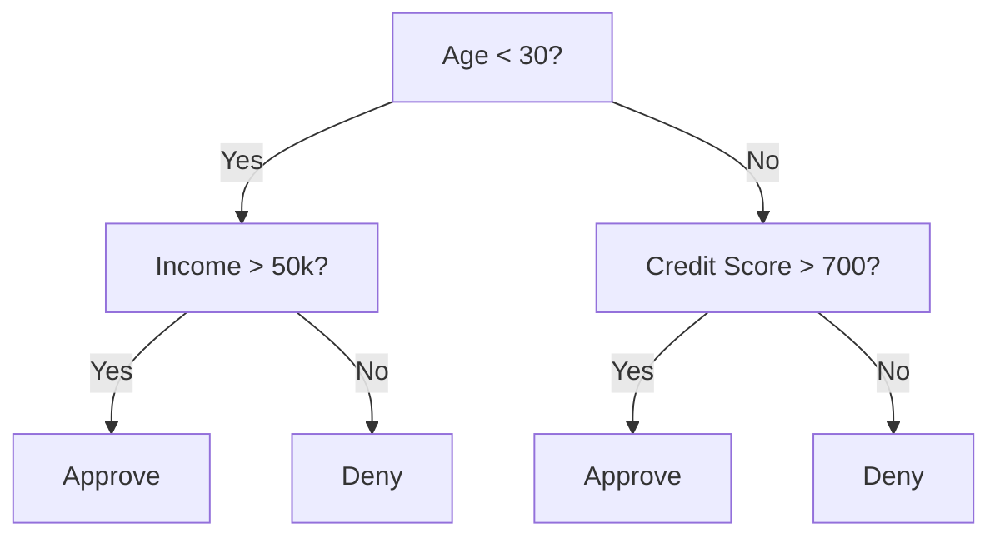
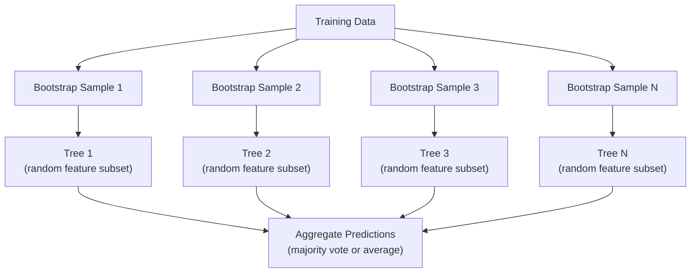

# Les arbres décisionnels et les forêts aléatoires

> Un arbre de décision n'est qu'un diagramme de flux, mais une forêt de ces arbres est l'un des outils les plus puissants de l'intelligence artificielle.

**Type:** Build
**Language:**Python
**Prerequisites:** Phase 1 (Lessons 09 Information Theory, 06 Probability)
**Time:** ~90 minutes

## Objectifs d'apprentissage

- Implémenter des calculs d'impureté, d'entropie et de gain d'informations de Gini pour trouver des fractions optimales des arbres de décision
- Construire un classificateur d'arbre de décision à partir de zéro avec des contrôles de pré-tissage (profondeur maximale, échantillons min)
- Construire une forêt aléatoire à l'aide de l'échantillonnage de démarrage et de la randomisation des caractéristiques, et expliquer pourquoi elle réduit la variance
- Comparer l'importance des caractéristiques de l'IDM avec l'importance de la permutation et déterminer quand l'IDM est biaisé

## Le problème

Vous avez des données tabulaires. Les lignes sont des échantillons, les colonnes sont des caractéristiques, et il y a une colonne cible que vous voulez prédire. Vous pouvez y jeter un réseau neuronal. Mais pour les données tabulaires, les modèles basés sur des arbres (arbres de décision, forêts aléatoires, arbres augmentés en gradient) dépassent systématiquement l'apprentissage profond. Les compétitions Kaggle sur les données structurées sont dominées par XGBoost et LightGBM, pas les transformateurs.

Les arbres gèrent des types de caractéristiques mixtes (numériques et catégoriques) sans traitement préalable. Ils gèrent des relations non linéaires sans ingénierie des caractéristiques. Ils sont interprétables: vous pouvez regarder l'arbre et voir exactement pourquoi une prédiction a été faite.

Cette leçon construit des arbres de décision à partir de zéro en utilisant la fraction récursive, puis construit une forêt aléatoire en haut. Vous allez mettre en œuvre les mathématiques derrière les critères de fractionnement (impureté génini, entropie, gain d'information) et comprendre pourquoi un ensemble d'apprenants faibles devient un fort.

## Le concept

### Ce que fait un arbre de décision

Un arbre de décision partage l'espace de fonctionnalités en régions rectangulaires en posant une séquence de questions oui/non.



Chaque nœud interne teste une fonctionnalité contre un seuil. Chaque nœud de feuille fait une prédiction. Pour classer un nouveau point de données, vous commencez à la racine et suivez les branches jusqu'à ce que vous atteignez une feuille.

L'arbre est construit de haut en bas en choisissant, à chaque nœud, la fonction et le seuil qui séparent le mieux les données. "Best" est défini par un critère de fractionnement.

### Critères de partage: mesure de l'impureté

Nous voulons les diviser de façon à ce que les nœuds enfants résultants soient aussi "purs" que possible, ce qui signifie que chaque enfant contient principalement une classe.

**Gini impurity**mesure la probabilité qu'un échantillon choisi au hasard soit mal classé s'il est étiqueté selon la distribution de classes au nœud.

```
Gini(S) = 1 - sum(p_k^2)

where p_k is the proportion of class k in set S.
```

Pour un nœud pur (tous une classe), Gini = 0, pour une fraction binaire avec des classes 50/50, Gini = 0,5.

```
Example: 6 cats, 4 dogs

Gini = 1 - (0.6^2 + 0.4^2) = 1 - (0.36 + 0.16) = 0.48
```

**Entropy**mesure le contenu d'information (trouble) dans un nœud. couvert dans la leçon 09 de la phase 1.

```
Entropy(S) = -sum(p_k * log2(p_k))
```

Pour un nœud pur, entropie = 0, pour une fraction binaire 50/50, entropie = 1,0.

```
Example: 6 cats, 4 dogs

Entropy = -(0.6 * log2(0.6) + 0.4 * log2(0.4))
        = -(0.6 * -0.737 + 0.4 * -1.322)
        = 0.442 + 0.529
        = 0.971 bits
```

**Information gain**est la réduction de l'impureté (entropie ou Gini) après une fraction.

```
IG(S, feature, threshold) = Impurity(S) - weighted_avg(Impurity(S_left), Impurity(S_right))

where the weights are the proportions of samples in each child.
```

L'algorithme avide de chaque nœud: essayez toutes les fonctionnalités et tous les seuils possibles. Choisissez la paire (fonction, seuil) qui maximize le gain d'informations.

### Comment fonctionne la séparation

Pour un ensemble de données avec n caractéristiques et m échantillons au nœud courant:

1. Pour chaque caractéristique j (j = 1 à n):
   - Régler les échantillons par caractéristique j
   - Essayez chaque point intermédiaire entre des valeurs distinctes consécutives comme un seuil
   - Calculer le gain d'information pour chaque seuil
2. Sélectionnez la fonctionnalité et le seuil avec le plus grand gain d'informations
3. Divisez les données en gauche (poids <=) et en droite (poids >)
4. Recursion sur chaque enfant

Cette approche avide ne garantit pas l'arbre optimal au niveau mondial. Trouver l'arbre optimal est NP-difficile. Mais la division avide fonctionne bien dans la pratique.

### Conditions d'arrêt

Sans s'arrêter, l'arbre pousse jusqu'à ce que chaque feuille soit pure (un échantillon par feuille).

**Pre-pruning**Arrête l'arbre avant qu'il ne pousse pleinement:
- Profondeur maximale: arrête de se diviser lorsque l'arbre atteint une profondeur définie
- Primes minimaux par feuille: arrêt si un nœud contient moins de k prémices
- Obtention minimale d'informations: arrêt si la meilleure fraction améliore l'impureté de moins d'un seuil
- Nœuds de feuilles maximaux: limiter le nombre total de feuilles

**Post-pruning**Il fait croître l'arbre entier, puis il le coupe.
- Taille de taille de la complexité des coûts (utilisée par scikit-learn): ajouter une pénalité proportionnelle au nombre de feuilles.
- Réduction de la taille des erreurs: supprimer un sous-arbre si l'erreur de validation ne s'accroît pas

La pré-tissage est plus simple et plus rapide. La post-tissage produit souvent de meilleurs arbres, car il n'arrête pas prématurément les fentes qui pourraient conduire à d'autres fentes utiles.

### Arbres de décision pour la régression

Pour la régression, la prédiction de la feuille est la moyenne des valeurs cibles de cette feuille.

**Variance reduction**remplace le gain d'information:

```
VR(S, feature, threshold) = Var(S) - weighted_avg(Var(S_left), Var(S_right))
```

Choisissez la fraction qui réduit le plus la variance. L'arbre divise l'espace d'entrée en régions et prédit une constante (la moyenne) dans chaque région.

### Les forêts aléatoires: le pouvoir des ensembles

Un seul arbre de décision est très varié. Des petits changements dans les données peuvent produire des arbres complètement différents.



Deux sources de hasard rendent les arbres divers:

**Bagging (bootstrap aggregating):**Chaque arbre est formé sur un échantillon de démarrage, un échantillon aléatoire avec le remplacement des données de formation. Environ 63% des échantillons originaux apparaissent dans chaque démarrage (le reste sont des échantillons hors sac qui peuvent être utilisés pour la validation).

**Feature randomization:**Pour chaque division, seul un sous-ensemble aléatoire de caractéristiques est pris en compte. Pour la classification, la valeur par défaut est sqrt(n_factualités). Pour la régression, n_factualités/3. Cela empêche tous les arbres de se diviser sur la même caractéristique dominante.

L'idée principale: en moyenne, de nombreux arbres décorérés réduisent la variance sans augmenter les biais.

### Importance des caractéristiques

Les forêts aléatoires fournissent naturellement des scores d'importance caractéristique.

**Mean Decrease in Impurity (MDI):**Pour chaque caractéristique, additionnez la réduction totale de l'impureté sur tous les arbres et tous les nœuds où cette caractéristique est utilisée.

```
importance(feature_j) = sum over all nodes where feature_j is used:
    (n_samples_at_node / n_total_samples) * impurity_decrease
```

Ceci est rapide (computé pendant l'entraînement) mais biaisé vers des caractéristiques et des caractéristiques de haute cardinalité avec de nombreux points de fraction possibles.

**Permutation importance**L'alternative est de mélanger les valeurs d'une caractéristique et de mesurer la précision du modèle.

### Quand les arbres battent les réseaux neuronaux

Les arbres et les forêts dominent les réseaux neuronaux sur les données tabulaires.

| Factor | Trees | Neural networks |
|--------|-------|----------------|
| Mixed types (numeric + categorical) | Native support | Need encoding |
| Small datasets (< 10k rows) | Work well | Overfit |
| Feature interactions | Found by splitting | Need architecture design |
| Interpretability | Full transparency | Black box |
| Training time | Minutes | Hours |
| Hyperparameter sensitivity | Low | High |

Les réseaux neuraux gagnent lorsque les données ont une structure spatiale ou séquentielle (images, texte, audio).

```figure
decision-tree-depth
```

## Faites-le

### Étape 1: Impureté et entropie de Gini

Construisez les deux critères de division à partir de zéro et vérifiez qu'ils sont d'accord sur les divisions qui sont bonnes.

```python
import math

def gini_impurity(labels):
    n = len(labels)
    if n == 0:
        return 0.0
    counts = {}
    for label in labels:
        counts[label] = counts.get(label, 0) + 1
    return 1.0 - sum((c / n) ** 2 for c in counts.values())

def entropy(labels):
    n = len(labels)
    if n == 0:
        return 0.0
    counts = {}
    for label in labels:
        counts[label] = counts.get(label, 0) + 1
    return -sum(
        (c / n) * math.log2(c / n) for c in counts.values() if c > 0
    )
```

### Étape 2: Trouver la meilleure fraction

Essayez chaque fonctionnalité et chaque seuil.

```python
def information_gain(parent_labels, left_labels, right_labels, criterion="gini"):
    measure = gini_impurity if criterion == "gini" else entropy
    n = len(parent_labels)
    n_left = len(left_labels)
    n_right = len(right_labels)
    if n_left == 0 or n_right == 0:
        return 0.0
    parent_impurity = measure(parent_labels)
    child_impurity = (
        (n_left / n) * measure(left_labels) +
        (n_right / n) * measure(right_labels)
    )
    return parent_impurity - child_impurity
```

### Étape 3: Construire la classe DecisionTree

Partage récursif, prédiction et suivi de l'importance des caractéristiques. `_build`est le cœur de l'arbre: il s'arrête quand un nœud est pur ou atteint une limite pré-tissage, sinon il prend la meilleure fraction et se récurre dans les deux enfants.

```python
import random

class DecisionTree:
    def __init__(self, max_depth=None, min_samples_split=2,
                 min_samples_leaf=1, criterion="gini",
                 max_features=None):
        self.max_depth = max_depth
        self.min_samples_split = min_samples_split
        self.min_samples_leaf = min_samples_leaf
        self.criterion = criterion
        self.max_features = max_features
        self.tree = None
        self.feature_importances_ = None

    def fit(self, X, y):
        self.n_features = len(X[0])
        self.feature_importances_ = [0.0] * self.n_features
        self.n_samples = len(X)
        self.tree = self._build(X, y, depth=0)
        total = sum(self.feature_importances_)
        if total > 0:
            self.feature_importances_ = [
                fi / total for fi in self.feature_importances_
            ]

    def predict(self, X):
        return [self._predict_one(x, self.tree) for x in X]

    def _build(self, X, y, depth):
        if len(set(y)) == 1:
            return {"leaf": True, "value": y[0]}

        if self.max_depth is not None and depth >= self.max_depth:
            return self._make_leaf(y)

        if len(y) < self.min_samples_split:
            return self._make_leaf(y)

        best_feature, best_threshold, best_gain = self._best_split(X, y)

        if best_feature is None or best_gain <= 0:
            return self._make_leaf(y)

        left_X, left_y, right_X, right_y = self._split_data(
            X, y, best_feature, best_threshold
        )

        if len(left_y) < self.min_samples_leaf or len(right_y) < self.min_samples_leaf:
            return self._make_leaf(y)

        weight = len(y) / self.n_samples
        self.feature_importances_[best_feature] += weight * best_gain

        return {
            "leaf": False,
            "feature": best_feature,
            "threshold": best_threshold,
            "left": self._build(left_X, left_y, depth + 1),
            "right": self._build(right_X, right_y, depth + 1),
        }

    def _make_leaf(self, y):
        counts = {}
        for label in y:
            counts[label] = counts.get(label, 0) + 1
        return {"leaf": True, "value": max(counts, key=counts.get)}

    def _best_split(self, X, y):
        best_feature = None
        best_threshold = None
        best_gain = -1.0

        if self.max_features == "sqrt":
            k = max(1, int(math.sqrt(self.n_features)))
            feature_indices = random.sample(range(self.n_features), k)
        elif isinstance(self.max_features, int):
            if self.max_features < 1:
                raise ValueError("max_features must be at least 1 when given as an integer")
            k = min(self.max_features, self.n_features)
            feature_indices = random.sample(range(self.n_features), k)
        else:
            feature_indices = list(range(self.n_features))

        for feature_idx in feature_indices:
            values = sorted(set(X[i][feature_idx] for i in range(len(X))))
            if len(values) <= 1:
                continue

            for i in range(len(values) - 1):
                threshold = (values[i] + values[i + 1]) / 2.0
                left_y = [y[j] for j in range(len(X)) if X[j][feature_idx] <= threshold]
                right_y = [y[j] for j in range(len(X)) if X[j][feature_idx] > threshold]

                if len(left_y) < self.min_samples_leaf or len(right_y) < self.min_samples_leaf:
                    continue

                gain = information_gain(y, left_y, right_y, self.criterion)
                if gain > best_gain:
                    best_gain = gain
                    best_feature = feature_idx
                    best_threshold = threshold

        return best_feature, best_threshold, best_gain

    def _split_data(self, X, y, feature, threshold):
        left_X, left_y, right_X, right_y = [], [], [], []
        for i in range(len(X)):
            if X[i][feature] <= threshold:
                left_X.append(X[i])
                left_y.append(y[i])
            else:
                right_X.append(X[i])
                right_y.append(y[i])
        return left_X, left_y, right_X, right_y

    def _predict_one(self, x, node):
        if node["leaf"]:
            return node["value"]
        if x[node["feature"]] <= node["threshold"]:
            return self._predict_one(x, node["left"])
        return self._predict_one(x, node["right"])
```

### Étape 4: Construire la classe de Forêt aléatoire

Prise d'échantillons à partir de bootstrap, randomisation des fonctionnalités et vote majoritaire.

```python
class RandomForest:
    def __init__(self, n_trees=100, max_depth=None,
                 min_samples_split=2, max_features="sqrt",
                 criterion="gini"):
        self.n_trees = n_trees
        self.max_depth = max_depth
        self.min_samples_split = min_samples_split
        self.max_features = max_features
        self.criterion = criterion
        self.trees = []

    def fit(self, X, y):
        n = len(X)
        for _ in range(self.n_trees):
            indices = [random.randint(0, n - 1) for _ in range(n)]
            X_boot = [X[i] for i in indices]
            y_boot = [y[i] for i in indices]
            tree = DecisionTree(
                max_depth=self.max_depth,
                min_samples_split=self.min_samples_split,
                max_features=self.max_features,
                criterion=self.criterion,
            )
            tree.fit(X_boot, y_boot)
            self.trees.append(tree)

    def predict(self, X):
        all_preds = [tree.predict(X) for tree in self.trees]
        predictions = []
        for i in range(len(X)):
            votes = {}
            for preds in all_preds:
                v = preds[i]
                votes[v] = votes.get(v, 0) + 1
            predictions.append(max(votes, key=votes.get))
        return predictions
```

Regardez !`code/trees.py`pour la mise en œuvre complète avec toutes les méthodes auxiliaires.

## Utilisez-le

Avec scikit-learn, l'entraînement d'une forêt aléatoire est de trois lignes:

```python
from sklearn.ensemble import RandomForestClassifier
from sklearn.datasets import load_iris
from sklearn.model_selection import train_test_split

X, y = load_iris(return_X_y=True)
X_train, X_test, y_train, y_test = train_test_split(X, y, random_state=42)

rf = RandomForestClassifier(n_estimators=100, random_state=42)
rf.fit(X_train, y_train)
print(f"Accuracy: {rf.score(X_test, y_test):.4f}")
print(f"Feature importances: {rf.feature_importances_}")
```

En pratique, les arbres à augmentation de gradient (XGBoost, LightGBM, CatBoost) sont souvent plus forts que les forêts aléatoires car ils construisent des arbres séquentiellement, chaque arbre corrigeant les erreurs des précédents.

## La faire partir

Cette leçon produit `outputs/prompt-tree-interpreter.md`-- une requête qui interprète les divisions d'arbres de décision pour les parties prenantes des entreprises. Donnez-lui la structure d'un arbre formé (profondeur, caractéristiques, seuils de division, précision) et il traduit le modèle en règles simples, classe l'importance des caractéristiques, surcharge des drapeaux ou fuite, et recommande les prochaines étapes. Utilisez-le chaque fois que vous avez besoin d'expliquer un modèle basé sur l'arbre à quelqu'un qui ne lit pas le code.

## Exercices

1. Trainer un seul arbre de décision sur un ensemble de données 2D avec 3 classes. Tracer manuellement les fractions et dessiner les limites de décision rectangulaire. Comparer les limites à max_depth=2 vs max_depth=10.

2. Implémenter la division de réduction de variance pour les arbres de régression. Générer y = sin(x) + bruit pour 200 points et correspondre à votre arbre de régression.

3. Construisez une forêt aléatoire avec 1, 5, 10, 50 et 200 arbres. Prenez le temps de tester la précision et la précision des essais par rapport au nombre d'arbres. Observez que la précision des essais est des plateaux mais ne diminue pas (les forêts résistent au surmontage).

4. Comparer l'impureté Gini vs entropie comme critères divisés sur 5 ensembles de données différents. Mesurer la précision et la profondeur de l'arbre. Dans la plupart des cas, ils produisent des résultats presque identiques. Expliquer pourquoi.

5. Implémenter l'importance de la permutation. Comparer avec l'importance de la MDI sur un ensemble de données où une caractéristique est le bruit aléatoire mais a une grande cardinalité.

## Les termes clés

| Term | What people say | What it actually means |
|------|----------------|----------------------|
| Decision tree | "A flowchart for predictions" | A model that partitions feature space into rectangular regions by learning a sequence of if/else splits |
| Gini impurity | "How mixed the node is" | Probability of misclassifying a random sample at a node. 0 = pure, 0.5 = maximum impurity for binary |
| Entropy | "The disorder in a node" | Information content at a node. 0 = pure, 1.0 = maximum uncertainty for binary. From information theory |
| Information gain | "How good a split is" | Reduction in impurity after a split. The greedy criterion for choosing splits |
| Pre-pruning | "Stop the tree early" | Stopping tree growth early by setting max depth, min samples, or min gain thresholds |
| Post-pruning | "Trim the tree after" | Growing the full tree, then removing subtrees that do not improve validation performance |
| Bagging | "Train on random subsets" | Bootstrap aggregating. Train each model on a different random sample with replacement |
| Random forest | "A bunch of trees" | Ensemble of decision trees, each trained on a bootstrap sample with random feature subsets at each split |
| Feature importance (MDI) | "Which features matter" | Total impurity decrease contributed by each feature, summed across all trees and nodes |
| Permutation importance | "Shuffle and check" | Accuracy drop when a feature's values are randomly shuffled. More reliable than MDI for noisy features |
| Variance reduction | "The regression version of info gain" | The regression tree analogue of information gain. Picks the split that reduces target variance the most |
| Bootstrap sample | "Random sample with repeats" | A random sample drawn with replacement from the original dataset. Same size, but with duplicates |

## Pour en savoir plus

- [Breiman: Random Forests (2001)](https://link.springer.com/article/10.1023/A:1010933404324)- le papier forestier aléatoire original
- [Grinsztajn et al.: Why do tree-based models still outperform deep learning on tabular data? (2022)](https://arxiv.org/abs/2207.08815)- une comparaison rigoureuse entre les arbres et les réseaux neuraux sur les tâches de tableau
- [scikit-learn Decision Trees documentation](https://scikit-learn.org/stable/modules/tree.html)- guide pratique avec des outils de visualisation
- [XGBoost: A Scalable Tree Boosting System (Chen & Guestrin, 2016)](https://arxiv.org/abs/1603.02754)- le papier de levage de la gradience qui domine Kaggle
