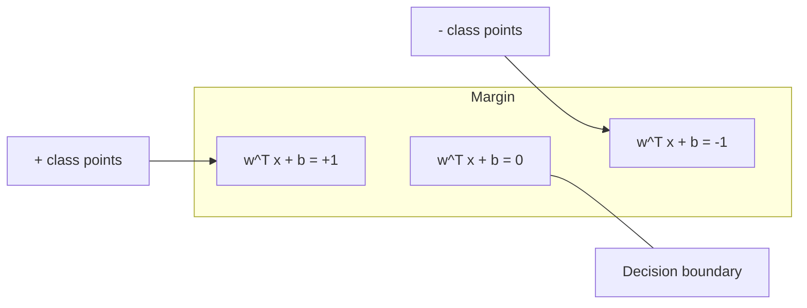
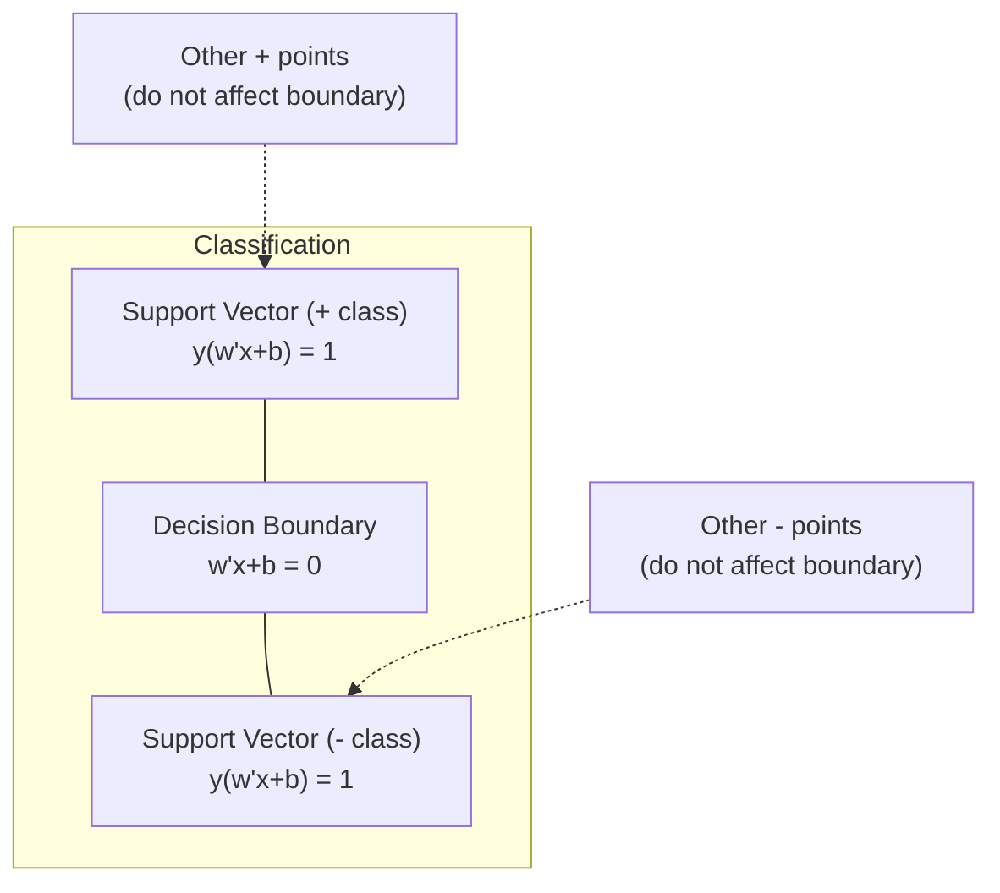
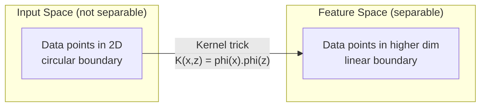

# Machines vectorielles de soutien

> Trouvez la rue la plus large entre deux classes.

**Type:** Build
**Language:**Python
**Prerequisites:** Phase 1 (Lessons 08 Optimization, 14 Norms and Distances, 18 Convex Optimization)
**Time:** ~90 minutes

## Objectifs d'apprentissage

- Implementer un SVM linéaire à partir de zéro en utilisant la perte de charnière et la baisse de gradient sur la formulation primaire
- Expliquer le principe de marge maximale et identifier les vecteurs de soutien d'un modèle formé
- Comparer les noyaux linéaires, polynomiels et RBF et expliquer comment la ruse du noyau évite une cartographie explicite haute dimension
- Évaluer l'offre contrôlée par le paramètre C entre la largeur des marges et les erreurs de classification

## Le problème

Vous avez deux classes de points de données et vous devez dessiner une ligne (ou hyperplane) les séparant.

La marge est la distance entre la limite de décision et les points de données les plus proches de chaque côté.

Cette intuition conduit à Support Vector Machines, l'un des algorithmes les plus élégants mathématiquement de ML. Les SVM étaient la méthode de classification dominante avant l'apprentissage profond et restent le meilleur choix pour les petits ensembles de données, les données haute dimension et les problèmes où vous avez besoin d'un modèle fondé sur des principes, bien compris avec des garanties théoriques.

Les SVM se connectent directement à la phase 1: l'optimisation est convexe (leçon 18), la marge est mesurée avec des normes (leçon 14), et le truc du noyau exploite les produits dotés pour gérer des limites non linéaires sans jamais calculer dans l'espace haute dimension.

## Le concept

### Le classement de marge maximale

Compte tenu des données séparables linéairement avec des étiquettes y_i dans {-1, +1} et des vecteurs de fonction x_i, nous voulons un hyperplane w^T x + b = 0 qui sépare les classes.

La distance entre un point x_i et l'hyperplane est:

```
distance = |w^T x_i + b| / ||w||
```

Pour un point correctement classé: y_i * (w^T x_i + b) > 0. La marge est le double de la distance de l'hyperplane au point le plus proche de chaque côté.



Le problème de l'optimisation:

```
maximize    2 / ||w||     (the margin width)
subject to  y_i * (w^T x_i + b) >= 1  for all i
```

En équivalence (minimiser les risques est plus facile à optimiser):

```
minimize    (1/2) ||w||^2
subject to  y_i * (w^T x_i + b) >= 1  for all i
```

Il s'agit d'un programme quadratique convexe. Il a une solution globale unique. Les points de données qui se trouvent exactement sur les limites de la marge (où y_i * (w^T x_i + b) = 1) sont les vecteurs de support. Ils sont les seuls points qui déterminent la limite de décision.

### Vecteurs de soutien: les quelques critiques



La plupart des points de formation sont sans importance. Seuls les vecteurs de support comptent. C'est pourquoi les SVM sont efficaces en termes de mémoire au moment de la prédiction: vous n'avez besoin que de stocker les vecteurs de support, pas l'ensemble du jeu de formation.

Le nombre de vecteurs de support donne également une limite sur l'erreur de généralisation.

### Marge douce: traitement du bruit avec le paramètre C

Les données réelles sont rarement parfaitement séparables. Certains points peuvent être du mauvais côté de la limite ou à l'intérieur de la marge.

```
minimize    (1/2) ||w||^2 + C * sum(xi_i)
subject to  y_i * (w^T x_i + b) >= 1 - xi_i
            xi_i >= 0  for all i
```

La variable de laxité xi_i mesure la quantité de point i qui viole la marge.

| C value | Behavior |
|---------|----------|
| Large C | Penalizes violations heavily. Narrow margin, fewer misclassifications. Overfits |
| Small C | Allows more violations. Wide margin, more misclassifications. Underfits |

C est la force de régulation, inversée.

### Perte de l'accrochage: la fonction de perte de SVM

Le SVM de marge douce peut être réécrit comme une optimisation sans contrainte:

```
minimize    (1/2) ||w||^2 + C * sum(max(0, 1 - y_i * (w^T x_i + b)))
```

Le terme max(0, 1 - y_i * f(x_i)) est la perte de charnière. Il est zéro lorsque le point est correctement classé et au-delà de la marge. Il est linéaire lorsque le point est à l'intérieur de la marge ou mal classé.

```
Hinge loss for a single point:

loss
  |
  | \
  |  \
  |   \
  |    \
  |     \_______________
  |
  +-----|-----|-------->  y * f(x)
       0     1

Zero loss when y*f(x) >= 1 (correctly classified, outside margin).
Linear penalty when y*f(x) < 1.
```

Comparer avec la perte logistique (régrésion logistique):

```
Hinge:     max(0, 1 - y*f(x))          Hard cutoff at margin
Logistic:  log(1 + exp(-y*f(x)))        Smooth, never exactly zero
```

La perte de coque produit des solutions rares (seuls les vecteurs de support ont une contribution non nulle). La perte logistique utilise tous les points de données.

### Formation d'un SVM linéaire avec descente de gradient

Vous pouvez entraîner un SVM linéaire en utilisant la descente de gradient sur la perte de charnière plus la régularisation de L2, sans résoudre le QP restreint:

```
L(w, b) = (lambda/2) * ||w||^2 + (1/n) * sum(max(0, 1 - y_i * (w^T x_i + b)))

Gradient with respect to w:
  If y_i * (w^T x_i + b) >= 1:  dL/dw = lambda * w
  If y_i * (w^T x_i + b) < 1:   dL/dw = lambda * w - y_i * x_i

Gradient with respect to b:
  If y_i * (w^T x_i + b) >= 1:  dL/db = 0
  If y_i * (w^T x_i + b) < 1:   dL/db = -y_i
```

Cette formule est appelée la formulation primaire. Elle fonctionne en O ((n * d) par époque, où n est le nombre d'échantillons et d est le nombre de caractéristiques. Pour les données de grande taille, rares, haute dimension (classification du texte), c'est rapide.

### La double formulation et le truc du noyau

Le double Lagrangien du problème SVM (à partir de la leçon de phase 1, conditions KKT) est:

```
maximize    sum(alpha_i) - (1/2) * sum_ij(alpha_i * alpha_j * y_i * y_j * (x_i . x_j))
subject to  0 <= alpha_i <= C
            sum(alpha_i * y_i) = 0
```

Le dual ne concerne que les produits de point x_i. x_j entre les points de données. C'est l'idée clé. Remplacez chaque produit de point par une fonction de noyau K(x_i, x_j) et le SVM peut apprendre les limites non linéaires sans jamais calculer explicitement la transformation.

```
Linear kernel:      K(x, z) = x . z
Polynomial kernel:  K(x, z) = (x . z + c)^d
RBF (Gaussian):     K(x, z) = exp(-gamma * ||x - z||^2)
```

Le noyau RBF cartographiera les données dans un espace dimensionnel infini. Les points proches de l'espace d'entrée ont une valeur de noyau proche de 1.



Le truc du noyau calcule le produit des points dans l'espace haute dimension sans jamais y aller. Pour le noyau polynomial de degré d dans les dimensions D, l'espace de caractéristiques explicite a des dimensions O(D^d. Mais K(x, z) est calculé en temps O(D).

### MTS pour la régression (MTS)

Le support vecteur de régression fixe un tube d'epsilon de largeur autour des données. les points à l'intérieur du tube ont une perte zéro. les points à l'extérieur du tube sont pénalisés linéairement.

```
minimize    (1/2) ||w||^2 + C * sum(xi_i + xi_i*)
subject to  y_i - (w^T x_i + b) <= epsilon + xi_i
            (w^T x_i + b) - y_i <= epsilon + xi_i*
            xi_i, xi_i* >= 0
```

Le paramètre epsilon contrôle la largeur du tube. un tube plus large = moins de vecteurs de support = plus lissé. un tube plus étroit = plus de vecteurs de support = plus serré.

### Pourquoi les SVM ont perdu face à l'apprentissage profond (et quand ils gagnent encore)

Les SVM ont dominé la ML de la fin des années 1990 au début des années 2010.

| Factor | SVMs | Deep learning |
|--------|------|---------------|
| Feature engineering | Requires it | Learns features |
| Scalability | O(n^2) to O(n^3) for kernel | O(n) per epoch with SGD |
| Image/text/audio | Needs handcrafted features | Learns from raw data |
| Large datasets (>100k) | Slow | Scales well |
| GPU acceleration | Limited benefit | Massive speedup |

Les SVM gagnent toujours dans ces situations:
- Petits ensembles de données (de centaines à des milliers d'échantillons)
- Données rares à haute dimension (texte avec caractéristiques TF-IDF)
- Lorsque vous avez besoin de garanties mathématiques (limites de marge)
- Lorsque le temps de formation doit être minimal (la SVM linéaire est très rapide)
- Classification binaire avec structure de marge claire
- Détection d'anomalies (MAS de classe unique)

```figure
svm-margin
```

## Faites-le

### Étape 1: Perte de crevasse et dégradation

Comptez la perte de charnière pour un lot et sa dégradation.

```python
def hinge_loss(X, y, w, b):
    n = len(X)
    total_loss = 0.0
    for i in range(n):
        margin = y[i] * (dot(w, X[i]) + b)
        total_loss += max(0.0, 1.0 - margin)
    return total_loss / n
```

### Étape 2: SVM linéaire par descente de gradient

Traînez en minimisant les pertes de charnières régulières.

```python
class LinearSVM:
    def __init__(self, lr=0.001, lambda_param=0.01, n_epochs=1000):
        self.lr = lr
        self.lambda_param = lambda_param
        self.n_epochs = n_epochs
        self.w = None
        self.b = 0.0

    def fit(self, X, y):
        n_features = len(X[0])
        self.w = [0.0] * n_features
        self.b = 0.0

        for epoch in range(self.n_epochs):
            for i in range(len(X)):
                margin = y[i] * (dot(self.w, X[i]) + self.b)
                if margin >= 1:
                    self.w = [wj - self.lr * self.lambda_param * wj
                              for wj in self.w]
                else:
                    self.w = [wj - self.lr * (self.lambda_param * wj - y[i] * X[i][j])
                              for j, wj in enumerate(self.w)]
                    self.b -= self.lr * (-y[i])

    def predict(self, X):
        return [1 if dot(self.w, x) + self.b >= 0 else -1 for x in X]
```

### Étape 3: Fonctions du noyau

Implémenter des noyaux linéaires, polynomiels et RBF.

```python
def linear_kernel(x, z):
    return dot(x, z)

def polynomial_kernel(x, z, degree=3, c=1.0):
    return (dot(x, z) + c) ** degree

def rbf_kernel(x, z, gamma=0.5):
    diff = [xi - zi for xi, zi in zip(x, z)]
    return math.exp(-gamma * dot(diff, diff))
```

### Étape 4: Identification des vecteurs de marge et de support

Après l'entraînement, identifiez quels points sont des vecteurs de support et calculez la largeur de marge.

```python
def find_support_vectors(X, y, w, b, tol=1e-3):
    support_vectors = []
    for i in range(len(X)):
        margin = y[i] * (dot(w, X[i]) + b)
        if abs(margin - 1.0) < tol:
            support_vectors.append(i)
    return support_vectors
```

Regardez !`code/svm.py`pour la mise en œuvre complète avec toutes les démonstrations.

## Utilisez-le

Avec scikit-apprendre:

```python
from sklearn.svm import SVC, LinearSVC, SVR
from sklearn.preprocessing import StandardScaler
from sklearn.pipeline import Pipeline

clf = Pipeline([
    ("scaler", StandardScaler()),
    ("svm", SVC(kernel="rbf", C=1.0, gamma="scale")),
])
clf.fit(X_train, y_train)
print(f"Accuracy: {clf.score(X_test, y_test):.4f}")
print(f"Support vectors: {clf['svm'].n_support_}")
```

Important: étalonnez toujours vos caractéristiques avant de former un SVM. Les SVM sont sensibles aux magnitudes des caractéristiques car la marge dépend des caractéristiques non étalonnées et déforment la géométrie.

Pour les grands ensembles de données, utiliser `LinearSVC`(formulation primaire, O(n) par époque) au lieu de `SVC`(double formule, O(n^2) à O(n^3)):

```python
from sklearn.svm import LinearSVC

clf = Pipeline([
    ("scaler", StandardScaler()),
    ("svm", LinearSVC(C=1.0, max_iter=10000)),
])
```

## Exercices

1. Générer un ensemble de données séparables linéairement en 2D. Exercer votre LinearSVM et identifier les vecteurs de support. Vérifiez que les vecteurs de support sont les points les plus proches de la limite de décision.

2. Varier C de 0,001 à 1000 sur un ensemble de données bruyant. Tracer la limite de décision pour chaque valeur C. Observer la transition de large marge (déficit de coût) à étroite marge (surcoût).

3. Créer un ensemble de données où les limites des classes sont circulaires (pas linéaires). Afficher qu'un SVM linéaire échoue. Compute la matrice du noyau RBF et montrer que les classes deviennent séparables dans l'espace des caractéristiques induit par le noyau.

4. Comparez la perte de charnière et la perte logistique sur le même ensemble de données. Exercez un SVM linéaire et une régression logistique. Comptez combien de points de formation contribuent à la limite de décision de chaque modèle (vecteurs de support contre tous les points).

5. Mettez en œuvre SVR (perte insensible à l'epsilon). Ajoutez-le à y = sin(x) + bruit.

## Les termes clés

| Term | What it actually means |
|------|----------------------|
| Support vectors | The training points closest to the decision boundary. The only points that determine the hyperplane |
| Margin | The distance between the decision boundary and the nearest support vectors. SVMs maximize this |
| Hinge loss | max(0, 1 - y*f(x)). Zero when correctly classified and outside the margin. Linear penalty otherwise |
| C parameter | Trade-off between margin width and classification errors. Large C = narrow margin, small C = wide margin |
| Soft margin | SVM formulation that allows margin violations via slack variables. Handles non-separable data |
| Kernel trick | Computing dot products in a high-dimensional feature space without explicitly mapping to that space |
| Linear kernel | K(x, z) = x . z. Equivalent to standard dot product. For linearly separable data |
| RBF kernel | K(x, z) = exp(-gamma * \|\|x-z\|\|^2). Maps to infinite dimensions. Learns any smooth boundary |
| Polynomial kernel | K(x, z) = (x . z + c)^d. Maps to a feature space of polynomial combinations |
| Dual formulation | Reformulation of the SVM problem that depends only on dot products between data points. Enables kernels |
| SVR | Support Vector Regression. Fits an epsilon-tube around the data. Points inside the tube have zero loss |
| Slack variables | xi_i: measures how much a point violates the margin. Zero for correctly classified points outside margin |
| Maximum margin | The principle of choosing the hyperplane that maximizes the distance to the nearest points of each class |

## Pour en savoir plus

- [Vapnik: The Nature of Statistical Learning Theory (1995)](https://link.springer.com/book/10.1007/978-1-4757-3264-1)- le texte fondamental sur les MSS et l'apprentissage statistique
- [Cortes & Vapnik: Support-vector networks (1995)](https://link.springer.com/article/10.1007/BF00994018)- le papier SVM original
- [Platt: Sequential Minimal Optimization (1998)](https://www.microsoft.com/en-us/research/publication/sequential-minimal-optimization-a-fast-algorithm-for-training-support-vector-machines/)- l'algorithme de gestion des risques qui a rendu la formation des risques de gestion des risques pratique
- [scikit-learn SVM documentation](https://scikit-learn.org/stable/modules/svm.html)- un guide pratique avec des détails de mise en œuvre
- [LIBSVM: A Library for Support Vector Machines](https://www.csie.ntu.edu.tw/~cjlin/libsvm/)- la bibliothèque C++ derrière la plupart des implémentations SVM
