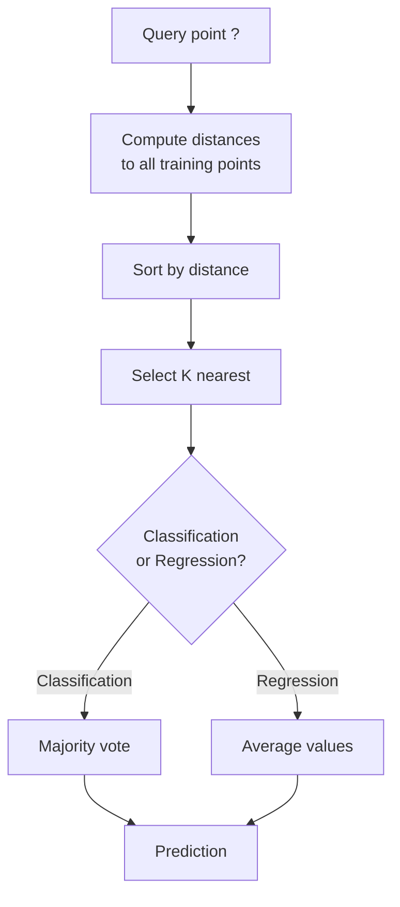
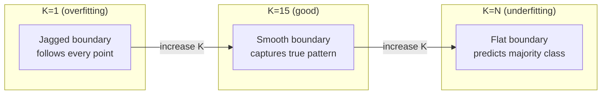
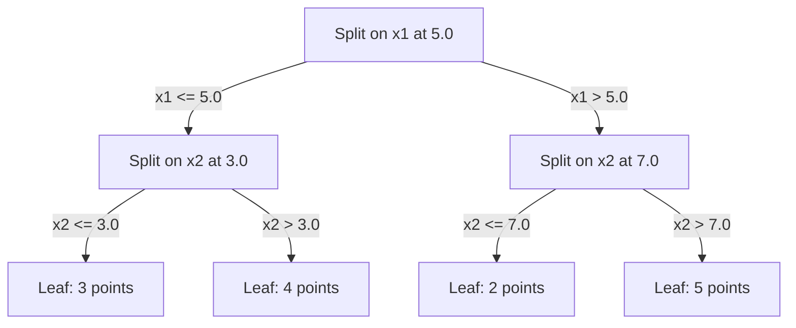

# K- Les voisins les plus proches et les distances

> On peut tout stocker, prédire en regardant les voisins, l'algorithme le plus simple qui fonctionne.

**Type:** Build
**Language:**Python
**Prerequisites:** Phase 1 (Lesson 14 Norms and Distances)
**Time:** ~90 minutes

## Objectifs d'apprentissage

- Implementer la classification et la régression des KNN à partir de zéro avec K configurable et vote pondéré à distance
- Comparer les mesures de distance L1, L2, cosine et Minkowski et sélectionner la bonne pour un type de données donné
- Expliquer la malédiction de la dimensionnalité et démontrer pourquoi le KNN se dégrade dans les espaces haute dimension
- Construire un arbre KD pour une recherche et une analyse efficaces du voisin le plus proche quand il dépasse la force brute

## Le problème

Vous avez un ensemble de données. Un nouveau point de données arrive. Vous devez le classer ou prédire sa valeur. Au lieu d'apprendre des paramètres à partir des données (comme la régression linéaire ou les SVM), vous trouvez simplement les points de formation K les plus proches du nouveau point et les laissez voter.

Il n'y a pas de phase d'entraînement, pas de paramètres à apprendre, pas de fonction de perte à minimiser, vous stockez l'ensemble de l'ensemble d'entraînement et comptez les distances au moment de la prédiction.

Il semble trop simple à travailler. Mais KNN est étonnamment compétitif pour de nombreux problèmes, en particulier avec de petits à moyens ensembles de données, et sa compréhension révèle profondément des concepts fondamentaux: le choix de la métrique de distance (connexion à la phase 1 Leçon 14), la malédiction de la dimensionnalité, et la différence entre l'apprentissage paresseux et ardent.

KNN apparaît également partout dans l'IA moderne, sous différents noms. Les bases de données vectorielles recherchent KNN sur les emblèmes. La génération augmentée de récupération (RAG) trouve les trous de documents K les plus proches. Les systèmes de recommandation trouvent des utilisateurs ou des éléments similaires. L'algorithme est le même. L'échelle et les structures de données sont différentes.

## Le concept

### Comment fonctionne KNN

Compte tenu d'un ensemble de données de points étiquetés et d'un nouveau point de requête:

1. Calculer la distance de la requête à chaque point de l'ensemble de données
2. Réglage par distance
3. Prenez les points les plus proches de K
4. Pour la classification: vote majoritaire parmi les voisins K
5. Pour la régression: moyenne (ou moyenne pondérée) des valeurs des voisins K



C'est l'algorithme, pas de réglage, pas de descente de gradient, pas d'époques.

### Choisir K

K est l'hyperparamètre unique.

| K | Behavior |
|---|----------|
| K = 1 | Decision boundary follows every point. Zero training error. High variance. Overfits |
| Small K (3-5) | Sensitive to local structure. Can capture complex boundaries |
| Large K | Smoother boundaries. More robust to noise. May underfit |
| K = N | Predicts the majority class for every point. Maximum bias |

Un point de départ commun est K = sqrt(N) pour un ensemble de données de N points.



### Mesures de distance

La fonction de distance définit ce que signifie "près".

**L2 (Euclidean)**est la distance par défaut.

```
d(a, b) = sqrt(sum((a_i - b_i)^2))
```

Sensitif à l'échelle des caractéristiques.

**L1 (Manhattan)**Il est plus robuste à des valeurs étrangères que L2 parce qu'il ne quadrate pas les différences.

```
d(a, b) = sum(|a_i - b_i|)
```

**Cosine distance**Il mesure l'angle entre les vecteurs, sans tenir compte de la magnitude.

```
d(a, b) = 1 - (a . b) / (||a|| * ||b||)
```

**Minkowski**généralise L1 et L2 avec paramètre p.

```
d(a, b) = (sum(|a_i - b_i|^p))^(1/p)

p=1: Manhattan
p=2: Euclidean
p->inf: Chebyshev (max absolute difference)
```

Quelle métrique utiliser dépend des données:

| Data type | Best metric | Why |
|-----------|------------|-----|
| Numeric features, similar scale | L2 (Euclidean) | Default, works for spatial data |
| Numeric features, outliers | L1 (Manhattan) | Robust, does not amplify large differences |
| Text embeddings | Cosine | Magnitude is noise, direction is meaning |
| High-dimensional sparse | Cosine or L1 | L2 suffers from curse of dimensionality |
| Mixed types | Custom distance | Combine metrics per feature type |

### Nénine pondérée

Le KNN standard donne le même poids à tous les voisins de K. Mais un voisin à distance 0,1 devrait être plus important qu'un voisin à distance 5.0.

**Distance-weighted KNN**peses de chaque voisin inversement par distance:

```
weight_i = 1 / (distance_i + epsilon)

For classification: weighted vote
For regression:     weighted average = sum(w_i * y_i) / sum(w_i)
```

L'epsilon empêche la division par zéro lorsqu'un point de requête correspond exactement à un point d'entraînement.

Le KNN pondéré est moins sensible au choix de K parce que les voisins éloignés contribuent très peu indépendamment.

### La malédiction de la dimensionnalité

Les performances du KNN se dégradent dans de grandes dimensions.

**Problem 1: distances converge.**À mesure que la dimensionnalité augmente, le rapport de la distance maximale à la distance minimale approche 1. Tous les points deviennent également "éloignés" de la requête.

```
In d dimensions, for random uniform points:

d=2:    max_dist / min_dist = varies widely
d=100:  max_dist / min_dist ~ 1.01
d=1000: max_dist / min_dist ~ 1.001

When all distances are nearly equal, "nearest" is meaningless.
```

**Problem 2: volume explodes.**Pour capturer les voisins K dans une fraction fixe des données, vous devez étendre votre rayon de recherche pour couvrir une fraction beaucoup plus grande de l'espace de fonctionnalités.

**Problem 3: corners dominate.**Dans un hypercube d'unité de dimension d, la plupart du volume est concentré près des coins, pas au centre.

Consequence pratique: KNN fonctionne bien jusqu'à environ 20 à 50 fonctionnalités. Au-delà de cela, vous avez besoin de réduction de dimensionnalité (PCA, UMAP, t-SNE) avant d'appliquer KNN, ou vous devez utiliser des structures de recherche basées sur des arbres qui exploitent la dimensionnalité inférieure intrinsèque des données.

### Les arbres de KD: recherche rapide du voisin le plus proche

Le KNN de force brute calcule la distance de la requête à chaque point de formation. c'est O(n * d) par requête. Pour les grands ensembles de données, c'est trop lent.

Un arbre KD partage récursivement l'espace le long des axes de caractéristiques.



Pour trouver le voisin le plus proche, traversez l'arbre jusqu'à la feuille contenant la requête, puis retracez-vous et vérifiez les partitions voisines seulement si elles peuvent contenir des points plus proches.

Temps moyen de requête: O(log n) pour les dimensions faibles. Mais les arbres KD se dégradent à O(n) dans les dimensions élevées (d > 20) parce que le retrait élimine de moins en moins de branches.

### Les arbres à billes: mieux adaptés aux dimensions modérées

Les arbres de boules divisent les données en hypersphères nichées au lieu de boîtes alignées sur les axes. Chaque nœud définit une boule (centre + rayon) qui contient tous les points de ce sous-arbre.

Avantages par rapport aux KD:
- Fonctionner mieux dans des dimensions modérées (jusqu'à ~50)
- Manche à structure non alignée sur un axe
- Les volumes de bord sont plus étroits, ce qui signifie que plus de branches sont taillées lors de la recherche.

Les arbres KD et les arbres à billes sont des algorithmes exacts. Pour la recherche à grande échelle (des millions de points, des centaines de dimensions), les méthodes voisines approximatives (HNSW, IVF, quantification des produits) sont utilisées à la place.

### L'apprentissage paresseux contre l'apprentissage par avidité

Le KNN est un apprenant paresseux: il ne travaille pas au moment de la formation et tout travaille au moment de la prédiction. La plupart des autres algorithmes (régrésion linéaire, SVM, réseaux neuronaux) sont des apprenants avides: ils effectuent des calculs lourds au moment de la formation pour construire un modèle compact, puis les prédictions sont rapides.

| Aspect | Lazy (KNN) | Eager (SVM, neural net) |
|--------|------------|------------------------|
| Training time | O(1) just store data | O(n * epochs) |
| Prediction time | O(n * d) per query | O(d) or O(parameters) |
| Memory at prediction | Store entire training set | Store model parameters only |
| Adapts to new data | Add points instantly | Retrain the model |
| Decision boundary | Implicit, computed on the fly | Explicit, fixed after training |

L'apprentissage paresseux est idéal lorsque:
- Les données changent fréquemment (ajouter/supprimer des points sans recyclage)
- Vous avez besoin de prédictions pour très peu de questions
- Vous voulez zéro temps d'entraînement
- Le jeu de données est assez petit pour que la recherche brute force soit rapide

### KNN pour la régression

Au lieu de voter à la majorité, la KNN pour la régression moyenne les valeurs cibles des voisins K.

```
prediction = (1/K) * sum(y_i for i in K nearest neighbors)

Or with distance weighting:
prediction = sum(w_i * y_i) / sum(w_i)
where w_i = 1 / distance_i
```

La régression KNN produit des prédictions de partage constante (ou partage lisse avec pondération). Elle ne peut pas extrapoler au-delà de la portée des données de formation. Si les objectifs de formation sont tous compris entre 0 et 100, KNN ne prédira jamais 200.

```figure
knn-smoothness
```

## Faites-le

### Étape 1: Fonctions de distance

Mettez en œuvre les distances L1, L2, cosine et Minkowski.

```python
import math

def l2_distance(a, b):
    return math.sqrt(sum((ai - bi) ** 2 for ai, bi in zip(a, b)))

def l1_distance(a, b):
    return sum(abs(ai - bi) for ai, bi in zip(a, b))

def cosine_distance(a, b):
    dot_val = sum(ai * bi for ai, bi in zip(a, b))
    norm_a = math.sqrt(sum(ai ** 2 for ai in a))
    norm_b = math.sqrt(sum(bi ** 2 for bi in b))
    if norm_a == 0 or norm_b == 0:
        return 1.0
    return 1.0 - dot_val / (norm_a * norm_b)

def minkowski_distance(a, b, p=2):
    if p == float('inf'):
        return max(abs(ai - bi) for ai, bi in zip(a, b))
    return sum(abs(ai - bi) ** p for ai, bi in zip(a, b)) ** (1 / p)
```

### Étape 2: Classificateur et régresseur KNN

Construire le KNN complet avec K configurable, mesure de distance et pondération de distance optionnelle.

```python
class KNN:
    def __init__(self, k=5, distance_fn=l2_distance, weighted=False,
                 task="classification"):
        self.k = k
        self.distance_fn = distance_fn
        self.weighted = weighted
        self.task = task
        self.X_train = None
        self.y_train = None

    def fit(self, X, y):
        self.X_train = X
        self.y_train = y

    def predict(self, X):
        return [self._predict_one(x) for x in X]
```

### Étape 3: Arbre KD pour une recherche efficace

Construisez un arbre KD à partir de zéro qui se divise récursivement sur la médiane de chaque dimension.

```python
class KDTree:
    def __init__(self, X, indices=None, depth=0):
        # Recursively partition the data
        self.axis = depth % len(X[0])
        # Split on median of the current axis
        ...

    def query(self, point, k=1):
        # Traverse to leaf, then backtrack
        ...
```

Regardez !`code/knn.py`pour la mise en œuvre complète avec toutes les méthodes et démonstrations auxiliaires.

### Étape 4: Écalement des caractéristiques

KNN nécessite une mise à l'échelle des caractéristiques car les distances sont sensibles aux magnitudes des caractéristiques.

```python
def standardize(X):
    n = len(X)
    d = len(X[0])
    means = [sum(X[i][j] for i in range(n)) / n for j in range(d)]
    stds = [
        max(1e-10, (sum((X[i][j] - means[j]) ** 2 for i in range(n)) / n) ** 0.5)
        for j in range(d)
    ]
    return [[((X[i][j] - means[j]) / stds[j]) for j in range(d)] for i in range(n)], means, stds
```

## Utilisez-le

Avec scikit-apprendre:

```python
from sklearn.neighbors import KNeighborsClassifier
from sklearn.preprocessing import StandardScaler
from sklearn.pipeline import Pipeline

clf = Pipeline([
    ("scaler", StandardScaler()),
    ("knn", KNeighborsClassifier(n_neighbors=5, metric="euclidean")),
])
clf.fit(X_train, y_train)
print(f"Accuracy: {clf.score(X_test, y_test):.4f}")
```

Scikit-learn utilise automatiquement des arbres KD ou des arbres boules lorsque le jeu de données est assez grand et la dimensionnalité est assez basse.`algorithm`Paramètre.

Pour la recherche de voisin le plus proche à grande échelle (millions de vecteurs), utilisez FAISS, Annoy ou une base de données vectorielle:

```python
import faiss

index = faiss.IndexFlatL2(dimension)
index.add(embeddings)
distances, indices = index.search(query_vectors, k=5)
```

## Exercices

1. Implémenter la classification KNN sur un ensemble de données 2D de 3 classes. Tracer la limite de décision pour K=1, K=5, K=15, et K=N. Observer la transition de la suradaptation à la sous-adaptation.

2. Générez 1000 points aléatoires dans 2, 5, 10, 50, 100 et 500 dimensions. Pour chaque dimensionnalité, calculer le rapport de la distance paritaire maximale à la distance paritaire minimale.

3. Comparer L1, L2 et la distance cosine pour KNN sur un problème de classification du texte (utiliser des vecteurs TF-IDF). Quelle mesure donne la meilleure précision? Pourquoi le cosine a-t-il tendance à gagner pour le texte?

4. Mettez en œuvre un arbre KD et mesurez le temps de requête par rapport à la force brute pour des ensembles de données de 1k, 10k et 100k points en 2D, 10D et 50D. À quelle dimension le arbre KD cesse d'être plus rapide que la force brute?

5. Construisez un régresseur KNN pondéré pour y = sin(x) + bruit. Comparer avec un KNN non pondéré pour K=3, 10, 30. Montrez que la pondération produit des prédictions plus fluides, en particulier pour les K de grande taille.

## Les termes clés

| Term | What it actually means |
|------|----------------------|
| K-nearest neighbors | Non-parametric algorithm that predicts by finding the K closest training points to a query |
| Lazy learning | No computation at training time. All work happens at prediction time. KNN is the canonical example |
| Eager learning | Heavy computation at training time to build a compact model. Most ML algorithms are eager |
| Curse of dimensionality | In high dimensions, distances converge and neighborhoods expand to cover most of the space, making KNN ineffective |
| KD-tree | Binary tree that recursively partitions space along feature axes. O(log n) queries in low dimensions |
| Ball tree | Tree of nested hyperspheres. Works better than KD-trees in moderate dimensions (up to ~50) |
| Weighted KNN | Neighbors weighted inversely by distance. Closer neighbors have more influence on the prediction |
| Feature scaling | Normalizing features to comparable ranges. Required for distance-based methods like KNN |
| Majority vote | Classification by counting which class is most common among K neighbors |
| Brute force search | Computing distance to every training point. O(n*d) per query. Exact but slow for large n |
| Approximate nearest neighbor | Algorithms (HNSW, LSH, IVF) that find approximately nearest points much faster than exact search |
| Voronoi diagram | The partition of space where each region contains all points closer to one training point than any other. K=1 KNN produces Voronoi boundaries |

## Pour en savoir plus

- [Cover & Hart: Nearest Neighbor Pattern Classification (1967)](https://ieeexplore.ieee.org/document/1053964)- le document KNN fondamental prouvant qu'il a un taux d'erreur au plus deux fois supérieur à l'optimal Bayes
- [Friedman, Bentley, Finkel: An Algorithm for Finding Best Matches in Logarithmic Expected Time (1977)](https://dl.acm.org/doi/10.1145/355744.355745)- le papier original KD-tree
- [Beyer et al.: When Is "Nearest Neighbor" Meaningful? (1999)](https://link.springer.com/chapter/10.1007/3-540-49257-7_15)- analyse formelle de la malédiction de la dimensionnalité pour le voisin le plus proche
- [scikit-learn Nearest Neighbors documentation](https://scikit-learn.org/stable/modules/neighbors.html)- guide pratique avec sélection d'algorithmes
- [FAISS: A Library for Efficient Similarity Search](https://github.com/facebookresearch/faiss)- La bibliothèque de Meta pour la recherche de voisin le plus proche à l'échelle de milliards
