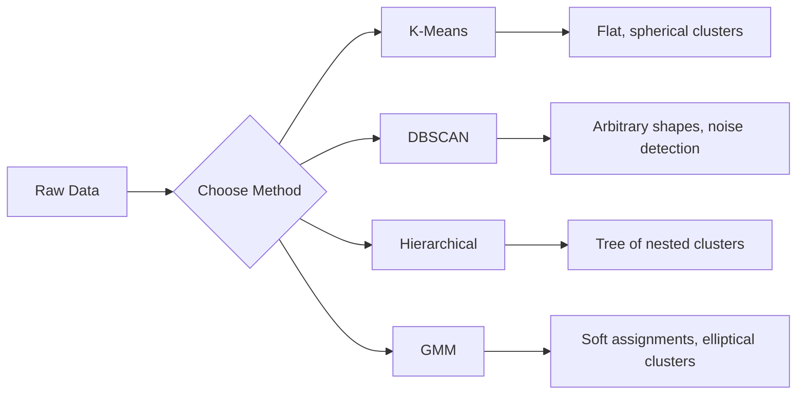

# Apprendre sans surveillance

> Aucune étiquette, aucun professeur, l'algorithme trouve sa structure.

**Type:** Build
**Languages:** Python
**Prerequisites:** Phase 1 (Norms & Distances, Probability & Distributions), Phase 2 Lessons 1-6
**Time:** ~90 minutes

## Objectifs d'apprentissage

- Implémenter les modèles K-Means, DBSCAN et Gaussian Mix from scratch et comparer leur comportement de regroupement
- Évaluer la qualité du cluster en utilisant le score de la silhouette et la méthode du coude pour sélectionner le K optimal
- Expliquer quand DBSCAN dépasse K-Means et identifier l'algorithme qui traite les grappes et les échelles non sphériques
- Construire un pipeline de détection des anomalies en utilisant des méthodes de regroupement pour désigner les points qui dévient des schémas normaux

## Le problème

Chaque leçon de ML jusqu'à présent a supposé des données étiquetées: " voici une entrée, voici la sortie correcte. " Dans le monde réel, les étiquettes sont chères. Un hôpital a des millions de dossiers de patients, mais personne n'a marqué manuellement chacun d'eux avec une catégorie de maladie. Un site de commerce électronique a des millions de sessions d'utilisateurs mais personne n'a de segments de clients étiquetés à la main. Une équipe de sécurité a des journaux de réseau mais personne n'a détecté chaque anomalie.

L'apprentissage non supervisé trouve des modèles sans qu'on lui dise quoi chercher. Il regroupe des points de données similaires, découvre des structures cachées et supprime des anomalies.

Le problème: sans étiquettes, vous ne pouvez pas mesurer directement "bien" ou "mal". Vous avez besoin de différents outils pour évaluer si la structure que votre algorithme a trouvée est significative.

## Le concept

### Les groupes: regrouper des choses similaires

Le clustering attribue chaque point de données à un groupe (cluster) de sorte que les points du même groupe sont plus similaires les uns aux autres que les points des autres groupes.



### K-Means: Le cheval de travail

K-Means partage les données en clusters K exactement. Chaque cluster a un centre de masse, et chaque point appartient au centre de masse le plus proche.

L'algorithme de Lloyd:

1. Choisissez K points aléatoires comme centres initiaux
2. Assignez chaque point de données au centre-point le plus proche
3. Récupérez chaque centroid comme la moyenne de ses points attribués
4. Répétez les étapes 2-3 jusqu'à ce que les tâches cessent de changer

La fonction objective (inertie) mesure la distance carrée totale de chaque point à son centre-point assigné. K-Means le minimise, mais ne trouve qu'un minimum local.

### Choisir K

Deux méthodes standard:

**Elbow method:**Exécuter K-Means pour K = 1, 2, 3, ..., n. Inertie de la trace vs K. Rechercher le "coude-d'épaule" où l'ajout de plus de grappes cesse de réduire l'inertie de manière significative.

**Silhouette score:**Pour chaque point, mesurez à quel point il est similaire à son propre cluster (a) par rapport à l'autre cluster (b). Le coefficient de silhouette est (b - a) / max(a, b), allant de -1 (cluster erroné) à +1 (bien regroupé).

### DBSCAN: Clustering basé sur la densité

K-Means suppose que les amas sont sphériques et vous oblige à choisir K à l'avance. DBSCAN ne fait aucune hypothèse.

Deux paramètres:
- **eps**: le rayon d'un quartier
- **min_samples**: le nombre minimum de points nécessaires pour former une région dense

Trois types de points:
- **Core point**: a au moins min_samples points à distance d'eps
- **Border point**: dans les épis d'un point central mais pas lui-même un point central
- **Noise point**Les résultats de la recherche ont été obtenus en vue de la réalisation de la recherche et de la recherche.

DBSCAN connecte les points de base qui sont à l'intérieur des eps les uns des autres dans le même cluster.

Les forces: trouve des amas de toute forme, détermine automatiquement le nombre de clusters, identifie des valeurs anormales.

### Clusterage hiérarchique

Construit un arbre (dendrogramme) de grappes nichées.

Agglomératif (de bas en haut):
1. Commencez par chaque point comme son propre cluster
2. Fusez les deux amas les plus proches
3. Répétez jusqu' à ce qu' un seul groupe reste
4. Coupez le dendrogramme au niveau souhaité pour obtenir des grappes K

La "proximité" entre les amas peut être mesurée comme suit:
- **Single linkage**: distance minimale entre les deux points des deux groupes
- **Complete linkage**: distance maximale entre les deux points
- **Average linkage**: distance moyenne entre toutes les paires
- **Ward's method**: la fusion qui provoque la plus petite augmentation de la variance totale au sein du cluster

### Modèles de mélange gaussiens (GMM)

K-Means donne des assignations difficiles: chaque point appartient à un cluster précis. GMM donne des assignations douces: chaque point a une probabilité d'appartenir à chaque cluster.

GMM suppose que les données sont générées à partir d'un mélange de distributions gaussiennes K, chacune avec sa propre moyenne et covariance.

- **E-step**: calculer la probabilité que chaque point appartient à chaque Gaussian
- **M-step**: mettre à jour la moyenne, la covariance et le poids de mélange de chaque Gaussian pour maximiser la probabilité des données

GMM peut modéliser des amas elliptiques (pas seulement sphériques comme K-Means) et gère naturellement des amas qui se chevauchent.

### Quand utiliser lequel

| Method | Best for | Avoid when |
|--------|----------|------------|
| K-Means | Large datasets, spherical clusters, known K | Irregular shapes, outliers present |
| DBSCAN | Unknown K, arbitrary shapes, outlier detection | Varying densities, very high dimensions |
| Hierarchical | Small datasets, need dendrogram, unknown K | Large datasets (O(n^2) memory) |
| GMM | Overlapping clusters, soft assignments needed | Very large datasets, too many dimensions |

### Détection des anomalies par agglomération

Le regroupement permet naturellement la détection des anomalies:
- **K-Means**: les points éloignés de tout centre sont des anomalies
- **DBSCAN**: les points de bruit sont des anomalies par définition
- **GMM**: les points avec une faible probabilité sous tous les Gaussiens sont des anomalies

```figure
kmeans-step
```

## Faites-le

### Étape 1: K-Mensures à partir de zéro

```python
import math
import random


def euclidean_distance(a, b):
    return math.sqrt(sum((ai - bi) ** 2 for ai, bi in zip(a, b)))


def kmeans(data, k, max_iterations=100, seed=42):
    random.seed(seed)
    n_features = len(data[0])

    centroids = random.sample(data, k)

    for iteration in range(max_iterations):
        clusters = [[] for _ in range(k)]
        assignments = []

        for point in data:
            distances = [euclidean_distance(point, c) for c in centroids]
            nearest = distances.index(min(distances))
            clusters[nearest].append(point)
            assignments.append(nearest)

        new_centroids = []
        for cluster in clusters:
            if len(cluster) == 0:
                new_centroids.append(random.choice(data))
                continue
            centroid = [
                sum(point[j] for point in cluster) / len(cluster)
                for j in range(n_features)
            ]
            new_centroids.append(centroid)

        if all(
            euclidean_distance(old, new) < 1e-6
            for old, new in zip(centroids, new_centroids)
        ):
            print(f"  Converged at iteration {iteration + 1}")
            break

        centroids = new_centroids

    return assignments, centroids
```

### Étape 2: méthode du coude et score de la silhouette

```python
def compute_inertia(data, assignments, centroids):
    total = 0.0
    for point, cluster_id in zip(data, assignments):
        total += euclidean_distance(point, centroids[cluster_id]) ** 2
    return total


def silhouette_score(data, assignments):
    n = len(data)
    if n < 2:
        return 0.0

    clusters = {}
    for i, c in enumerate(assignments):
        clusters.setdefault(c, []).append(i)

    if len(clusters) < 2:
        return 0.0

    scores = []
    for i in range(n):
        own_cluster = assignments[i]
        own_members = [j for j in clusters[own_cluster] if j != i]

        if len(own_members) == 0:
            scores.append(0.0)
            continue

        a = sum(euclidean_distance(data[i], data[j]) for j in own_members) / len(own_members)

        b = float("inf")
        for cluster_id, members in clusters.items():
            if cluster_id == own_cluster:
                continue
            avg_dist = sum(euclidean_distance(data[i], data[j]) for j in members) / len(members)
            b = min(b, avg_dist)

        if max(a, b) == 0:
            scores.append(0.0)
        else:
            scores.append((b - a) / max(a, b))

    return sum(scores) / len(scores)


def find_best_k(data, max_k=10):
    print("Elbow method:")
    inertias = []
    for k in range(1, max_k + 1):
        assignments, centroids = kmeans(data, k)
        inertia = compute_inertia(data, assignments, centroids)
        inertias.append(inertia)
        print(f"  K={k}: inertia={inertia:.2f}")

    print("\nSilhouette scores:")
    for k in range(2, max_k + 1):
        assignments, centroids = kmeans(data, k)
        score = silhouette_score(data, assignments)
        print(f"  K={k}: silhouette={score:.4f}")

    return inertias
```

### Étape 3: DBSCAN à partir de zéro

```python
def dbscan(data, eps, min_samples):
    n = len(data)
    labels = [-1] * n
    cluster_id = 0

    def region_query(point_idx):
        neighbors = []
        for i in range(n):
            if euclidean_distance(data[point_idx], data[i]) <= eps:
                neighbors.append(i)
        return neighbors

    visited = [False] * n

    for i in range(n):
        if visited[i]:
            continue
        visited[i] = True

        neighbors = region_query(i)

        if len(neighbors) < min_samples:
            labels[i] = -1
            continue

        labels[i] = cluster_id
        seed_set = list(neighbors)
        seed_set.remove(i)

        j = 0
        while j < len(seed_set):
            q = seed_set[j]

            if not visited[q]:
                visited[q] = True
                q_neighbors = region_query(q)
                if len(q_neighbors) >= min_samples:
                    for nb in q_neighbors:
                        if nb not in seed_set:
                            seed_set.append(nb)

            if labels[q] == -1:
                labels[q] = cluster_id

            j += 1

        cluster_id += 1

    return labels
```

### Étape 4: Modèle de mélange gaussien (algorithme EM)

```python
def gmm(data, k, max_iterations=100, seed=42):
    random.seed(seed)
    n = len(data)
    d = len(data[0])

    indices = random.sample(range(n), k)
    means = [list(data[i]) for i in indices]
    variances = [1.0] * k
    weights = [1.0 / k] * k

    def gaussian_pdf(x, mean, variance):
        d = len(x)
        coeff = 1.0 / ((2 * math.pi * variance) ** (d / 2))
        exponent = -sum((xi - mi) ** 2 for xi, mi in zip(x, mean)) / (2 * variance)
        return coeff * math.exp(max(exponent, -500))

    for iteration in range(max_iterations):
        responsibilities = []
        for i in range(n):
            probs = []
            for j in range(k):
                probs.append(weights[j] * gaussian_pdf(data[i], means[j], variances[j]))
            total = sum(probs)
            if total == 0:
                total = 1e-300
            responsibilities.append([p / total for p in probs])

        old_means = [list(m) for m in means]

        for j in range(k):
            r_sum = sum(responsibilities[i][j] for i in range(n))
            if r_sum < 1e-10:
                continue

            weights[j] = r_sum / n

            for dim in range(d):
                means[j][dim] = sum(
                    responsibilities[i][j] * data[i][dim] for i in range(n)
                ) / r_sum

            variances[j] = sum(
                responsibilities[i][j]
                * sum((data[i][dim] - means[j][dim]) ** 2 for dim in range(d))
                for i in range(n)
            ) / (r_sum * d)
            variances[j] = max(variances[j], 1e-6)

        shift = sum(
            euclidean_distance(old_means[j], means[j]) for j in range(k)
        )
        if shift < 1e-6:
            print(f"  GMM converged at iteration {iteration + 1}")
            break

    assignments = []
    for i in range(n):
        assignments.append(responsibilities[i].index(max(responsibilities[i])))

    return assignments, means, weights, responsibilities
```

### Étape 5: Générer des données de test et exécuter tout

```python
def make_blobs(centers, n_per_cluster=50, spread=0.5, seed=42):
    random.seed(seed)
    data = []
    true_labels = []
    for label, (cx, cy) in enumerate(centers):
        for _ in range(n_per_cluster):
            x = cx + random.gauss(0, spread)
            y = cy + random.gauss(0, spread)
            data.append([x, y])
            true_labels.append(label)
    return data, true_labels


def make_moons(n_samples=200, noise=0.1, seed=42):
    random.seed(seed)
    data = []
    labels = []
    n_half = n_samples // 2
    for i in range(n_half):
        angle = math.pi * i / n_half
        x = math.cos(angle) + random.gauss(0, noise)
        y = math.sin(angle) + random.gauss(0, noise)
        data.append([x, y])
        labels.append(0)
    for i in range(n_half):
        angle = math.pi * i / n_half
        x = 1 - math.cos(angle) + random.gauss(0, noise)
        y = 1 - math.sin(angle) - 0.5 + random.gauss(0, noise)
        data.append([x, y])
        labels.append(1)
    return data, labels


if __name__ == "__main__":
    centers = [[2, 2], [8, 3], [5, 8]]
    data, true_labels = make_blobs(centers, n_per_cluster=50, spread=0.8)

    print("=== K-Means on 3 blobs ===")
    assignments, centroids = kmeans(data, k=3)
    print(f"  Centroids: {[[round(c, 2) for c in cent] for cent in centroids]}")
    sil = silhouette_score(data, assignments)
    print(f"  Silhouette score: {sil:.4f}")

    print("\n=== Elbow Method ===")
    find_best_k(data, max_k=6)

    print("\n=== DBSCAN on 3 blobs ===")
    db_labels = dbscan(data, eps=1.5, min_samples=5)
    n_clusters = len(set(db_labels) - {-1})
    n_noise = db_labels.count(-1)
    print(f"  Found {n_clusters} clusters, {n_noise} noise points")

    print("\n=== GMM on 3 blobs ===")
    gmm_assignments, gmm_means, gmm_weights, _ = gmm(data, k=3)
    print(f"  Means: {[[round(m, 2) for m in mean] for mean in gmm_means]}")
    print(f"  Weights: {[round(w, 3) for w in gmm_weights]}")
    gmm_sil = silhouette_score(data, gmm_assignments)
    print(f"  Silhouette score: {gmm_sil:.4f}")

    print("\n=== DBSCAN on moons (non-spherical clusters) ===")
    moon_data, moon_labels = make_moons(n_samples=200, noise=0.1)
    moon_db = dbscan(moon_data, eps=0.3, min_samples=5)
    n_moon_clusters = len(set(moon_db) - {-1})
    n_moon_noise = moon_db.count(-1)
    print(f"  Found {n_moon_clusters} clusters, {n_moon_noise} noise points")

    print("\n=== K-Means on moons (will fail to separate) ===")
    moon_km, moon_centroids = kmeans(moon_data, k=2)
    moon_sil = silhouette_score(moon_data, moon_km)
    print(f"  Silhouette score: {moon_sil:.4f}")
    print("  K-Means splits moons poorly because they are not spherical")

    print("\n=== Anomaly detection with DBSCAN ===")
    anomaly_data = list(data)
    anomaly_data.append([20.0, 20.0])
    anomaly_data.append([-5.0, -5.0])
    anomaly_data.append([15.0, 0.0])
    anomaly_labels = dbscan(anomaly_data, eps=1.5, min_samples=5)
    anomalies = [
        anomaly_data[i]
        for i in range(len(anomaly_labels))
        if anomaly_labels[i] == -1
    ]
    print(f"  Detected {len(anomalies)} anomalies")
    for a in anomalies[-3:]:
        print(f"    Point {[round(v, 2) for v in a]}")
```

## Utilisez-le

Avec scikit-learn, les mêmes algorithmes sont un liner:

```python
from sklearn.cluster import KMeans, DBSCAN, AgglomerativeClustering
from sklearn.mixture import GaussianMixture
from sklearn.metrics import silhouette_score as sklearn_silhouette

km = KMeans(n_clusters=3, random_state=42).fit(data)
db = DBSCAN(eps=1.5, min_samples=5).fit(data)
agg = AgglomerativeClustering(n_clusters=3).fit(data)
gmm_model = GaussianMixture(n_components=3, random_state=42).fit(data)
```

Les versions à partir de zéro vous montrent exactement ce que ces bibliothèques calculent. K-Means itérée entre l'attribution et le recomptage. DBSCAN crée des grappes à partir de graines denses. GMM alternent entre l'attente et la maximisation. Les versions de bibliothèque ajoutent stabilité numérique, initialisation plus intelligente (K-Means++), et l'accélération de la GPU, mais la logique de base est la même.

## La faire partir

Cette leçon produit des implémentations de travail de K-Means, DBSCAN et GMM à partir de zéro. Le code de regroupement peut être réutilisé comme base pour des méthodes non supervisées plus avancées.

## Exercices

1. Implémenter l'initialisation K-Means++: au lieu de choisir des centroides aléatoires, choisissez le premier au hasard et chaque centroid suivant avec une probabilité proportionnelle à sa distance carrée du centroid existant le plus proche.
2. Ajoutez un regroupement hiérarchique à la liste. Implémenter le lien de Ward et produire un dendrogramme (comme une liste de fusions nichée). Coupez-le à différents niveaux et comparez-le aux résultats de K-Means.
3. Construire un pipeline simple de détection des anomalies: exécuter DBSCAN et GMM sur les mêmes données, les points de repère que les deux méthodes acceptent sont des avaries (bruit dans DBSCAN, faible probabilité dans GMM). Mesurer le chevauchement et discuter lorsque les méthodes ne sont pas d'accord.

## Les termes clés

| Term | What people say | What it actually means |
|------|----------------|----------------------|
| Clustering | "Grouping similar things" | Partitioning data into subsets where within-group similarity exceeds between-group similarity, measured by a specific distance metric |
| Centroid | "The center of a cluster" | The mean of all points assigned to a cluster; used by K-Means as the cluster representative |
| Inertia | "How tight the clusters are" | Sum of squared distances from each point to its assigned centroid; lower is tighter |
| Silhouette score | "How well-separated clusters are" | For each point, (b - a) / max(a, b) where a is mean intra-cluster distance and b is mean nearest-cluster distance |
| Core point | "A point in a dense region" | A point with at least min_samples neighbors within eps distance, in DBSCAN |
| EM algorithm | "Soft K-Means" | Expectation-Maximization: iteratively compute membership probabilities (E-step) and update distribution parameters (M-step) |
| Dendrogram | "A tree of clusters" | A tree diagram showing the order and distance at which clusters were merged in hierarchical clustering |
| Anomaly | "An outlier" | A data point that does not conform to the expected pattern, identified as noise by DBSCAN or low-probability by GMM |

## Pour en savoir plus

- [Stanford CS229 - Unsupervised Learning](https://cs229.stanford.edu/notes2022fall/main_notes.pdf)- Les notes de conférence d'Andrew Ng sur le clusterage et l'émotion
- [scikit-learn Clustering Guide](https://scikit-learn.org/stable/modules/clustering.html)- comparaison pratique de tous les algorithmes de regroupement avec des exemples visuels
- [DBSCAN original paper (Ester et al., 1996)](https://www.aaai.org/Papers/KDD/1996/KDD96-037.pdf)- le papier qui a introduit le clustering basé sur la densité
