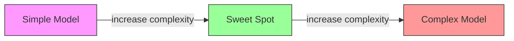
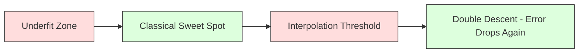
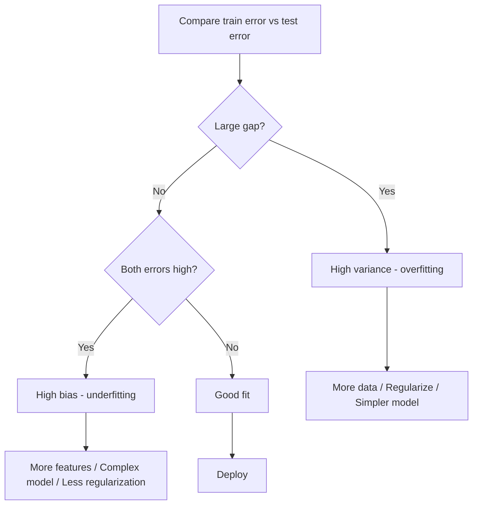
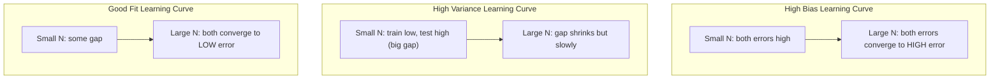
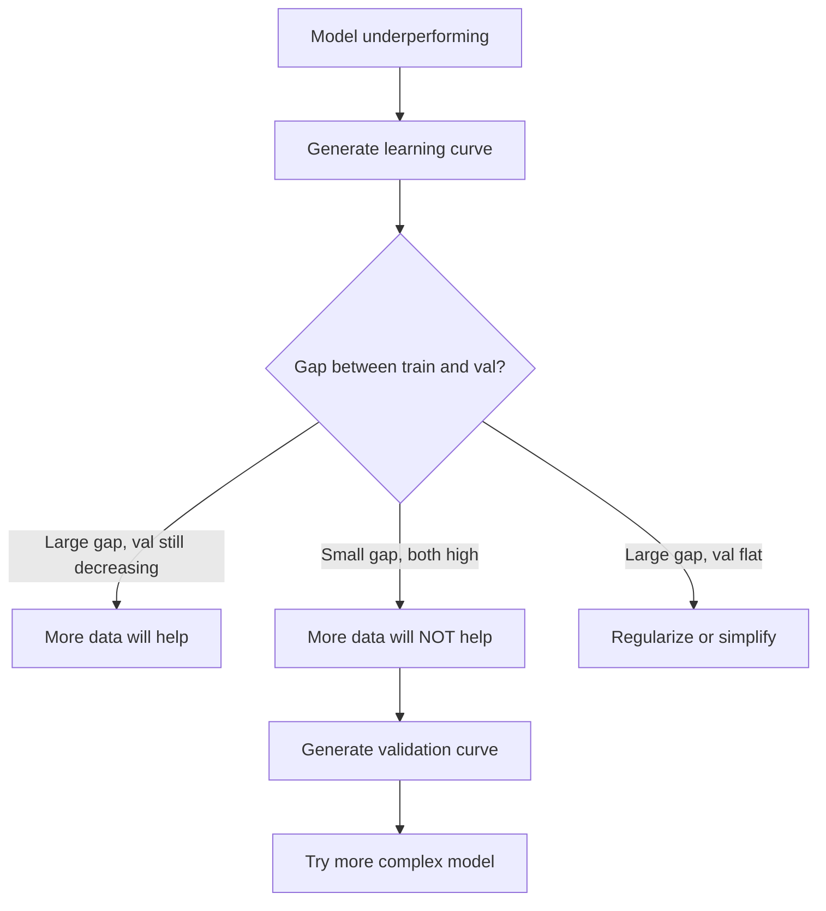

# Commerce des variantes partielles

> Chaque erreur de modèle provient d'une des trois sources: biais, variance ou bruit.

**Type:** Learn
**Language:**Python
**Prerequisites:** Phase 2, Lessons 01-09 (ML basics, regression, classification, evaluation)
**Time:** ~75 minutes

## Objectifs d'apprentissage

- Dériver la décomposition des variantes de biais de l'erreur de prédiction prévue et expliquer le rôle du bruit irréductible
- Diagnostication de la présence de biais ou de variance élevés dans un modèle en utilisant des modèles d'erreur de formation et de test
- Expliquer comment les techniques de régularisation (L1, L2, abandon, arrêt précoce) traitent de biais pour la variance
- Implementer des expériences qui visualisent le compromis de biais-variance entre les modèles de plus en plus complexes

## Le problème

Vous avez formé un modèle, il y a une erreur dans les données des tests.

Si votre modèle est trop simple (régrésion linéaire sur un ensemble de données courbes), il manquera constamment le vrai modèle. C'est un biais. Si votre modèle est trop complexe (polynôme de degré 20 sur 15 points de données), il s'adaptera parfaitement aux données de formation mais donnera des prédictions très différentes sur les nouvelles données. C'est la variance.

Vous ne pouvez pas minimiser les deux en même temps pour une capacité de modèle fixe. Poussez le biais vers le bas et la variance monte. Poussez la variance vers le bas et le biais monte. Comprendre ce compromis est la compétence diagnostique la plus utile dans l'apprentissage automatique. Il vous dit si vous devez rendre votre modèle plus complexe ou moins complexe, si vous devez obtenir plus de données ou améliorer les fonctionnalités, si vous devez réguler plus ou moins.

## Le concept

### Particuliers: erreur systématique

Si vous avez formé le même modèle sur plusieurs ensembles de formation différents tirés de la même distribution et avertis les prédictions, le biais est l'écart entre cette moyenne et la vérité.

Un biais élevé signifie que le modèle est trop rigide pour capturer le modèle réel. Une ligne droite adaptée à une parabole va toujours manquer la courbe, peu importe la quantité de données que vous lui donnez.

```
High bias (underfitting):
  Model always predicts roughly the same wrong thing.
  Training error: HIGH
  Test error: HIGH
  Gap between them: SMALL
```

### Variance: sensibilité aux données de formation

La variance mesure la quantité de changement que vos prédictions apportent lorsque vous vous entraînez sur différents sous-ensembles de données.

Une variance élevée signifie que le modèle est adapté au bruit dans les données de formation, pas le signal sous-jacent. Un polynôme de degré 20 traversera chaque point de formation mais oscillera de façon sauvage entre eux.

```
High variance (overfitting):
  Model fits training data perfectly but fails on new data.
  Training error: LOW
  Test error: HIGH
  Gap between them: LARGE
```

### La décomposition

Pour n'importe quel point x, l'erreur de prédiction attendue sous perte carrée se décompose exactement:

```
Expected Error = Bias^2 + Variance + Irreducible Noise

where:
  Bias^2   = (E[f_hat(x)] - f(x))^2
  Variance = E[(f_hat(x) - E[f_hat(x)])^2]
  Noise    = E[(y - f(x))^2]             (sigma^2)
```

- `f(x)`est la vraie fonction
- `f_hat(x)`est la prédiction de votre modèle
- `E[...]`est l'attente sur les différents ensembles de formation
- `y`est l'étiquette observée (vraie fonction plus bruit)

Le terme bruit est irréductible. Aucun modèle ne peut faire mieux que sigma^2 sur les données bruyantes.

### Complicité du modèle par rapport à l'erreur



La courbe classique en forme de U:

| Complexity | Bias | Variance | Total Error |
|-----------|------|----------|-------------|
| Too low | HIGH | LOW | HIGH (underfitting) |
| Just right | MODERATE | MODERATE | LOWEST |
| Too high | LOW | HIGH | HIGH (overfitting) |

### La régulation comme contrôle des variantes partielles

La régulation augmente délibérément le biais pour réduire la variance.

- **L2 (Ridge):**Réduit tous les poids vers zéro, conserve toutes les caractéristiques mais réduit leur influence.
- **L1 (Lasso):**Pousse certains poids exactement à zéro.
- **Dropout:**Il désactive les neurones au hasard pendant l'entraînement.
- **Early stopping:**Arrête de former avant que le modèle ne s'adapte pleinement aux données de formation.

La force de régulation (lambda, taux de décrochage, nombre d'époques) contrôle directement où vous vous asseyez sur la courbe de biais-variance.

### La double descendance: la perspective moderne

La théorie classique dit: après le point doux, plus de complexité fait toujours mal. Mais les recherches depuis 2019 ont montré quelque chose d'inattendu. Si vous continuez à augmenter la capacité du modèle bien au-delà du seuil d'interpolation (où le modèle a suffisamment de paramètres pour s'adapter parfaitement aux données de formation), l'erreur de test peut diminuer à nouveau.



Ce phénomène de "double descente" explique pourquoi les réseaux neuronaux massiquement surparamétrisés (avec beaucoup plus de paramètres que les exemples de formation) se généralisent encore bien.

Observations clés sur la double descente:
- Il se produit dans les modèles linéaires, les arbres de décision et les réseaux neuronaux
- Plus de données peuvent en fait nuire dans la région d'interpolation (double descente par échantillonnage)
- Plus d'époques d'entraînement peuvent également le causer (double descente selon l'époque)
- La régulation élimine le pic mais ne l'élimine pas.

Pourquoi cela arrive- t- il ? Au seuil d'interpolation, le modèle a une capacité suffisante pour s'adapter à tous les points de formation. Il est forcé dans une solution très spécifique qui traverse chaque point, et de petites perturbations dans les données provoquent de grands changements dans la couture. C'est là que la variance atteint son apogée. Au-delà du seuil, le modèle dispose de nombreuses solutions possibles qui correspondent parfaitement aux données. L'algorithme d'apprentissage (par exemple, la descente de gradient avec régularisation implicite) a tendance à choisir le plus simple parmi eux. Ce biais implicite vers des solutions simples est la raison pour laquelle les modèles surparamétrisés se généralisent.

| Regime | Parameters vs Samples | Behavior |
|--------|----------------------|----------|
| Underparameterized | p << n | Classical tradeoff applies |
| Interpolation threshold | p ~ n | Variance peaks, test error spikes |
| Overparameterized | p >> n | Implicit regularization kicks in, test error drops |

Pour des raisons pratiques: si vous utilisez des réseaux neuraux ou de grands ensembles d'arbres, ne vous arrêtez pas au seuil d'interpolation. Soyez bien en dessous de celui-ci (avec une régularisation explicite) ou bien en dépassez-le.

### Comment diagnostiquer votre modèle



| Symptom | Diagnosis | Fix |
|---------|-----------|-----|
| High train error, high test error | Bias | More features, complex model, less regularization |
| Low train error, high test error | Variance | More data, regularization, simpler model, dropout |
| Low train error, low test error | Good fit | Ship it |
| Train error decreasing, test error increasing | Overfitting in progress | Early stopping |

### Des stratégies pratiques

**When bias is the problem:**
- Ajouter des caractéristiques polynomielles ou d'interaction
- Utilisez un modèle plus flexible (ensemble d'arbres au lieu de linéaire)
- Réduire la force de régularisation
- Trains plus longs (si ils ne convergent pas encore)

**When variance is the problem:**
- Obtenez plus de données sur la formation
- Utilisation de la sachetation (forêts aléatoires)
- Augmentation de la régularisation (lambda plus élevé, plus de dérapages)
- Sélection des fonctionnalités (supprimer les fonctionnalités bruyantes)
- Utilisez la validation croisée pour la détecter précocement

### Métodes d'assemblage et réduction des variations

Les méthodes d'assemblage sont l'outil le plus pratique pour combattre les variantes.

**Bagging (Bootstrap Aggregating)**Les modèles de formation sont les plus variés, mais les modèles de formation sont les plus variés.

Pourquoi cela fonctionne-t-il mathématiquement: si vous faites en moyenne N prédictions indépendantes, chacune avec une variance sigma^2, la variance de la moyenne est sigma^2 / N. Les modèles ne sont pas vraiment indépendants (ils voient tous des données similaires), donc la réduction est inférieure à 1/N, mais elle est toujours substantielle.

**Boosting**Le booster peut surpasser si vous ajoutez trop de modèles, vous devez donc arrêter ou régulariser tôt.

| Method | Primary Effect | Bias Change | Variance Change |
|--------|---------------|-------------|-----------------|
| Bagging | Reduces variance | No change | Decreases |
| Boosting | Reduces bias | Decreases | Can increase |
| Stacking | Reduces both | Depends on meta-learner | Depends on base models |
| Dropout | Implicit bagging | Slight increase | Decreases |

**Practical rule:**Si votre modèle de base a une grande variance (arbres profonds, polynômes de haut degré), utilisez le sachetage.

### Curves d'apprentissage

Les courbes d'apprentissage tracent l'erreur de formation et de validation en fonction de la taille du jeu d'entraînement. Ce sont les outils de diagnostic les plus pratiques que vous avez. Contrairement à une comparaison de train/test unique, les courbes d'apprentissage vous montrent la trajectoire de votre modèle et vous disent si plus de données vous aideront.



Comment les lire ?

| Scenario | Training Error | Validation Error | Gap | What It Means | What to Do |
|----------|---------------|-----------------|-----|---------------|------------|
| High bias | High | High | Small | Model cannot capture the pattern | More features, complex model, less regularization |
| High variance | Low | High | Large | Model memorizes training data | More data, regularization, simpler model |
| Good fit | Moderate | Moderate | Small | Model generalizes well | Ship it |
| High variance, improving | Low | Decreasing with more data | Shrinking | Variance problem that data can fix | Collect more data |
| High bias, flat | High | High and flat | Small and flat | More data will NOT help | Change model architecture |

L'idée essentielle: si les deux courbes se sont plaquées et que l'écart est petit mais que les deux erreurs sont élevées, plus de données sont inutiles. Vous avez besoin d'un meilleur modèle. Si l'écart est grand et qu'il diminue toujours, plus de données vous aideront.

### Comment générer des courbes d'apprentissage

Il existe deux approches:

**Approach 1: Vary training set size, fixed model.**Gardez le modèle et les hyperparametres constants. Prenez des exercices sur des sous-ensembles de plus en plus grands des données de formation. Mesurez l'erreur de formation et l'erreur de validation à chaque taille.

**Approach 2: Vary model complexity, fixed data.**La valeur de la valeur de la valeur de la valeur de la valeur de la valeur de la valeur de la valeur de la valeur de la valeur de la valeur de la valeur de la valeur de la valeur de la valeur de la valeur de la valeur de la valeur de la valeur de la valeur de la valeur de la valeur de la valeur de la valeur de la valeur de la valeur de la valeur de la valeur de la valeur de la valeur de la valeur de la valeur de la valeur de la valeur de la valeur de la valeur de la valeur de la valeur de la valeur de la valeur de la valeur de la valeur de la valeur de la valeur de la valeur de la valeur de la valeur de la valeur de la valeur de la valeur de la valeur de la valeur de la valeur de la valeur de la valeur de la valeur de la valeur de la valeur de la valeur de la valeur de la valeur de la valeur de la valeur de la valeur de la valeur de la valeur de la valeur de la valeur de la valeur de la valeur de la valeur de la valeur de la valeur de la valeur de la valeur de la valeur de la valeur de la valeur de la valeur de la valeur de la valeur de la valeur de la valeur de la valeur de la valeur de la valeur de la valeur de la valeur de la valeur de la valeur de la valeur de la valeur de la valeur de la valeur de la valeur de la valeur de la valeur de la valeur de la valeur de la valeur de la valeur de la valeur de la valeur est de la valeur de la valeur est de la valeur est de la valeur de la valeur de la valeur de la valeur de la valeur de la valeur de la valeur de la valeur de la valeur de la valeur de la valeur de la valeur de la valeur de la valeur de la valeur de la valeur de la valeur de la valeur de la valeur de la valeur de la valeur de la valeur de la valeur de la valeur de la valeur de la valeur de la valeur de la valeur de la valeur de la valeur de la valeur de la valeur de la valeur de la valeur de la valeur de la valeur de la valeur de la valeur de la valeur de la valeur est de la valeur de la valeur de la valeur de la valeur est de la valeur est de la valeur de la valeur de la valeur de la valeur de la valeur est de la valeur de la valeur de la valeur est de la valeur de la valeur de la valeur de la valeur de la valeur de la valeur est de la valeur de la valeur de

Les deux approches se complètent. La première vous indique si plus de données vous aideront. La seconde vous indique si un modèle différent vous aidera.



```figure
bias-variance
```

## Faites-le

Le code dans `code/bias_variance.py`Il fait l'expérience complète de décomposition des variantes de biais.

### Étape 1: Générer des données synthétiques à partir d'une fonction connue

On utilise`f(x) = sin(1.5x) + 0.5x`Connaître la vraie fonction nous permet de calculer le biais et la variance exacts.

```python
def true_function(x):
    return np.sin(1.5 * x) + 0.5 * x

def generate_data(n_samples=30, noise_std=0.5, x_range=(-3, 3), seed=None):
    rng = np.random.RandomState(seed)
    x = rng.uniform(x_range[0], x_range[1], n_samples)
    y = true_function(x) + rng.normal(0, noise_std, n_samples)
    return x, y
```

### Étape 2: Prise d'échantillons à partir de la barre de démarrage et ajustement polynomial

Pour chaque degré polynomial, nous dessinons de nombreux ensembles de formation de démarrage, correspondons au polynôme et enregistrons des prédictions sur une grille de test fixe. Cela nous donne une distribution des prédictions à chaque point de test.

```python
def fit_polynomial(x_train, y_train, degree, lam=0.0):
    X = np.column_stack([x_train ** d for d in range(degree + 1)])
    if lam > 0:
        penalty = lam * np.eye(X.shape[1])
        penalty[0, 0] = 0
        w = np.linalg.solve(X.T @ X + penalty, X.T @ y_train)
    else:
        w = np.linalg.lstsq(X, y_train, rcond=None)[0]
    return w
```

Nous avons mis 200 échantillons différents de démarrage. Chaque échantillon de démarrage est tiré de la même distribution sous-jacente mais contient des points différents.

### Étape 3: calcul des biais^2, décomposition des variantes

Avec 200 ensembles de prédictions à chaque point de test, nous pouvons calculer la décomposition directement à partir de la définition:

```python
mean_pred = predictions.mean(axis=0)
bias_sq = np.mean((mean_pred - y_true) ** 2)
variance = np.mean(predictions.var(axis=0))
total_error = np.mean(np.mean((predictions - y_true) ** 2, axis=1))
```

- `mean_pred`est E[f_hat(x)] estimé à partir d'échantillons de démarrage
- `bias_sq`est l'écart carré entre la prédiction moyenne et la vérité
- `variance`est la propagation moyenne des prédictions sur les échantillons de démarrage
- `total_error`doit être approximativement égale à la particule^2 + variance + bruit

### Étape 4: Curves d'apprentissage

Les courbes d'apprentissage balayent la taille de l'ensemble d'entraînement tout en conservant la complexité du modèle fixe. Elles montrent si votre modèle est limité par les données ou la capacité.

```python
def demo_learning_curves():
    sizes = [10, 15, 20, 30, 50, 75, 100, 150, 200, 300]
    degree = 5

    for n in sizes:
        train_errors = []
        test_errors = []
        for seed in range(50):
            x_train, y_train = generate_data(n_samples=n, seed=seed * 100)
            w = fit_polynomial(x_train, y_train, degree)
            train_pred = predict_polynomial(x_train, w)
            train_mse = np.mean((train_pred - y_train) ** 2)
            test_pred = predict_polynomial(x_test, w)
            test_mse = np.mean((test_pred - y_test) ** 2)
            train_errors.append(train_mse)
            test_errors.append(test_mse)
        # Average over runs gives the learning curve point
```

Pour un modèle à grande variance (grade 5 avec de petites données), vous voyez:
- L'erreur de formation commence à bas et augmente à mesure que plus de données rendent la mémorisation plus difficile
- L'erreur de test commence à être élevée et diminue à mesure que le modèle reçoit plus de signal
- L'écart diminue avec plus de données

Pour un modèle à forte partialité (grade 1), les deux erreurs convergent rapidement à la même valeur élevée et plus de données ne contribuent pas.

### Étape 5: Effacer la régularisation

Le code comprend également `demo_regularization_sweep()`, qui fixe un polynôme de haut degré (grade 15) et balaie la résistance de régulation de Ridge de 0,001 à 100. Cela montre le compromis de biais-variance sous un angle différent: au lieu de varier la complexité du modèle, nous varions la résistance de contrainte.

```python
def demo_regularization_sweep():
    alphas = [0.001, 0.005, 0.01, 0.05, 0.1, 0.5, 1.0, 5.0, 10.0, 50.0, 100.0]
    for alpha in alphas:
        results = bias_variance_decomposition([15], lam=alpha)
        r = results[15]
        print(f"alpha={alpha:.3f}  bias={r['bias_sq']:.4f}  var={r['variance']:.4f}")
```

À l'alpha basse, le polynôme de degré 15 est presque sans contrainte. La variance domine parce que le modèle poursuit le bruit dans chaque échantillon de démarrage. À l'alpha élevé, la pénalité est si forte que le modèle devient effectivement une fonction quasi constante.

Il s'agit de la même courbe U à différents degrés polynomials, mais contrôlée par un bouton continu au lieu d'un bouton discret.

## Utilisez-le

sklearn fournit `learning_curve`et `validation_curve`pour automatiser ces diagnostics sans écrire des boucles de démarrage.

### Curve de validation: complexité du modèle de balayage

```python
from sklearn.model_selection import validation_curve
from sklearn.pipeline import make_pipeline
from sklearn.preprocessing import PolynomialFeatures
from sklearn.linear_model import Ridge

degrees = list(range(1, 16))
train_scores_all = []
val_scores_all = []

for d in degrees:
    pipe = make_pipeline(PolynomialFeatures(d), Ridge(alpha=0.01))
    train_scores, val_scores = validation_curve(
        pipe, X, y, param_name="polynomialfeatures__degree",
        param_range=[d], cv=5, scoring="neg_mean_squared_error"
    )
    train_scores_all.append(-train_scores.mean())
    val_scores_all.append(-val_scores.mean())
```

Cela vous donne directement la courbe de compensation des biais-variants. Là où le score de validation est le pire par rapport au score de formation, la variance domine. Là où les deux sont mauvais, le biais domine.

### Curve d'apprentissage: taille de l'ensemble de formation

```python
from sklearn.model_selection import learning_curve

pipe = make_pipeline(PolynomialFeatures(5), Ridge(alpha=0.01))
train_sizes, train_scores, val_scores = learning_curve(
    pipe, X, y, train_sizes=np.linspace(0.1, 1.0, 10),
    cv=5, scoring="neg_mean_squared_error"
)
train_mse = -train_scores.mean(axis=1)
val_mse = -val_scores.mean(axis=1)
```

Le film`train_mse`et `val_mse`contre `train_sizes`La forme vous dit tout sur votre modèle.

### Validation croisée avec analyse de régulation

```python
from sklearn.model_selection import cross_val_score

alphas = [0.001, 0.01, 0.1, 1.0, 10.0, 100.0]
for alpha in alphas:
    pipe = make_pipeline(PolynomialFeatures(10), Ridge(alpha=alpha))
    scores = cross_val_score(pipe, X, y, cv=5, scoring="neg_mean_squared_error")
    print(f"alpha={alpha:>7.3f}  MSE={-scores.mean():.4f} +/- {scores.std():.4f}")
```

Cela passe par la force de régularisation pour une complexité de modèle fixe. Vous verrez le même compromis de biais-variance: faible alpha signifie haute variance, haute alpha signifie haut biais.

### Le travail complet sur le diagnostic

En pratique, vous effectuez ces diagnostics dans la séquence:

1. Prenez votre modèle, comptez votre train et testez l'erreur.
2. Si les deux sont élevés, vous avez un problème de biais.
3. Si le train est bas mais que le test est élevé: vous avez un problème de variance. Générez une courbe d'apprentissage pour voir si plus de données vous aideront.
4. Générez une courbe de validation en balayant votre paramètre de complexité principal.
5. Si le décalage est encore important, vous avez besoin de plus de données ou de régularisation.
6. Essayez Ridge/Lasso avec différentes valeurs alpha en utilisant `cross_val_score`Choisissez l'alpha où l'erreur de validation croisée est la plus faible.

Cela prend 10-15 minutes de calcul pour la plupart des ensembles de données tabulaires et économise des heures de devinettes.

## La faire partir

Cette leçon donne: `outputs/prompt-model-diagnostics.md`

## Exercices

1. Exécutez la décomposition avec `noise_std=0`(sans bruit). Que se passe-t-il avec le terme d'erreur irréductible? La complexité optimale change-t-elle?

2. Augmenter la taille du jeu d'entraînement de 30 à 300. Comment cela affecte-t-il la composante de variance?

3. Ajouter la régulation L2 (régrésion de Ridge) à l'expérience. Pour un polynôme à degré élevé fixe (grade 15), balayer lambda de 0 à 100.

4. Modifier la vraie fonction d' un polynôme à `sin(x)`Comment la décomposition des variantes de biais change-t-il ?

5. Implémenter un simple emballage d'agrégation de la bande de démarrage: entraîner 10 modèles sur des échantillons de bande de démarrage et des prédictions moyennes.

## Les termes clés

| Term | What people say | What it actually means |
|------|----------------|----------------------|
| Bias | "The model is too simple" | Systematic error from wrong assumptions. The gap between the average model prediction and truth. |
| Variance | "The model is overfitting" | Error from sensitivity to training data. How much predictions change across different training sets. |
| Irreducible error | "Noise in the data" | Error from randomness in the true data-generating process. No model can eliminate it. |
| Underfitting | "Not learning enough" | Model has high bias. It misses the real pattern even on training data. |
| Overfitting | "Memorizing the data" | Model has high variance. It fits noise in training data that does not generalize. |
| Regularization | "Constraining the model" | Adding a penalty to reduce model complexity, trading bias for lower variance. |
| Double descent | "More parameters can help" | Test error decreases again when model capacity far exceeds the interpolation threshold. |
| Model complexity | "How flexible the model is" | The capacity of a model to fit arbitrary patterns. Controlled by architecture, features, or regularization. |

## Pour en savoir plus

- [Hastie, Tibshirani, Friedman: Elements of Statistical Learning, Ch. 7](https://hastie.su.domains/ElemStatLearn/)-- le traitement définitif de la décomposition des variantes de biais
- [Belkin et al., Reconciling modern machine learning practice and the bias-variance trade-off (2019)](https://arxiv.org/abs/1812.11118)- le papier à double descente
- [Nakkiran et al., Deep Double Descent (2019)](https://arxiv.org/abs/1912.02292)-- doubles descentes selon l'époque et l'échantillon
- [Scott Fortmann-Roe: Understanding the Bias-Variance Tradeoff](http://scott.fortmann-roe.com/docs/BiasVariance.html)- une explication visuelle claire
