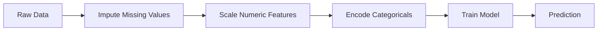
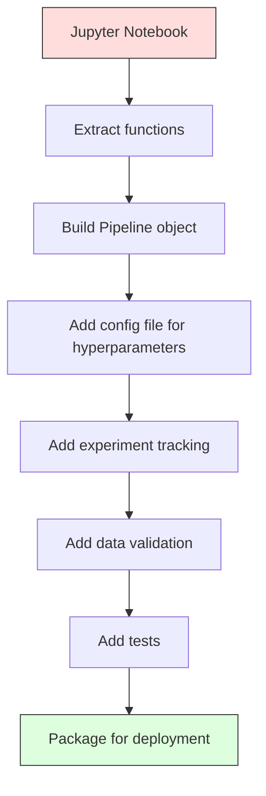

# Les pipelines ML

> Un modèle n'est pas un produit, mais un pipeline, c'est tout, des données brutes aux prédictions déployées, et chaque étape doit être reproduisable.

**Type:** Build
**Language:**Python
**Prerequisites:** Phase 2, Lesson 12 (Hyperparameter Tuning)
**Time:** ~120 minutes

## Objectifs d'apprentissage

- Construire un pipeline ML à partir de zéro qui relie imputation, mise à l'échelle, codage et formation de modèle en un seul objet reproduisable
- Identifier les scénarios de fuite de données et expliquer comment les pipelines les empêchent en installant des transformateurs uniquement sur des données de formation
- Construire un colonne-transformateur qui applique différents préprocessements aux caractéristiques numériques et catégoriques
- Implementer la sérialisation des pipelines et démontrer que la même pipeline montée produit des résultats identiques en formation et en production

## Le problème

Vous avez un bloc-notes qui charge des données, remplit les valeurs manquantes avec la médiane, mesure les caractéristiques, entraîne un modèle et imprime la précision.

Un mois plus tard, quelqu'un a refait le modèle et a obtenu des résultats différents. La médiane a été calculée sur l'ensemble complet des données, y compris les données d'essai (fuite de données). Les paramètres d'échelle n'ont pas été enregistrés, donc l'inférence utilise des statistiques différentes. Le code technique de fonctionnalités a été copié-coller entre la formation et le service, et les copies divergèrent. Une colonne catégorique a acquis une nouvelle valeur de production que l'encodeur n'a jamais vue.

Les systèmes de production de gaz à effet de serre sont les raisons les plus courantes pour lesquelles les systèmes de production de gaz à serre échouent.

## Le concept

### Ce qu'est un pipeline

Un pipeline est une séquence ordonnée de transformations de données suivie d'un modèle. Chaque étape prend la sortie de l'étape précédente comme entrée.



Le pipeline garantit:
- Les transformations ne sont montées que sur les données de formation (pas de fuites)
- Les mêmes transformations sont appliquées au moment de l'inférence
- L'ensemble de l'objet peut être sérialisé et déployé comme un seul artefact
- La validation croisée s'applique au pipeline par pli, ce qui empêche une fuite subtile

### Leur présence dans les médias

Les fuites de données surviennent lorsque les informations provenant du jeu d'essais ou des données futures contaminent la formation.

**Leaky (wrong):**
```python
X = df.drop("target", axis=1)
y = df["target"]

scaler = StandardScaler()
X_scaled = scaler.fit_transform(X)

X_train, X_test = X_scaled[:800], X_scaled[800:]
y_train, y_test = y[:800], y[800:]
```

Le scaler a vu les données de test. La moyenne et l'écart standard comprennent les échantillons de test.

**Correct:**
```python
X_train, X_test = X[:800], X[800:]

scaler = StandardScaler()
X_train_scaled = scaler.fit_transform(X_train)
X_test_scaled = scaler.transform(X_test)
```

Avec un pipeline, vous n'avez pas besoin de penser à cela.

### L'équipement de transport

Les produits de sklearn `Pipeline`Les transformateurs de chaînes et un estimateur.`.fit()`- Je suis là .`.predict()`, et `.score()`qui appliquent toutes les étapes dans l'ordre.

```python
from sklearn.pipeline import Pipeline
from sklearn.preprocessing import StandardScaler
from sklearn.linear_model import LogisticRegression

pipe = Pipeline([
    ("scaler", StandardScaler()),
    ("model", LogisticRegression()),
])

pipe.fit(X_train, y_train)
predictions = pipe.predict(X_test)
```

Quand vous appelez`pipe.fit(X_train, y_train)`- Le numéro de la liste:
1. Les appels de l' échelle .`fit_transform`sur le train X
2. Modèles d' appels `fit`sur le train X_scale

Quand vous appelez`pipe.predict(X_test)`- Le numéro de la liste:
1. Les appels de l' échelle .`transform`(pas adapté) sur X_test
2. Modèles d' appels `predict`sur le test X_test à l'échelle

Le scaler ne voit jamais les données de test pendant l'assemblage.

### ColonneTransformateur: différents pipelines pour différentes colonnes

Les vrais ensembles de données ont des colonnes numériques et catégoriques qui nécessitent un traitement préalable différent. `ColumnTransformer`Il s'occupe de ça.

```python
from sklearn.compose import ColumnTransformer
from sklearn.preprocessing import StandardScaler, OneHotEncoder
from sklearn.impute import SimpleImputer

numeric_pipe = Pipeline([
    ("impute", SimpleImputer(strategy="median")),
    ("scale", StandardScaler()),
])

categorical_pipe = Pipeline([
    ("impute", SimpleImputer(strategy="most_frequent")),
    ("encode", OneHotEncoder(handle_unknown="ignore")),
])

preprocessor = ColumnTransformer([
    ("num", numeric_pipe, ["age", "income", "score"]),
    ("cat", categorical_pipe, ["city", "gender", "plan"]),
])

full_pipeline = Pipeline([
    ("preprocess", preprocessor),
    ("model", GradientBoostingClassifier()),
])
```

Le `handle_unknown="ignore"`En effet, une nouvelle catégorie apparaît (une ville que le modèle n'a jamais vue), elle produit un vecteur zéro au lieu de s'écraser.

### Suivi des expériences

Un pipeline rend l'entraînement reproduisable, mais vous devez aussi suivre ce qui s'est passé dans les expériences: quels hyperparametres ont été utilisés, quelle version de l'ensemble de données, quelles étaient les métriques, quel code était en cours d'exécution.

**MLflow**est la solution open source la plus courante:

```python
import mlflow

with mlflow.start_run():
    mlflow.log_param("max_depth", 5)
    mlflow.log_param("n_estimators", 100)
    mlflow.log_param("learning_rate", 0.1)

    pipe.fit(X_train, y_train)
    accuracy = pipe.score(X_test, y_test)

    mlflow.log_metric("accuracy", accuracy)
    mlflow.sklearn.log_model(pipe, "model")
```

Chaque course est enregistrée avec des paramètres, des mesures, des artefacts et le modèle complet.

**Weights & Biases (wandb)**fournit la même fonctionnalité avec un tableau de bord hébergé:

```python
import wandb

wandb.init(project="my-pipeline")
wandb.config.update({"max_depth": 5, "n_estimators": 100})

pipe.fit(X_train, y_train)
accuracy = pipe.score(X_test, y_test)

wandb.log({"accuracy": accuracy})
```

### Modèle de version

Après avoir suivi les expériences, vous devez gérer les versions du modèle.

Le registre modèle de MLflow fournit:
- **Version tracking:**Chaque modèle enregistré obtient un numéro de version
- **Stage transitions:**"Stage", "Production", "Archivé"
- **Approval workflow:**Les modèles doivent être explicitement promus à la production
- **Rollback:**Retournez instantanément à une version précédente

### Versionnement des données avec DVC

Le code est versionné avec git. Les données doivent également être versionnées, mais git ne peut pas gérer de grands fichiers.

```
dvc init
dvc add data/training.csv
git add data/training.csv.dvc data/.gitignore
git commit -m "Track training data"
dvc push
```

DVC stocke les données réelles dans un stockage à distance (S3, GCS, Azure) et conserve une petite quantité de données.`.dvc`Lorsque vous effectuez un commande de Git,`dvc checkout`récupère les données exactes qui ont été utilisées.

Cela signifie que chaque pin de commande de git a le code et les données.

### Experiments reproducibles

Une expérience reproduisable nécessite quatre choses:

1. **Fixed random seeds:**S'établit des graines pour les numpy, les randomisations et le cadre (torche, sklearn)
2. **Pinned dependencies:**requêtes.txt ou poesie.lock avec des versions exactes
3. **Versioned data:**DVC ou similaire
4. **Config files:**Tous les hyperparametres dans une configuration, non codés durement

```python
import numpy as np
import random

def set_seed(seed=42):
    random.seed(seed)
    np.random.seed(seed)
    try:
        import torch
        torch.manual_seed(seed)
        torch.cuda.manual_seed_all(seed)
        torch.backends.cudnn.deterministic = True
    except ImportError:
        pass
```

### De notebook à pipeline de production



La progression typique:

1. **Notebook exploration:**Des expériences rapides, des visualisations, des idées de fonctionnalités
2. **Extract functions:**Transférer le prétraitement, l'ingénierie des caractéristiques, l'évaluation en modules
3. **Build Pipeline:**Transformations de chaînes en pipeline de sklearn ou en classe personnalisée
4. **Config management:**Mettre tous les hyperparametres dans une configuration YAML/JSON
5. **Experiment tracking:**Ajouter des logements MLflow ou de la barre
6. **Data validation:**Vérifiez les schémas, les distributions et les valeurs manquantes avant la formation
7. **Tests:**Tests unitaires pour les transformateurs, tests d'intégration pour l'ensemble du pipeline
8. **Deployment:**Sérialiser le pipeline, envelopper dans une API (FastAPI, Flask), contenir

### Erreurs courantes dans les pipelines

| Mistake | Why it is bad | Fix |
|---------|-------------|-----|
| Fitting on full data before splitting | Data leakage | Use Pipeline with cross_val_score |
| Feature engineering outside pipeline | Different transforms at train vs serve | Put all transforms in the Pipeline |
| Not handling unknown categories | Production crash on new values | OneHotEncoder(handle_unknown="ignore") |
| Hardcoded column names | Breaks when schema changes | Use column name lists from config |
| No data validation | Silently wrong predictions on bad data | Add schema checks before prediction |
| Training/serving skew | Model sees different features in prod | One Pipeline object for both |

```figure
f3-pipeline-flow
```

## Faites-le

Le code dans `code/pipeline.py`construit une pipeline ML complète à partir de zéro:

### Étape 1: Transformateur personnalisé

```python
class CustomTransformer:
    def __init__(self):
        self.means = None
        self.stds = None

    def fit(self, X):
        self.means = np.mean(X, axis=0)
        self.stds = np.std(X, axis=0)
        self.stds[self.stds == 0] = 1.0
        return self

    def transform(self, X):
        return (X - self.means) / self.stds

    def fit_transform(self, X):
        return self.fit(X).transform(X)
```

### Étape 2: Pipeline à partir de zéro

```python
class PipelineFromScratch:
    def __init__(self, steps):
        self.steps = steps

    def fit(self, X, y=None):
        X_current = X.copy()
        for name, step in self.steps[:-1]:
            X_current = step.fit_transform(X_current)
        name, model = self.steps[-1]
        model.fit(X_current, y)
        return self

    def predict(self, X):
        X_current = X.copy()
        for name, step in self.steps[:-1]:
            X_current = step.transform(X_current)
        name, model = self.steps[-1]
        return model.predict(X_current)
```

### Étape 3: Validation croisée avec pipeline

Le code démontre comment la validation croisée avec un pipeline empêche la fuite de données: le scaler est monté séparément sur les données de formation de chaque pli.

### Étape 4: Pipeline de production complète avec sklearn

Un pipeline complet avec `ColumnTransformer`, plusieurs chemins de pré-traitement, et un modèle, formé avec une validation croisée et une logerie d'expérience appropriées.

## La faire partir

Cette leçon donne:
- `outputs/prompt-ml-pipeline.md`-- une compétence pour la construction et le débogage de pipelines ML
- `code/pipeline.py`- un pipeline complet à partir de zéro à travers sklearn

## Exercices

1. Construire un pipeline qui gère un ensemble de données avec 3 colonnes numériques et 2 colonnes catégoriques. Utilisez `ColumnTransformer`Appliquer l'imputation médiane + l'échelle aux numéros et l'imputation la plus fréquente + l'encodage à un coup à des catégories.

2. Introduire délibérément une fuite de données: ajuster le scaler sur l'ensemble complet de données avant de le diviser. Comparer le score de validation croisée (fuite) au score de validation croisée du pipeline (netto). Quelle est la différence?

3. Sérialisez votre pipeline avec `joblib.dump`Chargez-le dans un script séparé et faites des prédictions.

4. Ajoutez un transformateur personnalisé au pipeline qui crée des caractéristiques polynomielles (grade 2) pour les deux colonnes numériques les plus importantes.

5. Configurez le suivi des débits de courant de l'équipement pour le pipeline.`mlflow ui`) pour comparer les courses et choisir le meilleur modèle.

## Les termes clés

| Term | What people say | What it actually means |
|------|----------------|----------------------|
| Pipeline | "Chain of transforms + model" | An ordered sequence of fitted transformers and a model, applied as one unit to prevent leakage |
| Data leakage | "Test info leaked into training" | Using information from outside the training set to build the model, inflating performance estimates |
| ColumnTransformer | "Different preprocessing per column" | Applies different pipelines to different subsets of columns, combining results |
| Experiment tracking | "Logging your runs" | Recording parameters, metrics, artifacts, and code versions for every training run |
| MLflow | "Track and deploy models" | Open-source platform for experiment tracking, model registry, and deployment |
| DVC | "Git for data" | Version control system for large data files, storing hashes in git and data in remote storage |
| Model registry | "Model version catalog" | A system that tracks model versions with stage labels (staging, production, archived) |
| Training/serving skew | "It worked in the notebook" | Differences between how data is processed during training versus inference, causing silent errors |
| Reproducibility | "Same code, same result" | The ability to get identical results from the same code, data, and configuration |

## Pour en savoir plus

- [scikit-learn Pipeline docs](https://scikit-learn.org/stable/modules/compose.html)-- la référence officielle du pipeline
- [MLflow documentation](https://mlflow.org/docs/latest/index.html)-- suivi des expériences et registre des modèles
- [DVC documentation](https://dvc.org/doc)-- versionnement des données
- [Sculley et al., Hidden Technical Debt in Machine Learning Systems (2015)](https://papers.nips.cc/paper/2015/hash/86df7dcfd896fcaf2674f757a2463eba-Abstract.html)-- le document de référence sur la complexité des systèmes ML
- [Google ML Best Practices: Rules of ML](https://developers.google.com/machine-learning/guides/rules-of-ml)-- conseils pratiques sur les méthodes de production
