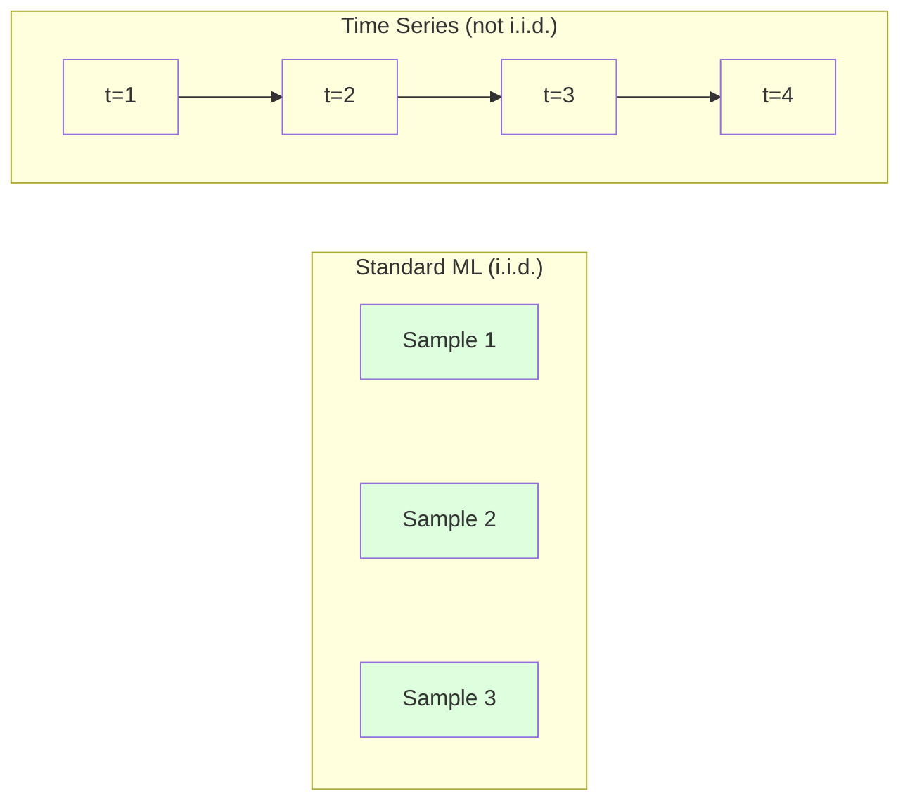
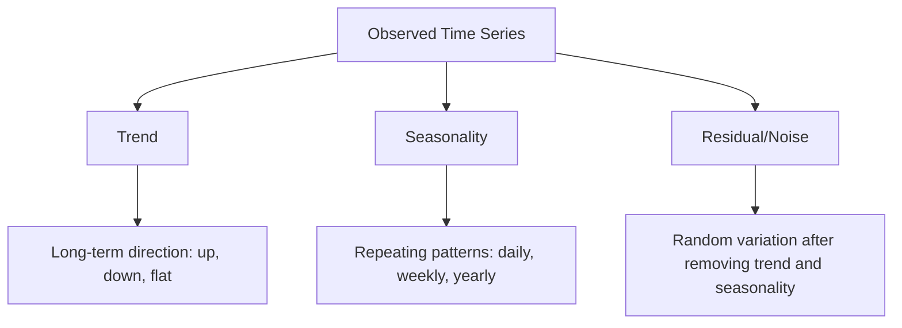
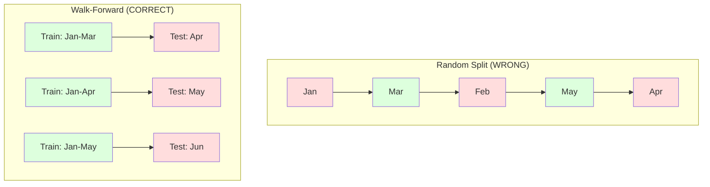

# Les fondements de la série temporelle

> Les performances passées prédisent les résultats futurs si vous vérifiez d'abord la stationnalité.

**Type:** Build
**Language:**Python
**Prerequisites:** Phase 2, Lessons 01-09
**Time:** ~90 minutes

## Objectifs d'apprentissage

- Décomposer une série temporelle en composants de tendance, de saisonnalité et de résidu et tester la stationnalité
- Implementer des caractéristiques de retard et des statistiques de rotation pour convertir une série temporelle en un problème d'apprentissage supervisé
- Construire un cadre de validation progressive qui empêche la fuite de données futures dans la formation
- Expliquer pourquoi les fractions aléatoires de train/test sont invalides pour les séries temporelles et démontrer l'écart de performance par rapport aux fractions temporelles appropriées

## Le problème

Vous avez des données ordonnées par temps, des ventes quotidiennes, température horaire, utilisation de la CPU par minute, prix hebdomadaires des actions.

Vous cherchez votre kit d'outils standard: train aléatoire / test divisé, validation croisée, matrice de fonctionnalités, prédiction.

La série temporelle brise les hypothèses sur lesquelles repose le système de calcul standard. Les échantillons ne sont pas indépendants - la température d'aujourd'hui dépend de celle d'hier. Les fractions aléatoires filtrent des informations futures dans le passé. Les fonctionnalités qui ont l'air superbes dans les tests arrière échouent dans la production parce qu'elles dépendent de modèles qui changent avec le temps.

Un modèle qui obtient une précision de 95% avec une validation croisée aléatoire peut obtenir 55% avec une évaluation en temps réel. La différence n'est pas une technicalité.

Cette leçon couvre les fondamentaux: ce qui rend les données de temps différentes, comment évaluer honnêtement les modèles et comment transformer une série de temps en fonctionnalités que les modèles ML standard peuvent consommer.

## Le concept

### Ce qui rend les séries de temps différentes

La norme ML suppose i.i.d. - indépendante et identiquement répartie. Chaque échantillon est tiré de la même distribution, indépendamment des autres échantillons.

- **Not independent.**Le prix des actions d'aujourd'hui dépend de celui d'hier. Les ventes de cette semaine sont correlatives avec celles de la semaine dernière.
- **Not identically distributed.**Les ventes en décembre sont différentes des ventes en mars.

Ces violations ne sont pas mineures, elles changent la façon dont vous construisez des fonctionnalités, comment vous évaluez des modèles et quels algorithmes fonctionnent.



Dans le système de calcul standard, les échantillons sont interchangeables, le mélange ne change rien, dans les séries temporelles, l'ordre est tout, le mélange détruit le signal.

### Les composants d'une série temporelle

Chaque série de temps est une combinaison de:



- **Trend**Les revenus augmentent de 10% par an, la température mondiale augmente.
- **Seasonality**Les prix de vente au détail ont augmenté en décembre, les prix de vente à la vente au détail ont augmenté en juillet, les prix de vente à la vente au détail ont augmenté en décembre, les prix de vente à la vente à la vente au détail ont augmenté en décembre, les prix de vente à la vente à la vente à la vente à la vente à la vente à la vente à la vente à la vente à la vente à la vente à la vente à la vente à la vente à la vente à la vente à la vente à la vente à la vente à la vente à la vente à la vente à la vente à la vente à la vente à la vente à la vente à la vente à la vente à la vente à la vente à la vente à la vente à la vente à la vente à la vente à la vente à la vente à la vente à la vente à la vente à la vente à la vente à la vente à la vente à la vente à la vente à la vente à la vente à la vente à la vente à la vente à la vente à la vente à la vente à la vente à la vente à la vente à la vente à la vente à la vente à la vente à la vente à la vente à la vente à la vente à la vente à la vente à la vente à la vente à la vente à la vente à la vente à la vente à la vente à la vente à la vente à la vente à la vente à la vente à la vente à la vente à la vente à la vente à la vente à la vente à la vente à la vente à la vente à la vente à la vente à la vente à la vente à la vente à la vente à la vente à la vente à la vente à la vente à la vente à la vente à la vente à la vente à la vente à la vente à la vente à la vente à la vente à la vente à la vente à la vente à la vente à la vente à la vente à la vente à la vente à la vente à la vente à la vente à la vente à la vente à la vente à la vente à la vente à la vente à la vente à la vente à la vente à la vente à la vente à la vente à la vente à la vente à la vente à la vente à la vente à la vente à la vente à la vente à la vente à la vente à la vente à la vente à la vente à la vente à la vente à la vente à la vente à
- **Residual**Si le résidu ressemble au bruit blanc, la décomposition a capturé le signal.

### Stabilité

Une série temporelle est stationnaire si ses propriétés statistiques (média, variance, autocorrélation) ne changent pas avec le temps.

**Why it matters:**Une série non stationnaire a une moyenne qui dérive. Un modèle formé sur des données de janvier a appris une moyenne différente de celle de février.

**How to check:**Comptez la moyenne de roulement et l'écart standard de roulement sur les fenêtres.

**How to fix:**Différenciation. Au lieu de modéliser les valeurs brutes, modélisez le changement entre les valeurs consécutives:

```
diff[t] = value[t] - value[t-1]
```

Si une série de différenciation ne rend pas la série stationnaire, appliquez-la à nouveau (différenciation de deuxième ordre).

**Example:**

La série originale: [100, 102, 106, 112, 120]
Première différence: [2, 4, 6, 8] (encore tendance à la hausse)
Deuxième différence: [2, 2, 2] (constante -- stationnaire)

La série originale avait une tendance quadratique. La première différenciation la transforme en tendance linéaire. La deuxième différenciation la rend plate.

**Formal test:**Le test Augmented Dickey-Fuller (ADF) est le test statistique standard pour la stationarité. L'hypothèse nulle est "la série est non stationnaire". Une valeur p inférieure à 0,05 signifie que vous pouvez rejeter la nullité et conclure la stationarité. Nous ne mettons pas en œuvre ADF à partir de zéro (il nécessite des tables de distribution asymptotiques), mais l'approche statistique en roulement dans notre code donne une vérification visuelle pratique.

### Corrélation automatique

La fonction d'autocorrélation (ACF) trace cette corrélation pour chaque retard k.

**ACF tells you:**
- Si l'ACF tombe à zéro après le retard 5, les valeurs de plus de 5 étapes sont sans importance.
- Si l'ACF augmente à un retard de 12 (données mensuelles), il y a une saisonnalité annuelle.
- Combien de fonctionnalités de retard à créer.

**PACF (Partial Autocorrelation Function)**Si aujourd'hui est corrélatif à 3 jours auparavant seulement parce que les deux sont corrélatifs à hier, le PACF au retard 3 sera zéro tandis que le ACF au retard 3 ne le sera pas.

### Caractéristiques de la latence: transformer la série de temps en apprentissage supervisé

Les modèles ML standard ont besoin d'une matrice de fonctionnalités X et d'une cible y. La série temporelle vous donne une seule colonne de valeurs.

Prenez la série [10, 12, 14, 13, 15] et créez les caractéristiques lag-1 et lag-2:

| lag_2 | lag_1 | target |
|-------|-------|--------|
| 10    | 12    | 14     |
| 12    | 14    | 13     |
| 14    | 13    | 15     |

Tout modèle ML (régrésion linéaire, forêt aléatoire, augmentation du gradient) peut prédire la cible à partir des délais.

Des fonctionnalités supplémentaires que vous pouvez concevoir:
- **Rolling statistics:**moyenne, std, min, max sur les dernières valeurs k
- **Calendar features:**jour de la semaine, mois, jour férié, week-end
- **Differenced values:**changement par rapport à l'étape précédente
- **Expanding statistics:**moyenne cumulée, somme cumulée
- **Ratio features:**valeur courante / moyenne de roulement (combien de distance de la moyenne récente)
- **Interaction features:**1 * jour de semaine (effets des jours de semaine sur l'élan)

**How many lags?**Utilisez la fonction de corrélation automatique. Si l'ACF est significative jusqu'à 10 délais, utilisez au moins 10 délais. S'il y a une saisonnalité hebdomadaire, inclure 7 délais (et éventuellement 14).

**The target alignment trap.**Lorsque vous créez des fonctionnalités de retard, la cible doit être la valeur au temps t, et toutes les fonctionnalités doivent utiliser des valeurs au temps t-1 ou plus tôt. Si vous incluez accidentellement la valeur au temps t comme une fonctionnalité, vous avez un prédicteur parfait - et un modèle complètement inutile. C'est le bug le plus courant dans l'ingénierie des fonctionnalités de séries temporelles.

### Une validation à l'avance

C'est le concept le plus important de cette leçon. La validation croisée standard k-fold attribue aléatoirement des échantillons à former et à tester. Pour les séries temporelles, cela fuit des informations futures.



Validation à l'avance:
1. Traîne sur les données à jour t
2. Prédiction à l'heure t+1 (ou t+1 à t+k pour plusieurs étapes)
3. Faites glisser la fenêtre vers l' avant
4. Répétez

Chaque pliage de test contient uniquement des données qui viennent après toutes les données de formation. Aucune fuite future. Cela vous donne une estimation honnête de la performance du modèle lors de son déploiement.

**Expanding window**utilise toutes les données historiques pour la formation (les fenêtres grandissent). **Sliding window**Utilisez le glisser lorsque les données anciennes sont toujours pertinentes. Utilisez le glisser lorsque le monde change et que les données anciennes font mal.

### L'intuition de l'ARIMA

ARIMA est le modèle classique de séries temporelles.

- **AR (Autoregressive):**Prédire à partir de valeurs passées. AR(p) utilise les dernières valeurs p.
- **I (Integrated):**Différenciation pour atteindre la stationarité.
- **MA (Moving Average):**Prédire à partir d'erreurs de prévision passées.

ARIMA ((p, d, q) combine les trois. Vous choisissez p, d, q en fonction de l'analyse ACF/PACF ou de la recherche automatisée (ARIMA automatique).

Nous ne allons pas mettre en œuvre ARIMA à partir de zéro - il nécessite une optimisation numérique qui est au-delà de la portée de cette leçon.

### Quand utiliser quoi

| Approach | Best For | Handles Seasonality | Handles External Features |
|----------|---------|-------------------|------------------------|
| Lag features + ML | Tabular with many external features | With calendar features | Yes |
| ARIMA | Single univariate series, short-term | SARIMA variant | No (ARIMAX for limited) |
| Exponential smoothing | Simple trend + seasonality | Yes (Holt-Winters) | No |
| Prophet | Business forecasting, holidays | Yes (Fourier terms) | Limited |
| Neural networks (LSTM, Transformer) | Long sequences, many series | Learned | Yes |

Pour la plupart des problèmes pratiques, les caractéristiques de retard + augmentation du gradient sont le point de départ le plus fort.

### Prévision des horizons et des stratégies

La prévision en une seule étape prédit une étape de l'avance.

**Recursive (iterated):**Prédire une étape en avant, utiliser la prédiction comme entrée pour la prochaine étape. Simple mais les erreurs s'accumulent - chaque prédiction utilise la prédiction précédente, donc les erreurs sont compoxes.

**Direct:**Exercer un modèle séparé pour chaque horizon. Le modèle 1 prévoit t+1, le modèle 5 prévoit t+5. Aucune accumulation d'erreur, mais chaque modèle a moins d'échantillons de formation et ils ne partagent pas d'informations.

**Multi-output:**Exercer un modèle qui sort tous les horizons simultanément. Partage des informations à travers les horizons mais nécessite un modèle qui prend en charge plusieurs sorties (ou une fonction de perte personnalisée).

Pour la plupart des problèmes pratiques, commencez par le récursif pour les horizons courts (1-5 étapes) et le direct pour les horizons plus longs.

### Les erreurs courantes dans la chronologie

| Mistake | Why it happens | How to fix |
|---------|---------------|-----------|
| Random train/test split | Habit from standard ML | Use walk-forward or temporal split |
| Using future features | Feature at time t included by mistake | Audit every feature for temporal alignment |
| Overfitting to seasonality | Model memorizes calendar patterns | Hold out a full seasonal cycle in the test set |
| Ignoring scale changes | Revenue doubles but patterns stay | Model percentage change instead of absolute |
| Too many lag features | "More history is better" | Use ACF to determine relevant lags |
| Not differencing | "The model will figure it out" | Tree models handle trends; linear models need stationarity |

```figure
f3-series-decompose
```

## Faites-le

Le code dans `code/time_series.py`Il met en œuvre les éléments de base de la construction à partir de zéro.

### Créateur de fonctionnalités Lag

```python
def make_lag_features(series, n_lags):
    n = len(series)
    X = np.full((n, n_lags), np.nan)
    for lag in range(1, n_lags + 1):
        X[lag:, lag - 1] = series[:-lag]
    valid = ~np.isnan(X).any(axis=1)
    return X[valid], series[valid]
```

Cela convertit une série 1D en une matrice de fonctionnalités où chaque ligne a la dernière `n_lags`Les valeurs sont des caractéristiques et la valeur actuelle est la cible.

### Validation croisée à l'avance

```python
def walk_forward_split(n_samples, n_splits=5, min_train=50):
    assert min_train < n_samples, "min_train must be less than n_samples"
    step = max(1, (n_samples - min_train) // n_splits)
    for i in range(n_splits):
        train_end = min_train + i * step
        test_end = min(train_end + step, n_samples)
        if train_end >= n_samples:
            break
        yield slice(0, train_end), slice(train_end, test_end)
```

Chaque fraction garantit que les données de formation sont strictement avant les données de test.

### Modèle autorégressif simple

Un modèle pur AR est juste une régression linéaire sur les caractéristiques de retard:

```python
class SimpleAR:
    def __init__(self, n_lags=5):
        self.n_lags = n_lags
        self.weights = None
        self.bias = None

    def fit(self, series):
        X, y = make_lag_features(series, self.n_lags)
        # Solve via normal equations
        X_b = np.column_stack([np.ones(len(X)), X])
        theta = np.linalg.lstsq(X_b, y, rcond=None)[0]
        self.bias = theta[0]
        self.weights = theta[1:]
        return self
```

Ceci est conceptuellement identique à la régression linéaire de la leçon 02, mais appliqué aux versions retardées du même variable.

### Vérifie de la stationnalité

Le code compute les statistiques de roulement pour évaluer visuellement et numériquement la stationnalité:

```python
def check_stationarity(series, window=50):
    rolling_mean = np.array([
        series[max(0, i - window):i].mean()
        for i in range(1, len(series) + 1)
    ])
    rolling_std = np.array([
        series[max(0, i - window):i].std()
        for i in range(1, len(series) + 1)
    ])
    return rolling_mean, rolling_std
```

Si la moyenne de dérive ou la std de roulement change, la série est non stationnaire.

Le code vérifie également la stationnalité en comparant la première moitié et la seconde moitié de la série. Si les moyens diffèrent de plus de la moitié d'un écart standard ou si le rapport de variance dépasse 2x, la série est marquée comme non stationnaire.

### Corrélation automatique

```python
def autocorrelation(series, max_lag=20):
    n = len(series)
    mean = series.mean()
    var = series.var()
    acf = np.zeros(max_lag + 1)
    for k in range(max_lag + 1):
        cov = np.mean((series[:n-k] - mean) * (series[k:] - mean))
        acf[k] = cov / var if var > 0 else 0
    return acf
```

## Utilisez-le

Avec sklearn, vous utilisez les fonctionnalités de retard directement avec n'importe quel régresseur:

```python
from sklearn.linear_model import Ridge
from sklearn.ensemble import GradientBoostingRegressor

X, y = make_lag_features(series, n_lags=10)

for train_idx, test_idx in walk_forward_split(len(X)):
    model = Ridge(alpha=1.0)
    model.fit(X[train_idx], y[train_idx])
    predictions = model.predict(X[test_idx])
```

Pour ARIMA, utilisez les modèles statistiques:

```python
from statsmodels.tsa.arima.model import ARIMA

model = ARIMA(train_series, order=(5, 1, 2))
fitted = model.fit()
forecast = fitted.forecast(steps=30)
```

Le code dans `time_series.py`démontre les deux approches et les compare à l'aide de la validation progressive.

### sklearn TempsSeriesSplit

sklearn fournit `TimeSeriesSplit`qui met en œuvre la validation progressive:

```python
from sklearn.model_selection import TimeSeriesSplit

tscv = TimeSeriesSplit(n_splits=5)
for train_index, test_index in tscv.split(X):
    X_train, X_test = X[train_index], X[test_index]
    y_train, y_test = y[train_index], y[test_index]
    model.fit(X_train, y_train)
    score = model.score(X_test, y_test)
```

C' est l' équivalent de notre " à partir de zéro " .`walk_forward_split`Il est intégré dans le cadre de validation croisée de sklearn.`cross_val_score`- Le numéro de la liste:

```python
from sklearn.model_selection import cross_val_score

scores = cross_val_score(model, X, y, cv=TimeSeriesSplit(n_splits=5))
print(f"Mean score: {scores.mean():.4f} +/- {scores.std():.4f}")
```

### Les mesures d'évaluation

La prévision des séries temporelles utilise des mesures de régression, mais dans un contexte conscient du temps:

- **MAE (Mean Absolute Error):**"En moyenne, les prédictions sont déformées de 3,2 degrés".
- **RMSE (Root Mean Squared Error):**La racine carrée de l'erreur carrée moyenne. Pénale les erreurs importantes plus que MAE. Utilisez quand les erreurs importantes sont pires que de nombreuses petites erreurs.
- **MAPE (Mean Absolute Percentage Error):**La moyenne de l'erreur / valeur vraie = 100 *. indépendante de l'échelle, utile pour comparer entre différentes séries. Mais indéfinie lorsque les valeurs vraies sont zéro.
- **Naive baseline comparison:**La base saisonnière naïve prédit la valeur d'une période antérieure (hier, la semaine dernière). Si votre modèle ne peut pas battre la naïve, quelque chose ne va pas.

### Caractéristiques roulantes

Le code démontre l'ajout de statistiques de roulement (média, std, min, max sur les fenêtres de 7 et 14 jours) pour les caractéristiques de retard.

Par exemple, si la moyenne de roulement augmente, cela suggère une tendance à la hausse. Si la std de roulement augmente, cela suggère une volatilité croissante. Ce sont les types de modèles dont les modèles basés sur des arbres peuvent apprendre mais les modèles linéaires ne peuvent pas.

## La faire partir

Cette leçon donne:
- `outputs/prompt-time-series-advisor.md`-- une demande pour enquêter les problèmes de séries temporelles
- `code/time_series.py`- fonctionnalités de retard, validation progressive, modèle AR, contrôle de stationnalité

### Les limites que vous devez atteindre

Avant de construire un modèle, établir des lignes de base:

1. **Last value (persistence).**Prédire que demain sera le même que aujourd'hui.
2. **Seasonal naive.**Prédisez que le jour d'aujourd'hui sera le même que le jour de la semaine dernière (ou de l'année dernière).
3. **Moving average.**Prédire la moyenne des derniers k. Légère le bruit mais ne peut pas capter les changements soudains.

Si votre modèle de ML de fantaisie perd à la base saisonnière naïve, vous avez un bug. Le plus souvent: fuite future dans les caractéristiques, mauvaise méthode d'évaluation, ou la série est vraiment aléatoire et imprévisible.

### Conseils pratiques

1. **Start with plotting.**Avant toute modélisation, tracez la série brute. Cherchez les tendances, la saisonnalité, les valeurs exceptionnelles, les ruptures structurelles (changements soudains de comportement).

2. **Difference first, model second.**Si la série a une tendance claire, différencier avant de créer des caractéristiques de retard. Les modèles basés sur des arbres peuvent gérer les tendances, mais les modèles linéaires ne peuvent pas, et différencier ne fait jamais de mal.

3. **Hold out at least one full seasonal cycle.**Si vous avez une saisonnalité hebdomadaire, votre ensemble de tests a besoin d'au moins une semaine complète. Si mensuel, au moins un mois complet. Sinon, vous ne pouvez pas évaluer si le modèle a capturé le schéma saisonnier.

4. **Monitor in production.**Les modèles de séries temporelles se dégradent au fil du temps à mesure que le monde change. Suivez les erreurs de prédiction sur une base régulière. Lorsque les erreurs commencent à augmenter, redéfinissez le modèle sur des données récentes.

5. **Beware of regime changes.**Un modèle formé sur des données pré-pandémiques ne prédira pas le comportement post-pandémique.

6. **Log-transform skewed series.**Les revenus, les prix et les comptes sont souvent déviés à droite. Prendre le journal stabilise la variance et rend les modèles multiplicatifs additifs, que les modèles linéaires peuvent gérer. Prévisions dans l'espace du journal, puis exponentiation pour revenir aux unités originales.

## Exercices

1. **Stationarity experiment.**Générer une série avec une tendance linéaire. Vérifiez la stationarité avec des statistiques de roulement. Appliquez la première différenciation. Vérifiez à nouveau. Combien de tours de différenciation faut-il pour une tendance quadratique?

2. **Lag selection.**Comptez ACF sur une série saisonnière (période = 7). Quels délais ont la plus grande autocorrélation? Créer des caractéristiques de délais en utilisant uniquement ces délais (pas des délais consécutifs).

3. **Walk-forward vs random split.**Exercer une régression Ridge sur les caractéristiques de retard. Évaluer avec une fraction 80/20 aléatoire et avec une validation progressive.

4. **Feature engineering.**Ajoutez la moyenne de roulement (window=7), la std de roulement (window=7) et les fonctionnalités du jour de la semaine aux fonctionnalités du retard.

5. **Multi-step forecasting.**Modifiez le modèle AR pour prédire 5 étapes à l'avant au lieu de 1. Comparer deux stratégies: a) prédire une étape, utiliser la prédiction comme entrée pour la prochaine étape (recursive), et b) entraîner des modèles séparés pour chaque horizon (direct).

## Les termes clés

| Term | What people say | What it actually means |
|------|----------------|----------------------|
| Stationarity | "The stats don't change over time" | A series whose mean, variance, and autocorrelation structure are constant over time |
| Differencing | "Subtract consecutive values" | Computing y[t] - y[t-1] to remove trends and achieve stationarity |
| Autocorrelation (ACF) | "How a series correlates with itself" | The correlation between a time series and a lagged copy of itself, as a function of the lag |
| Partial autocorrelation (PACF) | "Direct correlation only" | Autocorrelation at lag k after removing the effect of all shorter lags |
| Lag features | "Past values as inputs" | Using y[t-1], y[t-2], ..., y[t-k] as features to predict y[t] |
| Walk-forward validation | "Time-respecting cross-validation" | Evaluation where training data always precedes test data chronologically |
| ARIMA | "The classic time series model" | AutoRegressive Integrated Moving Average: combines past values (AR), differencing (I), and past errors (MA) |
| Seasonality | "Repeating calendar patterns" | Regular, predictable cycles in a time series tied to calendar periods (daily, weekly, yearly) |
| Trend | "The long-term direction" | A persistent increase or decrease in the series level over time |
| Expanding window | "Use all history" | Walk-forward validation where the training set grows with each fold |
| Sliding window | "Fixed-size history" | Walk-forward validation where the training set is a fixed-length window that slides forward |

## Pour en savoir plus

- [Hyndman and Athanasopoulos, Forecasting: Principles and Practice (3rd ed.)](https://otexts.com/fpp3/)-- le meilleur manuel gratuit sur la prévision des séries temporelles
- [scikit-learn Time Series Split](https://scikit-learn.org/stable/modules/generated/sklearn.model_selection.TimeSeriesSplit.html)- le séparateur à marche avant de sklearn
- [statsmodels ARIMA docs](https://www.statsmodels.org/stable/generated/statsmodels.tsa.arima.model.ARIMA.html)-- Implementation de l'ARIMA avec des diagnostics
- [Makridakis et al., The M5 Competition (2022)](https://www.sciencedirect.com/science/article/pii/S0169207021001874)-- une concurrence de prévision à grande échelle montrant les méthodes de l'analyse des évolutions et des méthodes statistiques
