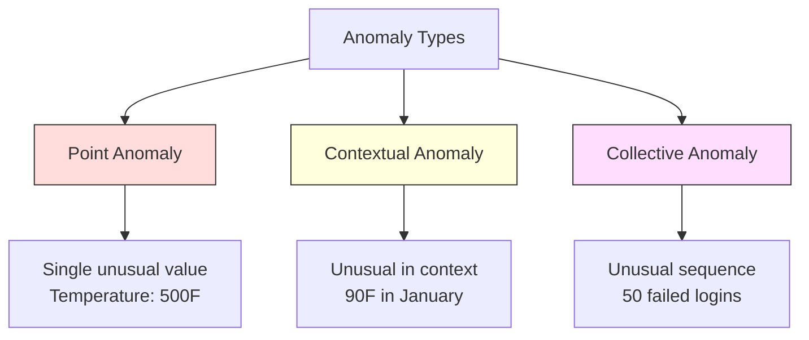
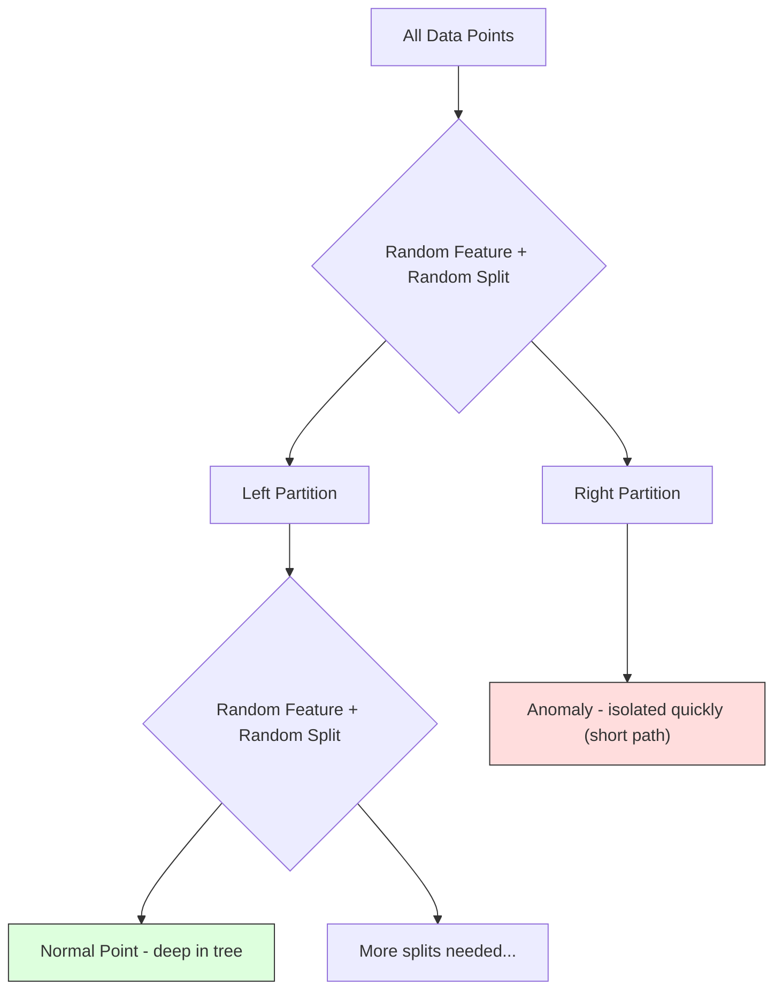
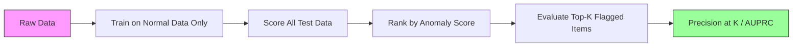

# Détection d'anomalies

> La normale est facile à définir, l'anormal est ce qui ne va pas.

**Type:** Build
**Language:**Python
**Prerequisites:** Phase 2, Lessons 01-09
**Time:** ~75 minutes

## Objectifs d'apprentissage

- Mettre en œuvre des méthodes de détection des anomalies forestières à partir de z-score, IQR et isolation
- Distinguer les anomalies de point, contextuelles et collectives et sélectionner la méthode de détection appropriée pour chaque
- Expliquer pourquoi la détection des anomalies est définie comme une modélisation des données normales plutôt que comme une classification des anomalies
- Comparer la détection des anomalies non surveillées avec la classification surveillée et évaluer le compromis entre la couverture des anomalies nouvelles et la précision

## Le problème

Une carte de crédit est utilisée à New York à 14h00, puis à Tokyo à 14h05. Un capteur d'usine lit 150 degrés lorsque la plage normale est de 80 à 120. Un serveur envoie 50 000 demandes par seconde lorsque la moyenne quotidienne est de 200.

Les fraudes coûtent des milliards, les pannes d'équipement coûtent des temps d'arrêt, les intrusions de réseau coûtent des données.

Le défi: vous avez rarement étiqueté des exemples d'anomalies. La fraude représente 0,1% des transactions. Les pannes d'équipement se produisent quelques fois par an. Vous ne pouvez pas former un classifiateur standard parce qu'il n'y a presque rien à apprendre dans la classe "anomalie". Même si vous avez des étiquettes, les anomalies que vous avez vues ne sont pas les seules que vous rencontrerez. Le plan de fraude de demain ressemble à celui d'aujourd'hui.

La détection des anomalies renverse le problème. Au lieu d'apprendre ce qui est anormal, apprenez ce qui est normal. Tout ce qui dévient de la normale est suspect. Cela fonctionne sans étiquettes, s'adapte à de nouveaux types d'anomalies et s'adapte à des ensembles de données massifs.

## Le concept

### Types d'anomalies

Toutes les anomalies ne sont pas les mêmes:

- **Point anomalies.**Un seul point de données qui est inhabituel quel que soit le contexte.$50,000 from an account that normally spends $Je suis à 50.
- **Contextual anomalies.**Un point de données qui est inhabituel compte tenu de son contexte. Une température de 90 degrés est normale en été, anormale en hiver.
- **Collective anomalies.**Une séquence de points de données qui est inhabituelle en tant que groupe, même si chaque point individuel pourrait être normal. Cinq défaillances de connexion est normal. Cinquante d'une série est une attaque de force brute.

La plupart des méthodes détectent des anomalies de point. Les anomalies contextuelles ont besoin de caractéristiques de temps ou de localisation.



### Le cadre non surveillé

Dans la classification standard, vous avez des étiquettes pour les deux classes.

1. **Fully unsupervised.**Vous mettez le détecteur sur toutes les données et espérez que les anomalies sont assez rares pour ne pas corrompre le modèle "normal".
2. **Semi-supervised.**Vous avez un ensemble de données propre de données normales seulement. Vous vous adaptez à ce ensemble propre et marquer tout le reste. C'est la configuration la plus forte lorsque possible.
3. **Weakly supervised.**Vous avez quelques anomalies étiquetées. Utilisez-les pour l'évaluation, pas pour l'entraînement.

La détection d'anomalies est fondamentalement différente de la classification.

### Surveillance et non surveillance: le compromis

Si vous avez des anomalies étiquetées, devriez-vous les utiliser pour la formation (classification supervisée) ou uniquement pour l'évaluation (détection non supervisée)?

**Supervised (treat as classification):**
- Il capture les types exacts d'anomalies que vous avez vues auparavant
- Une précision plus élevée sur les types d'anomalies connus
- Il manque complètement de nouveaux types d'anomalies
- Requiert une reformation lorsque de nouveaux types d'anomalies émergent
- Il faut suffisamment d'exemples d'anomalies (souvent trop peu)

**Unsupervised (model normal, flag deviations):**
- Capture de toute déviation de la norme, y compris les types nouveaux
- Ne nécessite pas d'anomalies étiquetées
- Un taux de faux positifs plus élevé (tout ce qui est inhabituel n'est pas mauvais)
- Plus robuste pour le changement de distribution

En pratique, les meilleurs systèmes combinent les deux: détection non supervisée pour une large couverture, modèles supervisés pour les types d'anomalies connues de haute priorité et examen humain pour les cas ambigu.

### Métode de Z-Score

L'approche la plus simple: calculer la moyenne et l'écart standard de chaque caractéristique.

```text
z_score = (x - mean) / std
anomaly if |z_score| > threshold
```

Le seuil par défaut est de 3,0 (99,7% des données normales sont dans les limites de 3 écarts standards pour une distribution gaussienne).

**Strengths:**Simple, rapide, interprétable ("cette valeur est une déviation standard de 4,5 à la normale").

**Weaknesses:**Supposant que les données sont normalement distribuées.Sensible aux valeurs étrangères dans les données de formation (les valeurs étrangères déplacent la moyenne et gonflent le std, ce qui les rend plus difficiles à détecter).

**When it works well:**Surveillance à fonction unique où les données sont à peu près en forme de cloche. Temps de réponse du serveur, tolérances de fabrication, lectures de capteurs avec lignes de base stables.

**When it fails:**Les données multi-clusters (deux bureaux avec des températures de base différentes), les données déformées (montants de transactions où 1000 $ est rare mais pas anormal), les données avec des valeurs anormales dans l'ensemble de formation.

### Métode de la RCI

Plus robuste que le score Z. Utilise la plage interquartile au lieu de la moyenne et de l'écart standard.

```
Q1 = 25th percentile
Q3 = 75th percentile
IQR = Q3 - Q1
lower_bound = Q1 - factor * IQR
upper_bound = Q3 + factor * IQR
anomaly if x < lower_bound or x > upper_bound
```

Le facteur par défaut est de 1.5.

**Strengths:**Robuste à des valeurs anormales (les pourcentages ne sont pas affectés par des valeurs extrêmes).

**Weaknesses:**Univariée uniquement (applique indépendamment à chaque caractéristique). Ne peut détecter des anomalies inhabituelles que lorsque les caractéristiques sont considérées ensemble (un point peut être normal dans chaque caractéristique individuellement mais anormal dans l'espace commun).

**Practical note:**Le facteur 1,5 dans IQR correspond aux moustaches dans une carte de carton. Les points en dehors des moustaches sont des valeurs potentielles. Utiliser 3,0 au lieu de 1,5 rend le détecteur plus conservateur (moins de drapeaux, moins de faux positifs). Le facteur correct dépend de votre tolérance aux fausses alarmes.

### Forêt isolée

L'idée clé: les anomalies sont rares et différentes. Dans une partition aléatoire des données, les anomalies sont plus faciles à isoler - elles ont besoin de moins de fractions aléatoires pour être séparées du reste.



**How it works:**
1. Construire de nombreux arbres aléatoires (une forêt isolée)
2. À chaque nœud, choisissez une fonctionnalité aléatoire et une valeur de fractionnement aléatoire entre la fonctionnalité min et max
3. Continuez à séparer jusqu'à ce que chaque point soit isolé (dans sa propre feuille)
4. Les anomalies ont des traces moyennes plus courtes à travers tous les arbres

**Why it works:**Les points normaux vivent dans des régions denses. De nombreuses splits aléatoires sont nécessaires pour les isoler de leurs voisins. Les anomalies vivent dans des régions rares. Une ou deux splits aléatoires suffisent pour les isoler.

Le score d'anomalie est basé sur la longueur moyenne du chemin sur tous les arbres, normalisée par la longueur de chemin attendue d'un arbre de recherche binaire aléatoire:

```
score(x) = 2^(-average_path_length(x) / c(n))
```

Où ?`c(n)`est la longueur de cheminée attendue pour n échantillons. Le score près de 1 signifie anomalie. Le score près de 0,5 signifie normal. Le score près de 0 signifie très normal (en profondeur dans les amas denses).

**Strengths:**Aucune hypothèse de distribution. Fonctionne dans de grandes dimensions. Équelles bien (sublinéaire en taille d'échantillon parce que chaque arbre utilise un sous-échantillon).

**Weaknesses:**Les luttes contre les anomalies dans les régions denses (effet de masquage).

**Key hyperparameters:**
- `n_estimators`Le nombre d'arbres: 100 est généralement suffisant.
- `max_samples`Le nombre d'échantillons par arbre. 256 est le défaut dans le papier original. Les valeurs plus petites rendent les arbres individuels moins précises mais augmentent la diversité. Le sous-échantillonnage est ce qui rend la forêt d'isolement rapide - chaque arbre voit une petite fraction des données.
- `contamination`: Fraction attendue d'anomalies. Utilisé uniquement pour fixer le seuil.

### Facteur local d'outrages (LOF)

LOF compare la densité locale autour d'un point à celle autour de ses voisins.

**How it works:**
1. Pour chaque point, trouvez ses voisins les plus proches
2. Calculer la densité de disponibilité locale (combien la zone est dense)
3. Comparer la densité de chaque point avec celle de ses voisins.
4. Si un point a une densité beaucoup plus faible que ses voisins, il est un écart

**LOF score:**
- LOF proche de 1,0 signifie une densité similaire à celle des voisins (normale)
- LOF supérieur à 1,0 signifie une densité inférieure à celle des voisins (potentiellement anormale)
- LOF beaucoup plus élevé que 1,0 (par exemple, 2,0+) signifie une densité significativement plus faible (anomalie probable)

La partie "locale" est essentielle. Considérez un ensemble de données avec deux amas: un amas dense de 1000 points et un amas rare de 50 points. Un point au bord du amas rare n'est pas inhabituel au niveau mondial - il a 50 voisins. Mais il est inhabituel au niveau local si ses voisins immédiats sont plus denses qu'il ne l'est. LOF capture cette nuance que les méthodes mondiales manquent.

**Strengths:**Détecte les anomalies locales (points qui sont inhabituels dans leur voisinage, même s'ils ne sont pas inhabituels dans le monde entier).

**Weaknesses:**Légère sur les grands ensembles de données (O(n^2) pour une mise en œuvre naïve.

### Comparaison

| Method | Assumptions | Speed | Handles High Dims | Detects Local Anomalies |
|--------|------------|-------|-------------------|------------------------|
| Z-score | Normal distribution | Very fast | Yes (per feature) | No |
| IQR | None (per feature) | Very fast | Yes (per feature) | No |
| Isolation Forest | None | Fast | Yes | Partially |
| LOF | Distance is meaningful | Slow | Poorly | Yes |

### Les défis de l'évaluation

L'évaluation des détecteurs d'anomalies est plus difficile que l'évaluation des classifiants:

- **Extreme class imbalance.**Avec des anomalies de 0,1%, prédire "normal" pour tout donne une précision de 99,9%.
- **AUROC is misleading.**Avec un déséquilibre important, l'AUROC peut paraître bon même lorsque le modèle manque la plupart des anomalies aux seuils pratiques.
- **Better metrics:**Precision@k (d'entre les éléments marqués au sommet de k, combien sont d'anomalies réelles), AUPRC (zone sous courbe de rappel de précision) et rappel à un taux de faux positif fixe.



### Pipeline de détection des anomalies

En pratique, la détection des anomalies suit ce flux de travail:

1. **Collect baseline data.**Idéalement, une période où vous savez qu'il n'y a pas (ou très peu) d'anomalies.
2. **Feature engineering.**Caractéristiques brutes plus caractéristiques dérivées (statistiques de roulement, caractéristiques temporelles, rapports).
3. **Train the detector.**Le modèle apprend à quoi ressemble le "normal".
4. **Score new data.**Chaque nouvelle observation est évaluée comme anomalie.
5. **Threshold selection.**C'est une décision commerciale: un seuil plus élevé signifie moins de fausses alarmes mais plus d'anomalies manquées.
6. **Alert and investigate.**Les points marqués vont à l'examen humain ou à la réponse automatisée.
7. **Feedback collection.**Enregistrez si les éléments signalés étaient de vraies anomalies ou de fausses alarmes.

Le pipeline n'est jamais " terminé ". Les distributions de données changent, de nouveaux types d'anomalies émergent et les seuils doivent être ajustés.

```figure
f3-anomaly-fence
```

## Faites-le

Le code dans `code/anomaly_detection.py`Il implique Z-score, IQR et Isolation Forest à partir de zéro.

### Détecteur de Z-Score

```python
def zscore_detect(X, threshold=3.0):
    mean = X.mean(axis=0)
    std = X.std(axis=0)
    std[std == 0] = 1.0
    z = np.abs((X - mean) / std)
    return z.max(axis=1) > threshold
```

Simple et vectorié, désigne un point si une caractéristique dépasse le seuil.

### Détecteur de RCI

```python
def iqr_detect(X, factor=1.5):
    q1 = np.percentile(X, 25, axis=0)
    q3 = np.percentile(X, 75, axis=0)
    iqr = q3 - q1
    iqr[iqr == 0] = 1.0
    lower = q1 - factor * iqr
    upper = q3 + factor * iqr
    outside = (X < lower) | (X > upper)
    return outside.any(axis=1)
```

### La forêt d'isolement à partir de rien

L'implémentation à partir de zéro construit des arbres d'isolement qui partagent au hasard l'espace de fonctionnalités:

```python
class IsolationTree:
    def __init__(self, max_depth):
        self.max_depth = max_depth

    def fit(self, X, depth=0):
        n, p = X.shape
        if depth >= self.max_depth or n <= 1:
            self.is_leaf = True
            self.size = n
            return self
        self.is_leaf = False
        self.feature = np.random.randint(p)
        x_min = X[:, self.feature].min()
        x_max = X[:, self.feature].max()
        if x_min == x_max:
            self.is_leaf = True
            self.size = n
            return self
        self.threshold = np.random.uniform(x_min, x_max)
        left_mask = X[:, self.feature] < self.threshold
        self.left = IsolationTree(self.max_depth).fit(X[left_mask], depth + 1)
        self.right = IsolationTree(self.max_depth).fit(X[~left_mask], depth + 1)
        return self
```

La longueur du chemin pour isoler un point détermine son score d'anomalie.

Le `IsolationForest`classe enveloppe plusieurs arbres:

```python
class IsolationForest:
    def __init__(self, n_estimators=100, max_samples=256, seed=42):
        self.n_estimators = n_estimators
        self.max_samples = max_samples

    def fit(self, X):
        sample_size = min(self.max_samples, X.shape[0])
        max_depth = int(np.ceil(np.log2(sample_size)))
        for _ in range(self.n_estimators):
            idx = rng.choice(X.shape[0], size=sample_size, replace=False)
            tree = IsolationTree(max_depth=max_depth)
            tree.fit(X[idx])
            self.trees.append(tree)

    def anomaly_score(self, X):
        avg_path = average path length across all trees
        scores = 2.0 ** (-avg_path / c(max_samples))
        return scores
```

Le facteur de normalisation `c(n)`est la longueur de chemin attendue d'une recherche infructueuse dans un arbre de recherche binaire avec n éléments.`2 * H(n-1) - 2*(n-1)/n`où `H`Cette normalisation garantit que les scores sont comparables sur des ensembles de données de différentes tailles.

### Scénarios de démonstration

Le code génère plusieurs scénarios de test:

1. **Single cluster with outliers.**Un groupe gaussien 2D avec des anomalies injectées loin du centre.
2. **Multimodal data.**Trois grappes de différentes tailles et densités. Les points entre les grappes sont anormaux.
3. **High-dimensional data.**50 caractéristiques, mais les anomalies diffèrent en seulement 5 d'entre elles.

Chaque démo compare toutes les méthodes utilisant la précision, le rappel, F1 et Precision@k.

## Utilisez-le

Avec sklearn (en utilisant des implémentations de bibliothèque, pas à partir de zéro):

```python
from sklearn.ensemble import IsolationForest
from sklearn.neighbors import LocalOutlierFactor

iso = IsolationForest(n_estimators=100, contamination=0.05, random_state=42)
iso.fit(X_train)
predictions = iso.predict(X_test)

lof = LocalOutlierFactor(n_neighbors=20, contamination=0.05, novelty=True)
lof.fit(X_train)
predictions = lof.predict(X_test)
```

Notes `contamination`La définition correcte est importante -- trop bas manque des anomalies, trop élevé crée de fausses alarmes.

Le code dans `anomaly_detection.py`Comparer les mises en œuvre à partir de zéro avec les résultats obtenus sur les mêmes données.

### Paramètre de contamination

Le `contamination`Le paramètre de sklearn détermine le seuil de conversion des scores d'anomalie continue en prédictions binaires.

```python
iso_5 = IsolationForest(contamination=0.05)
iso_10 = IsolationForest(contamination=0.10)
```

Les deux produisent les mêmes scores d'anomalie.`iso_5`les 5% les plus élevés tandis que `iso_10`Si vous ne connaissez pas le taux d'anomalie réel (vous ne le savez généralement pas), définissez la contamination en "auto" et travaillez directement avec les scores bruts.

### M.S.V. de classe unique

Un autre détecteur d'anomalies non surveillé qui mérite d'être connu.

```python
from sklearn.svm import OneClassSVM

oc_svm = OneClassSVM(kernel="rbf", gamma="auto", nu=0.05)
oc_svm.fit(X_train)
predictions = oc_svm.predict(X_test)
```

Le `nu`Le paramètre approximatif de la fraction d'anomalies. le SVM de classe unique fonctionne bien sur les petits et moyens ensembles de données mais ne s'étend pas à de très grandes données (la matrice du noyau se développe quadratiquement).

### Approche de l'autoencodeur (aperçu)

Les autoencoders sont des réseaux neuronaux qui apprennent à compresser et à reconstruire des données.

Ceci est couvert dans la phase 3 (apprentissage en profondeur), mais le principe est le même: modéliser ce qui est normal, désigner ce qui dévient.

### Ensemble de détection des anomalies

Tout comme les méthodes ensemble améliorent la classification (leçon 11), la combinaison de détecteurs d'anomalies multiples améliore la détection.

1. Exécuter plusieurs détecteurs (score Z, IQR, forêt d'isolement, LOF)
2. Normalizer les scores de chaque détecteur à [0, 1]
3. Average des scores normalisés
4. Points de banderole au-dessus du seuil du score moyen

Cela réduit les faux positifs parce que différentes méthodes ont des modes d'échec différents. Un point marqué par les quatre méthodes est presque certainement anormal. Un point marqué par une seule pourrait être une particularité de cette méthode.

Les ensembles plus sophistiqués pesent chaque détecteur selon sa fiabilité estimée (mesurée sur un ensemble de validation avec des anomalies connues, le cas échéant).

### Considérations concernant la production

1. **Threshold drift.**À mesure que la distribution des données change, un seuil fixe devient obsolète.
2. **Alert fatigue.**Trop de fausses alertes et d'opérateurs cessent d'être attentifs. Commencez par un seuil plus élevé (moins d'alertes fiables) et abaissez-le au fur et à mesure que la confiance s'accroît.
3. **Ensemble approach.**En production, combinez plusieurs détecteurs. Marquez un point seulement si plusieurs méthodes conviennent qu'il est anormal. Cela réduit considérablement les faux positifs.
4. **Feature engineering.**Les caractéristiques brutes sont rarement suffisantes. Ajoutez des statistiques de roulement, des ratios, du temps depuis le dernier événement et des caractéristiques spécifiques au domaine.
5. **Feedback loop.**Lorsque les opérateurs enquêtent sur les éléments signalés et les confirment ou les rejettent, ils les renvoient au système.

## La faire partir

Cette leçon donne:
- `outputs/skill-anomaly-detector.md`- une compétence de décision pour choisir le bon détecteur
- `code/anomaly_detection.py`- Z-score, IQR, et forêt d'isolement à partir de zéro, avec une comparaison sklearn

### Choisir un seuil

Le score d'anomalie est continu, il faut un seuil pour prendre des décisions binaires, c'est une décision commerciale, pas technique.

Considérons deux scénarios:
- **Fraud detection.**La fraude manquante est coûteuse (recharges, confiance des clients). Les fausses alertes coûtent à un analyste humain 5 minutes pour enquêter.
- **Equipment maintenance.**Une fausse alarme signifie une fermeture inutile coûteuse .$50,000. A missed failure means a $500 000 réparations, fixez le seuil pour équilibrer ces coûts.

Dans les deux cas, le seuil optimal dépend du rapport de coûts entre faux positifs et faux négatifs.

### Échantillonnage à la production

Pour la détection en temps réel d'anomalies en production:

1. **Batch training, online scoring.**Exercer le modèle périodiquement (daily, weekly) sur les données normales récentes.
2. **Feature computation must match.**Si vous avez suivi des statistiques en cours de formation pendant 30 jours, vous avez besoin de 30 jours d'histoire pour calculer les caractéristiques d'une nouvelle observation.
3. **Score distribution monitoring.**Suivre la répartition des scores d'anomalie au fil du temps. Si le score médian dérive vers le haut, soit les données changent, soit le modèle est obsolète.
4. **Explainability.**Lorsque vous marquez une anomalie, dites pourquoi. Z-score: "La caractéristique X est de 4,2 écarts standard au-dessus de la normale".

## Exercices

1. **Threshold tuning.**Exécutez le détecteur de Z-score avec des seuils de 1,0 à 5,0 en étapes de 0,5.

2. **Multivariate anomalies.**Créer des données 2D où chaque fonctionnalité semble individuellement normale, mais la combinaison est anormale (par exemple, des points éloignés de la diagonale principale du cluster).

3. **LOF from scratch.**Implémenter le facteur local outlier en utilisant les voisins les plus proches de k. Comparer avec le facteur local outlier de sklearn sur les mêmes données. Utilisez k=10 et k=50 - comment le choix de k affecte-t-il les résultats?

4. **Streaming anomaly detection.**Modifier le détecteur de Z-score pour qu'il fonctionne dans un environnement de streaming: mettre à jour la moyenne et la variance en cours d'exécution à mesure que de nouveaux points arrivent (algorithme en ligne de Welford).

5. **Real-world evaluation.**Prenez un ensemble de données avec des anomalies connues (fraude par carte de crédit de Kaggle, par exemple). Évaluez les quatre méthodes en utilisant precision@100, precision@500 et AUPRC. Quelle méthode fonctionne le mieux? Pourquoi?

## Les termes clés

| Term | What people say | What it actually means |
|------|----------------|----------------------|
| Anomaly | "Outlier, unusual point" | A data point that deviates significantly from the expected pattern of normal data |
| Point anomaly | "A single weird value" | An individual observation that is unusual regardless of context |
| Contextual anomaly | "Normal value, wrong context" | An observation that is unusual given its context (time, location, etc.) but might be normal in another context |
| Isolation Forest | "Random splits to find outliers" | An ensemble of random trees that isolates anomalies with fewer splits than normal points |
| Local Outlier Factor | "Compare density to neighbors" | A method that flags points whose local density is much lower than their neighbors' density |
| Z-score | "Standard deviations from mean" | (x - mean) / std, measuring how far a point is from the center in units of standard deviation |
| IQR | "Interquartile range" | Q3 - Q1, measuring the spread of the middle 50% of data, used for robust outlier detection |
| Contamination | "Expected fraction of anomalies" | A hyperparameter telling the detector what proportion of the data it should flag as anomalous |
| Precision@k | "Of the top k flags, how many are real" | Precision computed on only the k most suspicious points, useful for imbalanced anomaly detection |
| AUPRC | "Area under precision-recall curve" | A metric that summarizes precision-recall performance across all thresholds, better than AUROC for imbalanced data |

## Pour en savoir plus

- [Liu et al., Isolation Forest (2008)](https://cs.nju.edu.cn/zhouzh/zhouzh.files/publication/icdm08b.pdf)-- le papier original de l'isolement forestier
- [Breunig et al., LOF: Identifying Density-Based Local Outliers (2000)](https://dl.acm.org/doi/10.1145/342009.335388)-- le papier LOF original
- [scikit-learn Outlier Detection docs](https://scikit-learn.org/stable/modules/outlier_detection.html)-- vue d'ensemble de tous les détecteurs d'anomalies de sklearn
- [Chandola et al., Anomaly Detection: A Survey (2009)](https://dl.acm.org/doi/10.1145/1541880.1541882)-- un examen complet des méthodes de détection des anomalies
- [Goldstein and Uchida, A Comparative Evaluation of Unsupervised Anomaly Detection Algorithms (2016)](https://journals.plos.org/plosone/article?id=10.1371/journal.pone.0152173)-- comparaison empirique de 10 méthodes sur des ensembles de données réels
