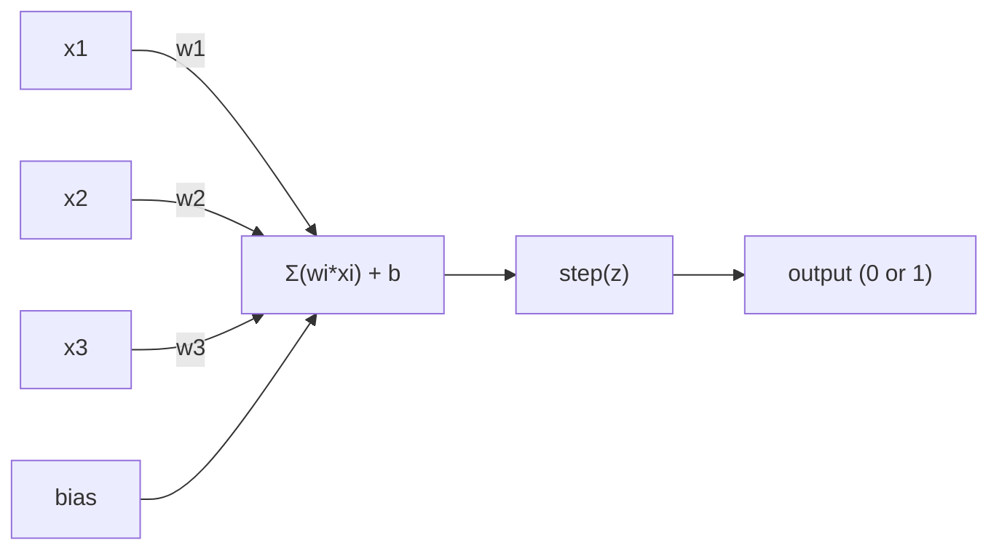
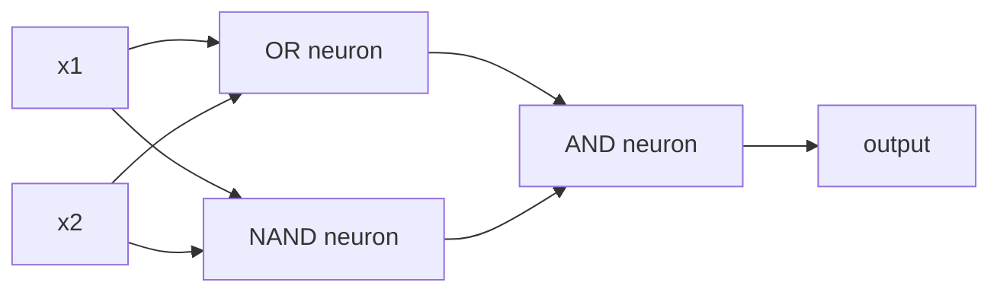

# Le Perceptron

> Le perceptron est l'atome des réseaux neuronaux.

**Type:** Build
**Languages:** Python
**Prerequisites:** Phase 1 (Linear Algebra Intuition)
**Time:** ~60 minutes

## Objectifs d'apprentissage

- Implémenter un perceptron à partir de zéro en Python, y compris la règle de mise à jour du poids et la fonction d'activation en étapes
- Expliquez pourquoi un seul perceptron ne peut résoudre que des problèmes séparables linéairement et démontrer le cas de défaillance XOR
- Construire un perceptron multicouche en composant les portes OR, NAND et AND pour résoudre XOR
- Formez un réseau à deux couches avec activation sigmoïde et réapprovisionnement pour apprendre automatiquement XOR

## Le problème

Vous connaissez les vecteurs et les produits de points. Vous savez qu'une matrice transforme les entrées en sorties. Mais comment une machine apprend-elle quelle transformation utiliser ?

Le perceptron répond à cela. C'est la machine d'apprentissage la plus simple possible: prendre quelques entrées, multiplier par des poids, ajouter un biais, et prendre une décision binaire. Puis ajuster. C'est tout. Chaque réseau neural jamais construit est des couches de cette idée empilées ensemble.

Comprendre le perceptron signifie comprendre ce que signifie réellement "apprendre" dans le code: ajuster les nombres jusqu'à ce que la sortie correspond à la réalité.

## Le concept

### Un neurone, une décision

Un perceptron prend n entrées, multiplie chacune par un poids, les résume, ajoute un biais et transmet le résultat à travers une fonction d'activation.



La fonction étape est brutale: si la somme pondérée plus le biais est >= 0, sortie 1.

```
step(z) = 1  if z >= 0
           0  if z < 0
```

Il s'agit d'un classifiant linéaire. Les poids et les biais définissent une ligne (ou un hyperplane dans des dimensions plus élevées) qui divise l'espace d'entrée en deux régions.

### La limite de décision

Pour deux entrées, le perceptron trace une ligne à travers l'espace 2D:

```
  x2
  ┤
  │  Class 1        /
  │    (0)          /
  │                /
  │               / w1·x1 + w2·x2 + b = 0
  │              /
  │             /     Class 2
  │            /        (1)
  ┼───────────/──────────── x1
```

Tout ce qui est de l'un des côtés de la ligne donne des résultats 0. Tout ce qui est de l'autre côté donne des résultats 1.

### La règle de l'apprentissage

La règle de l'apprentissage de la perception est simple:

```
For each training example (x, y_true):
    y_pred = predict(x)
    error = y_true - y_pred

    For each weight:
        w_i = w_i + learning_rate * error * x_i
    bias = bias + learning_rate * error
```

Si la prédiction est correcte, l'erreur = 0, rien ne change. Si elle prévoit 0 mais devrait être 1, les poids augmentent. Si elle prévoit 1 mais devrait être 0, les poids diminuent. Le taux d'apprentissage contrôle la taille de chaque ajustement.

### Le problème de la XOR

Regardez ces portes logiques:

```
AND gate:           OR gate:            XOR gate:
x1  x2  out         x1  x2  out         x1  x2  out
0   0   0           0   0   0           0   0   0
0   1   0           0   1   1           0   1   1
1   0   0           1   0   1           1   0   1
1   1   1           1   1   1           1   1   0
```

AND et OR sont séparables linéairement: vous pouvez dessiner une seule ligne pour séparer les 0s des 1s. XOR n'est pas. Aucune seule ligne ne peut séparer [0,1] et [1,0] de [0,0] et [1,1].

```
AND (separable):        XOR (not separable):

  x2                      x2
  1 ┤  0     1            1 ┤  1     0
    │     /                 │
  0 ┤  0 / 0              0 ┤  0     1
    ┼──/──────── x1         ┼──────────── x1
       line works!          no single line works!
```

C'est une limite fondamentale. Un seul perceptron ne peut résoudre que des problèmes séparables linéairement. Minsky et Papert ont prouvé cela en 1969 et il a presque tué la recherche sur les réseaux neuronaux pendant une décennie.

La solution: empiler les percepteurs en couches. Un percepteur multicouche peut résoudre XOR en combinant deux décisions linéaires en une non linéaire.

```figure
perceptron-boundary
```

## Faites-le

### Étape 1: La classe Perceptron

```python
class Perceptron:
    def __init__(self, n_inputs, learning_rate=0.1):
        self.weights = [0.0] * n_inputs
        self.bias = 0.0
        self.lr = learning_rate

    def predict(self, inputs):
        total = sum(w * x for w, x in zip(self.weights, inputs))
        total += self.bias
        return 1 if total >= 0 else 0

    def train(self, training_data, epochs=100):
        for epoch in range(epochs):
            errors = 0
            for inputs, target in training_data:
                prediction = self.predict(inputs)
                error = target - prediction
                if error != 0:
                    errors += 1
                    for i in range(len(self.weights)):
                        self.weights[i] += self.lr * error * inputs[i]
                    self.bias += self.lr * error
            if errors == 0:
                print(f"Converged at epoch {epoch + 1}")
                return
        print(f"Did not converge after {epochs} epochs")
```

### Étape 2: Formation sur les portes logiques

```python
and_data = [
    ([0, 0], 0),
    ([0, 1], 0),
    ([1, 0], 0),
    ([1, 1], 1),
]

or_data = [
    ([0, 0], 0),
    ([0, 1], 1),
    ([1, 0], 1),
    ([1, 1], 1),
]

not_data = [
    ([0], 1),
    ([1], 0),
]

print("=== AND Gate ===")
p_and = Perceptron(2)
p_and.train(and_data)
for inputs, _ in and_data:
    print(f"  {inputs} -> {p_and.predict(inputs)}")

print("\n=== OR Gate ===")
p_or = Perceptron(2)
p_or.train(or_data)
for inputs, _ in or_data:
    print(f"  {inputs} -> {p_or.predict(inputs)}")

print("\n=== NOT Gate ===")
p_not = Perceptron(1)
p_not.train(not_data)
for inputs, _ in not_data:
    print(f"  {inputs} -> {p_not.predict(inputs)}")
```

### Étape 3: Regardez l' échec de XOR

```python
xor_data = [
    ([0, 0], 0),
    ([0, 1], 1),
    ([1, 0], 1),
    ([1, 1], 0),
]

print("\n=== XOR Gate (single perceptron) ===")
p_xor = Perceptron(2)
p_xor.train(xor_data, epochs=1000)
for inputs, expected in xor_data:
    result = p_xor.predict(inputs)
    status = "OK" if result == expected else "WRONG"
    print(f"  {inputs} -> {result} (expected {expected}) {status}")
```

C'est la preuve qu'un seul perceptron ne peut pas apprendre XOR.

### Étape 4: Résoudre XOR avec deux couches

Le truc: XOR = (x1 ou x2) ET NON (x1 ET x2). Combinez trois percepteurs:



```python
def xor_network(x1, x2):
    or_neuron = Perceptron(2)
    or_neuron.weights = [1.0, 1.0]
    or_neuron.bias = -0.5

    nand_neuron = Perceptron(2)
    nand_neuron.weights = [-1.0, -1.0]
    nand_neuron.bias = 1.5

    and_neuron = Perceptron(2)
    and_neuron.weights = [1.0, 1.0]
    and_neuron.bias = -1.5

    hidden1 = or_neuron.predict([x1, x2])
    hidden2 = nand_neuron.predict([x1, x2])
    output = and_neuron.predict([hidden1, hidden2])
    return output


print("\n=== XOR Gate (multi-layer network) ===")
for inputs, expected in xor_data:
    result = xor_network(inputs[0], inputs[1])
    print(f"  {inputs} -> {result} (expected {expected})")
```

L'accumulation de percepteurs en couches crée des limites de décision qu'aucun seul percepteur ne peut produire.

### Étape 5: Faites une mise en réseau à deux couches

La solution est de remplacer la fonction de la marche par sigmoid et d'apprendre les poids automatiquement par réaction.

```python
class TwoLayerNetwork:
    def __init__(self, learning_rate=0.5):
        import random
        random.seed(0)
        self.w_hidden = [[random.uniform(-1, 1), random.uniform(-1, 1)] for _ in range(2)]
        self.b_hidden = [random.uniform(-1, 1), random.uniform(-1, 1)]
        self.w_output = [random.uniform(-1, 1), random.uniform(-1, 1)]
        self.b_output = random.uniform(-1, 1)
        self.lr = learning_rate

    def sigmoid(self, x):
        import math
        x = max(-500, min(500, x))
        return 1.0 / (1.0 + math.exp(-x))

    def forward(self, inputs):
        self.inputs = inputs
        self.hidden_outputs = []
        for i in range(2):
            z = sum(w * x for w, x in zip(self.w_hidden[i], inputs)) + self.b_hidden[i]
            self.hidden_outputs.append(self.sigmoid(z))
        z_out = sum(w * h for w, h in zip(self.w_output, self.hidden_outputs)) + self.b_output
        self.output = self.sigmoid(z_out)
        return self.output

    def train(self, training_data, epochs=10000):
        for epoch in range(epochs):
            total_error = 0
            for inputs, target in training_data:
                output = self.forward(inputs)
                error = target - output
                total_error += error ** 2

                d_output = error * output * (1 - output)

                saved_w_output = self.w_output[:]
                hidden_deltas = []
                for i in range(2):
                    h = self.hidden_outputs[i]
                    hd = d_output * saved_w_output[i] * h * (1 - h)
                    hidden_deltas.append(hd)

                for i in range(2):
                    self.w_output[i] += self.lr * d_output * self.hidden_outputs[i]
                self.b_output += self.lr * d_output

                for i in range(2):
                    for j in range(len(inputs)):
                        self.w_hidden[i][j] += self.lr * hidden_deltas[i] * inputs[j]
                    self.b_hidden[i] += self.lr * hidden_deltas[i]
```

```python
net = TwoLayerNetwork(learning_rate=2.0)
net.train(xor_data, epochs=10000)
for inputs, expected in xor_data:
    result = net.forward(inputs)
    predicted = 1 if result >= 0.5 else 0
    print(f"  {inputs} -> {result:.4f} (rounded: {predicted}, expected {expected})")
```

Deux différences clés de l'étape 4. Premièrement, sigmoïde remplace la fonction étape -- il est lisse, donc les gradients existent. Deuxièmement, le `train`La méthode propage l'erreur vers l'arrière de la sortie à la couche cachée, ajustant chaque poids proportionnellement à sa contribution à l'erreur.

C'est le pont vers la leçon 3.`d_output`et `hidden_deltas`C'est la règle de la chaîne appliquée au graphique de réseau.

## Utilisez-le

Tout ce que vous venez de construire à partir de zéro existe dans un seul import:

```python
from sklearn.linear_model import Perceptron as SkPerceptron
import numpy as np

X = np.array([[0,0],[0,1],[1,0],[1,1]])
y = np.array([0, 0, 0, 1])

clf = SkPerceptron(max_iter=100, tol=1e-3)
clf.fit(X, y)
print([clf.predict([x])[0] for x in X])
```

Cinq lignes, votre ligne 30.`Perceptron`La version sklearn ajoute des contrôles de convergence, des fonctions de perte multiples et une prise en charge rare - mais la boucle de base est identique: somme pondérée, fonction de pas, mise à jour de poids sur erreur.

Les réalités de la pauvreté se manifestent à grande échelle.

- La fonction de pas devient sigmoïde, ReLU, ou d'autres activations lisses
- Les poids sont apprises automatiquement par ré-propagation (leçon 03)
- Les couches deviennent plus profondes: 3, 10, 100+ couches
- Le même principe est valable: chaque couche crée de nouvelles caractéristiques à partir des sorties de la couche précédente

Un seul perceptron ne peut que dessiner des lignes droites.

## La faire partir

Cette leçon donne:
- `outputs/skill-perceptron.md`- une compétence qui couvre les besoins en architectures à couche unique et à couche multi-couche

## Exercices

1. Exercer un perceptron sur une passerelle NAND (la passerelle universelle - tout circuit logique peut être construit à partir de NAND).
2. Modifiez la classe Perceptron pour suivre la limite de décision (w1*x1 + w2*x2 + b = 0) à chaque époque.
3. Construire un perceptron à 3 entrées qui ne sort 1 que lorsque au moins 2 des 3 entrées sont 1 (une fonction de vote majoritaire).

## Les termes clés

| Term | What people say | What it actually means |
|------|----------------|----------------------|
| Perceptron | "A fake neuron" | A linear classifier: dot product of inputs and weights, plus bias, through a step function |
| Weight | "How important an input is" | A multiplier that scales each input's contribution to the decision |
| Bias | "The threshold" | A constant that shifts the decision boundary, letting the perceptron fire even with zero inputs |
| Activation function | "The thing that squishes values" | A function applied after the weighted sum - step function for perceptrons, sigmoid/ReLU for modern networks |
| Linearly separable | "You can draw a line between them" | A dataset where a single hyperplane can perfectly separate the classes |
| XOR problem | "The thing perceptrons can't do" | Proof that single-layer networks cannot learn non-linearly-separable functions |
| Decision boundary | "Where the classifier switches" | The hyperplane w*x + b = 0 that divides input space into two classes |
| Multi-layer perceptron | "A real neural network" | Perceptrons stacked in layers, where each layer's output feeds the next layer's input |

## Pour en savoir plus

- Frank Rosenblatt, "Le Perceptron: un modèle probabiliste de stockage et d'organisation de l'information dans le cerveau" (1958) -- le papier original qui a commencé tout cela
- Minsky & Papert, "Perceptrons" (1969) -- le livre qui a prouvé que XOR était insoluble par les réseaux à couche unique et a tué la recherche perceptron pendant une décennie
- Michael Nielsen, "Réseaux neuronaux et apprentissage profond", chapitre 1 (http://neuralnetworksanddeeplearning.com/) -- gratuit en ligne, la meilleure explication visuelle de la façon dont les percepteurs se composent en réseaux
